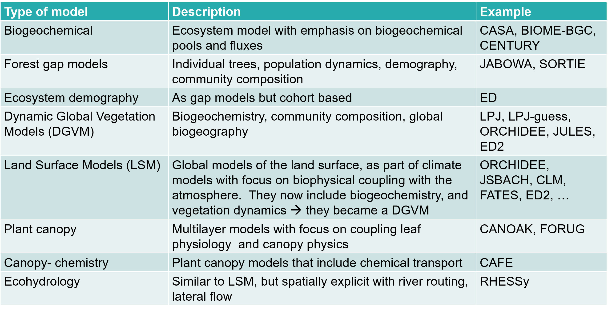

---
output:
  pdf_document: default
  html_document: default
---

\mainmatter

# Introduction {#intro}

An ecosystem model is an abstract, usually mathematical, representation of an ecological system which is studied to better understand the real system. The scale varies from an individual population to an ecological community or an entire biome. 

A dynamic global vegetation model (DGVM) is a computer program that simulates shifts in potential vegetation and its associated biogeochemical and hydrological cycles as a response to shifts in climate (see 1.5). Vegetation models can be used to conduct virtual experiments. 

## The central role of vegetation in the Earth system

Plants and vegetation play an essential role in the earth system. In Figure \@ref(fig:f1), we have represented the planetary boundaries and the significant environmental challenges we are facing. For some of them, we are reaching the system's boundary, such as genetic diversity, biogeochemical cycling, and climate change. It is crucial to understand how vegetation reacts to environmental problems (positive or negative feedback), as vegetation plays a central role in many of these boundaries. Environmental challenges we are facing include: 

- Stratospheric ozone depletion: The stratospheric ozone layer in the atmosphere filters out ultraviolet (UV) radiation from the sun. If this layer decreases, increasing amounts of UV radiation will reach ground level. Because of the actions taken as a result of the Montreal Protocol, we appear to be on the path that will allow us to stay within this boundary.

- Atmospheric aerosol loading: Through their interaction with water vapour, aerosol play a critically important role in the hydrological cycle affecting cloud formation and global-scale and regional patterns of atmospheric circulation, such as the monsoon systems in tropical regions. They also have a direct effect on climate, by changing how much solar radiation is reflected or absorbed in the atmosphere. Humans change the aerosol loading by emitting atmospheric pollution and through land-use change that increases the release of dust and smoke into the air. Shifts in climate regimes and monsoon systems have already been seen in highly polluted environments, giving a quantifiable regional measure for an aerosol boundary. 

- Ocean acidification: Around a quarter of the CO2 that humanity emits into the atmosphere is ultimately dissolved in the oceans. Here it forms carbonic acid, altering ocean chemistry and decreasing the pH of the surface water. This increased acidity reduces the amount of available carbonate ions, an essential 'building block' used by many marine species for shell and skeleton formation. Beyond a threshold concentration, this rising acidity makes it hard for organisms such as corals and some shellfish and plankton species to grow and survive. Losses of these species would change the structure and dynamics of ocean ecosystems and could potentially lead to drastic reductions in fish stocks. Compared to pre-industrial times, surface ocean acidity has already increased by 30 percent. The ocean acidification boundary has ramifications for the whole planet. 

- Biochemical flows: Nitrogen and phosphorus are both essential elements for plant growth, so fertilizer production and application is the main concern. Human activities now convert more atmospheric nitrogen into reactive forms than all of the Earth's terrestrial processes combined. Much of this new reactive nitrogen is emitted to the atmosphere in various forms rather than taken up by crops. When it is rained out, it pollutes waterways and coastal zones or accumulates in the terrestrial biosphere. Similarly, a relatively small proportion of phosphorus fertilizers applied to food production systems is taken up by plants; much of the phosphorus mobilized by humans also ends up in aquatic systems. These can become oxygen-starved as bacteria consume the blooms of algae that grow in response to the high nutrient supply. A significant fraction of the applied nitrogen and phosphorus makes its way to the sea, and can push marine and aquatic systems across ecological thresholds of their own. One regional-scale example of this effect is the decline in the shrimp catch in the Gulf of Mexico's 'dead zone' caused by fertilizer transported in rivers from the US Midwest.

- Freshwater use: Human pressure is now the dominant driving force determining the functioning and distribution of global freshwater systems. The consequences of human modification of water bodies include both global-scale river flow changes and shifts in vapour flows arising from land use change. These shifts in the hydrological system can be abrupt and irreversible. Water is becoming increasingly scarce - by 2050 about half a billion people are likely to be subject to water-stress, increasing the pressure to intervene in water systems.  

- Land-system change: Forests, grasslands, wetlands and other vegetation types have primarily been converted to agricultural land. This land-use change is one driving force behind the serious reductions in biodiversity, and it has impacts on water flows and on the biogeochemical cycling of carbon, nitrogen and phosphorus and other important elements. While each incident of land cover change occurs on a local scale, the aggregated impacts can have consequences for Earth system processes on a global scale. Forests play a particularly important role in controlling the linked dynamics of land use and climate, and is the focus of the boundary for land system change.

- Biosphere integrity: The Millennium Ecosystem Assessment of 2005 concluded that changes to ecosystems due to human activities were more rapid in the past 50 years than at any time in human history, increasing the risks of abrupt and irreversible changes. The main drivers of change are the demand for food, water, and natural resources, causing severe biodiversity loss and leading to changes in ecosystem services. The current high rates of ecosystem damage and extinction can be slowed by efforts to protect the integrity of living systems (the biosphere), enhancing habitat, and improving connectivity between ecosystems while maintaining the high agricultural productivity that humanity needs.

- Climate change: Recent evidence suggests that the Earth, now passing 390 ppmv CO2 in the atmosphere, has already transgressed the planetary boundary and is approaching several Earth system thresholds. The weakening or reversal of terrestrial carbon sinks, for example through the on-going destruction of the world's rainforests, is a potential tipping point, where climate-carbon cycle feedbacks accelerate Earth's warming and intensify the climate impacts. 

- Novel entities: Emissions of toxic and long-lived substances such as synthetic organic pollutants, heavy metal compounds and radioactive materials represent some of the key human-driven changes to the planetary environment. Even when the uptake and bioaccumulation of chemical pollution is at sub-lethal levels for organisms, the effects of reduced fertility and the potential of permanent genetic damage can have severe effects on ecosystems far removed from the source of the pollution. 

```{r f1, fig.cap='The planetary boundaries (www.stockholmresilience.org)', out.width='60%', fig.asp=.75, fig.align='center',echo=FALSE}
knitr::include_graphics('figures/chap1/planetary_boundaries.png')
```

A more specific example of the plant-environment interactions is the global carbon budget. We are currently facing this significant change in biogeochemical cycling due to the rising fossil fuel emission over the last 150 years. Figure \@ref(fig:f2) represents the balance between carbon sources (fossil carbon and land-use changes) and sinks (oceans, land, and atmosphere). The more we emit, the more the Earth system is capturing. Naturally, the emitted CO2 must go somewhere. Approximately half of it is taken up by the ocean and the land (soil + vegetation) sink. As stated earlier, roughly 25%  of the emitted CO2 is dissolved in the ocean sink. The land sink is highly variable: land and soils are very heterogeneous and difficult to model. Nevertheless, the land sink has taken up more emissions in the past 60 years than it did before. The atmosphere is responsible for most of the uptake.  This takes us to a question,  frequently addressed by global vegetation models, about how long these sinks will continue or not capture our increasing carbon emissions. Note that there is an imbalance: there was more CO2 emitted then absorbed. So, where did the surplus go? This is an active area of research. 

```{r f2, fig.cap='The global carbon budget (www.globalcarbonproject.org)', out.width='80%', fig.asp=.75, fig.align='center',echo=FALSE}
knitr::include_graphics('figures/chap1/carbon_budget.png')
```

**Climate Models** predict how the long-term weather variation and average weather will evolve. These models include an atmosphere, land and ocean component (Figure \@ref(fig:f3) top). The original climate models focused on biophysics: energy and water balances, predicting precipitation, radiation and fluxes between the three components.
More recently, climate models have evolved into **Earth System Models** (ESM). ESM have a more complex concept because they represents more processes (Figure \@ref(fig:f3) bottom). Why? If you want to predict the end of the century climate, we need to consider greenhouse gases and thus the full carbon cycle. ESM are more complex but also more realistic.

```{r f3, fig.cap='Scientific scope of (a) climate models and (b) earth system models. (Bonan 2019)', out.width='70%', fig.asp=.75, fig.align='center',echo=FALSE}

```

Vegetation models are often the land component of an earth system model. These 'terrestrial biosphere models'(TBM) or 'land surface models' (LSM)

- simulate **energy fluxes**: radiation, evapotranspiration and sensible heat fluxes between the land and the atmosphere. Depending on the vegetation type, the impacts are different.
- simulate the **hydrology** and the **carbon cycle**.
- simulate slower processes like **vegetation dynamics**: the succession of forest or **land use** and **urbanization**.

```{r f4, fig.cap='Scientific scope of terrestrial biosphere model. (Bonan 2019)', out.width='80%', fig.asp=.75, fig.align='center',echo=FALSE}

```

The coupler is a system that links different models. For example the terrestrial biosphere can be seen as the coupler between geochemistry and hydrology. A coupler can be the link between more than two other systems, so that a kind of satellite system is formed. The land model is mostly seen as the coupler. This results in the fact that both fast and slow processes depend on each other. The surface energy flux is an example of a fast process since it varies over the course of one day Vegetation dynamics on the other hand, is a slow process. Succession does not happen overnight.   


## Why do we need modelling?

Modelling has proven to be a essential tool:

- For **understanding**: we need good theoretical foundations (understand processes) to generalize knowledge and observations in space and time (upscaling). Studying the inaccuraies in models leads to the formulation of new hypotheses.
- For **prediction**, how vegetation responds to expected changes (temperature or CO2) to develop management strategies and policies.
- For **data integration**: a framework to bring together multiple data sources and to guide future data collection.

## Model types

How can we look at the different model types that exist (Table \@ref(table:example))? Models are to be placed in a continuum ranging from empirical to process-based models. **Empirical models** are based on data and correlations, not describing precisely the biophysical processes — **process-based models** describing the biophysical processes and causal relations between the variables (Table \@ref(table:empiricial)). Most existing vegetation models are hybrid.

\begin{center}
\captionof{table}{Continuum of terrestrial biosphere/ecosystem models. (Bonan 2019)}
\label{table:example}
```{r Gases, out.width='80%', fig.asp=.75, fig.align='center',echo=FALSE}

```
\end{center}

\begin{center}
\captionof{table}{Continuum of process-based versus empirical models. (Adams et al. 2013)}
\label{table:empiricial}
```{r f6, out.width='80%', fig.asp=.75, fig.align='center',echo=FALSE}

```
\end{center}


The model type depends on:
- Purpose: will it be used for management support, policy support, research.
- Question: different people will be interested in different questions (foresters, ecologists, policy makers…)
- Scale: models that are to be applied for local use can be much more detailed than worldwide models because data gathering is much more straightforward on a small scale. Also the time-scale is of importance: will the model be used for research about the past, the present or the future? 


## The history of vegetation models

The history of vegetation models is one that parallels that of the computer. Computers made it possible to calculate much faster and much more, which made them suitable for modelling. The first vegetation models have emerged in the 1960s and 1970s.

One of the first models were the **box models** (1960); these models describe the flow of mass and energy through boxes. These models still exist in current biogeochemical models, where arrows represent the fluxes between the pools. In parallel, **gap models** had emerged. Gap models simulate the dynamics of the development of a gap in a forest and the growth of plants in this gap. Gaps can be created by fallen trees, by dead trees, … . This kind of models are individual-based and focused on population dynamics and the life cycle of species: growth, regeneration and mortality while taking environmental constraints in account. These models are the first models that were ever used for upscaling: from tree level, to plot-level, to landscape level. They were developed by forest scientists using forest inventories to derive  growth, regeneration, and mortality in response to environmental variables. 
In 1973, the first model (MIAMI model by Lieth (1973)) was developed to derive global net primary productivity (NPP), relating NPP in an empirical way to climate variables (temperature) with vegetation productivity. This was the first attempt to make a global upscaling of a vegetation process. 
In the 1980s surged the first **land surface models**. Land surface models are the models where the other models start to integrate into, and evolved as such into – **Terrestrial biosphere models** (see Figure \@ref(fig:f7)), which are now the state-of-the-art land components of ESMs.
Vegetation modelling therefore is a very interdisciplinary field because it involves knowledge of different scientific fields, making it difficult to find a common terminology. Global EMS are currently still not good to simulate realistic vegetation dynamics. 

```{r f7, fig.cap='Timeline showing the parallel development of model types and the integration of model types into land surface models towards terrestrial biosphere models. (Bonan 2019)', out.width='80%', fig.asp=.75, fig.align='center',echo=FALSE}
knitr::include_graphics('figures/chap1/timeline.jpg')
```


## Components of a model

What is a vegetation model?
Two attempts for a definition:

- **Dynamic global vegetation models** (DGVMs) are powerful tools to project past, current and future vegetation patterns and associated biogeochemical cycles (Scheiter et al., 2013).
- A **Dynamic Global Vegetation Model** (DGVM) is a computer program that simulates shifts in potential vegetation and its associated biogeochemical and hydrological cycles as a response to shifts in climate. DGVMs use time series of climate data and, given constraints of latitude, topography, and soil characteristics, simulate monthly or daily dynamics of ecosystem processes. DGVMs are used most often to simulate the effects of future climate change on natural vegetation and its carbon and water cycles (Wikipedia 2021).

\begin{center}
\captionof{table}{Definition of key model components and examples for a typical TBM}
\label{table:components}
```{r f8, out.width='90%', fig.asp=.75, fig.align='center',echo=FALSE}

```
\end{center}


### Processes

They are a key component because we are focusing on process-based models in this course. There is a long list of processes (energy, water, turbulent transport, canopy scaling, carbon, nitrogen, trace gasses, demography,…) that the models integrate, especially the more complex ones. These processes will be discussed in detail in the following theory chapters and we will mainly focus on how to translate them into equations.

### Equations

These are the mathematical representations of the processes. However, there are important constraints to insert  equations into a vegetation model, such as the specific time scale at which a process operates. For example, it makes little sense to resolve the equation for forest composition (succession) on a daily calculation time step. This is a prolonged process with an extremely low variance between consecutive days. The solution for the equation for photosynthesis, on the other hand, varies significantly throughout the day and between consecutive days (cloudy day vs sunny day).

There are three types of equations within vegetation models: 
- **prognostic equations**: time derivatives of differential equations – they calculate the state's change over time
- **conservation equations**: equations describing the conservation of mass and energy
- **diagnostic equations**: linking multiple variables independent from the time. 

Often there is no analytical solution of the equations describing on-linear processes in biological systems; therefore, we must use numerical methods to solve the equations.


### Parameters

These are the constants in the model. Some parameters are highly uncertain because we cannot measure them very well at the relevant scale. For example, we can make reliable measurements of the photosynthetic capacity of a single leaf. However, upscaling this parameter so that it is applicable for a forest or multiple PFTs (= plant functional types) induces uncertainty. The more parameters a model uses, the more uncertainties that are to be taken into account.

### Time Steps

Vegetation models run at multiple timescales (combining processes that are resolved at multiple timescales). Models present fast processes, which are calculated every hour (e.g. photosynthesis and energy balance), intermediate processes calculated daily (e.g. carbon allocation and growth) and slow processes in order of years (e.g. mortality) (Fig.6).  

```{r f9, fig.cap='Structure of a vegatation model indicating the different time steps at which each process is simulated (Williams et al. 2009)', out.width='80%', fig.asp=.75, fig.align='center',echo=FALSE}
knitr::include_graphics('figures/chap1/time_steps.png')
```

### Spatial structure

The division of space in voxels, layers or grid cells and its resolution determines how many times we repeat our calculations in space. Global vegetation models have a typical spatial grid of 100km or even more and divide the landscape into patches. In each patch, they simulate the vegetation (forest, savannas, grassland…). Models also have a horizontal grid or horizontal layering: some models consider multiple soil layers. The same is true for above ground layers, where some models divide the canopy into multiple layers (Figure \@ref(fig:f10)). 
For example, the Ecosystem Demography Model (ED2.2) divides the forest into multiple grid cells where the same meteorological conditions apply within each grid cell. Then within each cell, this model has different sites with different soils. Each site is divided into multiple patches (forests with a similar disturbance history). For each patch, the model simulates multiple cohorts of trees  where size and plant functional types play a role (Figure \@ref(fig:f11)).

```{r f10, fig.cap='Three dimensional grid of a TBM structured in terms of longitude x latitude x level. The number of soil and canopy layers and the geographical resolution is model dependent, (Bonan 2019)', out.width='50%', fig.asp=.75, fig.align='center',echo=FALSE}
knitr::include_graphics('figures/chap1/grid_vert_hor.jpg')
```

```{r f11, fig.cap='Example: the spatial multi-level grid structure of of the ED2 vegetation model (Longo et al. 2019)', out.width='70%', fig.asp=.75, fig.align='center',echo=FALSE}

```

### Model code, complexity and uncertainty

There is a gap between equations and how the are implemented in the actual model code. Also, a specific process can be implemented into an equation in various ways. Usually, large models also contain a "technical debt", which means over the years, multiple modelers have continued working on models and added code lines, but at some point, the code is so large that none of the developers still knows the entire code, resulting in persistent bugs or overlooked assumptions. 

Models are always a simplification of the real world, but they tend to become overly complex.

More complex models (adding more processes) become more realistic, but we also add more sources of uncertainty. Therefore, we should choose our model carefully based on the research question we want to adress.

### Data

It is not possible to develop models without data. In general, the more data (multiple data sources), the better.

## Modelling workflow and structure of the course

Vegetation modelling is a multidisciplinary field. This course will mainly focus on the mathematical formulation of processes and translating these equations into a working model. 

```{r f12, fig.cap='Progression through spatial and temporal scales throughout this course', out.width='90%', fig.asp=.75, fig.align='center',echo=FALSE}
knitr::include_graphics('figures/chap1/course_overview.png')
```

The construction of a model is a continuous process – a model is never finished. As Figure 10 shows us, we start by describing our system in the form of equations, then running the computer program to characterize the model, perform parameter estimation and interpretation, and then apply it to other locations and validate against independent data.

```{r f13, fig.cap='Model data fusion in every step of the model development cycle (Williams et al. 2009)', out.width='80%', fig.asp=.75, fig.align='center',echo=FALSE}

```

```{r f14, fig.cap='Methodological workflow of model data fusion (Dietze: Ecological Forecasting)', out.width='80%', fig.asp=.75, fig.align='center',echo=FALSE}
knitr::include_graphics('figures/chap1/dietze_workflow.png')
```

