# (PART) Biophysical and physiological models {-}
<!-- We could buid a schematic of what is a vegetation model throughout the course, starting with independent boxes that we link together as we upscale the processes?  -->

# Modelling plant basic processes
\chaptermark{photsynthesis}

**For all processes, we provide an overview of existing models and approaches and we will detail only one of them for the practical course. This also apply for the other chapters, the idea of the course is to be more conceptual about how we model vegetation and the different applications and assumptions.**

## Photosynthesis models
### Refreshing the basic knowledge


```{r f21, fig.cap='Leaf level processes transpiration and photosysnthesis are strongy interlinked and both regulated by stomatal conductance', out.width='80%', fig.asp=.75, fig.align='center',echo=FALSE}
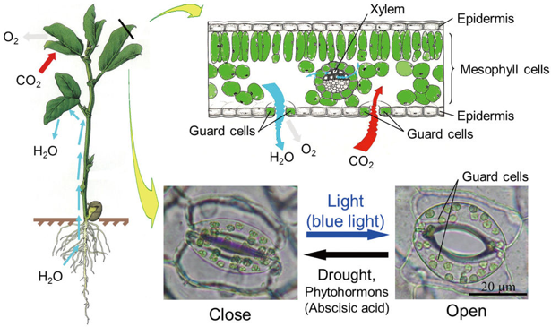
```

```{r f22, fig.cap='Photosynthesis in relation to (a) photosynthetically active radiation,(b) temperature, (c) vapor pressure deficit at 25°C and 35°C,(d) foliage water potential, (e) ambient CO2 concentration, and (f) foliage water potential for jack pine trees (Pinus banksiana). Bonan (2019)', out.width='80%', fig.asp=.75, fig.align='center',echo=FALSE}
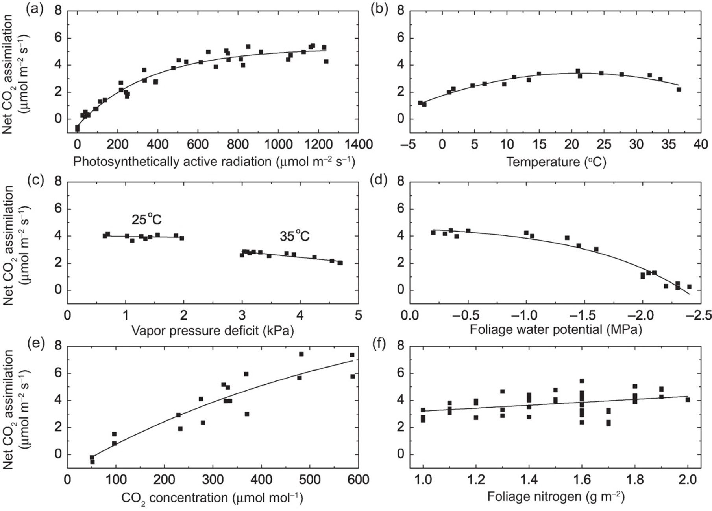
```

```{r f23, fig.cap='Temperature responses of photosynthesis, respiration and net CO2 exchange, interaction with CO2 concentration (A) and light  (B)  Schulze ()', out.width='80%', fig.asp=.75, fig.align='center',echo=FALSE}
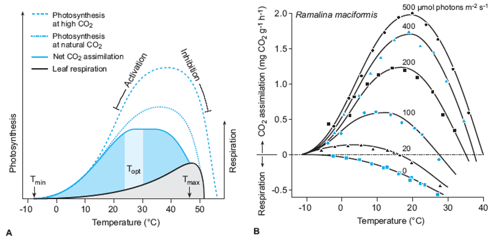
```


### C3 photosynthesis

#### Light response curve models

```{r f24, fig.cap='Conceptual figure of a leaf-level light reponse curve', out.width='80%', fig.asp=.75, fig.align='center',echo=FALSE}
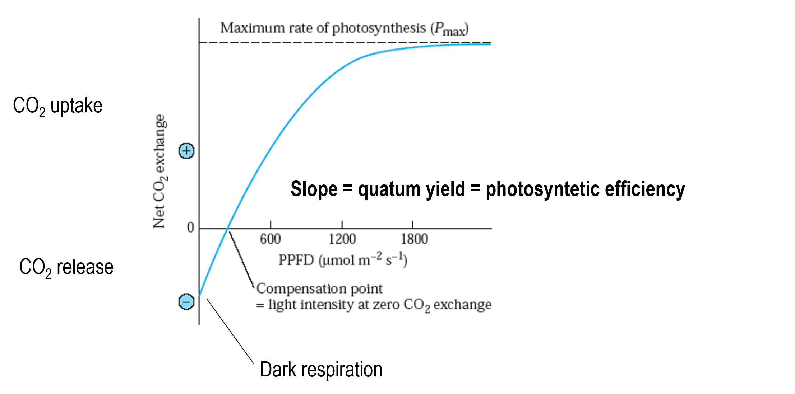
```

```{r f25, fig.cap='Co-limitation illustrated for photosynthetic response to light. The two dashed lines show the rates Amax adn EI The solid lines show the co-limited rate. (Bonan 2019)', out.width='80%', fig.asp=.75, fig.align='center',echo=FALSE}
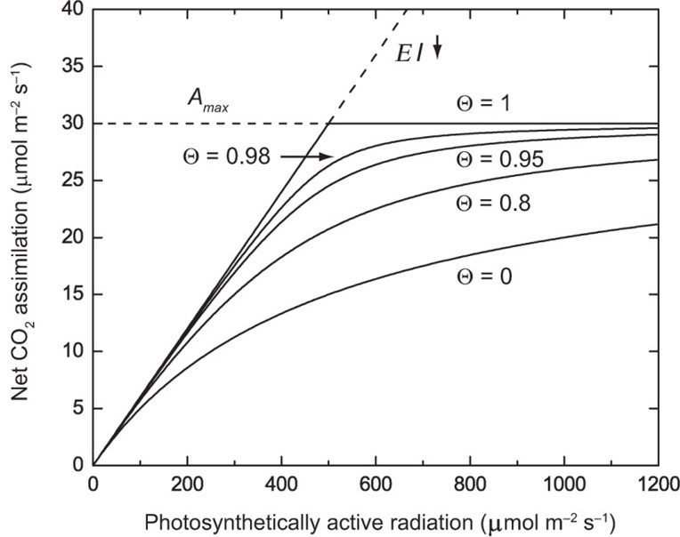
```


#### Light use efficiency models


```{r f26, fig.cap='MODIS based GPP map of the US, based on a LUE model.', out.width='80%', fig.asp=.75, fig.align='center',echo=FALSE}
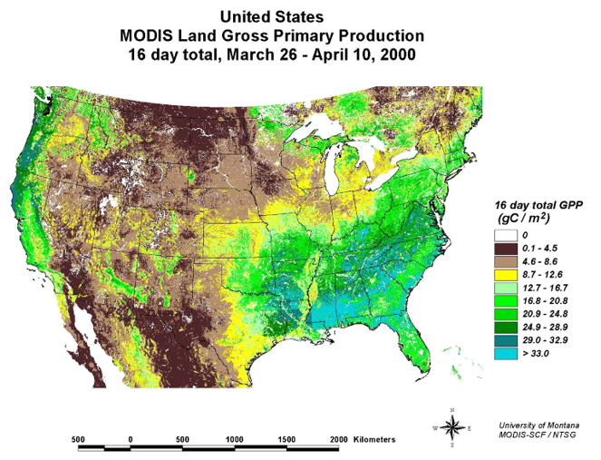
```


#### The Farquahar model


```{r f27, fig.cap='Diffusion of CO2 from free air across the leaf boundary layer and through stomata to the intercellular space. Diffusion to the chloroplast is additionally regulated by mesophyl conductance. (Bonan 2019)', out.width='80%', fig.asp=.75, fig.align='center',echo=FALSE}
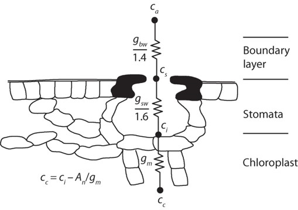
```


```{r f28, fig.cap='Simulated responses of C3 photosynthesis in relation to (a) intercellular CO2 (at I↓ = 2000 μmol m–2 s–1) and (b) photosynthetically active radiation (at ci = 266 μmol mol–1). (Bonan 2019)', out.width='80%', fig.asp=.75, fig.align='center',echo=FALSE}
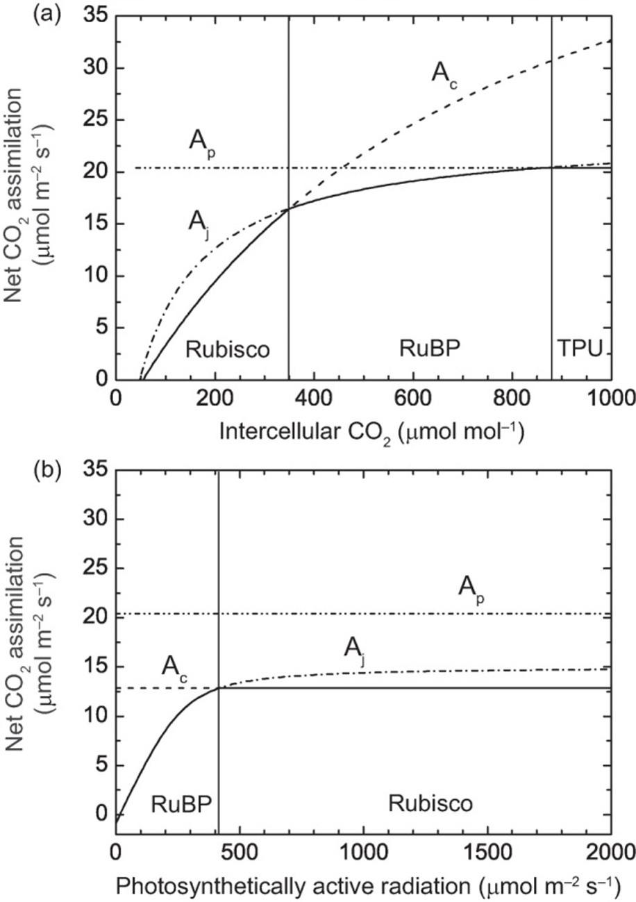
```


- UCL 4.6.1
- Bonan, Chapter 11.1
The FvCB model
Most equations between 11.1 and 11.31
Figure 11.2 a and b
Table 11.1 for parameters values + a few simulations to illustrate
Table 11.4

### Parameter and temperature dependencies


```{r f28bis, fig.cap='Relative temperature responses of the parameters of the Farquhar model (Bonan 2019)', out.width='80%', fig.asp=.75, fig.align='center',echo=FALSE}
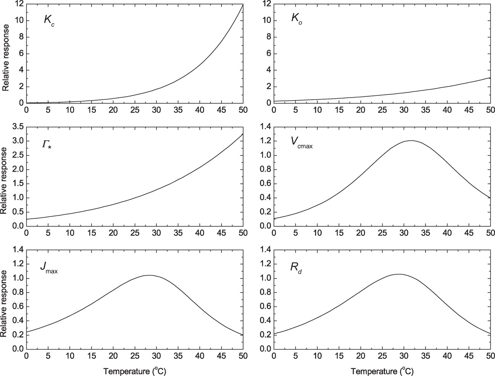
```


```{r f29, fig.cap='Linear relation between observed Vcmax and Jmax values for Beech (Verbeeck et al. 2008)', out.width='80%', fig.asp=.75, fig.align='center',echo=FALSE}
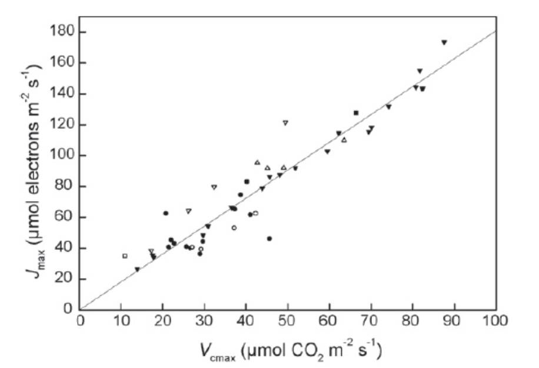
```


```{r f210, fig.cap='Equations of the full Farquhar model', out.width='80%', fig.asp=.75, fig.align='center',echo=FALSE}
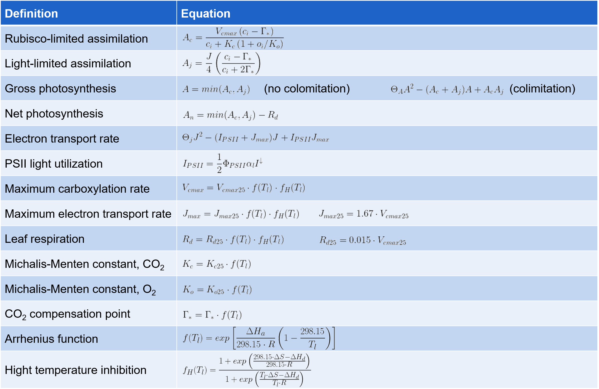
```


- Bonan, Chapter 11.2
Equations 11.34-11.37
Table 11.2
Figure 11.3 for illustration

Summary with Table 11.5 and Figure 11.4

### C4 photosynthesis
- Bonan, Chapter 11.7
PEP carboxylase
Equations 11.69-11.74
Find an illustration


```{r f210b, fig.cap='Comparison of C3 and C4 photosynthesis in response to (a) photosynthetically active radiation, (b) ambient CO2 concentration, (c) leaf temperature, and (d) vapor pressure deficit. In this figure, stomatal conductance is calculated using the Ball–Berry model and ci is obtained from the diffusion equation', out.width='80%', fig.asp=.75, fig.align='center',echo=FALSE}
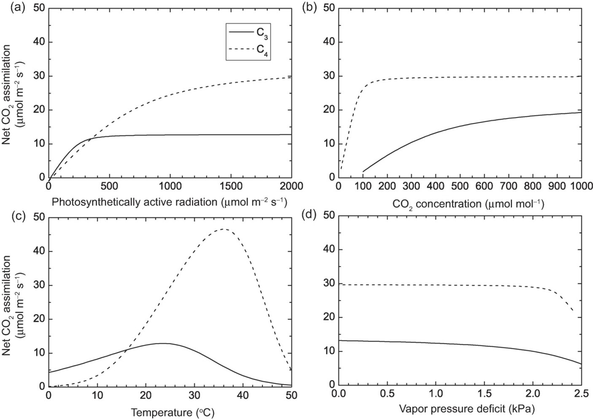
```


## Stomatal models

### Refreshing the basic knowledge

```{r f211, fig.cap='Diffusion of CO2 from free air across the leaf boundary layer and through stomata to the intercellular space. Diffusion to the chloroplast is additionally regulated by mesophyl conductance. (Bonan 2019)', out.width='80%', fig.asp=.75, fig.align='center',echo=FALSE}

```

```{r f212, fig.cap='Observed responses of stomatal conductance for Pinus banksiana. (Bonan 2019)', out.width='80%', fig.asp=.75, fig.align='center',echo=FALSE}
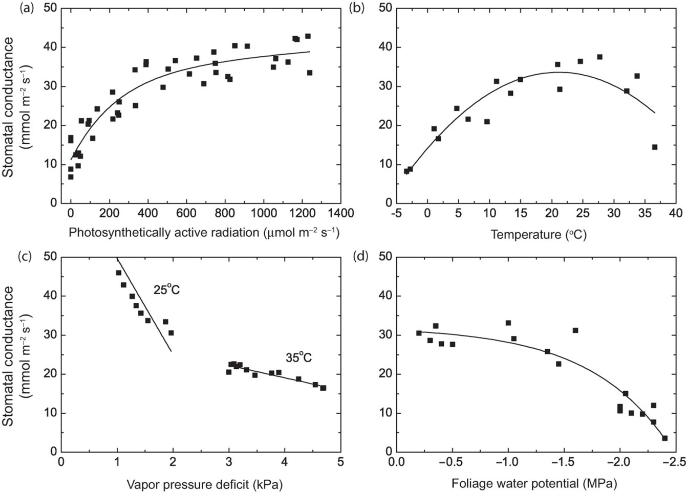
```
### Empirical multiplicative models
- Bonan, Chapter 12.2

### Semiempirical photosynthesis-based models
- Bonan, Chapter 12.3


```{r f213, fig.cap='Relationship between stomatal conductance and Anhs/cs for soybean.(Bonan 2019)', out.width='80%', fig.asp=.75, fig.align='center',echo=FALSE}
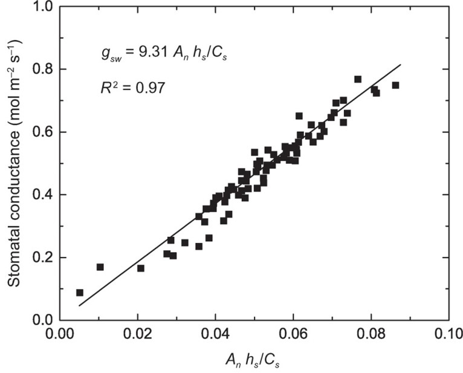
```

```{r f214, fig.cap='Flow diagram of the iterative procedure to numerically calculate ci.(Bonan 2019)', out.width='80%', fig.asp=.75, fig.align='center',echo=FALSE}
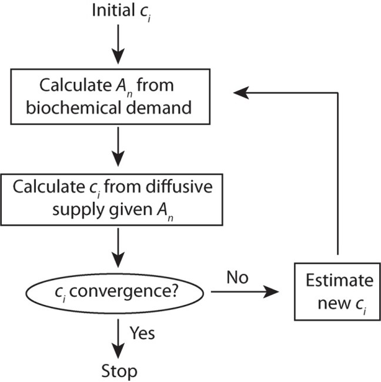
```


### WUE models and optimality theory
- Bonan, Chapter 12.4 + add optimality approach from Prentice et al.

```{r f215, fig.cap='Flow diagram of leaf flux calculations to numerically solve for stomatal conductance that optimizes water-use efficiency.(Bonan 2019)', out.width='80%', fig.asp=.75, fig.align='center',echo=FALSE}
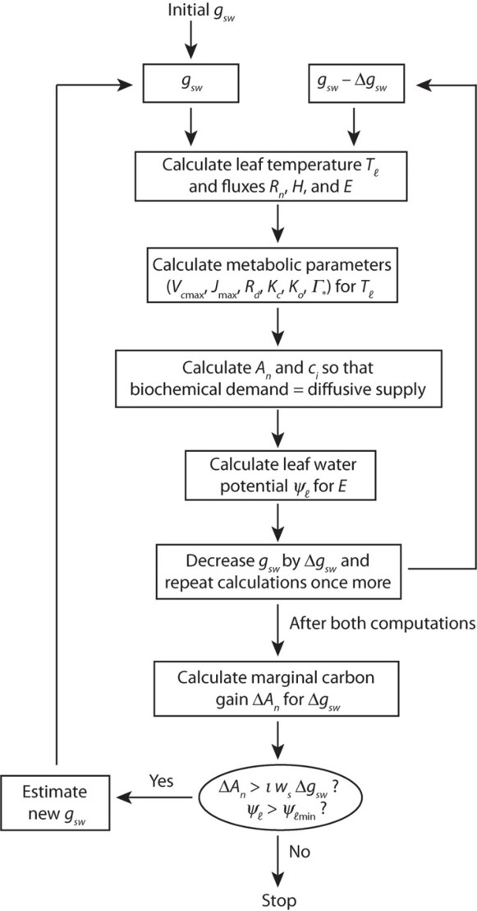
```

### Soil drought stress

```{r f216, fig.cap='Leaf carbon uptake in response to leaf water potential for multiple tree species.', out.width='80%', fig.asp=.75, fig.align='center',echo=FALSE}
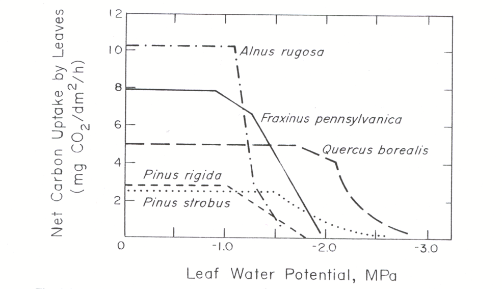
```

```{r f217, fig.cap='Soil moisture wetness factor in relation to volumetric water content. (Bonan 2019)', out.width='80%', fig.asp=.75, fig.align='center',echo=FALSE}
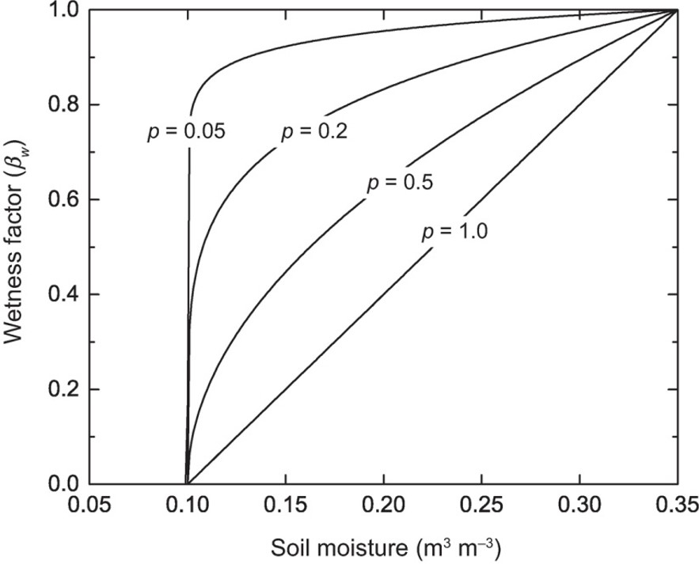
```


### Hydraulic models
```{r f218, fig.cap='Flow of water and representative water potentials along the soil–plant–atmosphere continuum. Also shown are conductances along the hydraulic pathway.(Bonan 2019)', out.width='80%', fig.asp=.75, fig.align='center',echo=FALSE}
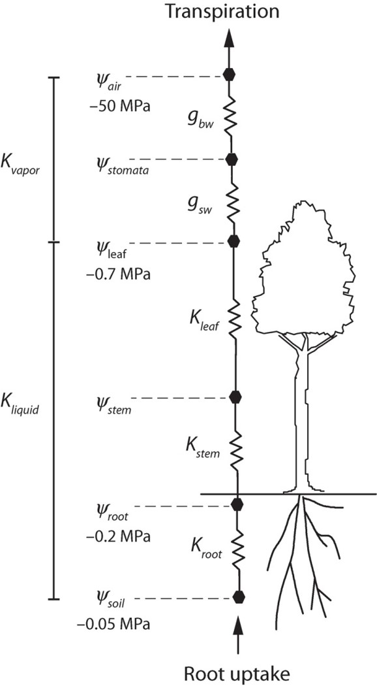
```

```{r f219, fig.cap='Depiction of (a) plant hydraulics and (b) leaf gas exchange in the Soil–Plant–Atmosphere (SPA) model. SPA is a multilayer canopy model.(Bonan 2019)', out.width='80%', fig.asp=.75, fig.align='center',echo=FALSE}
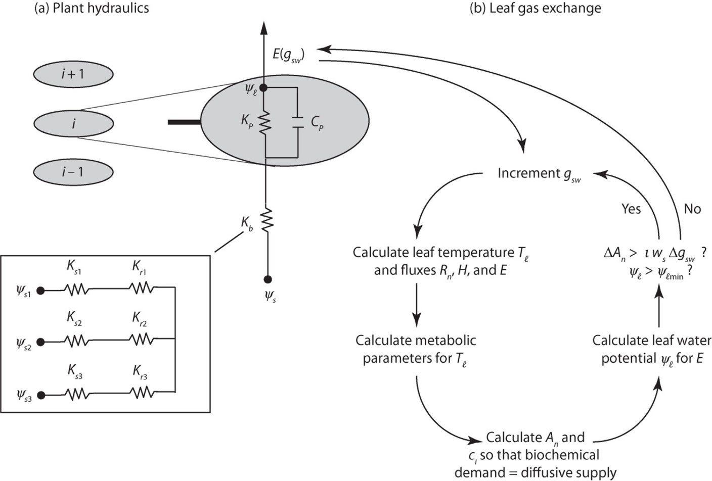
```

```{r f220, fig.cap='Simulated stomatal responses for various modelling approaches. (Bonan 2019)', out.width='80%', fig.asp=.75, fig.align='center',echo=FALSE}
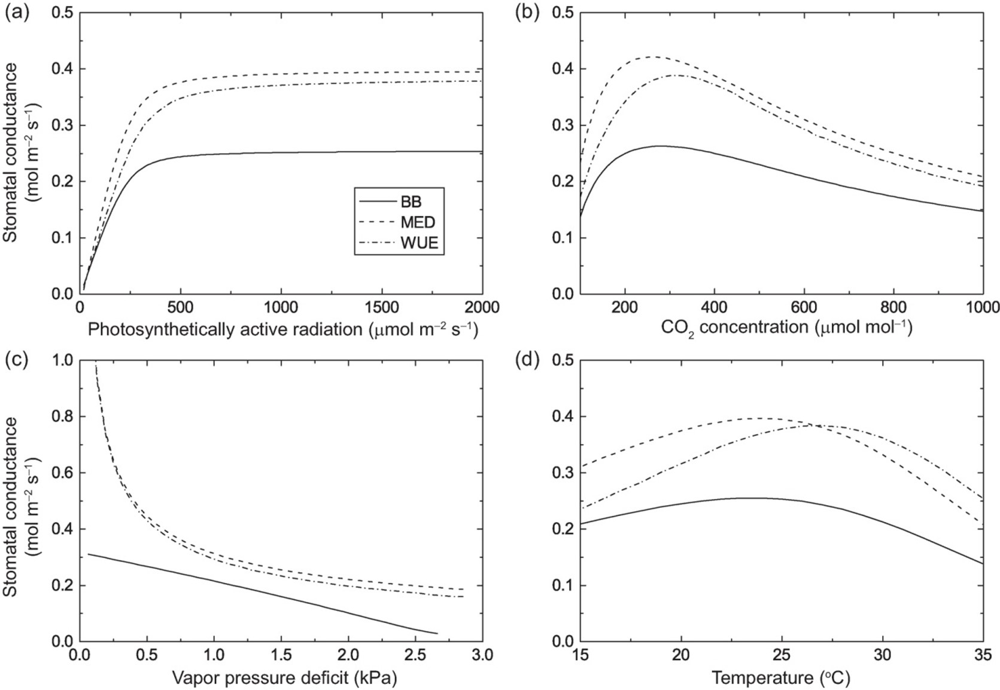
```

Figure 13.1
The soil-plant-atmosphere model
Leaf water potential
Plant water uptake
Resistance analogy
Multinode models


## Upscaling from leaf to canopy
- Quickly introduce the problem of scaling in ecology (review paper of Jerome Chave) and refer to chapter 10 on upscalling
- Canopy integration: LAI layers, etc... Nice transition to chap 3 with the interception of light by the canopy

Leaf microclimate and boundary layer processes in relation to leaf dimension for sun and shade conditions.

```{r f221, fig.cap='Leaf microclimate and boundary layer processes in relation to leaf dimension for sun and shade conditions.(Bonan 2019)', out.width='80%', fig.asp=.75, fig.align='center',echo=FALSE}
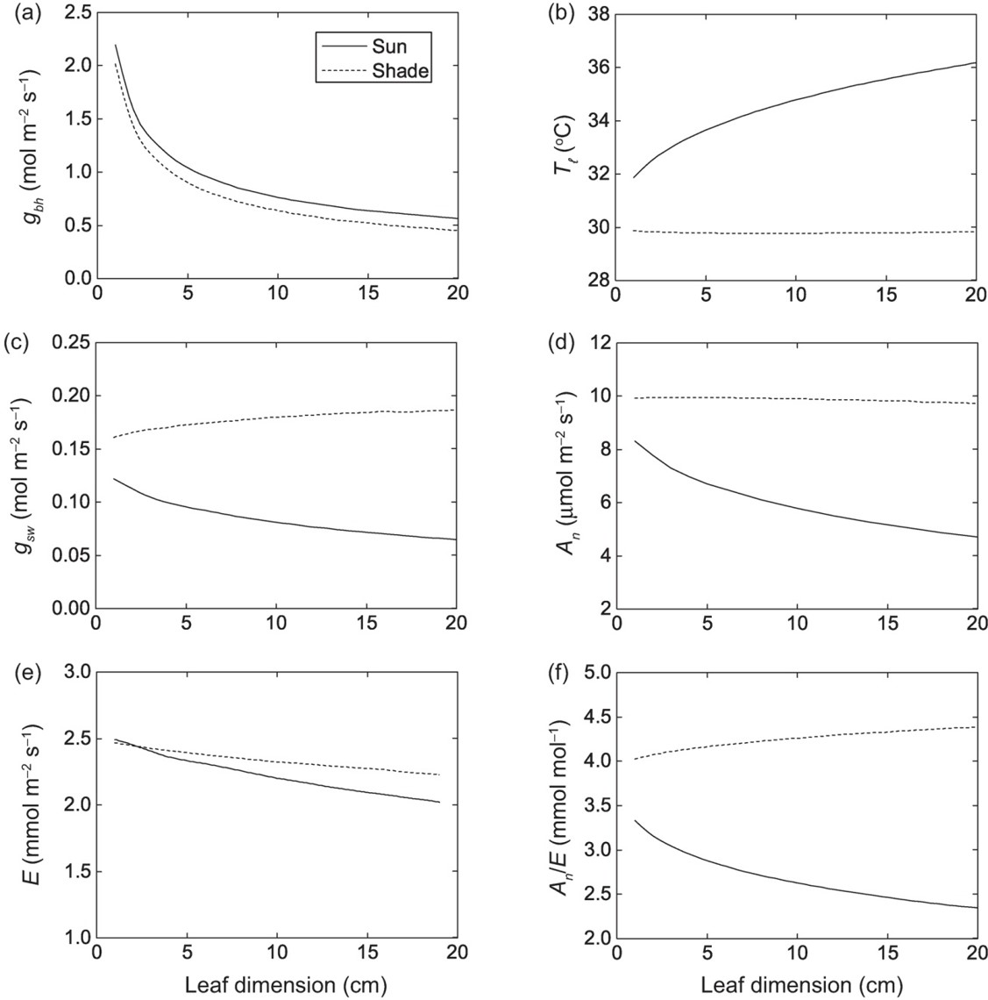
```

```{r f222, fig.cap='Controlling facors on ecosystem GPP. (Chapin)', out.width='80%', fig.asp=.75, fig.align='center',echo=FALSE}
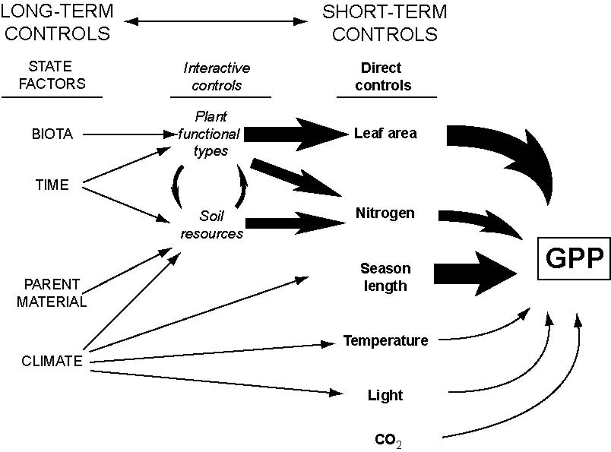
```


## Case studies
### Case study 2.1 Ozone impact on global GPP

```{r f223, fig.cap='Simulated global GPP reduction in response to current and future atmospheric ozone concentrations', out.width='80%', fig.asp=.75, fig.align='center',echo=FALSE}
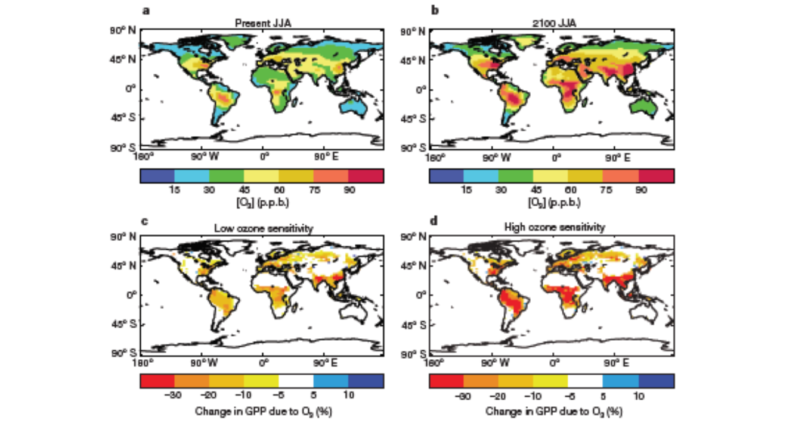
```


### Case study 2.2 Drought impact on rainforest GPP

```{r f224, fig.cap='Simulated (SPA model) and observed sapflow for a drought experiment in the Amazon; Fisher et al. 2007', out.width='80%', fig.asp=.75, fig.align='center',echo=FALSE}
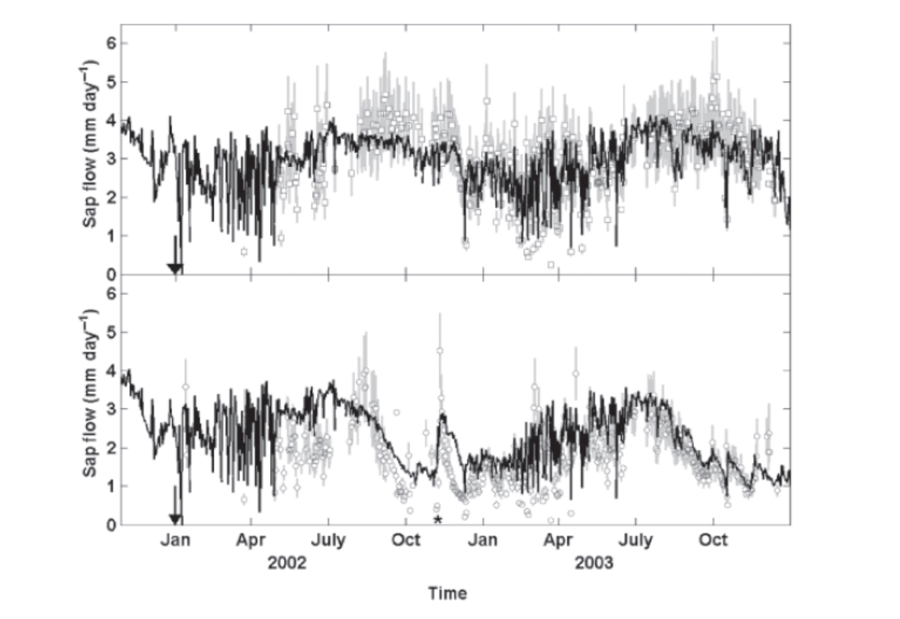
```

```{r f225, fig.cap='Simulated (SPA model) gs and GPP for a drought experiment in the Amazon. Fisher et al. 2007', out.width='80%', fig.asp=.75, fig.align='center',echo=FALSE}
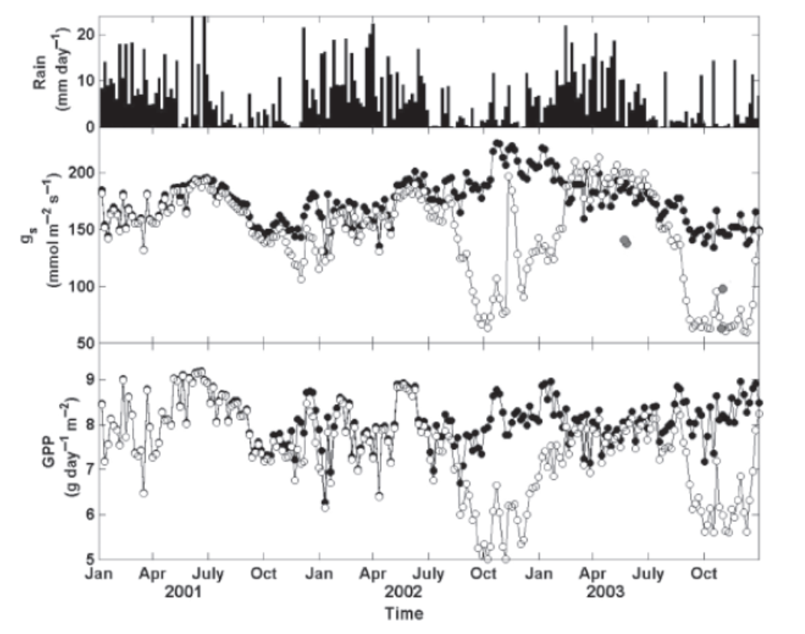
```
