# Modelling radiation, vegetation canopies, and energy balance
\chaptermark{Light}

## Introduction

This chapter deals with upscaling processes from leaf level to canopy level, but still on a (very) short timescale (~hours, sub-daily). 

We want a model that is consistent over different scales. If we measure parameters at the leaf level and put those parameter values in our model, we want the results to be as consistent as possible with the data at the canopy scale, for example data from eddy covariance flux towers. Also the other way around, if we optimize model parameters based on flux tower measurements, we want the resulting leaf parameters to be as close as possible to the parameters observed in the field at leaf level.

We first refresh some basics on radiation. The sun emits shortwave radiation, the earth emits longwave radiation (invisible). Longwave radiation has its maximum intensity at a much longer wavelength and contains a much lower amount of energy (surface under the spectral intensity curve). The spectrum of wavelengths the sun emits is different when we measure it on the earth surface (compared to the spectrum at the top of the atmosphere, as the atmosphere absorbs some of the radiation, e.g. in the ultraviolet light and infrared light absorption takes place. Diffuse radiation (which indirectly reaches the surface) is more shifted towards the blue light, which is one of the wavelengths used by plants. On a sunny day, both diffuse and direct radiation reach the plants. Under full cloud cover, plants only receive diffuse radiation. 50% of the shortwave radiation is PAR (Photosynthetic Active radiation). PAR is typically expressed as a photon flux density (micromols of photons per m² per s). The lower the zenith angle (higher sun), the higher the PAR fraction in the diffuse and direct radiation that reaches the earth surface. The relative PAR fraction is higher in diffuse radiation.

Secondly, we need to refresh some basics on canopy structure parameters. The leaf area index (LAI) is the total leaf area per unit of ground area. Sometimes it is also defined as the total double-sided surface of the leaves (so the two sides of the leaf), but this is not commonly used. The projected leaf area depends on the orientation of the leaf. Vertically oriented leaves have a smaller projected leaf area than if they would be horizontally oriented. Figure \@ref(fig:f31) shows a generalized example of the leaf area density distribution for different vegetation types. The peak of leaf area density is different depending on the vegetation type, with a peak higher in the vegetation for forests and more in the middle for grass. The total LAI is calculated by integrating the function $a(z)$ showed in figure \@ref(fig:f31) over the height. If you keep in mind that trees are higher than grass, it is clear that the total LAI will be bigger for trees than for grass. 

$$
total \, LAI = \int_0^{h_c}a(z) \cdot dz
$$

```{r f31, fig.cap='Generalized profiles of leaf area density in plant canopies. (Bonan)', out.width='80%', fig.asp=.75, fig.align='center',echo=FALSE}
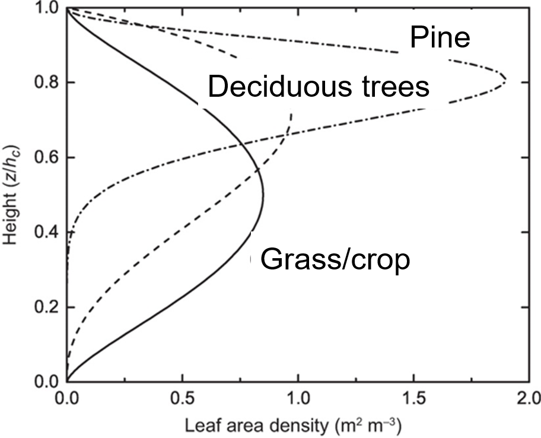
```

The cumulative LAI represented in Figure \@ref(fig:f32) shows the LAI above a certain point in the canopy. It is calculated as the integral of the function between that point and the canopy height. This figure also shows the cumulative wood area index. If we make the sum of the LAI and the wood area index (WAI) we get the plant area index PAI, which is the total area of plant material per unit of ground area.

$$
cumulative \, LAI = \int_z^{h_c}a(z) \cdot dz
$$

```{r f32, fig.cap='Cumulative LAI and WAI in a deciduous oak-hickory forest. (Bonan)', out.width='80%', fig.asp=.75, fig.align='center',echo=FALSE}
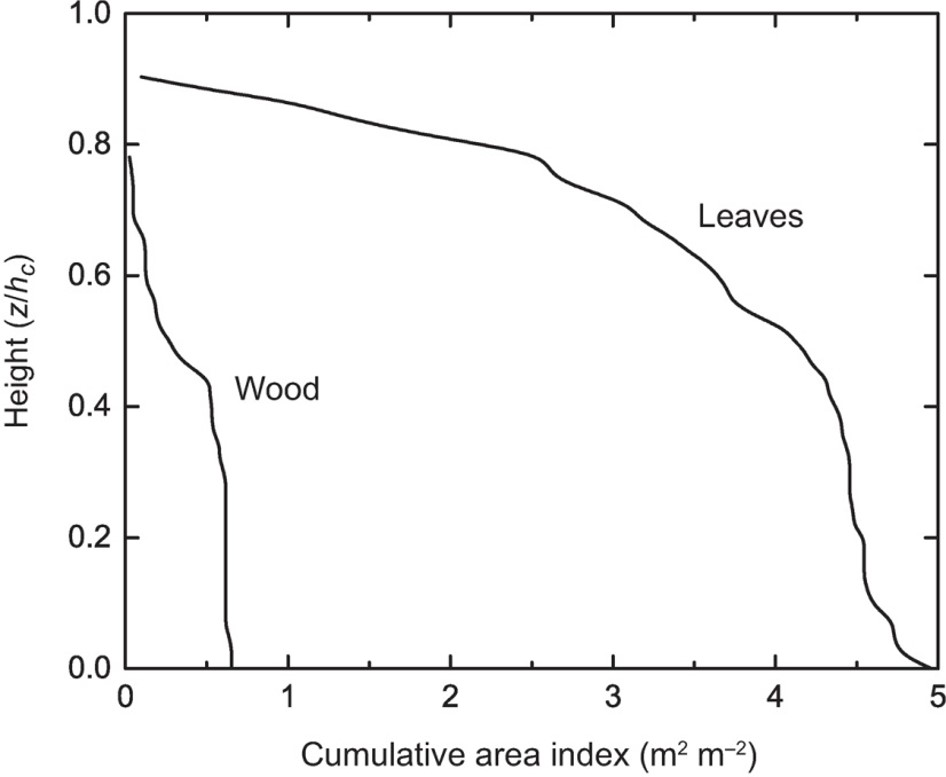
```

The leaf angle (distribution) is a key structural property of a vegetation canopy. It will largely determine how light will penetrate in the canopy, and is important for other processes, like precipitation interception. Figure \@ref(fig:f33) illustrates that the leaf angle can be expressed as the angle between the leaf and the horizontal plane, or as the angle between the zenith line and the line perpendicular to the leaf surface.

```{r f33, fig.cap='Illustration of a leaf (thick line) oriented at an angle Θℓ to horizontal. (Bonan)', out.width='80%', fig.asp=.75, fig.align='center',echo=FALSE}
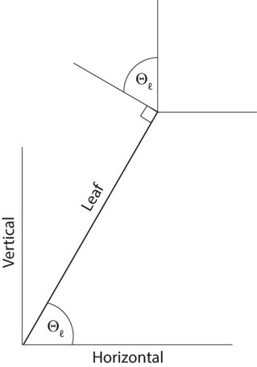
```

Leaf angle distributions describe a probability density function of leaf angles of a plant or vegetation. Base on these distribution we can distinguish differences between plants and vegetation types. Planophile leaf angle distributions: most leaves are horizontally oriented; erectophile: most leaves are vertically oriented; plagiophile: average leaf inclination angle is 45°; spherical: mostly used in modelling, corresponds somehow to erectophile, it is a kind of idealized form. This distributions are illustrated in Fig. \@ref(fig:f34) Subplot b indicates the cumulative distribution of the leaves. 

```{r f34, fig.cap='Planophile, erectophile, plagiophile, and spherical leaf angle distributions showing (a) the probability density function f(Θℓ) and (b) the cumulative distribution F(Θℓ). (Bonan)', out.width='80%', fig.asp=.75, fig.align='center',echo=FALSE}
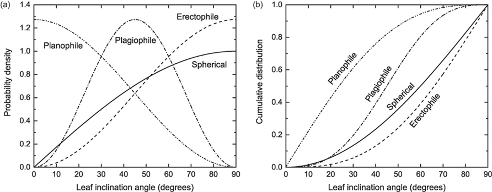
```

Figure \@ref(fig:f35) illustrates the impact of leaf orientation in two crops on light penetration in the canopy of two crops (lower panel). The complexity of the vegetation plays an important role in where the light is intercepted and how much is intercepted (upper panel). In an erectophile leaf orientation, the light interception is more evenly spread through the vegetation than for a planophile profile, where most of the interception takes place at the center of the vegetation.

```{r f35, fig.cap='Illustration of leaf angle distributions and canopy architecture in general influences radiation attenuation in vegetation canopies.', out.width='80%', fig.asp=.75, fig.align='center',echo=FALSE}
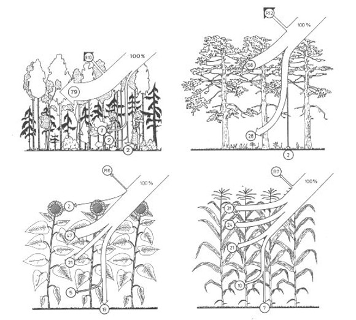
```

Light extinction follows a typical exponential course when it is observed at multiple heights in vegetation, it decreases very fast at the top of the canopy, with almost no light reaching the soil in this example (Fig. \@ref(fig:f36)). 
We can conclude that radiative transfer in the canopy depends on:

- the LAI (amount of leaves), 
- the optical properties (which depend on the morphology and chemical composition) of the leaves
- the organization of the leaves (architecture, angles,..) 


```{r f36, fig.cap='Profile of light and foliage in a stand of herbaceous plants approximately 130 cm tall. The horizontal axis shows transmittance as a fraction of incident radiation (top axis) and foliage mass (bottom axis) at various heights in the canopy. (Bonan)', out.width='80%', fig.asp=.75, fig.align='center',echo=FALSE}
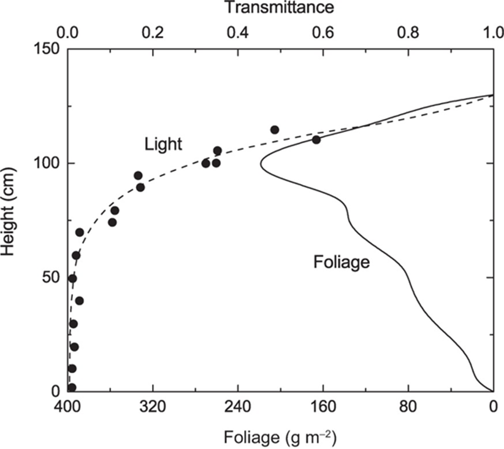
```


Radiative transfer theory aims to integrate the light environment of individual vegetation elements (leaves, branches, …) over the entire canopy. It must distinguish between the specific behavior of direct beam radiation and omnidirectional diffuse radiation and it should account for wavelength.

## Radiative transfer modelling

Radiative transfer modelling in full 3D is very complex and is a separate branch of science. The radiative transfer schemes in vegetation models are usually relatively simple approximations of full 3D radiative transfer. Such schemes have a lot of assumptions: all leaves are plane-parallel oriented, leaf layers are horizontally homogeneous. We mostly use a one dimensional representation of the canopy (Fig.\@ref(fig:f37)), which is often used in vegetation models. Such an approach neglects the horizontal heterogeneity of vegetation and only assume a simplified vertical heterogeneity. A more complex model, subplot b, represents a three dimensional representation of the canopy, with vertical and horizontal variation.

```{r f37, fig.cap='Representation of a canopy as (a) one-dimensional with a vertical profile of leaf area (shown by grayscale gradation in which darker shading denotes more leaves) that is horizontally homogenous and (b) threedimensional with vertical and spatial structure determined by crown geometry and spacing. (Bonan)', out.width='80%', fig.asp=.75, fig.align='center',echo=FALSE}
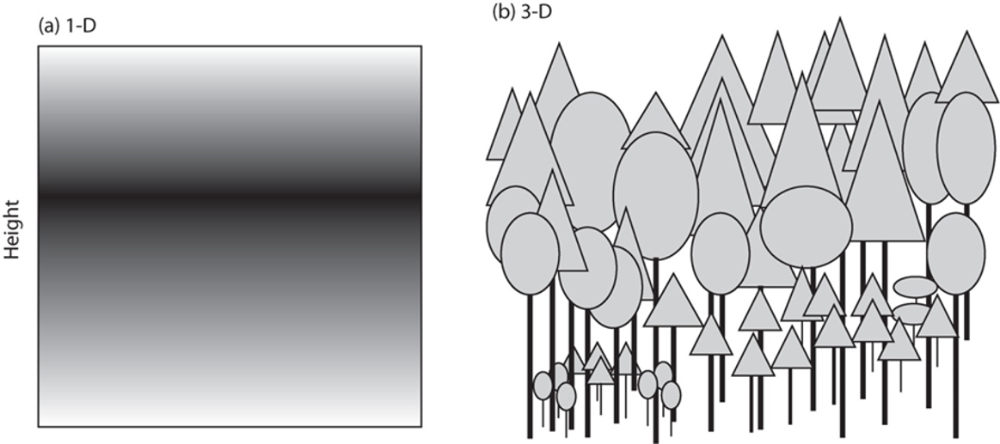
```

### Leaf optical properties

What happens to light when it reaches a leaf? It can be absorbed, reflected or transmitted. We express these in relative fractions as $\rho$ = reflectance (albedo), $\tau$ = transmittance, $\alpha$ = absorbance. Leaves absorb PAR, with a small negative peak at the green light, which they reflect more compared to blue and red light. Also in the infrared wavelength band, radiation is absorbed (mostly longwave radiation). UV light is absorbed by the cuticula to protect the leaves. The reflectance and transmittance curves are inverse curves from the absorptance curve. Here, infrared radiation and green light are reflected/transmitted. The clear difference between VIS and NIR is used in remote sensing for vegetation indices (e.g. NDVI). Transmittance depends on the thickness of the leave.

```{r f37b, fig.cap='Spectrum of absorptance, reflectance and transmittance of a typical plant leaf (Jones, 2014)', out.width='80%', fig.asp=.75, fig.align='center',echo=FALSE}
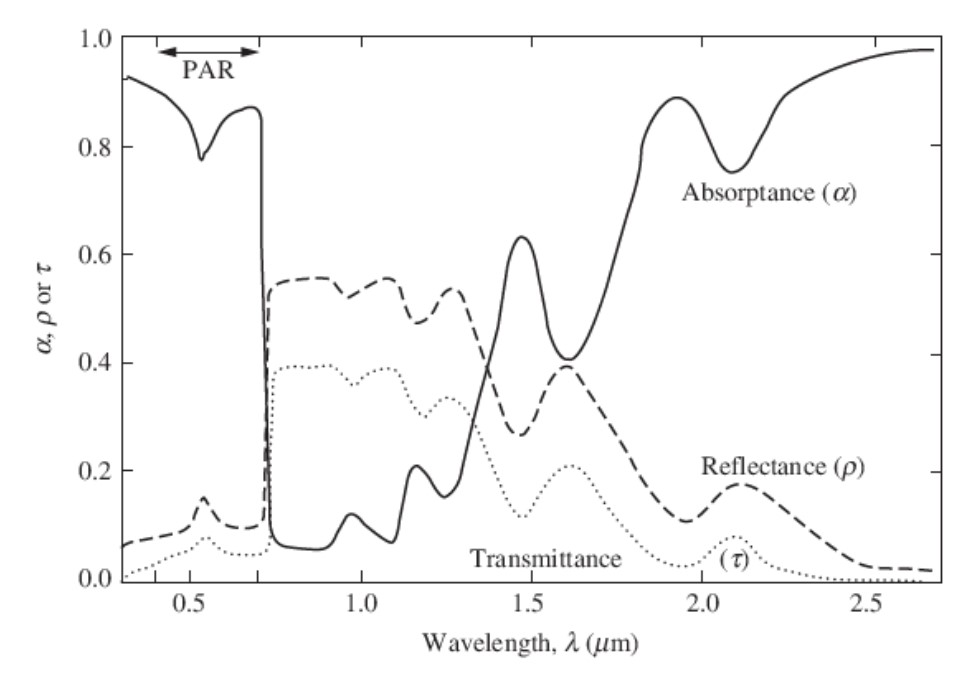
```

The albedo of the total canopy is typically lower than that of its individual leaves, as light that is transmitted or reflected by one leave can be absorbed by another leaf (multiple scattering) (see Table below). Reflectance of needles is lower than the reflectance of broadleaves. 

\begin{center}
\captionof{table}{Table showing typical reflectance and absorptance values for leaves and vegetation canopies of different Plant Functional Types (PFT).(Jones, 2014)}
\label{table:reflectance}
```{r f38, out.width='80%', fig.asp=.75, fig.align='center',echo=FALSE}
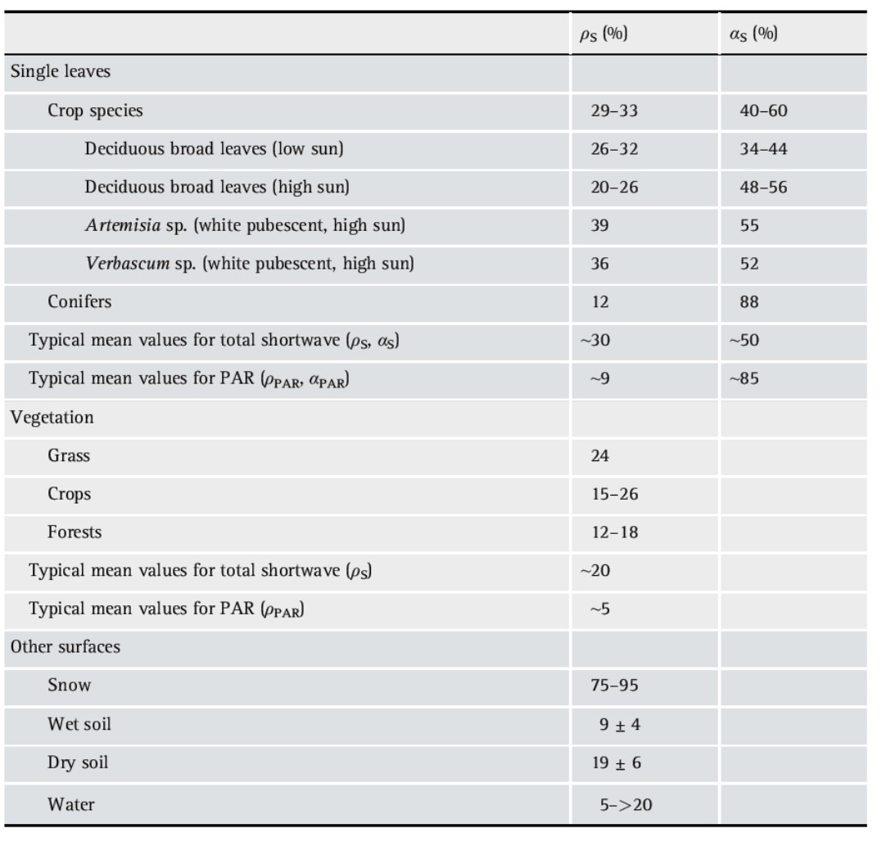
```
\end{center}

### Light transmission without scattering

The most basic radiative transfer models, do not consider scattering (no reflection on the leaf). The Beer-Bouguer-Lambert law describes the attenuation of light through a homogeneous medium with thickness $dz$ in absence of scattering. The absorbed radiation is proportional to the thickness of the medium, the amount of light that comes in and a constant $K$.

$$
dI^{\downarrow} = -KI^\downarrow dz
$$

with $dz$: thickness; $I^\downarrow$: incoming radiation; $K$: constant; $dI^\downarrow$: absorbed radiation in the medium.

After integration we can calculate the radiation $I$ leaving the medium from $I_0$, the radiation intensity entering the medium.

$$
I^{\downarrow} = I^{\downarrow}_0\cdot e^{-Kz}
$$

For leaves in a canopy, and based on probability theory, Monsi and Saeki (1953) applied the Beer law for a volume with crown thickness $dz$, with randomly distributed horizontal elements (leaves) with density $N$ (number of elements per volume, see Fig. \@ref(fig:f39). 

$$
dI^{\downarrow} = - I^{\downarrow} a N dz
$$

where the total leaf area in the volume can be calculated as:

$$
L = aNz
$$

with $N$: density of leaf elements; $L$: total leaf area; $a$: surface of individual leaf perpendicular to the path of light; $z$ the total thickness of the canopy.

After integration we get an exponential function that describes the radiation extinction in the canopy:

$$
I^{\downarrow} = I^{\downarrow}_0\cdot e^{-L}
$$

```{r f39, fig.cap='Transmission of solar radiation through a homogeneous medium in the absence of scattering. In this example, n non-overlapping opaque particles each with cross-sectional area a oriented perpendicular to the path of light are placed in a medium with cross-sectional area A and thickness dz. The radiation absorbed in the medium is dI.(Bonan)', out.width='80%', fig.asp=.75, fig.align='center',echo=FALSE}
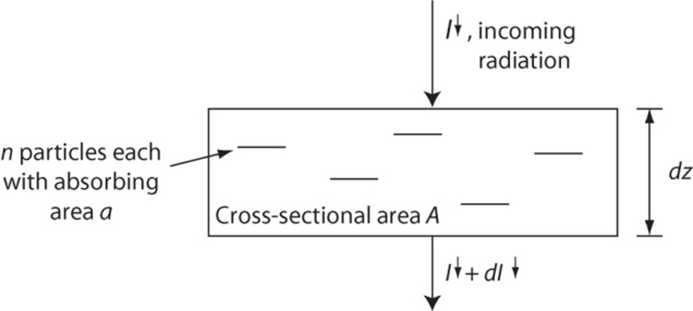
```

However, in real canopies not all leaves are horizontal, and the light is not coming in perpendicular as assumed in the original equation of Monsi and Saeki. In the exponential function, $L$ should therefore be adapted to the projected leaf area perpendicular to the light beams, as the model assumes that light comes in perpendicularly.

$$
I^{\downarrow} = I^{\downarrow}_{sky,b}\cdot e^{-K_bL}
$$


Where $K_b$: direct beam extinction coefficient, and $LH$ (horizontal leaf area)= $K_b L$. And $I^{\downarrow}_{sky,b}$ is the incident radiation at the top of the canopy. $K_b$ describes how severe light is attenuated in the canopy depending on the LAI. A higher $K_b$ indicates a faster extinction, so a more dark forest. Fig. \@ref(fig:f310) describes the light transmittance with increasing LAI for different $K_b$ values. 

```{r f310, fig.cap='Transmission of direct beam radiation τb in relation to leaf area index for typical values of the extinction coefficient Kb. (Bonan)', out.width='80%', fig.asp=.75, fig.align='center',echo=FALSE}
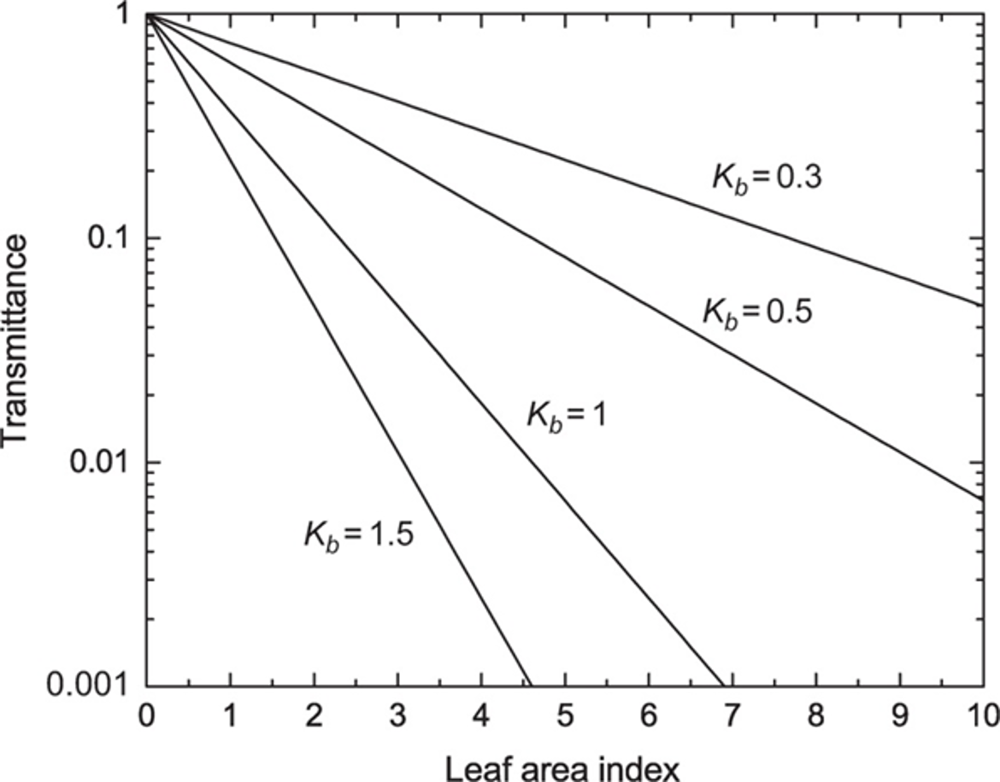
```

The extinction coefficient depends on solar zenith angle and leaf orientation (as illustrated in Fig.\@ref(fig:f311)).

$$
K_b = \frac{L_H}{L} = \frac{G(Z)}{cosZ}
$$

With $Z$: solar angle; $\Theta_l$: leaf angle; $G(Z)$: function depending on the zenith angle (shown in figure \@ref(fig:f311)). Divided by $cosZ$ because we project to the horizontal plane. $L_h$: leaf area projected on the horizontal plane.

```{r f311, fig.cap='Extinction coefficient in relation to solar zenith angle Ζ and leaf inclination angle. In each panel, a unit leaf area (L = 1), shown with a thick line, is projected onto a horizontal surface $L_H$ so that $K_b = L_H$. The leaf inclination angle is 0° (bottom panels), 30° (middle panels), and 60° (top panels). In the left and middle columns, the leaf is oriented towards the Sun and the solar zenith angle is 0° (left column) and 15° (middle column). In the right column, Ζ = 15°, but the leaf is oriented away from the Sun. In each panel, the arrows indicate the solar beam (Bonan)', out.width='80%', fig.asp=.75, fig.align='center',echo=FALSE}
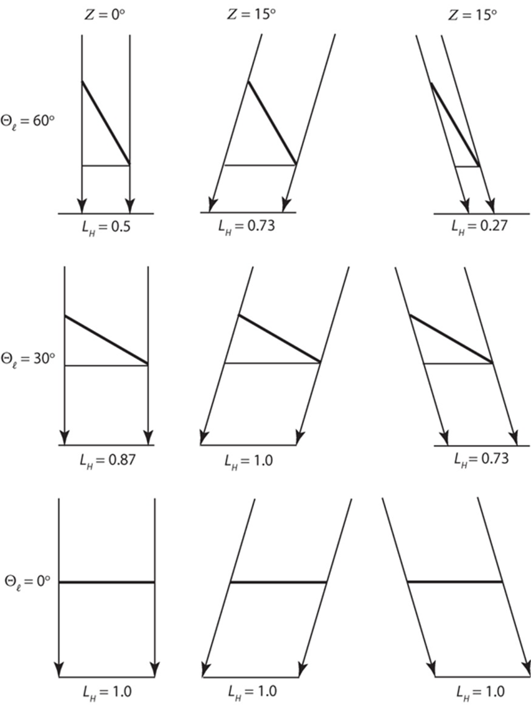
```

The lower the sun is to the horizon (the higher the zenith angle), the higher the extinction coefficient is, except for horizontal leaves, which have a constant $K_b$ of 1.

```{r f312, fig.cap='Extinction coefficients for horizontal, spherical, and vertical leaf angle distributions. (a) Direct beam radiation Kb in relation to solar zenith angle. (b) Diffuse radiation Kd in relation to leaf area index(Bonan)', out.width='80%', fig.asp=.75, fig.align='center',echo=FALSE}
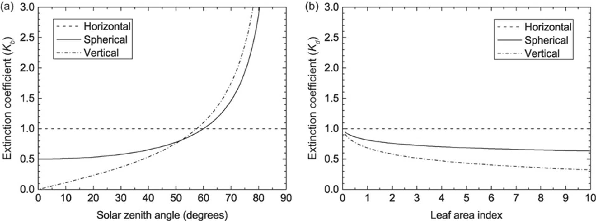
```

The above described formulas do not only allow us to describe the light extinction in the canopy, but also to calculate the sun and shaded fraction of leaf are in the canopy. If we divide the canopy into multiple layers, we can calculate for each layer which part is in the sun and which part is in the shade. For every canopy layer, the fraction of sunlit leaves is equal to the fsun(x) function. It represents the amount of light that comes through the layers above it.

$$
f_{sun} (x) = e^{-K_b x}
$$

Where $x$ is the cumulative LAI above the layer of interest. Similarly we can calculate the actual sunlit leaf area within a certain layer:

$$
\Delta L_{sun} = \frac{e^{-K_b x} \left(1 - e^{-K_b \Delta L} \right)}{K_b}
$$

Where $\Delta L$ is the actual amount of leaves in that layer, this formula calculates the difference between the sunlit fraction at the top of the layer minus the "reduction of sunlit fraction" within the layer. If we apply that formula on a full canopy we can calculate the sunlit leaf area of the full canopy $L_{sun}$:

$$
L_{sun} = \frac{\left(1 - e^{-K_b L} \right)}{K_b}
$$

$L_sun$: integrated over the whole canopy. Based on this equation you can calculated the amount of leaves that is sunlit in the canopy. And also the shade fraction based on the difference with the total LAI.

In the example below (Fig. \@ref(fig:f313)) the sunlit and total LAI are compared between a vegetation with horizontal and with vertical foliage. The latter has more sunlit leaves, as top leaves don’t shade the underlaying leaves. In the horizontal foliage, more light is absorbed, so less light is transmitted than in the vertical foliage.

```{r f313, fig.cap='Radiative transfer and sunlit leaf area index for a canopy of horizontal leaves (top panels) with Kb = 1 and vertical leaves (bottom panels) with Kb = 0.112. The left-hand panels show a canopy consisting of four layers of leaves. Each thick black line represents a leaf area index of 0.1 m2 m–2. The thin lines depict interception or transmission of beam radiation with a zenith angle of 10°. The middle panels show cumulative leaf area index and sunlit leaf area index with depth in the canopy. The right-hand panels show direct beam transmittance with depth in the canopy. (Bonan)', out.width='80%', fig.asp=.75, fig.align='center',echo=FALSE}
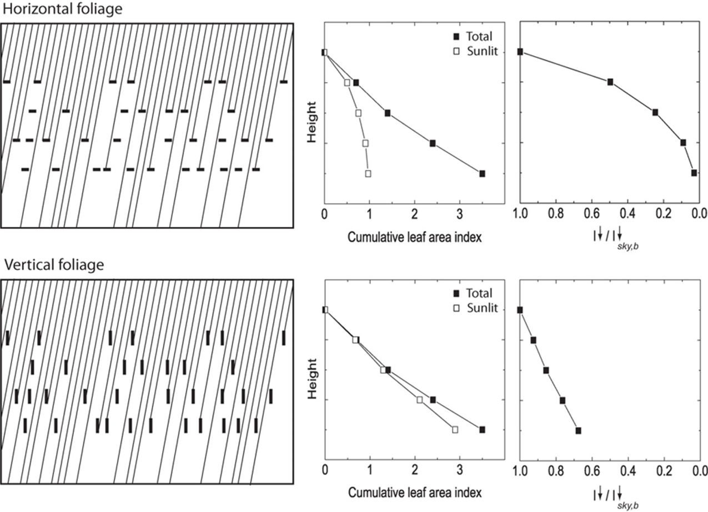
```

When we study the sunlit LAI with increasing cumulative LAI (Fig.\@ref(fig:f314)) for different leaf orientations, the same course of the curve applies: first, there is a linear increase of the amount sunlit leave are index with increasing LAI, after which a saturation occurs when the vegetation becomes more dense (higher LAI). The level of saturation depends on the leaf angle distribution.

```{r f314, fig.cap='Sunlit leaf area index in relation to total leaf area index for horizontal, spherical, and vertical foliage orientations with solar zenith angle Ζ = 30°. Kb = 1, 0.577, and 0.368 for horizontal, spherical, and vertical foliage. (Bonan)', out.width='80%', fig.asp=.75, fig.align='center',echo=FALSE}
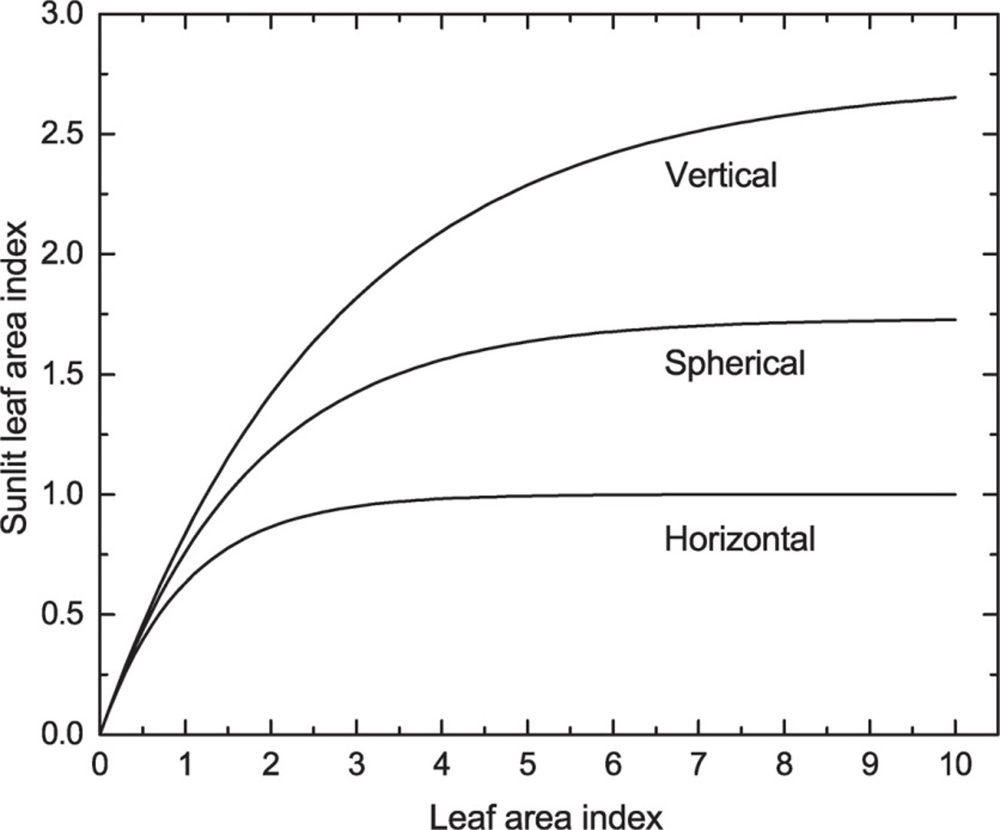
```

A final complicating factor that we want to highlight here is that leaves and canopies are not distributed randomly in space, but occur clumped. Leaf clumping means that leaves appear in groups and that there are larger gaps in between. Clumping can occur at different scales: at leaf level, canopy level or landscape level (Fig.\@ref(fig:f315)). The clumping factor ($\Omega$) adjusts the amount of light that goes through the vegetation (more light passes through). The factor is added in the radiation extinction equations to adjust the extinction coefficient. Where a clumping factor of 1 represents randomly distributed leaves, while values lower then 1 represent clumped leaves (e.g. 0.74 for needleleaf evergreen forest).


$$
I^{\downarrow} = I^{\downarrow}_{sky,b}\cdot e^{-K_b \Omega L}
$$

$$
f_{sun} (x) = e^{-K_b \Omega x}
$$

```{r f315, fig.cap='Images illustrating leaf/canopy clumping a various scales: leaf, crown, stand.', out.width='80%', fig.asp=.75, fig.align='center',echo=FALSE}
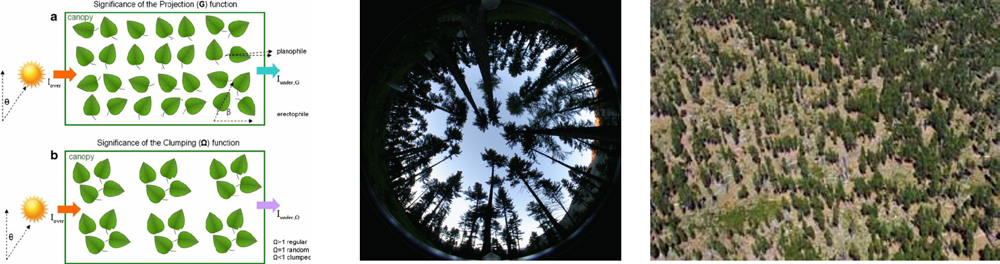
```


### Diffuse transmittance

Diffuse radiation is omnidirectional, and therefore it penetrates better into the canopy. The formula below represents the diffuse transmittance. The last part of the equation represents the contribution of a certain sky angle to the total sky irradiation (e.g. contribution of zenith angle between Z1 and Z2 in Fig.\@ref(fig:f316)). The exponential curve with the leaf area $L$ is the light extinction curve, but here it is also integrated over the zenith angle. 

$$
\tau_d = \frac{I^{\downarrow}}{I^{\downarrow}_{sky,d}} \int_0^{\pi/2} exp\left[- \frac{G(Z)}{cosZ}L \right] sinZcosZdz
$$

```{r f316, fig.cap='Illustration of direct beam and diffuse radiation. The sky forms a bowl, or inverted hemisphere, over a horizontal surface. Shown is a cross section of the sky hemisphere. Direct beam (solid line) originates from the  direction of the Sun with zenith angle Ζ. Diffuse radiation (dashed lines) can be treated as independent beams of radiation each with an angle Ζ. The shaded region is the relative contribution between sky angles Ζ1 and Ζ2 to total sky irradiance.(Bonan)', out.width='80%', fig.asp=.75, fig.align='center',echo=FALSE}
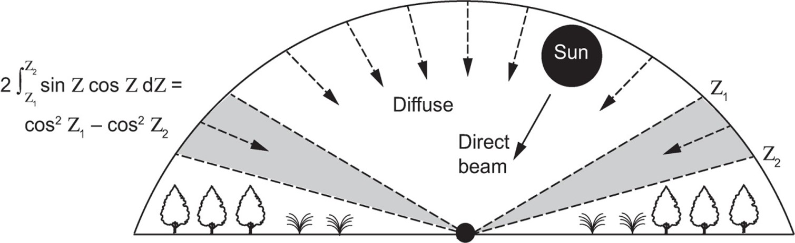
```

The more leaves, the less diffuse light is transmitted through the canopy. The contribution of the zenith angles is shown on Fig.\@ref(fig:f317). There is more light transmitted in the 30°-60° zenith angle range than in the other two groups. Thus perpendicular diffuse sunlight penetrates less easy in the canopy than sunlight under a 30°-60° angle.

```{r f317, fig.cap='Transmittance of diffuse radiation τd in relation to leaf area index for a spherical leaf distribution. Show are the transmittances for sky zones of 0°–30°, 30°–60°, and 60°–90° and also the total transmittance. Fill patterns show the contribution of each sky zone to total transmittance.(Bonan)', out.width='80%', fig.asp=.75, fig.align='center',echo=FALSE}
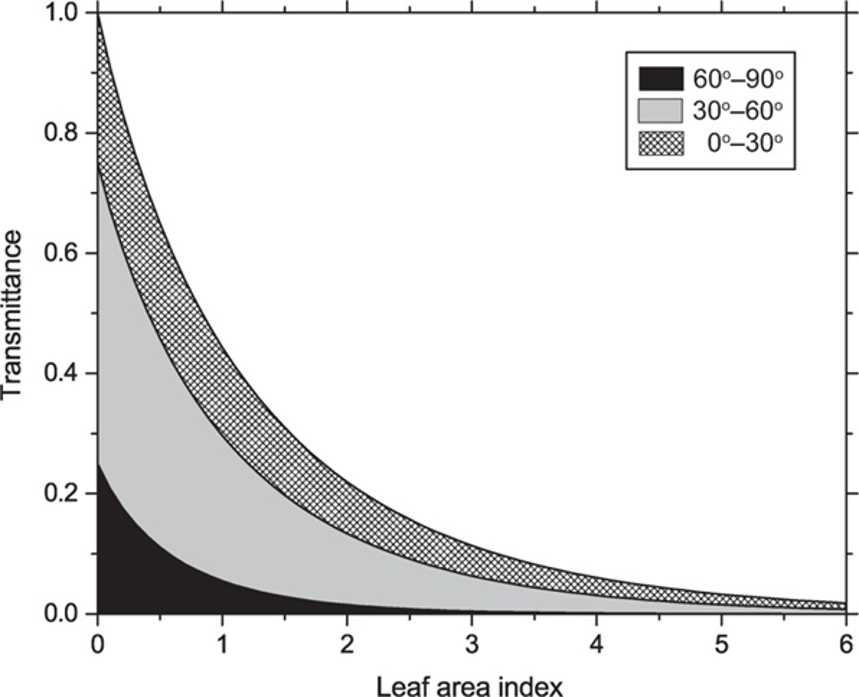
```


It is also interesting to compare the diffuse transmission to the direct transmission. The dashed line (Fig.\@ref(fig:f318)) indicates the transmittance for diffuse light (omnidirectional), the solid lines indicate the transmittance for direct light at different solar zenith angles. The transmittance of diffuse light is higher than that of direct light for solar zenith angles greater than 40-50°, direct light penetrates less easy through the canopy compared to diffuse light.

It is important to include diffuse radiation into models as it penetrates deeper into the canopy, it is shifted towards the blue light, which is used by plants for photosynthesis, and because plants depend on it in cloudy conditions.


```{r f318, fig.cap='Transmission of solar radiation through a canopy with spherical leaf distribution in relation to leaf area index. The solid lines show direct beam transmittance τb for solar zenith angles of 0°–80° (in 10° increments).The dashed line shows the diffuse transmittance τd. (Bonan)', out.width='80%', fig.asp=.75, fig.align='center',echo=FALSE}
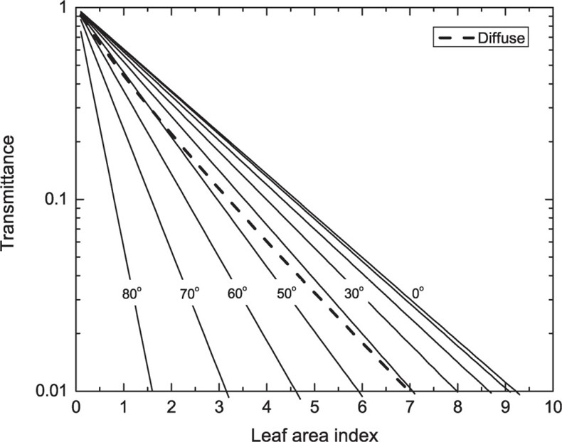
```


### The Norman Model(1979)

In the Norman model, the canopy is divided into multiple layers of typically 0.5 LAI per layer. For each layer the diffuse, direct and longwave radiation balance is calculated: reflection, absorption and transmission. The model thus accounts for scattering. We do not discuss the equations in detail, but the large number of equations have to be solved numerically, which is very computational expensive, especially in model versions where a sunlit and shade fraction per leaf layer are considered.

```{r f319, fig.cap='Radiative fluxes in a canopy of N leaf layers. The vertical profile is oriented with i = 1 the leaf layer at the bottom of the canopy, leaf layer i + 1 above layer i, and i = N the leaf layer at the top of the canopy. Each layer has a leaf area index ΔL. is the downward diffuse shortwave flux onto layer i, is the upward diffuse shortwave flux above layer i, and is the unscattered direct beam flux onto layer i. and are the corresponding downward and upward fluxes of longwave radiation. These depend on leaf Tℓand ground Tg temperatures. Thick arrows denote boundary conditions of diffuse solar radiation , direct beam solar radiation, and atmospheric longwave radiation at the top of the canopy.(Bonan)', out.width='80%', fig.asp=.75, fig.align='center',echo=FALSE}
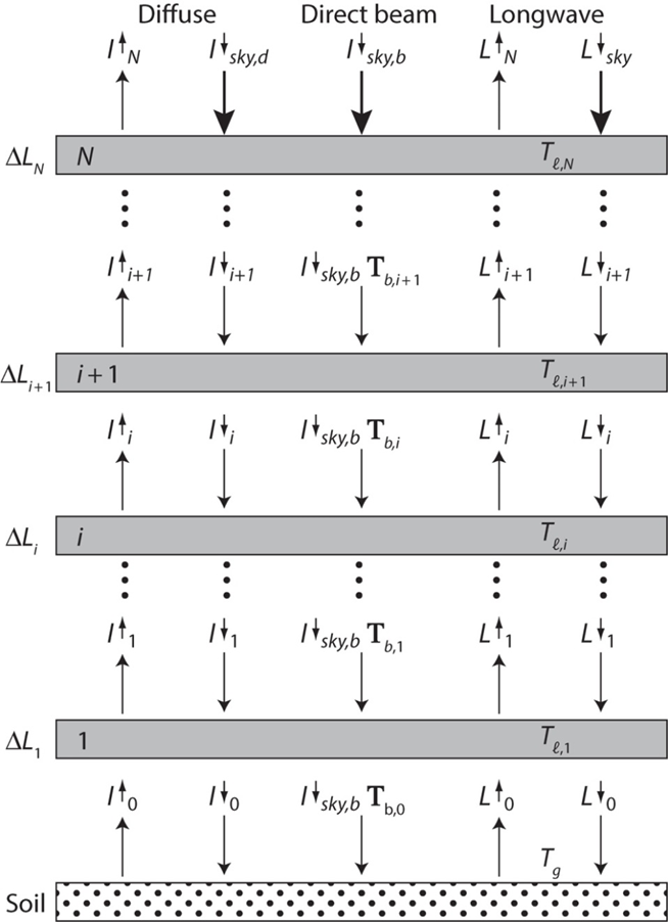
```


### The Goudriaan and van Laar Model (1994)

This is an analytical solution of the model, which integrates over a single calculation step. To be able to do so, one integrated extinction coefficient for all layers is assumed (K’b, adapted extinction coefficient). One light extinction coefficient is thus used for diffuse and direct radiation together, which is the major simplification in the model. This coefficient also includes a clumping factor. This model is widely used due to its simplicity and low computational demand. It can be applied to a single layer or multi-layer canopy. Due to its assumptions, this model produces more errors, especially for diffuse light (under cloudy conditions).

```{r f320, fig.cap=' Derivation of absorbed direct beam solar radiation for a leaf layer with leaf area index ΔL (Goudriaan 1982). $ρ_c$ is the reflectance of the leaf layer.(Bonan)', out.width='80%', fig.asp=.75, fig.align='center',echo=FALSE}
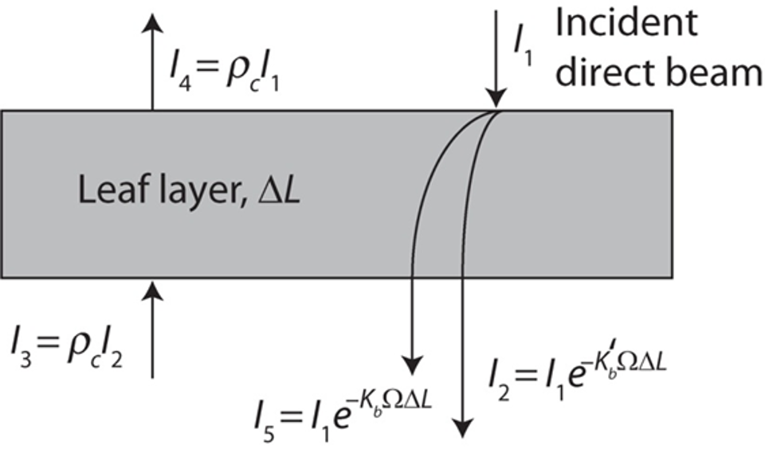
```


### The Two-Stream approximation

This model takes "the best of both worlds". It is called "two stream"" because it calculates light penetration separately for direct and diffuse radiation, but it has an analytical solution. It can be used for multilayer models.

```{r f321, fig.cap='Fluxes for (a) direct beam and (b) diffuse radiation in the twostream approximation for a canopy with leaf area index L.(Bonan)', out.width='80%', fig.asp=.75, fig.align='center',echo=FALSE}
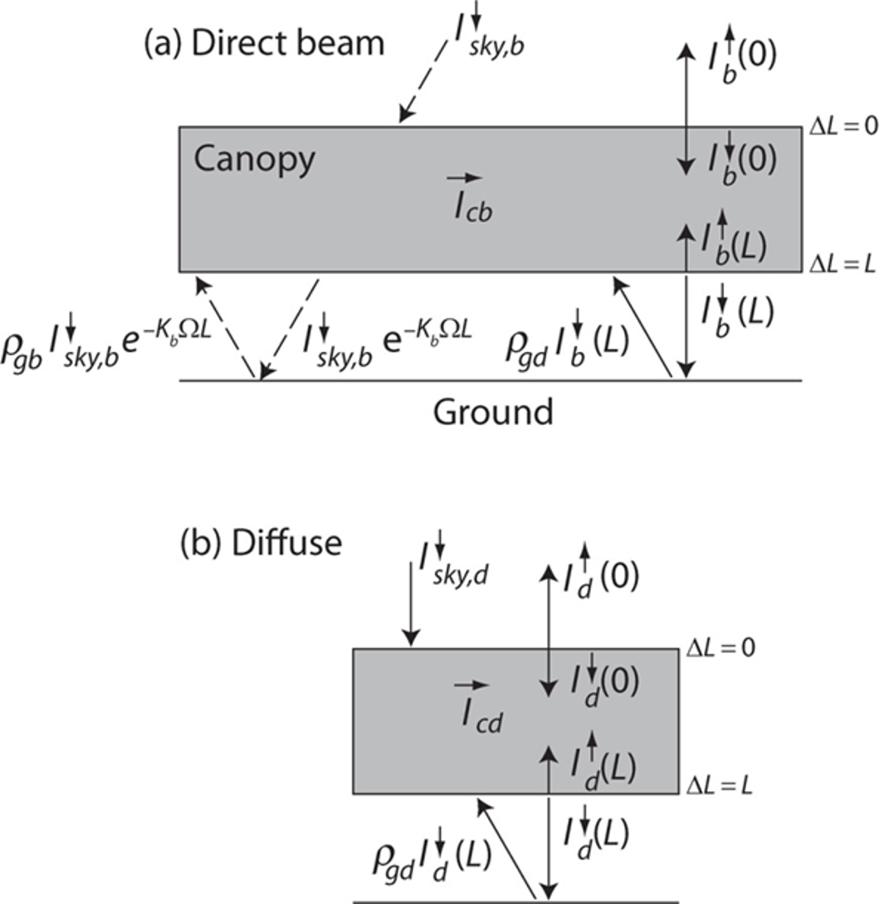
```

The three approaches (Norman/Goudriaan/two stream) are all based on the same theory. They are implemented in a different way, but the results are very similar for direct light. However they show substantial deviations for diffuse light, shaded leaves and denser canopies.

### Longwave radiation

Longwave radiation is important for closing the energy balance. To simulate longwave radiation transfer in canopies, similar approaches as above are used, but the emission of longwave radiation by the ground, and leaf surfaces need to be accounted for. 

```{r f322, fig.cap='Longwave radiation fluxes represented for a single leaf layer.(a) Norman’s (1979) numerical model. Shown is the radiative balance for leaf layer i + 1 located above leaf layer i. (b) A simplified model to allow only forward scattering and to permit an analytical solution integrated over a canopy. In both panels, emitted radiation is excluded. Thick lines denote fluxes incident onto the layer. (Bonan)', out.width='80%', fig.asp=.75, fig.align='center',echo=FALSE}
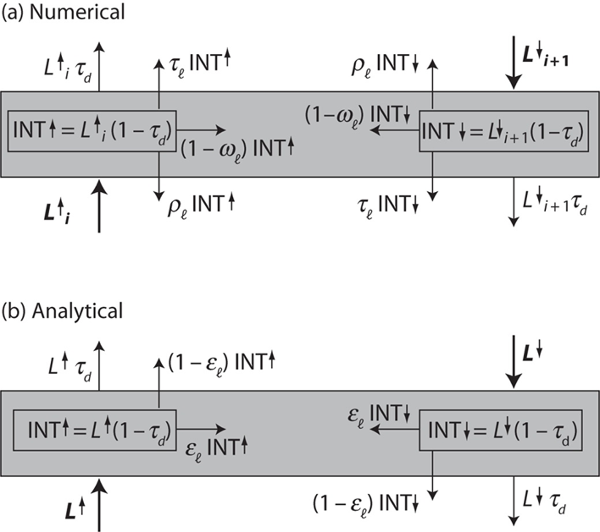
```


## Representing canopy structure in models
### Big-leaf models

Big leaf models can have a shaded and a sunlit fraction in the canopy, or can consider sunlit leaves only. The forest/vegetation is represented as one big leaf, with a leaf area equal to the total leaf area of the forest/vegetation. Such models do not account for the vertical structure of the canopy. These models calculate properties of the big leaf, by upscaling. For example by caluculating an average stomatal or caopy conductance. Evapotranspiration can then be calculated by applying the Penman-Monteith equation and a canopy level conductance. The leaf boundary layer is replaced by the atmosphere surface layer and gsw is the average stomatal conductance of the whole forest.

```{r f323, fig.cap='Scaling of leaf fluxes to the canopy using a big-leaf model. (a) Shown are leaf sensible heat, transpiration, and CO2 fluxes in relation to various conductances. Fluxes are exchanged between the leaf and air around the leaf. Also shown is the total resistance. (b) Shown are big-leaf canopy fluxes in which leaf fluxes are scaled by the average conductance and leaf area index and are further modified by turbulent transport in the atmospheric surface layer. Surface layer processes are commonly omitted for CO2 exchange. Only a single big leaf is shown, but separate sunlit and shaded big leaves can be similarly depicted. (Bonan)', out.width='80%', fig.asp=.75, fig.align='center',echo=FALSE}
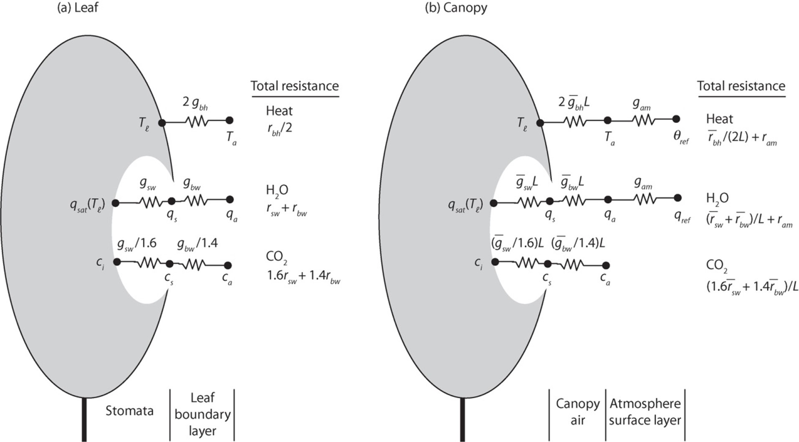
```

It is not an easy task to integrate GPP (e.g. calculated by the Farquhar model of Chapter 2) over a canopy represented by a big leaf. We cannot just give the total light absorbed by the canopy to a photosynthesis model, as we need to account for the non-linearity in the process. The task is easier if Amax is assumed to decrease exponentially together with light availability I the canopy, which is a reasonable assumption, as we know that leaf nitrogen content is decreasing from the top to the bottom of the canopy. As such we are assuming a "photosynthesis extinction"" instead of a light extinction in the canopy. 

$$
GPP = \int_0^LA(x)dx
$$

$$
A_{max}(x) = A_{max0}e^{-K_bx}
$$

$$
GPP = \int_0^{L}A(x)dx = A(0) \left[\frac{1 - e^{-K_b L}}{K_b} \right]
$$

However, this is a rough approach, and it does not account for the nonlinear canopy responses. A better approach is to include a sunlit and shade fraction of the leaves. Where the GPP is calculated as the sum for sunlit and shaded leaves separately. Each fraction has a separate value for $g_s$, $A_m$ etc...

$$
GPP = \left[A_{sun} f_{sun} + A_{shade} (1 - f_{sun}) \right]L
$$

Big leaf models that use the Fraquhar approach often assume an integrated Vcmax value for the canopy, calculated based on an exponential profile of $V_{cmax}$.

$$
V_{cmax}(x) = V_{cmax0} e^{-K_n x}
$$

```{r f324, fig.cap='Canopy profiles of relative photosynthetic capacity in relation to cumulative leaf area index. Thin lines show exponential profiles using values of Kn for 16 temperate broadleaf forests and two tropical forests ranging from 0.10 to 0.43 (Lloyd et al. 2010). The two thick lines show observed profiles of Vcmax and Jmax from Niinemets and Tenhunen (1997) obtained for sugar maple (Acer saccharum). (Bonan)', out.width='80%', fig.asp=.75, fig.align='center',echo=FALSE}
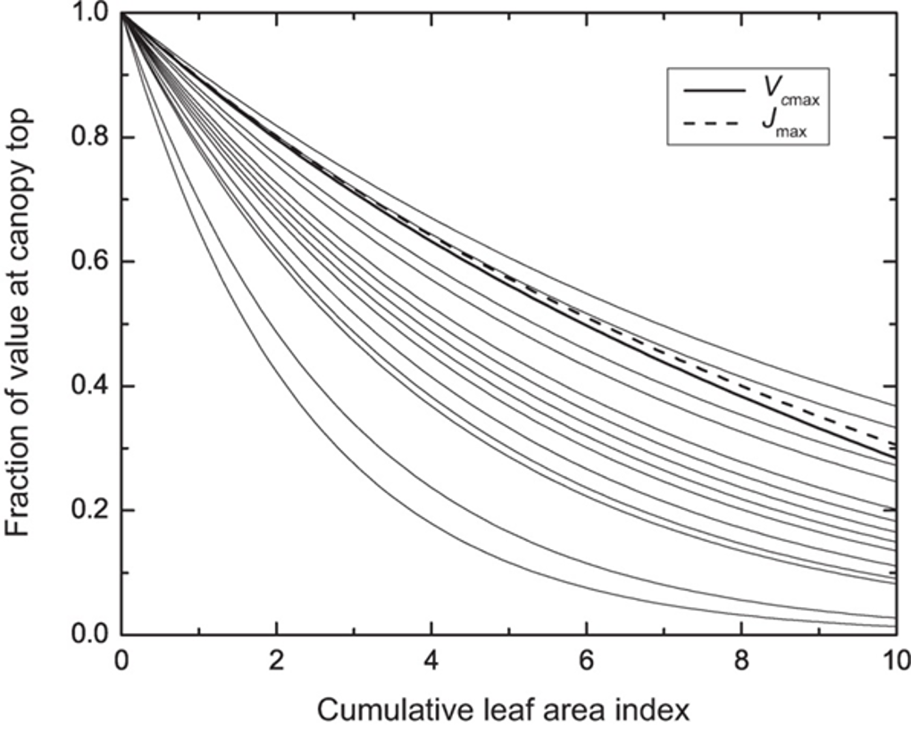
```

### Multilayer models

Account for al vertical heterogeneity, such as light, leaf physiology, leaf traits and even micrometeorology, e.g. RH is different at different leaf layers in the model. All equations (fluxes, energy balance) are calculated for each layer, and GPP is the sum of the photosynthesis of all layers. Figure \@ref(fig:f325): each layer is a big leaf to calculate all leaf level processes. Radiative transfer and leaf fluxes are thus simulated for each layer. Sometimes, even leaf hydraulics are simulated, to simulate leaf water potential and its influence on stomatal conductance. Such models are computationally expensive, especially because they is solved for each layer a set of equations in an iterative way (Fig. \@ref(fig:f326)). Nevertheless, such multilayer models are very common in large scale land surface models. Be aware that horizontal heterogeneity is not considered in these models, see later chapters for that.

```{r f325, fig.cap='Overview of the main processes in a multilayer canopy model.The canopy is represented by N leaf layers with layer i + 1 above layer i. (a) Diffuse and direct beam solar radiation is transmitted or intercepted. The intercepted portion is absorbed or scattered in the forward and backward direction. Longwave radiation is similar to diffuse radiation. (b) Leaf sensible heat, transpiration, and CO2 fluxes depend on absorbed radiation and leaf boundary layer and stomatal conductances. Sensible heat is exchanged from both sides of the leaf. Water vapor and CO2 can be exchanged from one or both sides of the leaf depending on stomata. Leaf temperature is the temperature that balances the energy budget. (c) Stomatal conductance depends on leaf water potential. Plant water uptake for a canopy layer is in relation to belowground soil and root conductance and aboveground stem conductance acting in series and also a capacitance term. (d) Scalar profiles are calculated from a conductance network. Leaf fluxes provide the source or sink of heat, water vapor, and CO2, along with soil fluxes. (e) Sensible heat, latent heat, and heat storage in soil depend on the ground temperature that balances the soil energy budget. (f) The wetted fraction of the canopy layer depends on the portion of precipitation that is intercepted. (Bonan)', out.width='80%', fig.asp=.75, fig.align='center',echo=FALSE}
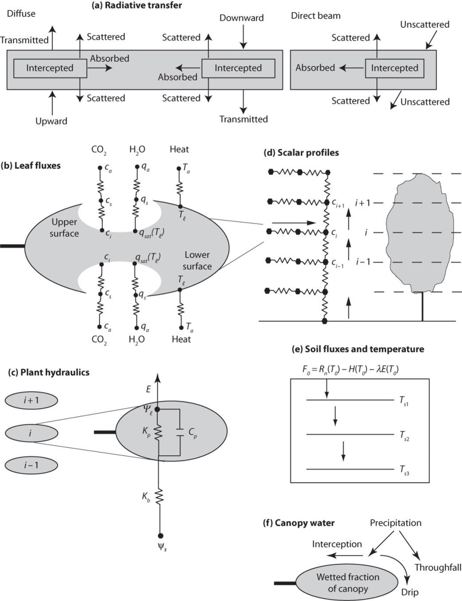
```

```{r f326, fig.cap='Flow diagram of processes in a multilayer canopy model. The shaded area denotes leaf processes resolved at each layer in the canopy. This is a generalized diagram of the required calculations for a dry leaf. Specific models differ in how the equation set is solved and the iterative calculations. Evaporation of intercepted water requires additional complexity.(Bonan)', out.width='80%', fig.asp=.75, fig.align='center',echo=FALSE}
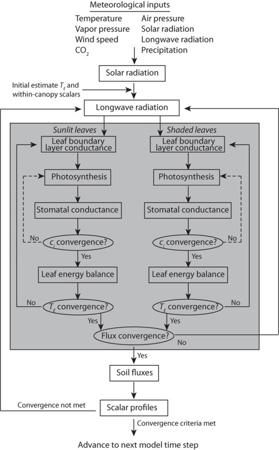
```


### 3D ray tracing models

3D ray tracing models are not (yet) use as part of operational vegetation models. They rather for a separate group of models, focus on radiative transfer only (they do not simulate other processes such as photosynthesis). These models are typically used to simulate what a satellite (or other remote sensing sensor) would observe in specific wavelength bands. As such these models are very useful for interpretation of remote sensing observations. They really simulate how light, or individual sun rays penetrate the canopy and do that for the different wavelengths. Based on such models we can also get better insight in radiative transfer and derive better radiative transfer schemes for operational vegetation models. 

```{r f327, fig.cap='Example of the PROSPECT leaf optical model and the DART 3D ray tracing model.', out.width='80%', fig.asp=.75, fig.align='center',echo=FALSE}
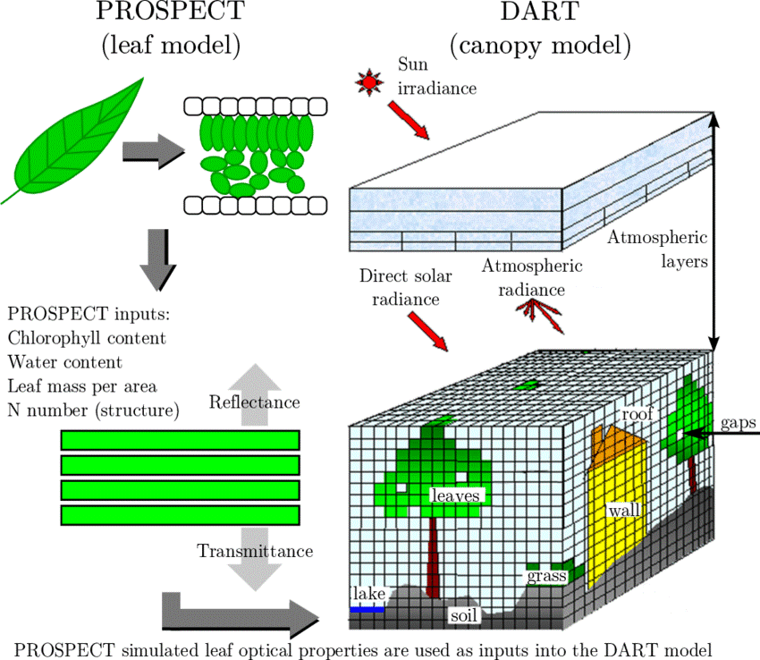
```

These models typically consider simple 3D objects with specific optical properties. However, the newest addition to this research is using detailed 3D reconstructions of trees from lidar scans as model input and run the model with the lidar data as scattering objects in the 3D scene.

```{r f328, fig.cap='Example of a study that uses terrestrial laser scanning (TLS) to construct a full 3D model of a forest as input for a 3D ray tracing model (Kükenbrink et al. 2020) ', out.width='80%', fig.asp=.75, fig.align='center',echo=FALSE}
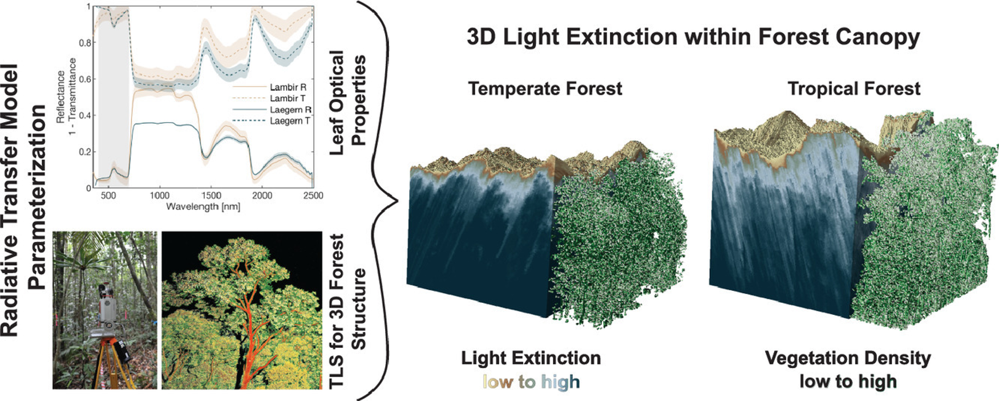
```

## Ecosystem energy balance

### Basic principles

The energy balance is a fundamental part of vegetation models. The goal is to calculate how much energy comes in, how much is lost and in what the resulting temperature is for the leaf or the surface. The energy balance is governed by non-linear equations. However linearizations exist (e.g. Penman Monteith equations to calculate ET).

### Surface radiation balance

The formula below (Fig. \@ref(fig:f329)) calculates the radiation balance

```{r f329, fig.cap='Radiative balance of an opaque gray body receiving downwelling solar S and longwave L radiation.(Bonan)', out.width='80%', fig.asp=.75, fig.align='center',echo=FALSE}
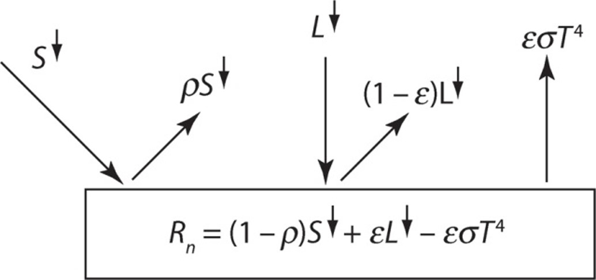
```

where $R_n$: net radiation (how much energy is available for system), $\rho S^{\downarrow}$: reflected shortwave radiation, $\epsilon \sigma T^{4}$ the Stefann-Boltzman law. The equation essentially makes the balance between how much shortwave net comes in, and how much longwave is net reflected. The net radiation forms the major input term of the energy balance.

### Bulk surface energy balance

This is the central equation of the surface energy balance:

$$
R_n = \lambda E + H + G +S
$$

The net radiation is the input of energy to the ecosystem which is dissipated via multiple loss terms: latent heat (evapotranspiration), sensible heat flux, ground heat flux and energy storage (in the biomass of the ecosystem). Most of the energy goes to the latent heat to well-watered active vegetation (e.g. a beach forest in summer).

It is really important to close the energy balance in models. All factors in the equation can be formulated in terms of input factors of the model, such as incoming radiation, and in function of the surface temperature. The equation below is rewriting the above equation in terms of surface temperature.

$$
\sum_{\Lambda} (1 - \rho_{\Lambda} ) S^{\downarrow}_{\Lambda} + \epsilon L^{\downarrow} = Q_{a} \\ = \epsilon \sigma \theta_s^{4} + c_p ( \theta_s - \theta_{ref} ) g_{ac} + \frac{\lambda \left[ q_{sat} ( \theta_s ) - q_{ref} \right] }{ g_c^{-1} + g_{ac}^{-1}} + \frac{k}{\Delta z} (\theta_s - T_1)
$$

Where $S$ input energy (shortwave) in a certain wave length band ($\Lambda$), $Q$ is the total gross incoming energy. At the right side of the equation we see: the longwave loss term, sensible heat loss, latent heat (in response to vapor pressure) , and the ground heat flux. The surface temperature ($\Theta_s$) is the big leaf surface temperature. 

The big leaf latent heat (evapotranspiration), in often accounted by the Penman-Monteith equations (as function of net radiation and vapor pressure deficit).

$$
\lambda E = \frac{s (R_n - G) + c_p \left(q_{sat}(T_a) - q_a \right) g_{ac}}{s + (1 + \frac{g_{ac}}{g_c}) \frac{c_p}{\lambda}}
$$

```{r f330, fig.cap='Conductance networks for sensible heat flux (top) and latent heat flux (bottom) for various depictions of the land surface. This chapter describes the bulk surface and big-leaf canopies. (Bonan)', out.width='80%', fig.asp=.75, fig.align='center',echo=FALSE}
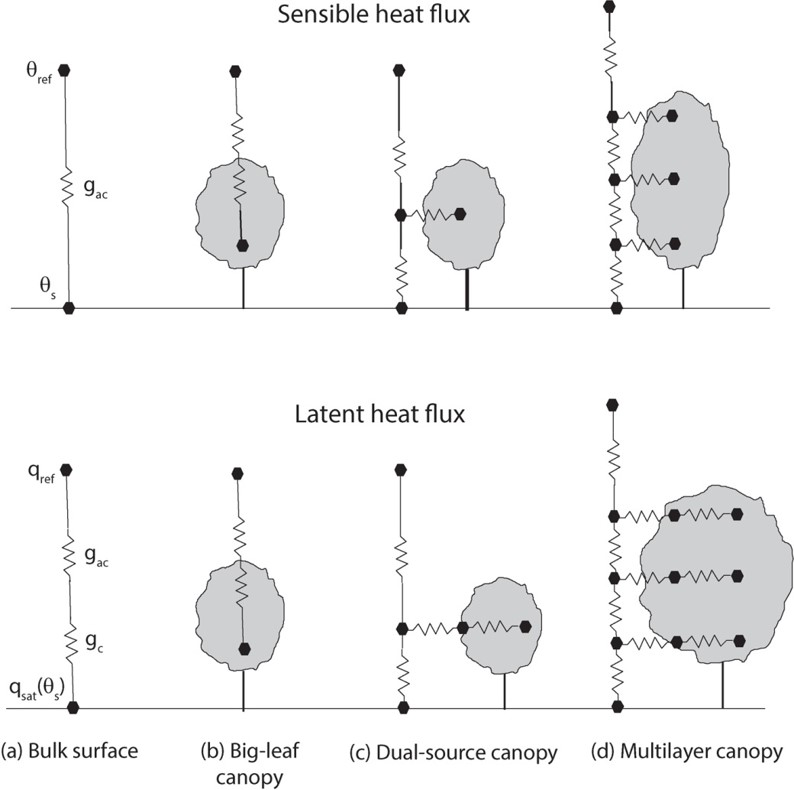
```

### Leaf energy balance

Some models make the leaf energy balance, which is essentially using the same equations as the bulk energy balance, but applying them at the leaf (layer) level and solving team for leaf temperature. The leaf energy balance depends on radiative forcing, boundary layer processes and stomatal physiology. The stomatal conductance is balance photosynthesis, transpiration and energy fluxes. 

$$
c_L \frac{\delta T_l}{\delta t} = Q_a - 2 \epsilon_l T_l^4 - H(T_l) + \lambda E(T_l)
$$

$$
Q_a = \sum_\Lambda S^{\downarrow}_\Lambda (1 + \rho_{g \Lambda})(1 - \rho_{g \Lambda} - \tau_{l \Lambda}) + \epsilon_l (L_{sky}^\downarrow+ L_g^{\uparrow})
$$

The dimension of the leaf plays an important role in the solving of the leaf energy balance, for example, the boundary layer conductance depends on the leaf dimensions and the wind speed. 

```{r f331, fig.cap='Biophysics and biochemistry of leaves. (a) The radiative environment consists of solar radiation (left) and longwave radiation (right). (b) Leaf fluxes include CO2, H2O, and heat through the boundary layer. These fluxes are shown as a network of conductances for the adaxial (upper) and abaxial (lower) leaf surfaces. For H2O and CO2, the conductance for each surface is obtained from stomatal and boundary layer conductances acting in series. The total conductance is defined by the adaxial and abaxial surfaces acting in parallel. (c) Stomata open to absorb CO2 for photosynthesis, but, in doing so, water is lost as transpiration. (Bonan)', out.width='80%', fig.asp=.75, fig.align='center',echo=FALSE}
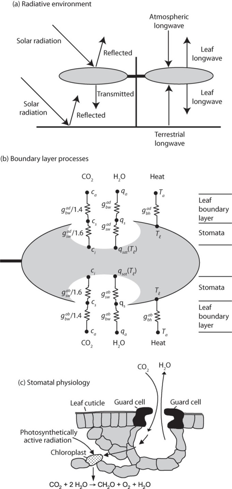
```


## Case studies

### Case study 3.1

How is the amount of diffuse light impacting photosynthesis? (diffuse radiation fertilization) In normal circumstances, the sun leaves are in the saturated zone of photosynthesis, while shaded leaves are somewhere on the linear increase part. If you would change the radiation composition (e.g. more clouds), this would result in less light for the sunlit leaves, which has only limited impact on their photosynthesis. For the shaded leaves on the other hand, more diffuse radiation has a big impact on the photosynthesis. So, the hypothesis in this study is that if you have more diffuse radiation, more photosynthesis takes place at the canopy level. This hypothesis is tested by using data of two fluxtower stations and a multilayer vegetation model.

```{r f332, fig.cap='Principle of the effect of increased diffuse raditaion on leaf/canopy photosynthesis. (Knohl et al. 2008)', out.width='80%', fig.asp=.75, fig.align='center',echo=FALSE}
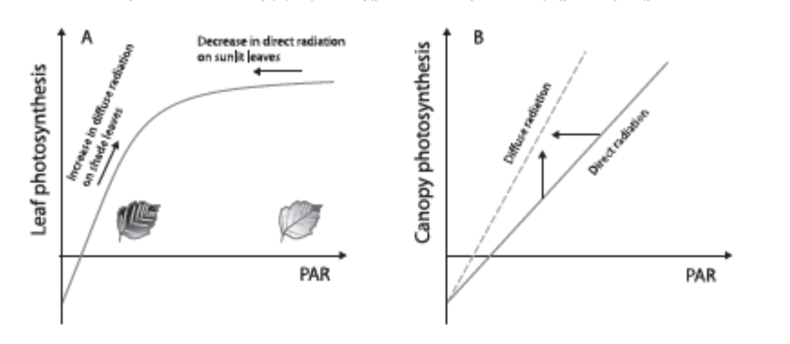
```

The x axis (Fig. \@ref(fig:f333)) represents the diffuse radiation over the total radiation. Photosynthesis increases with increasing diffuse radiation an reaches a maximum at 45% diffuse light. Transpiration increases also but at a slower pace, and the water use efficiency increases faster. So, forests have a higher water use efficiency when the amount of diffuse radiation is higher (again with max but now around 0.65). On cloudy days the Rd/Rs is higher than the optimum. The net carbon balance increased if you have more diffuse light (in relative terms), the transpiration remains stable but the WUE is increasing (more photosynthesis for the same amount of transpiration). However, for the studied sites, the situation is in 61% of the time beyond the optimum (on cloudy days), resulting in a net decreasing impact on the net carbon uptake. 

```{r f333, fig.cap='Resulting impact of changing diffuse fraction on carbon and water fluxes and WUE (Knohl et al. 2008)', out.width='80%', fig.asp=.75, fig.align='center',echo=FALSE}
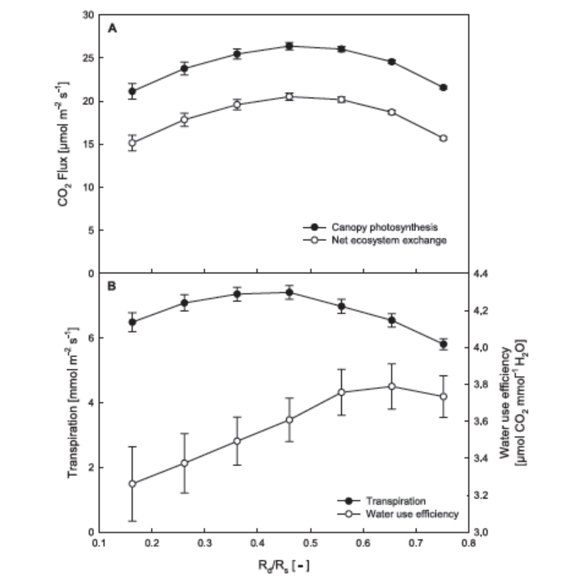
```


### Case study 3.2

Studies have shown that the increase of atmospheric CO2 since the 1850’s caused an enhancement in plant growth, but the magnitude varies. This enhancement also manifests itself in the enhancement of LAI (leaf area index), the area of leafs on a specific ground area.
In the paper, Boreal Ecosystem Productivity Simulator (BEPS) was used as process-based diagnostic model. It initially was used, as the name states, for boreal ecosystems, but has been adapted for all ecosystems on Earth. It simulates the impact of drivers (climate, CO2 concentration, and nitrogen deposition) on the GPP (Gross Primary Production) and as well carbon pools below GPP and respiration activities, generally, the whole carbon cycle, this on a daily time interval for each pixel. It makes use of various satellite data (assimilate LAI) and LUE (light-use efficiency) models.

Running these simulations on three LAI series, it stated that the enhancement of LAI contributed 12,4% to the accumulated carbon sink.
In satellite observations it was observed that the global leaf area index has increased over the past 40 years, and they wanted to investigate whether this has had an effect on global carbon sink. The model used in this study is driven by remote sensing data, it is a diagnostic and not really a process-based model. The model calculates the GPP based on the equation (seen today) which used LAIshade and LAIsun based on similar equation with exponential function, clumping factor and so on. The study aims to quantify how much the LAI increase is contributing to the simulated carbon uptake globally.
Map shows the trends of the LAI in the world.

```{r f334, fig.cap='Global map of LAI trend between 1981 and 2016 based on remote sensing (Chen et al. 2021).', out.width='80%', fig.asp=.75, fig.align='center',echo=FALSE}
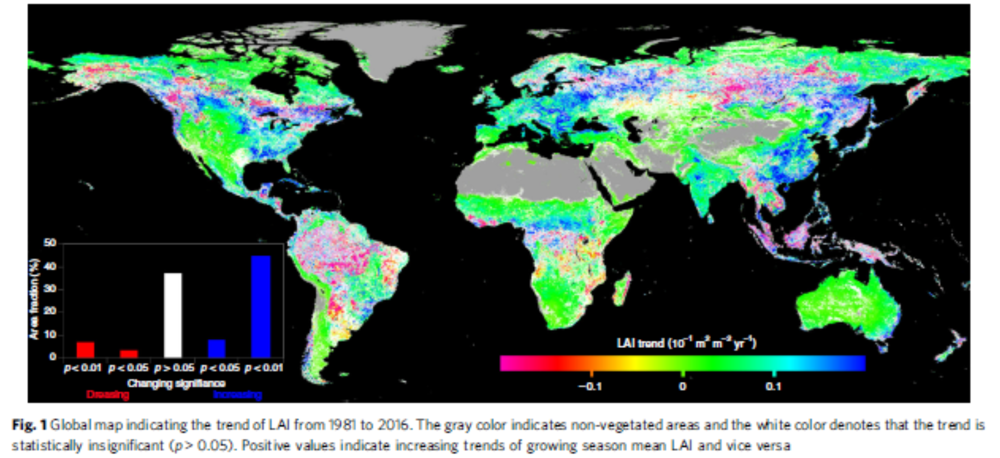
```

They calculated the different factors which are accounted for in their model and tested how sensitive their model result was to that different driving factors. According to the model, global ecosystem productivity has increased (light blue line in Fig. \@ref(fig:f335)). N deposition did not a net effect. Climate change (T increase, drought stress) has reduced the sink strength. The LAI increase had a positive impact, contributes to the increased sink.
They observed that the relative increase of the maximum LAI per year was larger than the relative increase of the average LAI per year. This indicates that the average LAI increase is mainly caused by the higher maximum LAI, and not by the lengthening of the growing season.

```{r f335, fig.cap='Simulated impact of different factors contributing to the increased global land C sink since 1981 (Chen et al. 2021) ', out.width='80%', fig.asp=.75, fig.align='center',echo=FALSE}
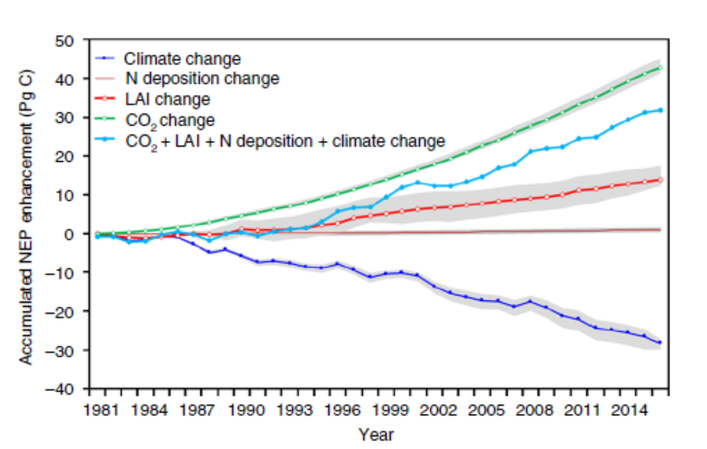
```
