# Modelling temporal and seasonal dynamics
\chaptermark{dynamics}

The main topic of this chapter is temporal variations in fluxes and leaf seasonality. We will study the upscaling in time, going from instantaneous processes to daily and seasonal dynamics (temporal dynamics), focusing on phenology. 

## Introduction on temporal dynamics

An example shows how we use flux data to evaluate the diurnal and seasonal cycles of models (Figure \@ref(fig:f41)). The modeled data is shown in black, the measured data in different colors, for different variables. The model can predict diurnal (instantaneous) fluxes good, seasonal cycles are more difficult to predict because the leaf area changes over time.

```{r f41, fig.cap='Evaluation of the temporal dynamics of fluxes (Rn: Net Radiation, H: sensible heat, LE: latent heat, NEE: net ecosystem exchanges of CO2) simulated by the global model ORCHIDEE. LEFT: measured (color) and modelled "summer" diurnal cycle for each flux and each PFT. RIGHT: measured (color) and modelled seasonal cycle for each flux and each PFT. (Krinner et al. 2005)', out.width='80%', fig.asp=.75, fig.align='center',echo=FALSE}
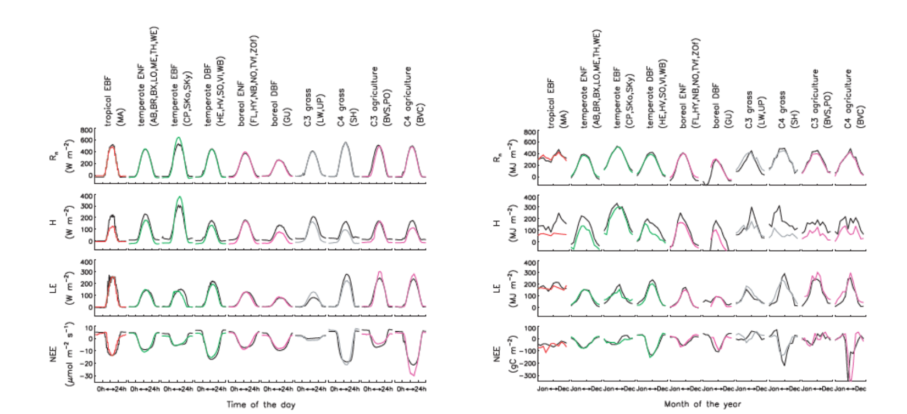
```

The temporal dynamics of fluxes respond to multiple factors and depending on the scales we are looking at, we need to take other processes into account. If we are interested in **instantaneous** responses, we need to modulate the physiological processes (stomata of leaves). On the other hand, if we look at **seasonal** responses, we need to consider both physiology and phenology (the amount of leaves the vegetation has). It is also important to mention **long-term** responses; for example, if you want to simulate carbon fluxes for the coming decades, more (slower) processes need to be considered (e.g. forest succession). 
The focus of this chapter will be on seasonal responses and phenology. These are processes that are typically calculated on an intermediate time step (e.g. daily or monthly) in vegetation models.

## Phenology: the background

**Phenology** is the study of periodic events in biological life cycles and how these are influenced by seasonal and interannual variations in climate, as well as habitat factors (such as elevation). There is a link with carbon allocation, which means how much carbon will be distributed over different plant compartments.
The phenological processes respond to climate variability, the so-called environmental cue, an environmental trigger. For example, from observational data, the ecodormancy responds both to high temperatures and longer day length. It is a complex mechanism with many factors, and we still don't know the underlying physiological processes.

### Trends in phenology

There are important trends in phenology with climate change because it's not only global average temperatures that are changing, but also spring temperatures are advancing. Autumn temperatures are coming later in the year. Figure \@ref(fig:f42) shows an example of needle appearance dates (for larch), where it is possible to identify a trend of needles appearing earlier. New needles of larch trees appear more early over time and this shift is accelerating. Shifts are occurring in the range of weeks. Such phenological trends have an impact on ecosystem functioning, and those impacts of shifting leaf phenology can manifest in multiple ways (Fig. \@ref(fig:f43)). 

```{r f42, fig.cap='Larch needle appearance in Sargans 1958-2002. Dashed line is trend 1958-1999, solid line is trend 1958-2002.  (Defilia and Clot 2005)', out.width='80%', fig.asp=.75, fig.align='center',echo=FALSE}
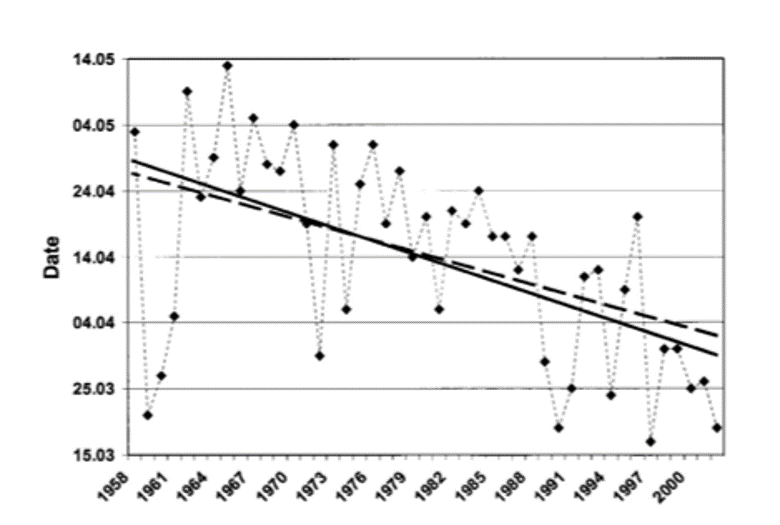
```

```{r f43, fig.cap='Concept of various effect that changing phenology can have on ecosystem processes (e.g. productivity or transpiration). (Polgar and Primack 2011)', out.width='80%', fig.asp=.75, fig.align='center',echo=FALSE}
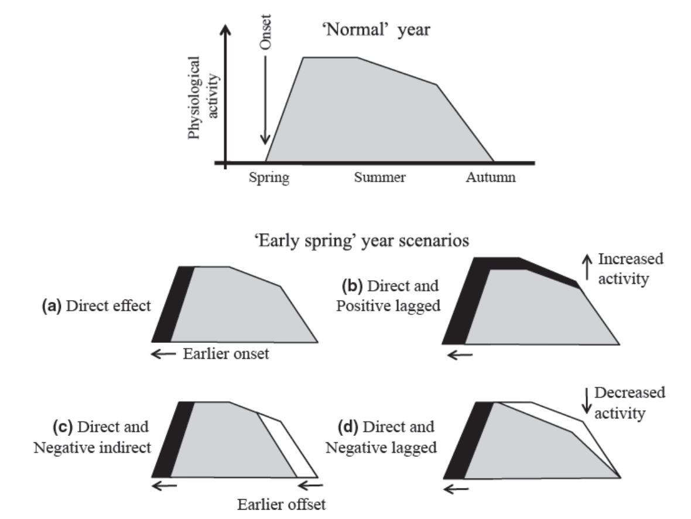
```

A shift in phenology has an impact on the functioning of ecosystems. In a normal year the physiological activity (e.g. photosynthesis) increases after leaves are formed, reaches a maximum, and after the summer a decrease occurs because of less efficient leaves and less light input. Due to changes in phenology, this is influenced (direct or lagged, positive or negative):

A) Full positive effect, faster maximum

B) A total increase in amount of leaves, also benefits in summer 

C) Earlier onset of leaves cause earlier senescence of leaves, causing less assimilation in autumn

D) Faster ageing leaves: decrease activity after spring
    
## Leaf phenology models
Leaf phenology models are essentially models used to update the leaf area state variable for PFTs in vegetation models.

**Phenology is typically a PFT dependent process in vegetation models:**

* Evergreen PFTs typically have a constant background leaf turnover rate.
* Summer green and rain green PFTs have a leaf phenology driven by environmental factors (temperature, water, light, …).

**How to model phenology?** We don't have (bio)physical models, only empirical models:

* Option 1: prescribed phenology 

  - Prescribed dates of leaf onset and offset (4 dates to determine carbon allocation phases to leaves).

  - Or data assimilation of remote sensing data (LAI).

* Option 2: prognostic phenology 

  - A complete leaf phenology model includes carbon allocation, leaf onset and growth, and litterfall as influenced by environmental conditions (still empirical).

### Prescribed phenology

An option to model phenology is using the dates of leaf onset and offset (typical 4 dates; start leaf formation, maximal activity, start senescence, all leaves ‘are gone’) .

An alternative is to fit a function to remote sensing data. What is typically done is fitting a logistic function of time to remote sensing observations of leaf phenology:

$$
y(t)=\frac{c}{1+e^{a+bt}}+d
$$

If we observed phenology with satellites, it could be done using vegetation indices (NDVI, EVI, …). Based on observation indices throughout the year, we could define dates to phenological events (Figure \@ref(fig:f44))

```{r f44, fig.cap='Sample time series of MODIS EVI data and estimate phenological transition dates for a mixed forest pixel in New England. Diamonds: EVI data, solid line with stars: fitted logistic model. (Zhang et al. 2003)', out.width='80%', fig.asp=.75, fig.align='center',echo=FALSE}
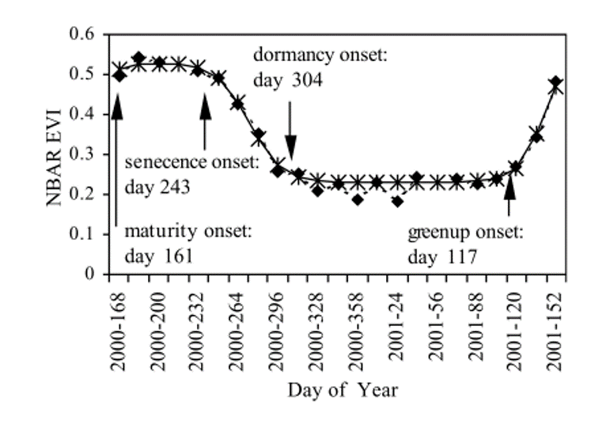
```

This approach allows plotting maps with the key days for phenology (Figure \@ref(fig:f45)) and seeing the spacial variance in shifts in phenology. Such datasets can be used to train prognostic models. 

```{r f45, fig.cap='Maps of phenological transition dates for New England. (Zhang et al. 2003)', out.width='80%', fig.asp=.75, fig.align='center',echo=FALSE}
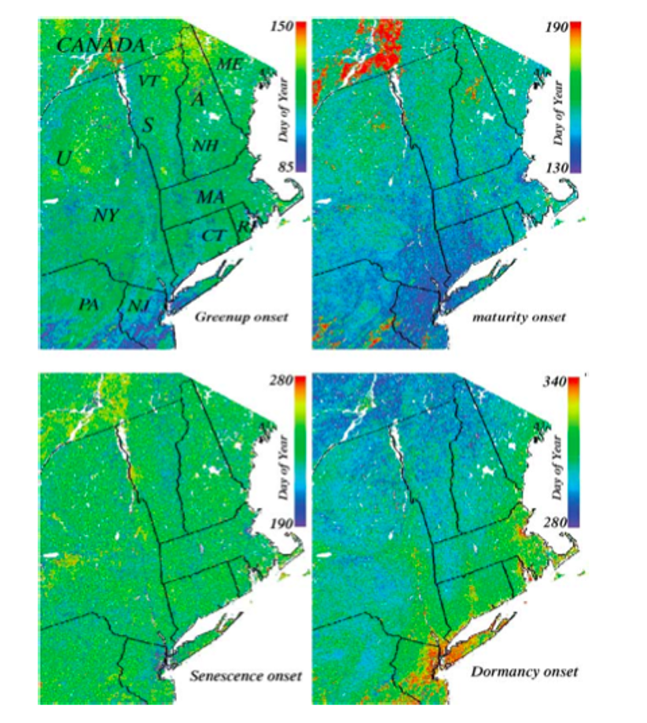
```

### Budburst models

Budburst models are prognostic models and are the most developed ones (compared to senescence models for example). They simulate when a bud is becoming a leaf. These models are based on environmental signals (cues), and the most common approaches are:

* Degree day sums (summation of daily temperature above 5°, for example).
* Chilling requirement (to pass the danger of spring frost) (accumulation of cold T).
* Photoperiod (daylength).
* Soil moisture (for rain green plants).

Some models combine approaches of the above, and others use just one approach. Most of the time, air temperature is used in these models (and not bud temperature).

**Growing degree-day model**

It's the simplest version of the budburst models but also the most widely used. However, this approach only works well in systems where temperature is the only limiting factor:

$$
GDD = \sum_{T>T_{base}}(T-T_{base}) \\
budburst:GDD>F^*
$$

Identify some threshold value of GDD $F^∗$ that corresponds to the metric of interest, which is budburst in this case. Similar models can be made for fruiting or harvest.

**Photoperiod**

Used only for some species where there is empirical evidence that photoperiod plays a dominant role. Typically not used in global models.

**Models including chilling**

More complicated phenology models use a combination of growing degree days and a chilling requirement (amount of cold days). There are diffent ways to implement such a combination:

* *Sequential models*: forcing (GDD) only starts when the chilling requirement is met.

* *Parallel models*: chilling and forcing accumulated in parallel and critical values then applied to both.

* *Alternating models*: the temperature $F^∗$ is a decreasing function of chilling.
    
### Snescence models
Process of leaf ageing. Many models are based on daylength (photoperiod), but many others use temperature or drought. Some models are also driven by the negative carbon balance of the leaf.

### Leaf age
Leaf age is quite important because if you want to simulate fluxes throughout the season, it will depend not only on the number of leaves but also on the physiological activity of leaves related to their physiological age (e.g. young leaves perform typically photosynthesis at a higher). For example, the leaf's functional traits (nutrient content and water content) will change over time. This effect is especially important for evergreen species. If we want to have a good simulation for boreal forests, we should account for leaf age. 

Some models track (big) leaf age and link the values of leaf parameters to leaf age. Figure \@ref(fig:f46) shows an example based on data where Vcmax is linked to leaf age. The photosynthetic capacity is typically reduced significantly from a certain leaf age threshold.

Some models also use leaf age classes, where it is assumed that a certain fraction of the leaf area of the system is young and a different fraction is constituted of middle-aged leaves. Of course, with the beginning of the growing season, more young leaves are added, but the leaves aged and change fraction. However, the majority of vegetation models do not account for leaf age classes.

```{r f46, fig.cap='Relation  between Vcmax and leaf age in the ED2 vegetation model. (Kim et al. 2011)', out.width='80%', fig.asp=.75, fig.align='center',echo=FALSE}
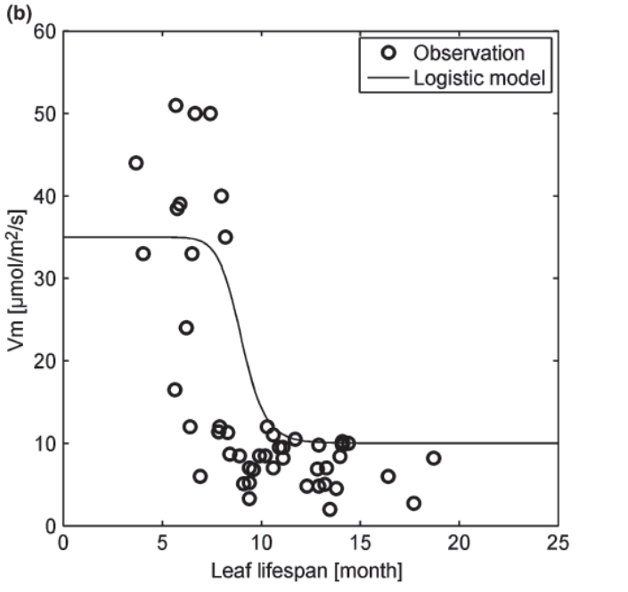
```

### Phenology in DGVMs

A few general facts are important to know concerning phenology in global vegetation models:

* The precise way to model phenology is highly uncertain

* Vegetation models differ significantly in detail for modelling phenology

* The phenology models are mainly based on empirical equations and parameters

* Phenology is an important process in monitoring, modelling and understanding vegetation dynamics and their response to climate variations.

* The growing amount of observational data on phenology at various scales will allow us to make better phenology models in the future.

* Likely that for some areas at least, species-specific (or slightly broader groupings of species) parameterizations of phenology need to be considered rather than just broad PFT definitions.

### Phenology in the tropics

Phenology is very complex if we focus on evergreen tropical forests. Figure \@ref(fig:f47) shows an example of the Yangambi reserve (centre of the Congo basin) classified as a semideciduous tropical forest. Based on digitized historical data, we can make an overall summary (Figure \@ref(fig:f48)) showing the phenology complexity of the tropical rainforests. It is very hard to see an overall pattern. In the semi-deciduous forest, many trees lose their leaves at (ir)regular moments. Evergreen species are continuously dropping leaves, whereas deciduous trees have more specific periods (more clear seasonality). Most models in evergreen forests assume that the leaf area is (more or less) constant over time, but this figure shows that in reality the leaf area can also change over time in evergreen forests. An attempt of improving phenology modelling in evergreen forests is discussed in case study 4.2.  

```{r f47, fig.cap='Example of how manual historical phenology observations in Yangambi (DR Congo) are trasnlated in a visual phenology pattern for a single tree species. (junglerythms.org))', out.width='80%', fig.asp=.75, fig.align='center',echo=FALSE}
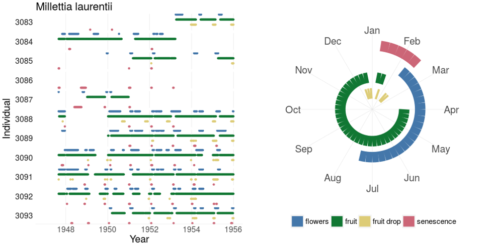
```


```{r f48, fig.cap="Overview of species-specific timing of onset of leaf phenophases for evergreen and deciduous species in tropical forest in Yangambi (DR Congo). The median timing of the onset of leaf senescence and turnover is indicated for each species. Species-specific bootstrapped 95\\%-confidence intervals are indicated with a line segment. Species are arranged according to the variability in the timing of the phenophase, with species with the lowest uncertainty at the outer edge and continuing towards the center. Species with an annual (full circles) or sub-annual (crosses) fourier-based seasonality are indicated. Grey shaded areas represent the average timing of the long and short dry seasons (LD and SD; monthly precipitation < 150 mm), separated by the long and short wet seasons (LW and SW). (Kearsley et al. 2021))", out.width='80%', fig.asp=.75, fig.align='center',echo=FALSE}
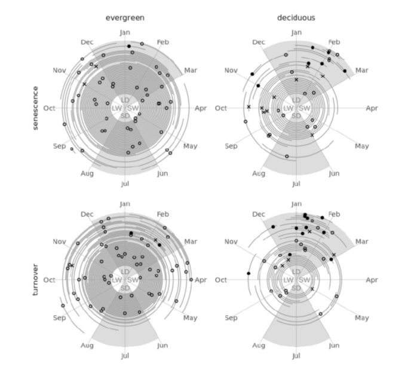
```


## Case studies

### Case study 4.1

**Richardson, A. D., Anderson, R. S., Arain, M. A., Barr, A. G., Bohrer, G., Chen, G., ... & Xue, Y. (2012). Terrestrial biosphere models need better representation of vegetation phenology: results from the N orth A merican C arbon P rogram S ite S ynthesis. Global Change Biology, 18(2), 566-584.**

The study of Richardson et al.(2012) is part of the North American Carbon Program, an initiative that is stuying the North American land carbon cycle use various data platforms, including multiple flux tower  stations. In this specific project, 14 vegetation models are compared and ran for the same flux towers with a very detailed protocol to make results comparable. The study is focused on how good models are predicting seasonal cycles. Figure \@ref(fig:f49) represents the simulated leaf area index (LAI) for five sites on deciduous forests. The overall growing season was predicted too long by models (too early spring and too late autumn), leading to an overestimation of GPP. 

```{r f49, fig.cap='Simulated and observed LAI for 5 deciduous forest sites and 14 vegetation models participating to the NACP model intercomparison project. (Richardson et al. 2012)', out.width='80%', fig.asp=.75, fig.align='center',echo=FALSE}
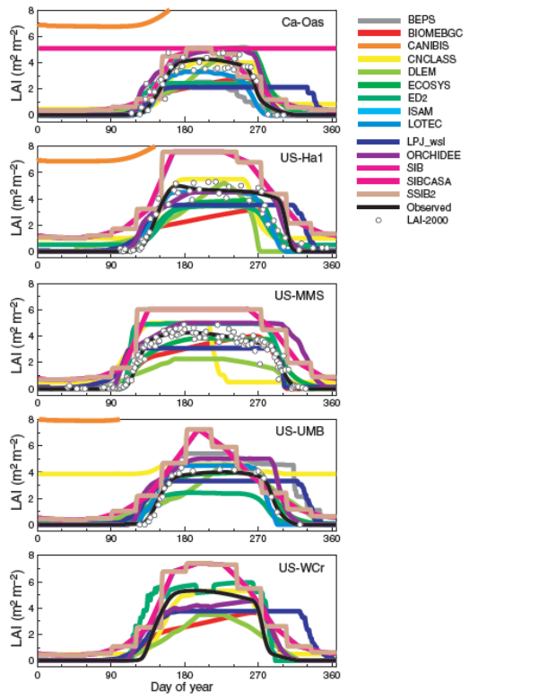
```

Large biases are present for deciduous forests, evergreen forests are better predicted. If we want to be able to perform better C-fluxes simulations in the future, better understanding of phenology is necessary.


```{r f410, fig.cap='Bias in modeled gross ecosystem photosynthesis (GEP=GPP) for deciduous broadleaf (top) and evergreen needleleaf (bottom) forests. Left panels show bias, by model. Right panels show the frequency distribution of these spring and autumn biases in re-scaled model GEP, across all models, sites, and years of data, for each forest type. The sign convention is that positive bias means that modeled GEP > tower GEP. (Richardson et al. 2012)', out.width='80%', fig.asp=.75, fig.align='center',echo=FALSE}
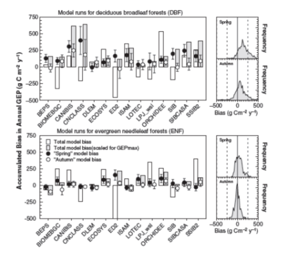
```

The conclusion of this study is the models are not very good at predicting the timing of seasonality.

### Case study 4.2

**Chen, X., Maignan, F., Viovy, N., Bastos, A., Goll, D., Wu, J., ... & Ciais, P. (2020). Novel representation of leaf phenology improves simulation of Amazonian evergreen forest photosynthesis in a land surface model. Journal of Advances in Modeling Earth Systems, 12(1), e2018MS001565.**

The study of Chen et al. (2018) is an attempt to improve phenology modelling in evergreen forests. This study uses a leaf age – leaf functioning relation and shows clearly the **links between phenology and photosynthetic activity**. 

```{r f411, fig.cap='Observed and assumed relation between Vcmax and leaf age in the ORCHIDEE global model, for the tropical evergreen PFT. (Chen et al. 2018)', out.width='80%', fig.asp=.75, fig.align='center',echo=FALSE}
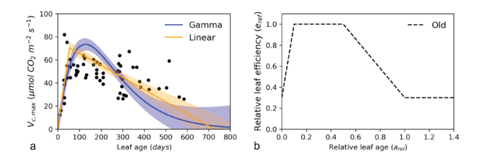
```

Improved GPP simulation if phenology and leaf age is better represented.

```{r f412, fig.cap='Comparison of litterfall data with two new and the old leaf turnover schemes in the ORCHIDEE model for 4 sites in the Amazon. (Chen et al. 2018)', out.width='80%', fig.asp=.75, fig.align='center',echo=FALSE}
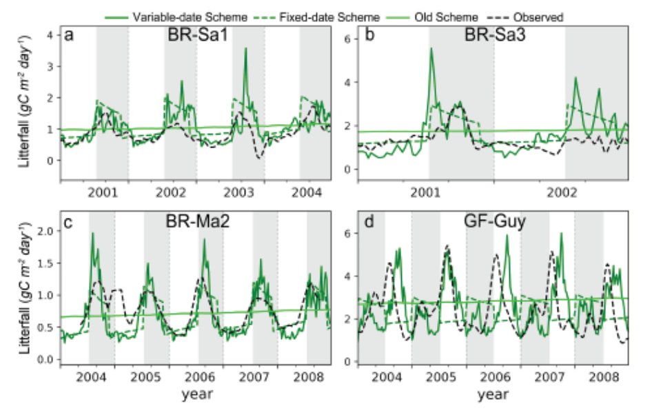
```

Improved GPP simulation if phenology and leaf age is explicitly discussed.

```{r f413, fig.cap='Comparison of GPP fluxtower data with two new and the old leaf turnover schemes in the ORCHIDEE model for 4 sites in the Amazon. (Chen et al. 2018)', out.width='80%', fig.asp=.75, fig.align='center',echo=FALSE}
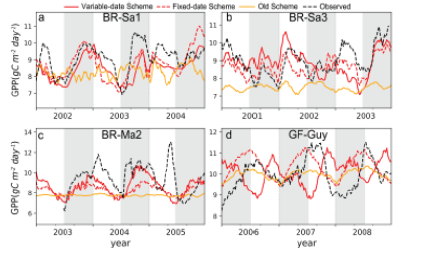
```

