# (PART) Modelling vegetation dynamics {-}

# Modelling C-allocation and biogeochemical cycles
\chaptermark{Grotwh}

## Introduction


```{r f51, fig.cap='Forest succession. (a) the biogeochemical perspective: variation of aboveground carbon (AGC) and soil organic carbon (SOC) along the forest succession in the Maringa-Lopori-Wamba landscape (DR Congo. Young: recently abandoned farmland, 5–25 years; SYoung: second growth young forest, 25–30 years; SOld: second growth old forest, approx. 150–300 years; Old-Mix: old growth mixed forest, 1700 years; Old-Gil: old growth Gilbertiodendron forest.BA stands for basal area. Error bars represent standard deviations. Percentages are stock values relative to the value of Old-Mix forest. The dashed horizontal line indicates the regional mean AGC of old growth forests across Central Africa (Lewis et al., 2013). (b) the forest structure perspective: Variation of four forest structure plot variables along the successional stages at our study site. Bars represent mean plot values per successional stage. Error bars represent standard deviations. BA stands for basal area. Error bars represent standard deviations. No standard deviations were calculated for Old-Mix because of its single plot replicate. Significant differences across forest types are indicated by different letters per type (p < 0.05)(Bauters et al. 2019)', out.width='80%', fig.asp=.75, fig.align='center',echo=FALSE}
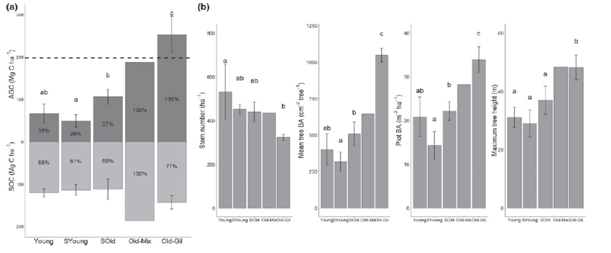
```

## Carbon cycle models: stocks and fluxes


This chapter will develop the ecological foundation and mathematics to describe ecosystem carbon dynamics using biogeochemical models.
Biogeochemical models abstract an ecosystem as pools of carbon and the flows of carbon among these pools.

Biogeochemical models simulate processes of allocation of photosynthetic carbon gain to plant parts (e.g., foliage, fine root, wood), turnover of plant biomass as litterfall, transformation of litter to soil organic matter, and carbon loss during respiration.

Principles: 
- net carbon input is equal to gross primary production minus autotrophic respiration;
- carbon flows from donor to receiver pools at a rate that depends on the donor pool size and its chemical quality as modified by the environment;
- mass balance is maintained as carbon flows through the system of interconnected pools;
- decay of litter and soil organic matter releases CO 2 as heterotrophic respiration.

Models:
a system of first-order, linear differential equations to describe carbon pools and fluxes (typically time step of one day)

Pools and fluxes to be included:
- Carbon gain from gross primary production  minus autotrophic respiration
- Allocation of carbon to growth of leaves, wood, and roots pools (partitioning varies with light availability, soil temperature, soil moisture, and nutrients + temporal for leaves (ref to phenology)
- Carbon turnover (comprising litterfall, background mortality, and disturbances) + turnover rates depending on the plant material
- litter pools: metabolic litter, structural litter, coarse woody debris (vary in chemical quality and turnover rate; base turnover rates are modified for soil temperature and soil moisture (environmental scaling factors))
- decomposition to soil organic matter pools: fast SOM, slow SOM, passive SOM (vary in chemical quality and turnover time)
- portion of the decomposition flow lost as heterotrophic respiration

```{r f52, fig.cap='Forest carbon cycle: stocks and fluxes.', out.width='80%', fig.asp=.75, fig.align='center',echo=FALSE}
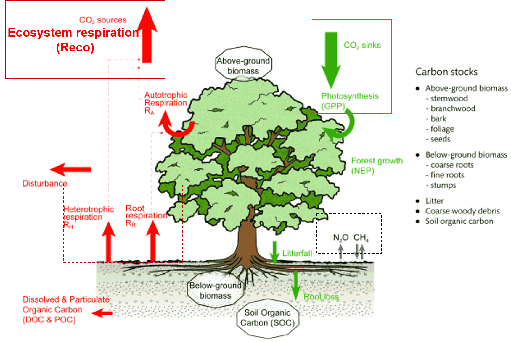
```

```{r f53, fig.cap='Definitions of productivity terms in the carbon cycle (Schulze et al. 2000)', out.width='80%', fig.asp=.75, fig.align='center',echo=FALSE}
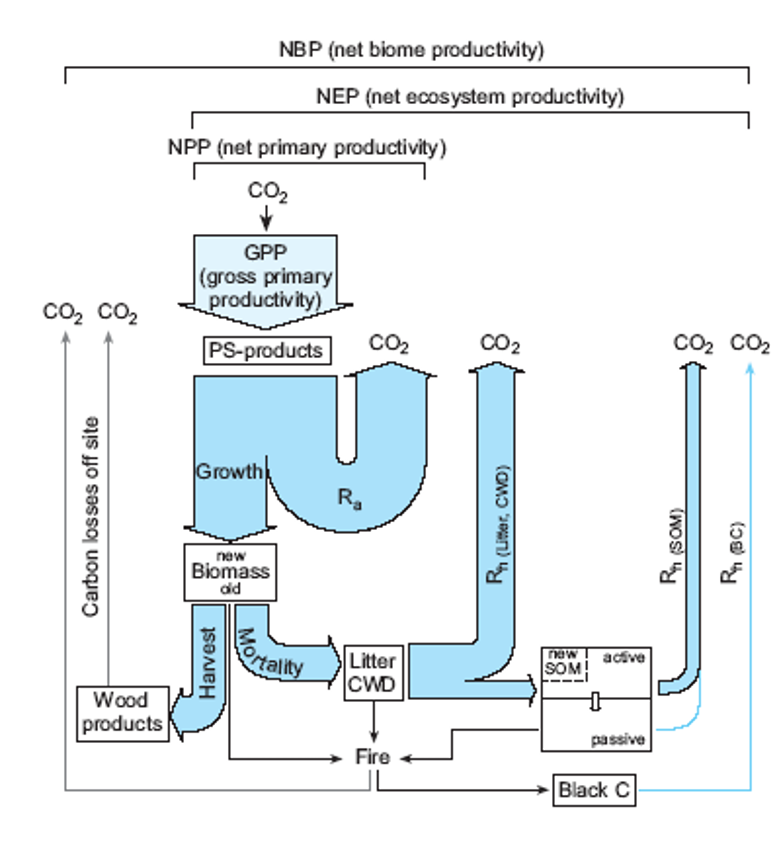
```

```{r f54, fig.cap='Structure of the nine-pool CASA-CNP biogeochemical model (Wang et al. 2010). Plant carbon mass consists of leaf c1, fine root c2, and wood c3. Net primary production is allocated to plant material in proportion to bi. Plant residue becomes metabolic litter c4, structural litter c5, or coarse woody debris c6. These pools decompose to fast c7, slow c8, and passive c9 soil organic matter. Pools differ in base turnover rate ki. Lines indicate carbon pathways, with aij the fraction of carbon turnover from pool j that enters pool i after heterotrophic respiration loss. Curved arrows denote heterotrophic respiration fluxes for each pathway. Shown are representative allocation and turnover rates for evergreen broadleaf forest. (Bonan)', out.width='80%', fig.asp=.75, fig.align='center',echo=FALSE}
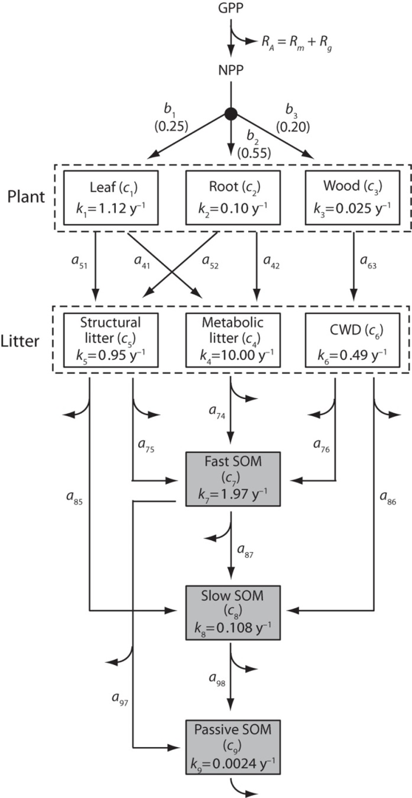
```

```{r f55, fig.cap='Carbon dynamics of evergreen broadleaf forest using parameters described in (Bonan Table 17.3 and Table 17.4) with net primary production equal to 1000 g C m–2 y–1. The thick black line denotes soil organic matter at equilibrium.Definitions of productivity terms in the carbon cycle. (Bonan)', out.width='80%', fig.asp=.75, fig.align='center',echo=FALSE}
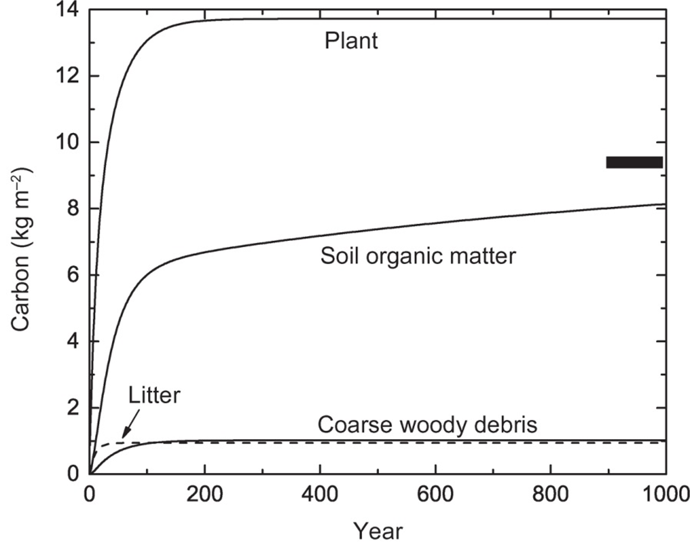
```

```{r f56, fig.cap='Turnover of carbon in terrestrial ecosystems (Schulze 2000).', out.width='80%', fig.asp=.75, fig.align='center',echo=FALSE}
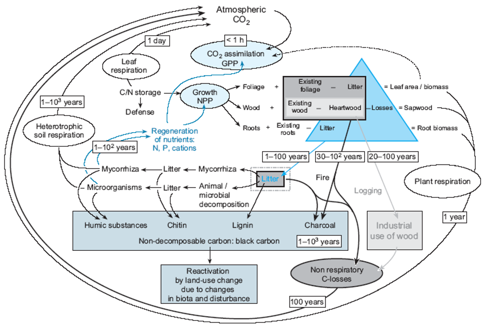
```


## Carbon allocation models

- allocation parameters
- fixed allocation and dynamic allocation (specified by biome or based on environmental conditions)
- Optimality models: plants optimally allocate resources to balance light acquisition (foliage), structural support and water transport (stems), and water and nutrient uptake (roots).
- allocation based on scaling relationships among plant components (specified ratios of foliage, root, and wood biomass)

- Turnover rates vary depending on plant material and are specified as a fraction of biomass.
- Turnover rates are commonly estimated as the inverse of residence time or longevity

-  biogeochemical models can be applied to any type of ecosystem such as grassland, savanna, forest, shrubland, and tundra

```{r f57, fig.cap='Schematic model of internal carbon, water and nutrient pools and fluxes within the plant (full lines) as well as important feedbacks and regulation (dashed lines). regylating factors are climate (a), stomata and impact of water balance on carbon allocation (b, c, d, e) and nutrient impacts (f) (Schulze and Chapin 1987).', out.width='80%', fig.asp=.75, fig.align='center',echo=FALSE}
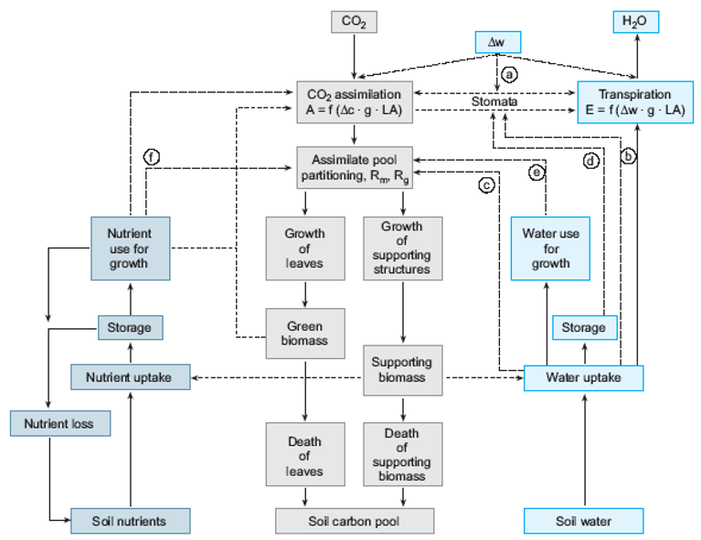
```

```{r f58, fig.cap='Biomass allocation to leaf, root, and wood in relation to relative light availability f1 for (a) wet (f2 = 1) and (b) dry (f2 = 0.5) soil as in Arora and Boer (2005).', out.width='80%', fig.asp=.75, fig.align='center',echo=FALSE}
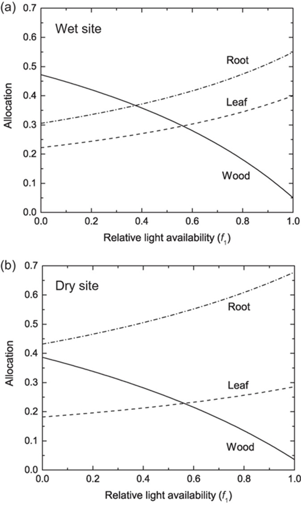
```

```{r f59, fig.cap='Two different representations of plant growth. (a) Autotrophic respiration Ra is subtracted from gross primary production (GPP) and the remaining carbon is allocated to the growth of leaves, wood, and roots. (b) GPP first enters a storage pool from which maintenance respiration Rm is subtracted. The remaining carbon is allocated to growth after accounting for growth respiration Rg.(Bonan)', out.width='80%', fig.asp=.75, fig.align='center',echo=FALSE}
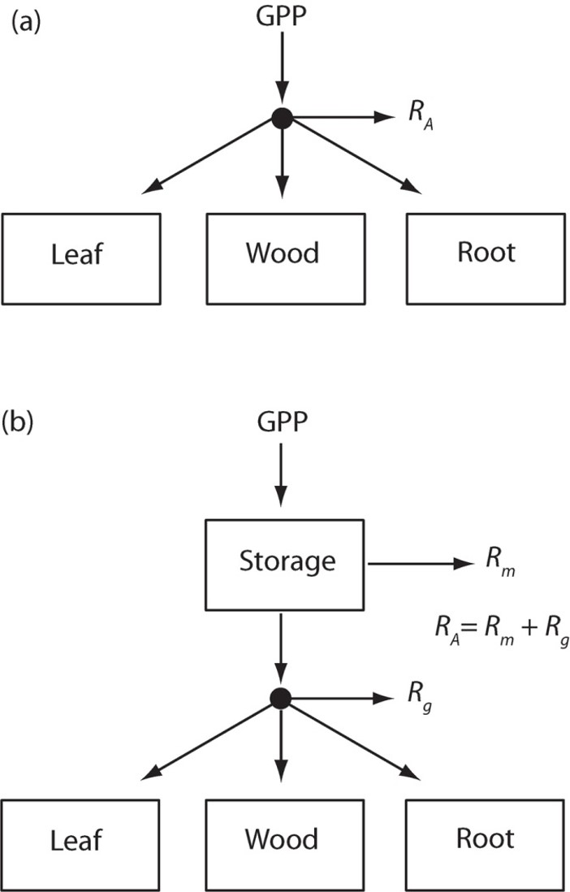
```

```{r f510, fig.cap='The Swiss Canopy Crane (SCC) free air CO2 enrichment (FACE) experiment  conducted in a mature mixed deciduous forest near Hofstetten, 15 km south of Basel, Switzerland. Fatichi et al.2013. ', out.width='80%', fig.asp=.75, fig.align='center',echo=FALSE}
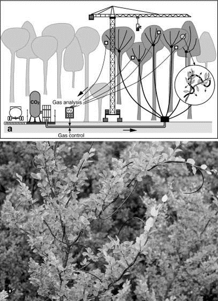
```
```{r f511, fig.cap='A comparison between observed sapflow and simulated transpiration in relative units for the Swiss Crane forest stand in ambient (AMB) and elevated (ELE) CO2 conditions during the growing season of 2004 (subplots a and c) and 2005 (subplots b and d). Scatter plots of daily sums (subplots a and b) and time series for two representative five day periods (subplots c and d) are shown. Fatichi et al. 2013.', out.width='80%', fig.asp=.75, fig.align='center',echo=FALSE}
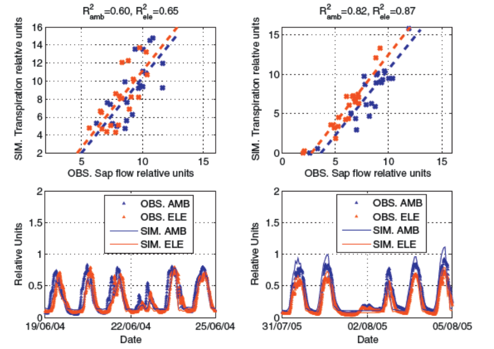
```
```{r f512, fig.cap='A comparison between observations [OBS. (1)] (solid lines) with uncertainty bounds (colored area) and model simulations (SIM., triangles) of stem growth (species averaged) per unit surface area for the period of 2000 through 2010 in ambient (AMB.) and elevated (ELE.) CO2 conditions. The stand carbon increments using only the Acrown derived for trees equipped with dendrometers in ambient and elevated conditions [OBS. (2)] in the upscaling are also reported (dashed lines). Fatichi et al. 2013.', out.width='80%', fig.asp=.75, fig.align='center',echo=FALSE}
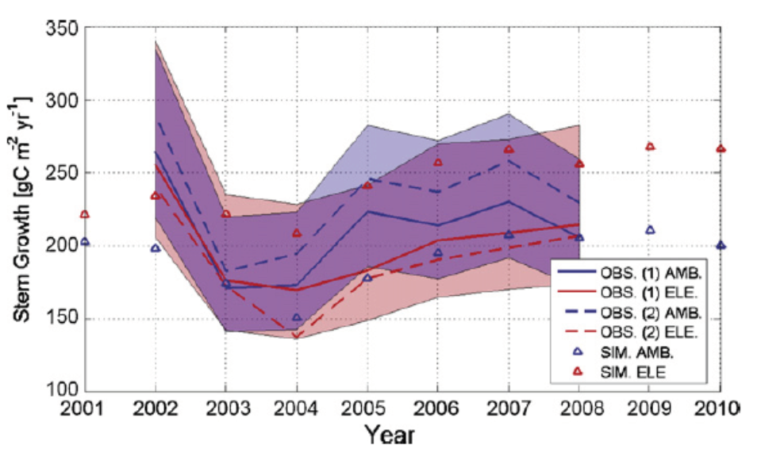
```

```{r f513, fig.cap='The simulated dynamics of green aboveground, living sapwood, fine roots and carbohydrate reserves carbon pools of (a) Fagus sylvatica (Fs) and (b) Quercus petraea (Qp) under ambient (dashed lines) and elevated (solid lines) CO2 conditions for the period of 2001 through 2010.Fatichi et al. 2013', out.width='80%', fig.asp=.75, fig.align='center',echo=FALSE}
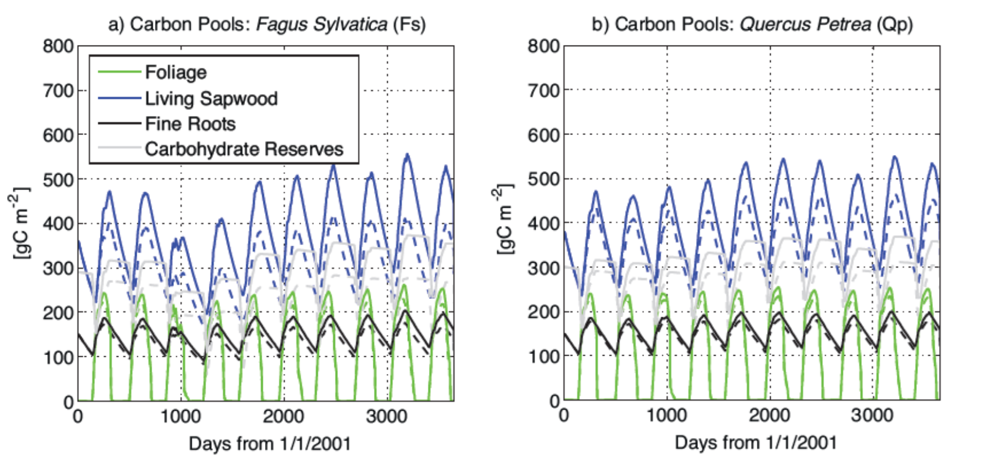
```


## Soil biogeochemistry models

### Decomposition models

```{r f514, fig.cap='Mass decline over time during decomposition of different plant materials.', out.width='80%', fig.asp=.75, fig.align='center',echo=FALSE}
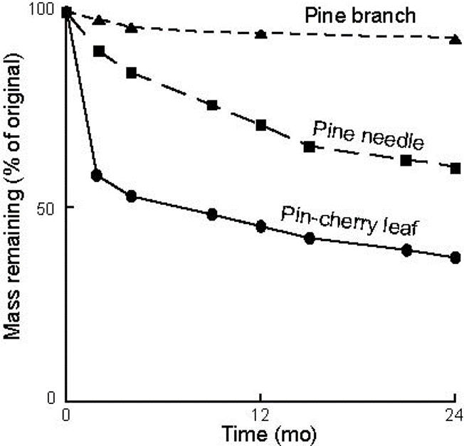
```

```{r f514bis, fig.cap='Controling factors on the decomposition process. The thickness of the arrows are proportional to the level of control. (CHapin).', out.width='80%', fig.asp=.75, fig.align='center',echo=FALSE}
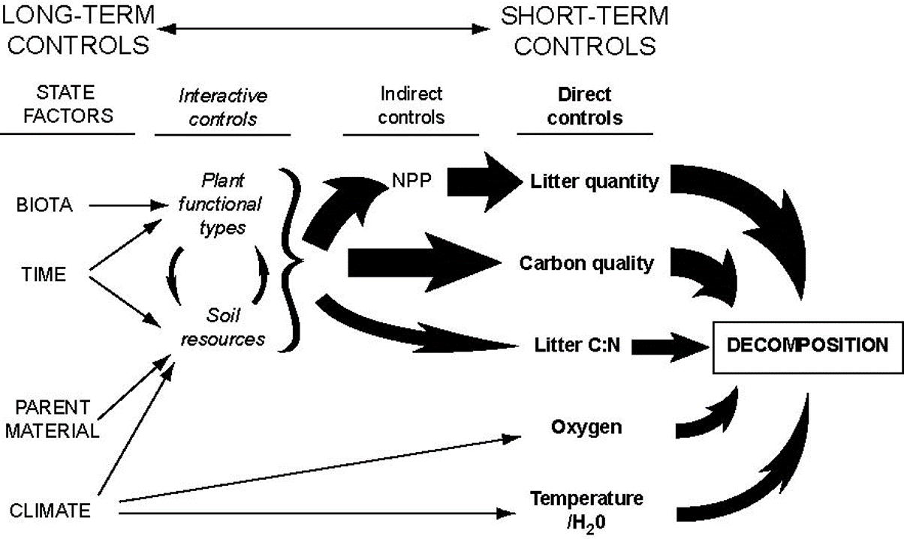
```

```{r f515, fig.cap='Phases of decomposition over time depending on the constitution of the remaing litter.', out.width='80%', fig.asp=.75, fig.align='center',echo=FALSE}
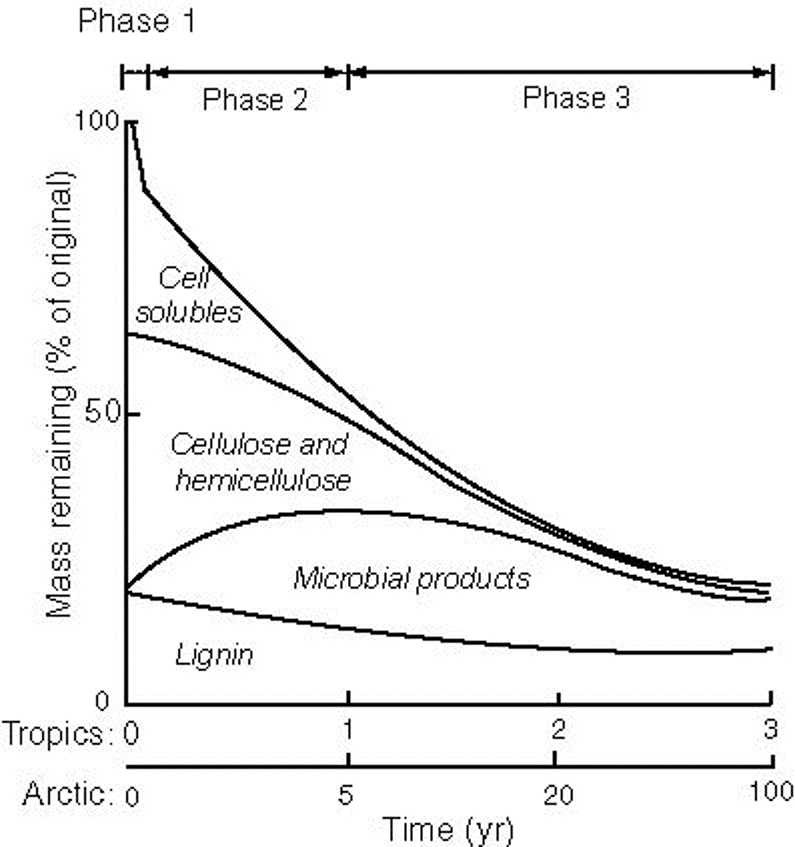
```


```{r f516, fig.cap='Relation between the decomposition constant and the lignin:nitrogen ration.', out.width='80%', fig.asp=.75, fig.align='center',echo=FALSE}
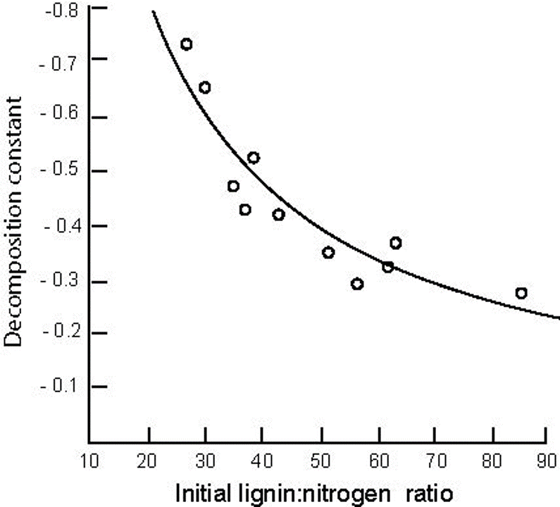
```

```{r f517, fig.cap='Decomposition as represented by a litter cohort model. Foliage, twig, root, and wood litter form individual cohorts with an initial carbon, nitrogen, and lignin mass. Each box represents an individual cohort for a particular year. Foliage litter can vary in initial quality, represented by multiple litter cohorts. The cohorts decompose over time, immobilize nitrogen, and transfer to humus upon reaching a critical nitrogen concentration. Fresh wood first passes through a well-decayed wood pool (WDW) before becoming humus. Humus decomposes and mineralizes nitrogen.(Bonan)', out.width='80%', fig.asp=.75, fig.align='center',echo=FALSE}
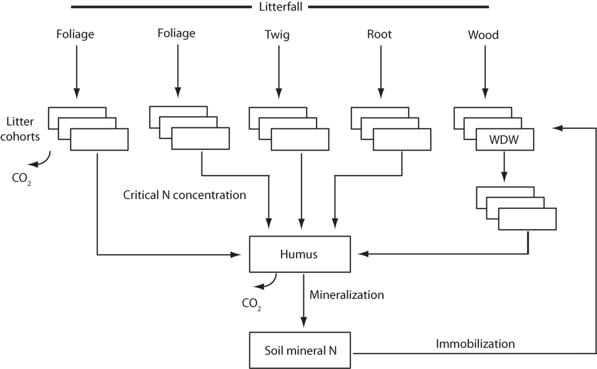
```

```{r f518, fig.cap='Example of a full soil biogeochemical model DAYCENT. Litter, soil organic matter, and coarse woody debris pools and fluxes represented. The model has leaf, fine root, and three coarse woody debris litter flux inputs (u1–u5) and twelve carbon pools (c1–c12). Shown are litter flux partitioning parameters bij, base decomposition rates kii (per year), fractional carbon transfer fij, and respiration fraction rij. Solid lines indicate decomposition pathways, with curved arrows denoting heterotrophic respiration fluxes for each pathway. DAYCENT allows for photodegradation from solar radiation, but that was not included in Bonan et al. (2013). Nor was leaching loss included. (a) Leaves decompose as surface material represented by two litter pools and two organic matter pools (shown on the left). Fine roots decompose as belowground material represented by two litter pools and three organic matter pools (shown on the right). The actual decomposition rate varies with soil temperature T, soil moisture θ, and pH. Belowground decomposition additionally varies with anaerobic conditions (O2), cultivation, and soil texture. Structural litter decomposition also depends on lignin fraction flig. The total turnover of the surface slow pool depends on decomposition and mixing, with a fraction to the belowground slow pool and the remainder to the surface active pool. The C/N of organic matter differs among pools and varies with soil mineral nitrogen. Shown is the minimum and maximum value for each pool and (in parentheses) the soil mineral nitrogen (g N m–2) for the minimum C/N. (b) Coarse woody debris decomposes to the active and slow pools. Fine-branch and large-wood debris flows to surface pools, and coarse root flows to belowground pools.(Bonan)', out.width='80%', fig.asp=.75, fig.align='center',echo=FALSE}
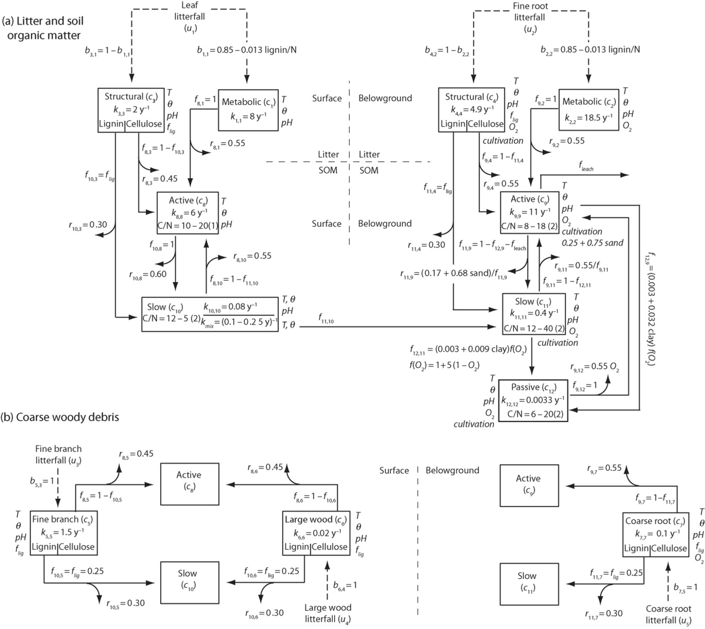
```

### NUtrient cycle models

- similar to carbon with an associated nitrogen pool and transfer.
- cycling of nitrogen can be represented by a system of linear differential equations similar to that for carbon.

- allocation of plant nitrogen uptake  up to plant pools
- loss of nitrogen in litterfall +  portion is reabsorbed

- soil nitrogen cycle is more complex (various forms)
- decomposition of litter and soil organic matter, (mineralization and immobilization)
- nitrification, denitrification, leaching, ammonia volatilization

- additional inputs from biological nitrogen fixation, atmospheric deposition, and fertilizer


```{r f519, fig.cap='Depiction of the nitrogen cycle. Circles indicate various pools (solid lines) or gaseous losses (dashed lines). Boxes denote processes. Also shown are natural inputs from biological nitrogen fixation and anthropogenic inputs from nitrogen deposition, fertilizer, and manure.(Bonan).', out.width='80%', fig.asp=.75, fig.align='center',echo=FALSE}
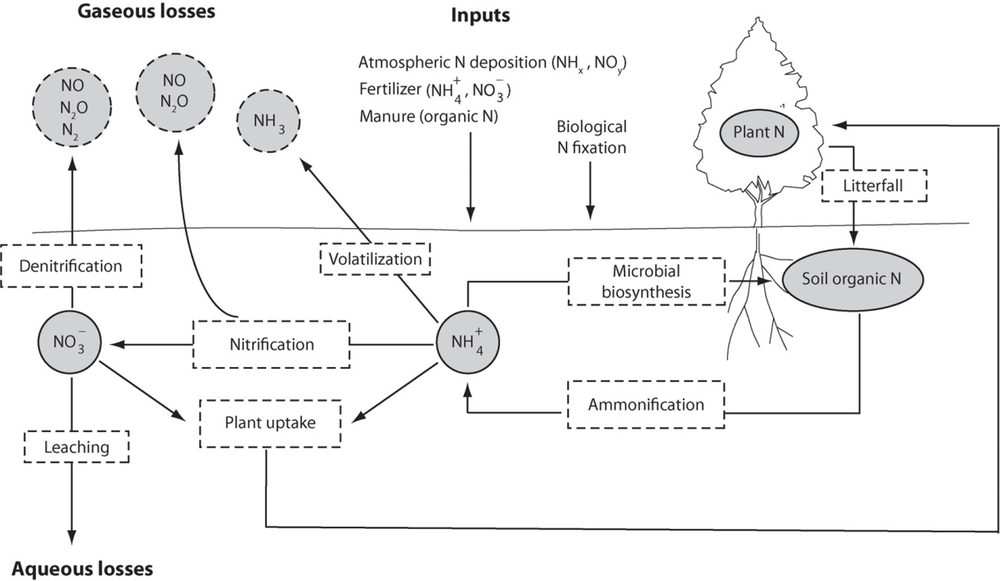
```

```{r f520, fig.cap='Cumulative C sequestration from the CMIP5 models and plausible range of C sequestration considering N constraints (CMIP5-N) for the HadGEM2-ES and IPSL-CM5A-LR models. Zhaele et al. 2015', out.width='80%', fig.asp=.75, fig.align='center',echo=FALSE}
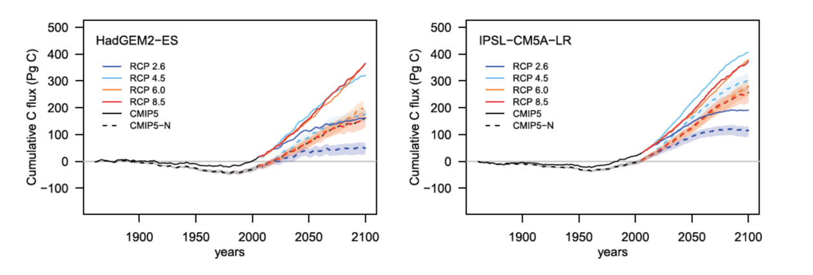
```


```{r f521, fig.cap='Schematic representation of pools and fluxes in JSBACH. Solid arrows indicate carbon fluxes and dashed arrows nutrient fluxes. The plant compartment consists of the three C pools: active (leaves and non-lignified tissue), wood (stem and branches) and reserve (sugar and starches). The litter compartment consists of non-lignified litter, and woody litter (lignified litter and fast-decomposing soil organic matter).The soil compartment consists of one pool (slow) representing slow-decomposing organic matter. All carbon pools except the reserve pool have a corresponding nutrient pool with variable C :N: P ratio (slow, non-lignified litter) or fixed C :N: P ratio (rest). There is one mobile plant pool representing mobile nutrients stored internally in plants. Soil mineral nitrogen is represented by a single pool (soil mineral pool), while mineral P is represented by labile (available) pool and sorbed pool. The opposing triangles indicated that the flux is controlled by phosphorus (red triangles), nitrogen (blue triangles) or both (mixed triangles).Goll et al. 2012', out.width='80%', fig.asp=.75, fig.align='center',echo=FALSE}
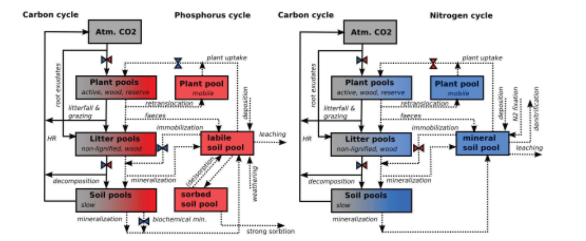
```


```{r f522, fig.cap='The simulated P in vegetation (top left), sorbed P (top right), P in soil organic matter and litter (bottom left), and the annual P uptake by vegetation (bottom right) for present day as simulated by JSBACH. Goll et al. 2012.', out.width='80%', fig.asp=.75, fig.align='center',echo=FALSE}
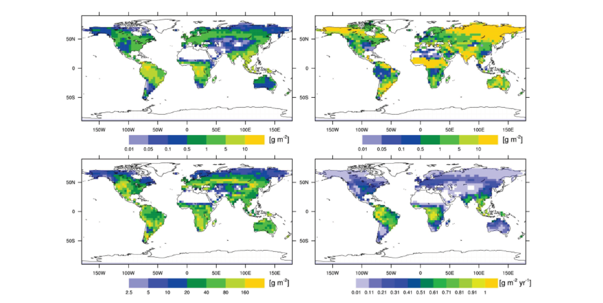
```


```{r f523, fig.cap='The simulated change in land carbon storage under the SRES A1B scenario. Shown are the 10-yr mean of soil temperature (a), the CO2 concentration as used in the forcing simulation (b), the resulting change in total land C storage (c), and the changes in the two main land compartments vegetation (d) and soil (e). Goll et al. 2012.', out.width='80%', fig.asp=.75, fig.align='center',echo=FALSE}
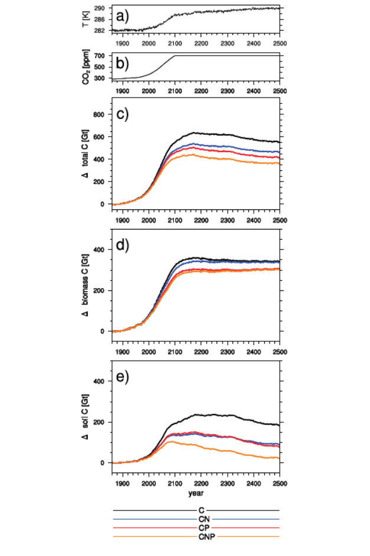
```


```{r f524, fig.cap='The reduction in C storage (kgm−2) by nutrient limitation at the end of the 21st century. Shown is the difference in the mean C storage (2070–2099) between the CN simulation and the C-only simulation (upper panel), and between the CP simulation and the C-only simulation (lower panel). The latitudinal means over land points are shown on the right side.Goll et al. 2012.', out.width='80%', fig.asp=.75, fig.align='center',echo=FALSE}
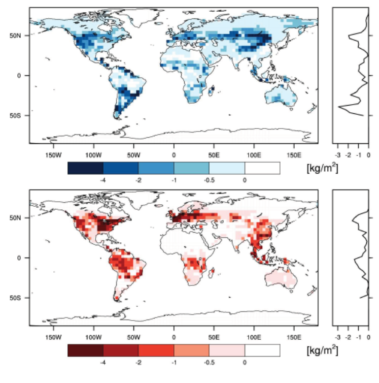
```


## Water balance models

- focus on the surface energy balance and vertical water movement in the soil–plant atmosphere system (e.g., soil moisture control of evapotranspiration)

- Specific components in terrestrial biosphere models:  
Interception, throughfall, stemflow, infiltration, surface runoff, soil water redistribution, subsurface runoff, snow melt, evaporation, transpiration, plant water uptake, stomatal conductance


