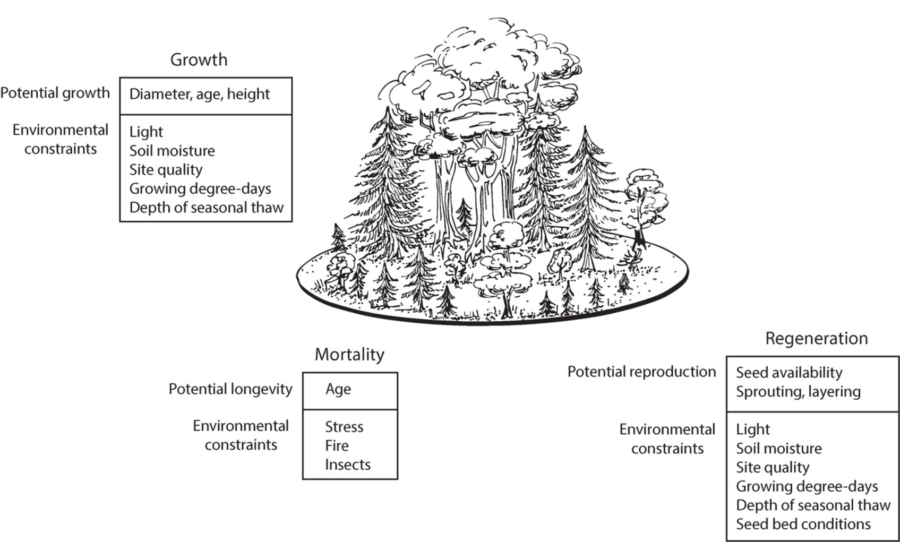

# Modelling Vegetation Dynamics and Demography
\chaptermark{Biodiversity}

## Introduction

**Biogeography** is the study of the distribution of species and ecosystems in geographic space and through geological time. A group of models that studies the distribution of species geographically is called **“species distribution models”** (SDM) (e.g. Fig. \@ref(fig:f61)). These models are typically empirical models, as they link species distribution to other parameters, e.g. climate and soil parameters, by using statistical approaches. We just mention these models briefly here (as they are not the focus of this course, but they are still important as biogeographical model outputs are used as an input to the vegetation models, to inform the vegetation model where a species occurs or can occur.
SDMs link the current distribution of a species, to a range of environmental properties, typically climate and soil properties, by using statistical approaches. The models typically use climate envelopes for this, where a specific species occurs within a range of a certain parameter. These data can then be used to predict where a species will occur in the future, or where it occurred in the past, neglecting the possible barriers of species migration.
A second group is a more mechanistic type of model that uses plant physiology and plant traits to predict the distribution of a species. These models should  be able to account for climate adaptation and acclimation.

```{r f61, fig.cap='Example of a species distribution model (SDM), used to simulate current and past species distribution (Svenning et al. 2011). LGM: Last Glacial Maximum. Such models can also be used to predict future species distributions.', out.width='80%', fig.asp=.75, fig.align='center',echo=FALSE}

```

The study of **ecosystem demography** tries to understand and quantify vegetation dynamics. Temporal dynamics in vegetation, community composition and ecosystem structure are typically driven by demographic processes: recruitment and establishment, growth, and mortality (Fig. \@ref(fig:f62)). 

```{r f62, fig.cap='Illustration of succesional forest dynamics.', out.width='80%', fig.asp=.75, fig.align='center',echo=FALSE}

```


## Gap models, area and cohort based models

From the perspective of vegetation dynamics we can consider three types of vegetation models (Fig. \@ref(fig:f63)). **Gap models** were developed in parallel with biogeochemical models. They simulate demographic processes for each individual tree. The landscape consists of different patches, which can be in different stages of succession. The model output is typically an output per tree. The second group of models are the **area-based models**, most dynamic global vegetation models (DVGM) belong to this model type. This group is on the other side of the spectrum, as this model does not calculate values for individual plants, or the number of individuals, but it simulates allocation at ecosystem scales. In these models, the landscape is divided in different patches, but every patch is only occupied by one PFT. Every patch is then represented by an average tree, after which the output is calculated at landscape model. The third type of model falls in the middle of the spectrum between two previous model types. **Cohort based models** do not track each individual tree in the landscape, but group trees from similar size and function in cohorts. Each cohort is represented by an average tree, for which the calculations are made. Contrary to the area models, the number of individuals is tracked. Gap models/individual based models and cohort-based models are both called **demographic models**, as they are both able to model demography and the account for demographic processes.

What are plant functional types (PFT)? They represent broad groupings of plant species that share similar characteristics (e.g. growth form) and roles (e.g. photosynthetic pathway) in ecosystem function. However, PFTs have a different meaning in demographic models and area-based models. In the latter, they represent an ecosystem functional type, whereas in cohort/individual based models they represent a specific plant type.

```{r f63, fig.cap='Representation of vegetation patches in models. (a) Forest gap models are individual-based models and represent a landscape as patches that differ in stage of post-disturbance development. Shown are two patches, each comprised of multiple trees that differ in size and species. (b) Area-based dynamic global vegetation models (DGVMs) represent vegetation as discrete patches of plant functional types (PFTs) that differ in area. In this example, the model grid cell has six plant functional types (distinguished by canopy shape and shading) that differ in biomass (size of plant) and patch area (size of subgrid tile). (c) Ecosystem demography models define patches based on time elapsed since disturbance. Multiple plant functional types can exist within a patch and are represented as cohorts defined by plant type and size. Shown are six patches with different subgrid area and cohort assemblages. (Bonan)', out.width='50%', fig.asp=.75, fig.align='center',echo=FALSE}

```


### Area based models
Area based models typically focus on biogeochemical processes. In area-based models, a region is subdivided in pixels, and every pixel is occupied by one or multiple plant functional types (PFT). If more than one PFT is present, the pixels are subdivided in different patches, where the area of the patch relates to the abundance of the PFT. Plant functional types are not mixed, e.g. a savanna pixel is represented by two patches, a grass patch and a forest patch. The size of the patches can change time if the conditions are more in favor of a specific PFT. The calculation of the surface of the patches is based on simplistic rules, based on productivity, mortality, establishment, fire, bioclimate tolerance,... Example: if the upper soil dries, grasses die, but trees have access to deeper water so they survive and the size of the tree-patch will increase. In this perspective, area-based models are also dynamic models. 

Within each pixel (or grid-cell), the same homogeneous climatic conditions apply. PFTs are determined based on growth form, leaf longevity, leaf type, photosynthetic pathway and bioclimate in area-based models. This typically results in 12 up to 14 functional types to cover the entire world. As only one average plant is simulated, the light availability within the PFT (patch) is homogenous, and no canopy dynamics are included. As the model is deterministic, depending on the climatic parameters you set, a certain area will be occupied by a certain PFT. Co-existence (e.g. two competing trees in a mixed forest living together) is very difficult to simulate with such models, because if the parameter of one PFT is a bit more advantageous, this PFT will eventually expel the other and dominate the model.

Despite the above described strong assumptions, these models are nowadays mostly used in the current earth system models, because they are computational efficient, and they are good in simulating broad scale landscape patterns. Examples of vegetation models that are using an area-based approach are ORCHIDEE (French model), JSBACH (German model), JULES (UK model).
Sometimes the models are used with prescribed vegetation, e.g. a vegetation map, and are then executed without the dynamic vegetation. This is mostly done when simulations are run over a shorter time period, e.g. 20 years.

The LPJ-model is a very widely used model and the model occurs in many of the examples in this syllabus. LPJ-GUESS is the demographic variant of the LPJ-model. It is a particular type area-based model because it simulates the average plant, but it also simulates the number of plants in each patch. The overall scheme of the LPJ model is shown below (Fig. \@ref(fig:f64)). The model contains the biogeophysics (see first lectures), biogeochemistry (e.g. Carbon pools), and had vegetation dynamics, which is calculated at a yearly basis. It has a background mortality of 1% and mortality caused by negative NPP, heat stress, fire, …

```{r f64, fig.cap='Coupling of a dynamic global vegetation model with a land surface model. Shown are linkages among the biogeophysics, biogeochemistry, and vegetation dynamics components of the model. The lightly shaded biogeophysical processes represent the traditional hydrometeorological scope of land surface models. The darker boxes represent the greening of land surface models with the introduction of dynamic vegetation and the carbon cycle. (Bonan)', out.width='80%', fig.asp=.75, fig.align='center',echo=FALSE}

```

The figure below (Fig. \@ref(fig:f65)) shows some dynamic simulation results of the original LPJ-model. The color of the grid cells shows the most dominant vegetation type simulated in that cell. The resulting world map of potential vegetation is very realistic.

```{r f65, fig.cap='Map of LPJ simulated dominant PFTs (Sitch et al. 2003)', out.width='80%', fig.asp=.75, fig.align='center',echo=FALSE}

```

In Figure \@ref(fig:f66) LPJ simulations are compared with satellite data. The comparison shows that the model does a reasonable job, but for some regions, the model simulations are not good, e.g. Spain: there are no dominating evergreen species, while the model predicts this. Also, tundra vegetation is not simulated well.

```{r f66, fig.cap='Comparison of LPJ-simulated distributions of woody vegetation with satellite-based maps, for percentages of tree cover, partitioned according to phenology (evergreen vs. deciduous), and leaf morphology (broadleaf vs. needleleaf). (Sitch et al. 2003)', out.width='80%', fig.asp=.75, fig.align='center',echo=FALSE}

```

These models are also able to simulate successional vegetation dynamics: see figure \@ref(fig:f67). Within one grid cell, the relative cover of different pft is calculated, and in this way, the forest succession is simulated. The start is from bare ground, and the model then dynamically simulates that it is first covered by grasses, which are gradually replaced by trees, with first a peak in broadleaved trees, which are eventually replaced by needleleaf trees in this example. The simulated competition is a kind of ‘prescribed’ as each PFT covers a separate landscape patch.
Problems with area-based models: They cannot be linked to real inventory observations because the model does not simulate a number if individuals or a size of individuals. They also neglect important aspects of the successional dynamics: for example, height, size distribution and species diversity are not simulated, but they are very important as they affect the dynamics and habitats of forests. The model is also not capable of simulating disturbances. For example, if you want to take thinning into account, you can only remove a certain amount of biomass, not a specific number of trees. Therefore, we need other models to simulate demographic processes.

```{r f67, fig.cap='Boreal forest dynamics in terms of (a) percentage cover and (b) plant carbon pools as simulated by a dynamic global vegetation model. The simulation is from initially bare ground for a single model grid cell in the boreal forest over 1000 years in the absence of fire. Percentage cover is the annual extent of plant functional types in the grid cell.(Bonan)', out.width='80%', fig.asp=.75, fig.align='center',echo=FALSE}
knitr::include_graphics('figures/chap6/f67_DGM_boreal_succession.png')
```

The Triffid model: is the predecessor of JULES mode, competition is based on lotka-volterra competition model, a general equation originally developed to predict predator prey interactions. A well know study (Cox et al. 2004) predicted the amazon dieback by using this area-based model, coupled to a climate model. It predicted a drying of the Amazon forest, and following the drying pattern, the forest would be replaced by grasses, creating a savanna (Fig \@ref(fig:f68)). However in follow-up studies, it turned out that the Amazon forest is more resilient than in the original model simulations by Triffid, if you consider that patches are interacting with each other, which was not simulated in this model (see examples later in this syllabus).

```{r f68, fig.cap='Evolution of the vegetation cover in the Amazon from a coupled climate-carbon cycle simulation with the TRIFFID DGVM and the HadCM3LC climate models. (Cox et al. 2004)', out.width='80%', fig.asp=.75, fig.align='center',echo=FALSE}

```


### Gap models

Gap models (or IBMs individual based models) were developed in parallel with area-based models in the 1970s. However, both model types were developed from a different perspective. Area based models are driven by an interest to simulate global carbon cycle, and global energy balance and water cycles, and vegetation dynamics were only a secondary element of these models. Gap models are originally developed by foresters. They were interested in the dynamics of forests as such, in individual trees, but not in the energy balance or the carbon cycle. The models are based on studies of gap dynamics, and therefore, they have patches of circa 100-800 m², which is the size of the gap created by one big tree that dies.

Within a gap, trees are competing for resources, and growth, mortality and regeneration are simulated (Fig \@ref(fig:f69) and Fig \@ref(fig:f610)) . The main mechanism that drives the dynamics in gap models is the competition for light between individuals. Growth, diameter, age and height are simulated in response to environmental variables. Mortality is simulated in response to environmental constraints such as stress (climate), fire and insects. Regeneration is calculated based on seed availability, sprouting, which in turn depend on environmental constraints. All these variables are calculated for every individual, typically at annual timesteps.

```{r f69, fig.cap='Cyclic growth and thinning of trees in a forest patch during gap dynamics.(Bonan)', out.width='80%', fig.asp=.75, fig.align='center',echo=FALSE}
knitr::include_graphics('figures/chap6/f69_gap_dynamics.png')
```

```{r f610, fig.cap='Depiction of a boreal forest gap model. The growth of an individual tree depends on its diameter, age, and height as modified by environmental constraints. Mortality depends on the age of the tree as modified by stress, wildfire, and insects. Regeneration depends on seed availability, the ability to sprout or layer, and site conditions. (Bonan)', out.width='80%', fig.asp=.75, fig.align='center',echo=FALSE}

```

By simulating demographic processes for each tree, the model can track stem density over time, also the size distribution and the species composition.
Gap models are stochastic: as each simulated patch is different and can evolve in a different way, depending on stochastic elements. However, all patches combined results in a landscape with stable properties. 

In these models, biomass is not in the center, but can be calculated as the model simulates the growth of all individual trees. This also applies to the community composition and the biogeochemical cycles. These are all emergent outcomes, as they are not described explicitly in the model, but emerge from its output.

In gap models, landscapes are simulated by different patches, in which each individual is modelled by the model. There are different possibilities to put the patches together in the landscape (Fig \@ref(fig:f611)): first, a monte Carlo simulation is run to select random places, and for theses places, the growth is simulated, after which it is upscaled (averaged out) to the landscape. A second possibility is to use a grid of patches and average out, while a third method simulates all processes for adjacent plots. Finally, you can start a simulation from existing inventories. If you have inventories over different parts of the landscape, you can average simulations of these inventories to come to a landscape average.

Gap models are computationally very intensive, as they simulate each individual tree, which makes it problematic to implement them in earth system models. They also don’t simulate short time scale leaf physiology, but simulate growth based on specific growth equations, that describe growth directly as a response to the available light or other factors.

```{r f611, fig.cap='General functioning of a gapmodel. As one moves to the right to left, spatial scale increases from an individual tree to a small plot to a landscape. The tree-level response shown here is the elementary growth equation from the FORET (Shugart and West 1977) model. The magnitude of the tree-mortality probablity of each tree is also determined at the tree-level depending on tree growth as an index of vigor, species longevities and other conditions. The form of the growth equation with no constraints is shown at the top and the decrement to this optimal growth equation is found below according to the particular controlling environmental factors (available light, soil moisture, etc). At the plot level, the vertical profile of light, available soil moisture, and other environmental and biogeochemical factors are calculated and tree to tree interactions are computed. Conditions for potential new seedlings for each year are determined factors such as the environmental conditions and seed sources. At the landscape model, a basic gap model can be used to represent the landscape as: (a) the summation of a Monte Carlo collection of independent random points; (b) gridded points at some spacing, (c) a tessellation of adjacent plots; (d) a spatially explicit landscape simulation with a spatial map of trees that is ‘windowed’ or updated for tree birth, growth and death by dropping a gap-model computational window onto the tree-stem map to solve for a subset of a new map. This is repeated to produce the new map. The size of this subset determines the resolution of the spatial map. (Shugart et al. 2018)', out.width='80%', fig.asp=.75, fig.align='center',echo=FALSE}

```

Examples: ForClim model Fig \@ref(fig:f612) shows simulations for forests in the alps, where different species are competing. The model is initiated from bared ground, and also includes some disturbances with a stochastic character: e.g. wind or management impact. The figure shown is a typical figure for this kind of models, where calculations are made on an annual basis, and simulations are run for centuries or even millennia. In this graph, the abundance of a species is expressed as its total biomass.

```{r f612, fig.cap='Comparison of the behavior of two versions of the gap model ForClim under current climate (years 0–800) and under conditions of climatic change (years 800–900) and under a hypothetical future constant climate (years 900–1500) at two sites in the European Alps, Bever (a, b) and Davos (c,d). Model version 2.4 (a, c) has a parabolic temperature response function for tree growth (like JABOWA model), whereas model version 2.9 (b, d) features an asymptotic response function. (Bugmann 2001)', out.width='80%', fig.asp=.75, fig.align='center',echo=FALSE}

```

Gap models are mostly applied locally but can sometimes be upscaled to larger areas (Fig \@ref(fig:f613) and Fig \@ref(fig:f614)). However, for such large scale applications they don’t simulate every single tree over the large area but simulate representative areas and extrapolate that data over the entire study area. 
Sometimes a model data fusion approach is followed, and the data is matched with satellite data, to have a more realistic representation of reality (as in example Fig \@ref(fig:f613)). In this example for the Amazon they used satellite data to parameterize the FORMIND model. The model gives a very detailed biomass map at a very high resolution. This is only possible with this kind of model, with an area-based model for example, you would have very homogenous biomass patterns over the amazon. 

```{r f613, fig.cap='High-resolution biomass map for the Amazon rainforest at 1000 m resolution (left) and relative frequency distributions at 40 m resolution (right) derived by linking FORMIND (IBM) simulation results with remote sensing data. (Rödig et al. 2017)', out.width='80%', fig.asp=.75, fig.align='center',echo=FALSE}
knitr::include_graphics('figures/chap6/f613_formind_amazon.png')
```

In the example of Fig \@ref(fig:f614) projections for the change in carbon biomass in Russia are shown over the period from now to the end of the century, by using two different climate scenarios. Red areas indicate a large decrease in carbon biomass, green areas indicate a growing carbon biomass. For example, northern Russia is now too cold for tree growth, but could be warmer towards the end of the century, allowing tree growth and leading to a higher carbon biomass.

```{r f614, fig.cap='Difference in UVAFME simulated total carbon biomass (tonnes of carbon per hectare (t C·ha–1) for a mature forest between year 2000 and year 2095 following 95 years of temperature and precipitation as represented by NCAR CCSM A1B and A2 scenarios.(Shuman et al 2015)', out.width='80%', fig.asp=.75, fig.align='center',echo=FALSE}

```


### Cohort based models

Cohort based models (also called ‘ecosystem demography models’) are an approximation of IBM’s. They group all similar plants into cohorts and simulated one average plant for each cohort, enormously reducing the computational demand. They bridge the gap between IBM and area-based models. They do simulate very short time-scale processes such as photosynthesis and simulate demographic processes. They are not stochastic,  i.e. they don’t simulate the mortality of each individual tree but have a more deterministic description of mortality. For example, every year, a fraction of x% of the trees is removed. The cohort approach retains the dynamics of IBMs, with reduced computational cost, but removes stochastic processes that can enhance the representation of functional diversity. Just like in IBMs, the model has emergent outcomes for community composition, stand biomass and productivity and biogeochemical cycles, as these are not explicitly simulated by the model. 

We will focus on one example: the ED model (ecosystem demography model). In ED the landscape is divided into multiple grid cells (Fig \@ref(fig:f615)). In each grid cell, the same climatological conditions apply. Within each grid cell, multiple sites exist, based on abiotic conditions, such as soil texture. The sites and grid cells belong to the static part of the model, these characteristics don’t change over time. Each site has two dynamic levels, i.e. patches and cohorts. A patch represents a fraction of the landscape grouping all pieces of land that have the same disturbance history. The size of the patches and the number of patches is dynamic, and changes during the simulation. E.g. if there is a lot of mortality, a large patch of young, new forest will be created. Or if there is almost no mortality, the size of the patch of old growth forest will increase. Each patch is covered by a vegetation community, built by different cohorts. A cohort represents a number of individual trees belonging to the same size class and the same plant functional type. Cohorts are also dynamic and change over time (number of plants can increase or decrease), and cohorts can merge (e.g. a cohort of young beech trees that grew enough can become part of the cohort of old large beech trees).

```{r f615, fig.cap='Schematic representation of the multiple hierarchical levels in the ED-2.2 model, organized by increasing level of detail from top to bottom. Static levels (grid, polygons, and sites) are assigned during the model initialization and remain constant throughout the simulation. Dynamic levels (patches and cohorts) may change during the simulation according to the dynamics of the ecosystem.(Longo et al 2019)', out.width='80%', fig.asp=.75, fig.align='center',echo=FALSE}
knitr::include_graphics('figures/chap6/f615_ED_structure.png')
```

The ED2.2 model is an advance version of ED that has the full biophysics and biogeochemistry cycle and energy balance included (Fig \@ref(fig:f616), Fig \@ref(fig:f617)). For each cohort, all these variables and processes are calculated, and the different cohorts are competing within the patch. This implies that it will be more difficult for a young tree to develop in this model, a struggle for life which is not represented in an area-based model, as here, the tree stands underneath another cohort, which reduces the light and nutrients available for the young tree. The advantage of this model compared to gap models and area-based models is that we can simulate fast time processes and vegetation dynamics with one model.

```{r f616, fig.cap='ED2.2 biophysics. Schematic of the fluxes that are solved in ED-2.2 for a single patch (thermodynamic envelope). In this example, the patch has NT cohorts, NG soil layers, and NS=1 temporary surface water. Both NG and the maximum NS are specified by the user; NT is dynamically defined by ED-2.2. Letters near the arrows are the subscripts associated with fluxes, although the flux variables have been omitted here for clarity. Solid red arrows represent heat flux with no exchange of mass, and dashed yellow arrows represent exchange of mass and associated enthalpy. Arrows that point to a single direction represent fluxes that can only go in one (non-negative) direction, and arrows pointing to both directions represent fluxes that can be positive, negative, or zero.(Longo et al 2019)', out.width='80%', fig.asp=.75, fig.align='center',echo=FALSE}
knitr::include_graphics('figures/chap6/f616_ED_biophysics.png')
```

```{r f617, fig.cap=' ED2.2 biogeochemistry. Schematic of the patch-level carbon cycle solved in ED-2.2 for a patch containing NT cohorts. Like Fig. 6.15, letters near the arrows are the subscripts associated with fluxes. Fluxes shown in solid yellow lines are part of the CO2 cycle, and dashed red lines are part of the carbon cycle but do not directly affect the CO2 flux.(Longo et al 2019)', out.width='80%', fig.asp=.75, fig.align='center',echo=FALSE}

```

Fig \@ref(fig:f618) illustrates some outputs of the ED2 model for a temperate forest. Fig\@ref(fig:f619) shows the output of the model for tropical ecosystems. The visualization in these figures  (6.18a, 6.19a and b) are produced based on the outputs of ED2.2, they are not simulated directly by the model, as the model is not spatially explicit (it is not tracking the location of cohorts). The model simulates carbon fluxes, but also size distribution, which gives a lot of opportunities, as it can be compared with many different datasets: fluxtowerdata, inventory data,

```{r f618, fig.cap=' Visualization of the ecosystem composition in the Harvard Forest flux tower footprint as simulated by ED2. Midsuccessional hardwoods (red) dominate, but the footprint also contains early successional hardwoods (green), pines (blue), late successional conifers (magenta) and late successional hardwoods (gray). (b) Distribution of basal area of the different plant functional types across tree diameter classes.(Medvigy et al. 2009)', out.width='80%', fig.asp=.75, fig.align='center',echo=FALSE}
knitr::include_graphics('figures/chap6/f618_ED_harvard.png')
```

```{r f619, fig.cap=' Examples of size, age, and functional structure simulated by ED-2.2, after 500 years of simulation using local meteorological forcing and active fires. (a, b) Individual realization of simulated stands for sites (a) Paracou (GYF, tropical forest); (b) Brasília (BSB, woody savanna). The number of individuals shown is proportional to the simulated stem density, the distribution in local communities is proportional to the patch area, the crown size and stem height are proportional to the cohort size, and the crown color indicates the functional group. (c, d) Distribution of cohorts as a function of size (DBH and height) and age since last disturbance (patch age) for sites (c) GYF and (d) BSB. Crown sizes are proportional to the logarithm of the stem density within each patch.(Longo et al 2019)', out.width='80%', fig.asp=.75, fig.align='center',echo=FALSE}

```

## Growth and allometric relations in demographic models
Allometric relations are a critical driver for growth in demographic models. Most variables are scaled to the diameter at breast height. The allometries are like the allometries for biogeochemical models but are applied to individual (in IBM) and cohorts (in cohort-based models). Further, these models also use growth specific equations, as can be seen below where we will typical examples of growth and allometric equations. 

The **diameter height allometry** of the JOBOWA IBM has three parameters, b1 is breast height (1.5m) and the other parameters are species specific and can be derived from the maximum height and diameter that specific species can reach, using empirical equations (Fig. \@ref(fig:f620)).

$$
h = b_1 + b_2D - b_3D^2
$$
with $h$ the tree height in m, $D$ the tree diameter in m and $b_1$ is breast height (1.5m), $b_2$ and $b_3$ empirical parameter following: 
$$
b_2=2\left(\frac{h_{max}-1.37}{D_{max}}\right)
$$
and 
$$
b_3 = \frac{h_{max}-1.37}{D_{max}^2}
$$
```{r f620, fig.cap='Height-diameter allometry in the JABOWA individual based model.(Buggman 2001)', out.width='80%', fig.asp=.75, fig.align='center',echo=FALSE}
knitr::include_graphics('figures/chap6/f620_HD_allom.png')
```

Allometric equations have also been developed for **biomass**, where an exponential relationship is used. ai and bi are species specific parameters. This leads to different curves for different species (see Fig \@ref(fig:f621)). For the tropics, no such equations are available, and the use of pan-tropical equations or average equations based on destructive measurements are used. 

$$
M_i=a_iD^{b_i}
$$
with $M_i$ the mass of individual $i$, $D_i$ its diameter and $a_i$ and $b_i$ empirical coefficients. 

```{r f621, fig.cap='Relationships between stem diameter and (a) aboveground biomass and (b) height for sugar maple, yellow birch, beech, and red spruce trees at the Hubbard Brook Experimental Forest, New Hampshire using allometric relationships. (Bonan)', out.width='80%', fig.asp=.75, fig.align='center',echo=FALSE}
knitr::include_graphics('figures/chap6/f621_BD_allom.png')
```

The **leaf biomass allometry** is also an exponential relation between the diameter and leaf biomass, which can then be recalculated to LAI using the specific leaf area (SLA). This allometry is not often used in forestry, but is interesting from a modelling point of view, as the size and area of the crown determines the competition for light with other trees. 
$$
M_{leaf}=cD^2
$$
with $M_{leaf}$ the mass of leaves, $D$ the diameter and $c$ an empirical coefficient. 

```{r f622, fig.cap='Leaf area - diameter allometry in the JABOWA individual based model. (Buggman 2001)', out.width='60%', fig.asp=.75, fig.align='center',echo=FALSE}
knitr::include_graphics('figures/chap6/f622_LD_allom.png')
```

The **growth equation** used in the JABOWA model is shown in Fig \@ref(fig:f623). This is a key equation in the model to calculate the diameter increment, as the other variables are calculated based on the diameter. IBM’s apply growth functions every year, whereas cohort-based models typically apply them at a shorter calculation step, mostly every month. The equation of JABOWA is an empirical equation, based on inventories, and the diameter is the only state variable. The equation calculates the maximum obtainable growth (first 4 terms) and multiplies this with a correction factor (values between 0 and 1), which is based on environmental conditions.  This results in the fact that the obtained growth in the model is different for every individual, based on the competition it has with neighboring trees for light and other resources.

$$
\frac{\Delta D}{\Delta t}=GD(1-\frac{DH}{D_{max}H_{max}})\frac{1}{b(D)}f(e)
$$
with $D$ the tree diameter, $H$ its height, $t$ the time and $b$ and $f(e)$ empirical coefficients. 

```{r f623, fig.cap='The JABOWA equation of maximum tree growth plotted for a tree with Hmax = 40 m, Dmax = 285 cm, and G = 143 cm/yr. (Buggman 2001)', out.width='80%', fig.asp=.75, fig.align='center',echo=FALSE}
knitr::include_graphics('figures/chap6/f623_jabowa_growth.png')
```

The figure \@ref(fig:f624) illustrates the allometries and growth factor of two tree species in an IBM, subplots a and b represent the height-D allometry and the leaf area -D allometry for two species. Subplot c shows the cumulative leaf area index vs the fraction of full sunlight and subplot d indicates the effect of light availability on the growth factor. Exceptionally, the growth factor can be higher than one, for the shade tolerant species in full sunlight. This indicated that the maximum obtained growth can be higher that the modeled maximum under certain circumstances.

```{r f624, fig.cap='Tree height and light competition in a forest gap model. (a) Height in relation to stem diameter for two species of trees. (b) Leaf area in relation to stem diameter. (c) Light profile in relation to cumulative leaf area index. (d) Light growth factors for shade tolerant and intolerant species. Height is shown for basswood (Tilia americana) and blackjack oak (Quercus marilandica) with parameters from a model of forests in eastern North America (Pastor and Post 1985). Leaf area and light extinction are from FORET (Shugart 1984). (Figure from Bonan)', out.width='80%', fig.asp=.75, fig.align='center',echo=FALSE}
knitr::include_graphics('figures/chap6/f624_growthfactor.png')
```

Figure \@ref(fig:f625) illustrates other dependencies of the growth factor on environmental conditions, for the dependency on growing days, drought and nitrogen availability. Some models also link the growth factor to the basal area of the total stand, where a high basal area lowers the growth factor, because of the high competition.

```{r f625, fig.cap='Growth factors for (a) temperature (growing degree-days), (b) soil moisture, and (c) soil nitrogen illustrated for basswood and blackjack oak (Pastor and Post 1985). Basswood grows at more northern locations than blackjack oak, on wetter soils, and is intolerant of low soil nitrogen. (Bonan)', out.width='80%', fig.asp=.75, fig.align='center',echo=FALSE}

```

Figure \@ref(fig:f626) shows the growth functions of the two species discussed above. Basswood is more a pioneer species as its peak annual growth falls early, whereas oak is more a climax tree, as its peak falls later and is more spread over time. The maximum growth shown on these curves is then corrected by the growth factor which is shown  in the figures above.

```{r f626, fig.cap='Stem diameter growth in relation to age as represented in gap models. Relationships are shown for basswood (Dmax = 100 cm, hmax = 30 m, G0 = 188.7 cm y–1, maximum age 140 years) and blackjack oak (Dmax = 50 cm, hmax = 15 m, G0 = 34.0 cm y–1, maximum age 400 years). Parameter values are from Pastor and Post (1985). (Bonan)', out.width='60%', fig.asp=.75, fig.align='center',echo=FALSE}

```


## Competition for light in demographic models

In this section we focus on how is competition for light is implemented in demographic models. This is important because it largely determines the dynamics of the forests. 

Cohort based models are usually not specially explicit. This implies that plants have no specific place in the patch, so it is impossible to know which individual has an influence on another, e.g. which individuals shades another individual. To be able to apply the exponential decay of light in the canopy, we need to have a vertical canopy profile. This needs to be build with the cohorts that grow in the patch and can be done in different ways (Fig \@ref(fig:f627)), depending on the assumption we make on the shape of the crowns and the spatial (vertical) organization of these crowns within the patch. The easiest approach is the approach of “flat-topped crowns”. In this approach, each cohort has all its leaf area at its maximum height and the largest tree in the patch is shading all the other trees within the patch. A second approach is the perfect plasticity approximation (PPA). This approximation assumes that the available horizontal space in the patch is first filled by the largest trees, followed by the lower trees, until a layer of LAI = 1 is reached. The remaining trees are then considered as understory trees. In this approach, smaller trees that are still in the top layer are not shaded by the highest tree, which is more realistic than the first approximation. This approach assumes that crowns are not interfering, so crowns don’t grow into each other (i.e. are perfectly plastic). It further results in a critical height that represents the height that is needed to be in the overstory, and thus to be fully sunlit (Fig \@ref(fig:f628)).

Among various demographic models, there are different approaches. Some models assume multiple layers within one cohort, so only the top layer can be sunlit. There are attempts to model in three dimensions, but this will not be discussed in this course.

Both methods have advantages and disadvantages: e.g. shading by neighboring trees is not accounted for in the PPA model, while it is in some way included in the flat crown approach.


```{r f627, fig.cap='Representation of plant canopies in vegetation dynamics models.(a) Actual canopies have complex three-dimensional structure determined by the spatial location of trees and their crown geometry. (b) Gap models simplify the canopy so that the crown of an individual tree is a thin, flat layer of leaves at the top of the tree. Shown are six trees with different heights (white vertical lines). The leaf area of each tree (black horizontal lines) spreads over the area of the patch so that the tallest tree shades all others, and so forth, through the canopy. Horizontal positioning is for illustration only. The models do not represent spatial location, only the vertical dimension. Darker shading denotes progressively less light deeper in the canopy. The ecosystem demography model (ED) uses a similar concept, but applied to cohorts rather than individual trees. (c) The perfect plasticity approximation (PPA) organizes canopies into layers. All cohorts in the overstory (white boxes) receive identical light for that layer. The understory (black boxes) receives less light. Spatial location is for illustration only. (Bonan)', out.width='50%', fig.asp=.75, fig.align='center',echo=FALSE}

```


```{r f628, fig.cap='Canopy organization in the perfect plasticity approximation. Shown are 10 cohorts arranged from tallest to shortest. The cumulative crown area of the six tallest cohorts (C1–C6) sums to one, and these form the overstory. The remaining cohorts (C7–C10) form the understory. The height z∗ separates the two canopy layers. (Bonan)', out.width='80%', fig.asp=.75, fig.align='center',echo=FALSE}

```

We further some critical issues of these approximations. If we consider an open canopy (no canopy closure yet), the flat top crown will simulate shading, while there is none. Also, the impact of a height advantage is magnified in the flat top crown approach, i.e. the highest tree has a huge advantage over all the other trees. This leads to monodominance, which makes it difficult to simulate co-existence of multiple trees. 

In the PPA approximation (Fig \@ref(fig:f629)), it is assumed that gaps are filled, which removes magnification of small height advantages, but it assumes that all trees in the top layer are fully sunlit, which is likely not the case in reality. Also, all understory trees have all the same light environment in this model, which is different from reality. 

```{r f629, fig.cap='Crown shapes modelled by the Ideal Tree Distribution model (ITD) following the perfect plasticity approximation (Purves et al. 2007)', out.width='80%', fig.asp=.75, fig.align='center',echo=FALSE}

```

The simulated vegetation dynamics (growth, mortality, recruitment) can have an impact on the light regime within the patch and the light availability of the respective cohorts. Figure \@ref(fig:f630) shows how growth can lead to demotion (opposite of promotion) of certain cohorts. Subplot a: the growth of the largest cohorts leads to an increased LAI of these cohorts. Because of that, they become too large to fit as one lai layer in the patch, so a part of the smallest cohort will be demoted to the shaded canopy, creating a new cohort. For mortality, there are two options: in subplot b, mortality leads to the death of a certain fraction of the crown of each cohort, resulting in a more open space, and thus place for new cohorts to reach the top of the canopy. The new open space is filled starting with the highest cohort of the shaded cohorts, until the top layer is filled again. In subplot c, the mortality leads to new open space which is used to create new patches of newborn vegetation. Both approaches lead to a different forest dynamic.

```{r f630, fig.cap='Depiction of cohort and patch dynamics. (a) Growth of cohorts leads to crown expansion, resulting in splitting of a cohort and demotion to the understory. Shown are four overstory cohorts (C1–C4). Part of the shortest cohort (C4) is demoted to the understory to form a new cohort. (b) Mortality leads to open canopy space that can be filled by promotion of understory cohorts to the overstory. In this example, the two understory cohorts form new cohorts (C5, C6) in the overstory. Patch area is unchanged. (c) The open canopy space upon mortality can also be used to create a new patch that is filled by new cohorts. The area of the old patch decreases, and a new patch is formed from the open canopy area.(Bonan)', out.width='80%', fig.asp=.75, fig.align='center',echo=FALSE}

```


## Competition for water and nutrients in demographic models
The implementation of competition for water and nutrients depends on how detailed the soil is represented in the model. The soil representation varies between models, ranging from a one-bucket model (i.e. one soil water reservoir with inputs and outputs), to multiple soil layers with an explicit rooting depth or profile. In demographic models (i.e. models with multiple PFTs), plants can compete with each other. In these models, the rooting profile is often the key to determine competition for water and nutrients; e.g. a plant with superficial roots will be more vulnerable to drought than a plant with roots that reach the ground water table. 

Models also differ in the scale at which they represent the competition for resources. Some models consider that all patches in the same gridcell have access to the same resource pool (fig \@ref(fig:f631) b), while other models track a resource pool for each patch separately (fig 6.31 a). In the former case, water uptake by a tree in for example patch 3, has a direct impact on the water availability for trees in patch 1.

The below ground competition in models is generally less well developed than the above ground competition for resources. This is mainly because there is less information and data available on variables that determine the below ground competition, such as root distribution, root biomass in different soil layers, …

```{r f631, fig.cap='Illustration of resource partitioning in vegetation demographic models. (a, b) show two alternative depictions of resource partitioning in an age-since-disturbance resolving (ED-type) model. In (a) resources (water/nutrients) are resolved for each age-since-disturbance patch, meaning that different extraction levels can affect resource availability over the successional gradient, a situation made more likely by large spatial-scale disturbances. In (b) all patches share a common pool, a situation more relevant to smaller (individual) scale disturbances. (Fischer et al. 2018)', out.width='80%', fig.asp=.75, fig.align='center',echo=FALSE}
knitr::include_graphics('figures/chap6/f631_root_competition.png')
```


## Seed dispersal and recruitment
In most models, recruitment and dispersal are stochastic processes, and the model implementations are much less process-based compared to for example photosynthesis. Most models assume that seeds of all PFTs that potentially grow in the patch are available everywhere in the patch, i.e. there is a constant available seedbank for all PFTs. By consequence, most models don’t simulate seed arrival, germination and establishment, but only how many new young trees establish. However, some models are more spatially explicit, and only allow establishment of certain PFTs, only those PFTs that grow in the neighborhood of the establishment site (seed input of neighboring patches allows for gap-colonization by specific PFTs). 

Establishment of new seedlings further depends on light availability and other climatic conditions, such as water availability or temperature. The initial dimensions of new seedlings/saplings are highly model dependent. Some models assume a new tree to be 0.5 m high from the start, without explicitly simulating the growth of that young tree, while other models assume a variation in the size of new young trees. 


## Mortality
Mortality is typically a stochastic process, which consists of three different components. First, there is a **background mortality**. This is a constant probability for a tree/plant to die each year throughout the tree life, which typically ensures that only a limited number (a few percent) of trees reach the maximum age (maximum age is a PFT dependent parameter in most models). In area-based models, this component is included by removing a certain fraction of the wood biomass each year, whereas in demographic models, a certain number of individuals dies each year. 

The second component of mortality is the **stress related mortality**. Typical examples of this are drought stress or heat stress. Some models link these stresses to actual physiological processes simulated by the model, e.g. if actual drought stress is simulated on photosynthesis, the model also increases the mortality because of the drought (process based mortality). Other models, such as the JABOWA model (shown in figure \@ref(fig:f632)), link mortality empirically to the diameter growth of trees (higher mortality rates for low growth rates). In this case, trees that only grow very little according to their prescribed growth curve, have a higher mortality. Figure \@ref(fig:f632) shows how mortality over the life cycle of a tree is included in the JABOWA model. The full line is the background mortality. On the left hand, the stress related mortality for young trees is shown. Young trees have a higher mortality because they have only a limited diameter growth, as they are mostly shaded and heavily competing in their early life stages. On the right hand of the graph, the increased stress related mortality for old trees is shown. Again, the mortality becomes higher as older trees show less diameter growth. The total probability of mortality over the lifetime of a tree is shown by the dark black line and is the result of the sum of all individual probabilities.

Third, there is **disturbance related mortality**. This mortality is related to individual events, such as wind or fire. The simplest models assume a constant annual mortality related to disturbance, while more complicated models link this mortality to, for example, wind speed or have an explicit fire module. Mortality is, just like recruitment and dispersal, not fully developed, because our knowledge on these processes is rather limited.

```{r f632, fig.cap='Changes of mortality patterns with tree age and their approximation in the JABOWA model. AIM – age-independent ‘background’ mortality; SM – stress-related mortality.(Buggman 2001)', out.width='80%', fig.asp=.75, fig.align='center',echo=FALSE}
knitr::include_graphics('figures/chap6/f632_mortality_jabowa.png')
```

## Conclusion
Demographic models (individual based or cohort based) simulate forest dynamics as an outcome of the life history traits (such as maximum height, maximum age and climate tolerance), attributed to the species or the PFT. In these models, the different PFTs compete with each other, limited by their life history traits, resulting in a vegetation composition. When we provide other input values for the life history traits, the simulated vegetation community (PFT composition, size distribution) will also be different. For this reason, these models are also called ‘trait filtering models’: properties of the individuals/cohorts determine which species can become dominant during succession. 

From that perspective, these models could be used to replace standard species distribution models, which need species abundance data, climate data and soil data to predict where a certain species can occur. In a well-working demographic model, only species that suit to a certain place and climate are able to grow. For example, in Belgium, no tropical trees would survive, but temperate tree species would, and will dominate the vegetation in the model after some time. However, more data on more traits should be accounted for to allow such model to predict species distribution reliably. In the meantime, demographic models are often run with prescribed potential species or PFTs that can grow in a certain region, which results in figures as Figure \@ref(fig:f633). 

Figure \@ref(fig:f633) b shows the stem density at a certain point in time during the simulation. It shows a typical pattern, namely that of multiple small diameter trees, and only a few large diameter trees. Subplot c shows the biomass distribution over the diameter classes. Here we see that most of the biomass is concentrated in the trees with an average diameter, and less in trees with a small, or large diameter. The results of this model can be related to inventory data to validate the model output.

```{r f633, fig.cap='Forest dynamics simulated by LM3-PPA. Shown is (a) basal area of aspen (Populus tremuloides), red maple (Acer rubrum), and sugar maple (Acer saccharum) in relation to stand age. Also shown for year 80 are (b) stem diameter distribution and (c) biomass distribution. (Bonan))', out.width='60%', fig.asp=.75, fig.align='center',echo=FALSE}
knitr::include_graphics('figures/chap6/f633_LM3_ppa_succession.png')
```

Area-based models are the models that are now standard in global models, but cohort-based models will likely take over this task in the future. The table below gives a general overview of the main properties of area- based models, cohort-based models and gap models. Please note that not every model can fit exactly into one of these groups, some models combine properties of different groups. 

Models are not only used to make simulations or predict what will happen in the future, but they can also be used as a diagnostic tool. Combing the model with available data (model-data fusion) leads to better estimates of parameters that are more difficult to derive from the original dataset that was used to feed the model. This allows people to extract more information from the data.

```{r f634, fig.cap='Summary of the differences between area based, cohort based and individual based vegetation models.', out.width='80%', fig.asp=.75, fig.align='center',echo=FALSE}
knitr::include_graphics('figures/chap6/f634_table.png')
```


## Case study 6.1
**Bohn, F. J., May, F., & Huth, A. (2018). Species composition and forest structure explain the temperature sensitivity patterns of productivity in temperate forests. Biogeosciences, 15(6), 1795-1813.**

The FORMIND model is an individual-based model that was used in this study to simulate how the forest structure and composition affects the temperature sensitivity of woody productivity. The model showed that structure and species composition are both relevant for temperature sensitivity. The results were diverging for young and old forests. In young forests, low diversity and low heterogeneity resulted in a positive impact of the temperature on the NPP, whereas in old forest, the opposite is true. If you plant a new forest, the authors therefore advice to start with a closed, even aged pioneer canopy, with a climax species rich understory. 

```{r f635, fig.cap='Overview of drivers influencing wood production. External variables in this study are temperature, radiation and precipitation. Forest properties are divided into two groups: species composition properties (e.g. Rao’s Q as a measure of functional diversity and species distribution index OAWP) and forest structure properties (e.g. forest height, leaf area index and tree height heterogeneity). (Bohn et al. 2018)', out.width='80%', fig.asp=.75, fig.align='center',echo=FALSE}
knitr::include_graphics('figures/chap6/f635_bohn1.png')
```

```{r f636, fig.cap='Overview of forest properties and resulting temperature sensitivity of AWP of three exemplary forests: (a) old even-aged spruce forest; (b) mature deciduous forest; (c) a quite young mixed species forest. The middle (panels d, e and f) shows the corresponding stem size distributions and provides information on the highest tree in the forest (Hforest) and species distribution index OAWP (which quantifies the suitability of a species distributed within the forest structure with regard to AWP). Each forest is treated with 320 climate time series; the last column (panels g, h and i) shows the AWP as a function of mean annual temperature (MAT). The colours indicate different inter-annual temperature amplitudes (Q95) of the used time series. (The coloured bands show the standard deviation due to the variability of the five different time series that exist for each combination of mean annual temperature and intra-annual temperature amplitude.(Bohn et al. 2018).', out.width='80%', fig.asp=.75, fig.align='center',echo=FALSE}
knitr::include_graphics('figures/chap6/f636_bohn2.png')
```


## Case study 6.2

**Levine, N. M., Zhang, K., Longo, M., Baccini, A., Phillips, O. L., Lewis, S. L., ... & Moorcroft, P. R. (2016). Ecosystem heterogeneity determines the ecological resilience of the Amazon to climate change. Proceedings of the National Academy of Sciences, 113(3), 793-797.**

This study used a demographic model (ED2) to find out whether or not there would still be a dieback of the Amazon forest if demographic processes are included in the model (compared to the dieback simulated by the area-based model in Fig \@ref(fig:f68)). To test the effect of demography, they used the ED2 model, and a big leaf version of that model, which has no demographic processes.  Figure \@ref(fig:f637) shows some of the results of the study. The left side of the figure shows the result of the model with demography, the left side shows the results of the big leaf model. Different colors indicate different dry season lengths. Subplot A and C show the AGB vs clay fraction. The demographic model shows a smooth relation, while the big leaf model simulated big jumps in the driest patches. The same results were obtained when AGB was plotted vs plant water stress. In the demographic model, a smooth relationship appears, whereas the big leaf model suddenly drops to zero and predicts a dieback. 

```{r f637, fig.cap='Impact of changes in soil clay fraction (A and B) and plant water stress (C and D) on AGB in the ED2 (A and C) and ED2-BL (B and D) model simulations. Four climatological conditions are shown, a 2-month dry season, a 4-month dry season, a 6-month dry season, and an 8-month dry season.(Levine et al. 2016)', out.width='80%', fig.asp=.75, fig.align='center',echo=FALSE}
knitr::include_graphics('figures/chap6/f637_levine1.png')
```

The next Figure \@ref(fig:f638) shows the same pattern, in A, the green dots show a gradual decrease of AGB with increasing dry season length, while the purple dots (big leaf model) remain at the same level until a threshold is reached and the system goes to an AGB of zero. The black dots show what is observed via satellites, and correspond more to the green dots. 

```{r f638, fig.cap='(A) Change in AGB with DSL (dry season length) for remote sensing-based estimates (black and gray circles), ground-based plot measurements (blue triangles), ED2 model output (green circles), and ED2-BL model output (purple circles).(B) Distribution of AGB in the observations and the two models. (C) Change in the percentage of biomass variability, with the coefficient of variation (CV) defined as 1σ/mean. Results are for undisturbed primary vegetation forests. (Levine et al. 2016) ', out.width='60%', fig.asp=.75, fig.align='center',echo=FALSE}

```

