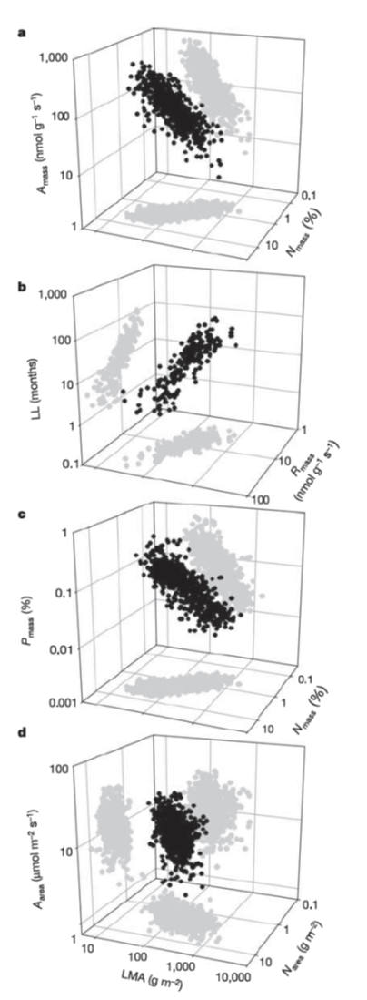
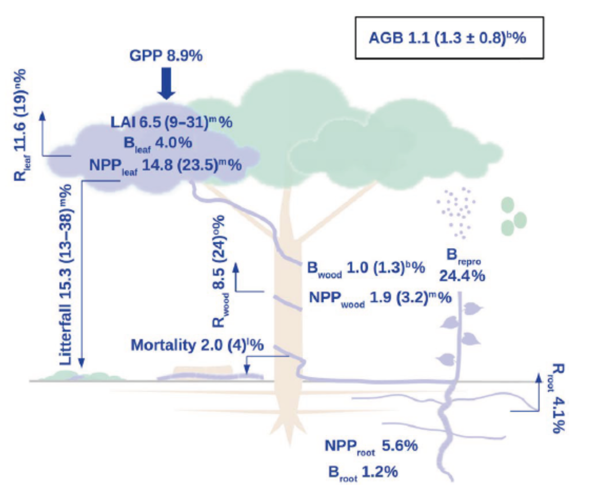

# Representing functional biodiversity in vegetation models
\chaptermark{Dynamics}
<!-- Not in UCL -->

## Introduction

This chapter wil focus on the biodiversity perspective of vegetation models. The first question to address is: why do we want to represent biodiversity in vegetation models? Some initial reasons why biodiversity is key:
- From a conservation perspective it is hey to have the ability to simulate species abundance
- Ecosystem resilience is depending on its diversity
- Species composition is impacting biogeochemical feedbacks to the atmosphere. 

In this chapter, the main question to address is: **How to represent biodiversity in vegetation models?** This question can be translated into two subquestions:
- How do we parameterize PFTs? (in the different types of models described in chapter 6) – Wich parameters can we add to PFTs to represent different types of biodiversity.
- Do we really need these PFTs? Are there any alternatives? 

## Functional diversity

Diversity can be studied from multiple perspectives. In this chapter, the focus will be on tree species diversity (as trees are the dominant growth form in forests). For example, for many temperate forests in Europe, the dominant PFT are beech trees; for most model applications it is unnecessary to consider the small understory plants in beech forests. However, for highly diverse systems, like tropical forests, it is much more complicated to represent tree species diversity in a model.

There are at least 400.000 plant species in the world. Figure \@ref(fig:f71) shows the species number per ecoregion. It is possible to identify biodiversity “hot spots” in tropical and mountain areas on the map. It is estimated that 50.000 tree species exist globally in tropical forests. However, the diversity is quite different between the continents, with fewer tree species in Africa and a very limited amount of tree species overlapping between the tropical continents. Region specific parameterization for global vegetation models in the tropics is a topic is ongoing research in modelling, because most current vegetation models assume the same parameterization and PFTs in the Amazon and Congo Basin for example.

```{r f71, fig.cap='Estimated vascular plant species richness per ecoregion (Kier et al. 2005)', out.width='80%', fig.asp=.75, fig.align='center',echo=FALSE}
knitr::include_graphics('figures/chap7/f71_species_map_Kier.png')
```

It is clear that is not possible to simulate a specific parameterization for every single tree species on Earth. Therefore, we focus on the **dominant species** (trees) and we abandon the taxonomic framework and pass to a functional framework – grouping species into functional groups. In such a functional approach we are not interested in the number of species but in how functionally diverse the forest is. In a funct framework we describe trees not by their taxonomy but by their functional properties, the so-called functional traits.

In other words, **functional diversity** refers to those components of biodiversity that influence how an ecosystem operates or functions. The biological diversity, or biodiversity, of a habitat is much broader and includes all the species living in a site, all of the genotypic and phenotypic variation within each species, and all the spatial and temporal variability in the communities and ecosystems that these species form. Functional diversity, which is a subset of this, is measured by the values and range in the values, for the species present in an ecosystem, of those **organismal traits that influence one or more aspects of the functioning of an ecosystem**. Functional diversity is of ecological importance because it, by definition, is the component of diversity that influences ecosystem dynamics, stability, productivity, nutrient balance, and other aspects of ecosystem functioning (Tilman 2001).

A **functional trait** is any morphological, physiological or phenological feature measurable at the individual level, from the cell to the whole-organism level, without reference to the environment or any other level of organization. It is functional if it affects fitness indirectly via its effects on growth, reproduction and survival (Figure \@ref(fig:f72)).

```{r f72, fig.cap='Arnold’s (1983) framework revisited in a plant ecology perspective. Morpho-physio-phenological (M-P-P) traits (from 1 to k) modulate one or all three performance traits (vegetative biomass, reproductive output and plant survival) which determine plant performance and, in fine, its individual fitness. M-P-P traits may be inter-related (dashed double-arrows). For clarity, interrelations among performance traits and feedbacks between performance and M-P-P traits are not represented. (Violle et al. 2007)', out.width='80%', fig.asp=.75, fig.align='center',echo=FALSE}
knitr::include_graphics('figures/chap7/f72_violle.png')
```

Important to note that not all plant traits can be defined as functional. Plant proprieties can be measured at different scales: individual, population, community, and ecosystem-level (Figure \@ref(fig:f73)). This course mainly focuses on individual traits, measured in individual plants, which can impact higher scale levels.

```{r f73, fig.cap='Pathways linking the challenge of interest of different organizational levels, through their related inherent components, to some examples of traits found in the literature. Without trait-based information, scaling-up to higher organizational levels needs complex integration information (I). Thus fitness components of an individual determine the components of the finite rate of increase (lambda) of the population (Ii-p). Occurrence and frequency of species at the community level encompass components of lambda through complex integration (e.g. biotic interactions) (Ip-c). Finally, scaling-up to ecosystem properties can be done by combining functional property of each species of the community (Ic-e). Using traits as proxies of a process at a particular organizational level can sometimes be done without such integration function. For example, at the ecosystem level, ecosystem productivity (one component of ecosystem functioning) shows a strong positive relationship with plant height (an effect trait) (Saugier et al. 2001; Violle et al. 2007)', out.width='80%', fig.asp=.75, fig.align='center',echo=FALSE}

```

### Trait correlations reflect plant strategy

Certain trait combinations have proven to be successful during evolution. For example, leaves with high nitrogen content are mostly leaves with a high specific leaf area (and the opposite is true as well). In contrast, very tick leaves with high nitrogen content are very uncommon; this combination was not successful during evolution. At the leaf level, we call this spectrum of treai combinations the **leaf economics spectrum (LES)** (Figures \@ref(fig:f74) and \@ref(fig:f75)) – a spectrum of trade combinations that have proven successful and represent a plant strategy.
- At one site of the spectrum we find leaves with high photosynthetic rates, high nitrogen content and very thin leaves – short lifetime.
- At the other end of the spectrum we find leaves that invested more in the structure but with lower photosynthetic rates and nutrients content – longer lifetime.

```{r f74, fig.cap='Illustration of the leaf economics spectrum.', out.width='80%', fig.asp=.75, fig.align='center',echo=FALSE}

```

The LES can also be related to growth and plant strategies: for example nitrogen conservative versus nitrogen spending plants. If we want to simulate different groups of species the LES offers an interesting framework, we can consider pioneer trees that grow fast and have leaves situated at the fast return on investment side, and we can have late successionial trees with leaves situated at the slow return on investment side of the LES.

```{r f75, fig.cap='The leaf economic spectrum. Three-way trait relationships among six leaf traits with reference to LMA (leaf mass per area), one of the key traits in the leaf economics spectrum. The direction of the data cloud in three-dimensional space can be ascertained from the shadows projected on the floor and walls of the three-dimensional space. Sample sizes for three-way relationships are necessarily a subset of those for each of the bivariate relationships. a) Amass, LMA and Nmass; 706 species. b) LL, Rmass and LMA; 217 species. c) Nmass, Pmass and LMA; 733 species. d) Aarea, LMA and Narea; 706 species. (Wright et al. 2004)', out.width='40%', fig.asp=.75, fig.align='center',echo=FALSE}

```

In parallel to the LES a similar spectrum was developed for wood trait correlations (Chave et al. 2009), the **wood economics spectrum (WES)** – representing correlations between wood proprieties and plant strategies (Figure \@ref(fig:f76)). Her trees with low wood density are typically fast growing pioneer trees and and trees with high wood density are typically slow growing late successional trees. Years after, Diaz et al. (2015) integrated various plant traits (including leaf, wood, seed and whole plat traits) into the **plant economics spectrum (PES)** – woody and not woody species can be clearly separated in this analysis (Figure \@ref(fig:f77)). The correlations described by these economic spectra are very useful to vegetation modellers because it helps to define plant functional types in a more constrained way.

```{r f76, fig.cap='Illustration of the wood economics spectrum. Relationship between wood density and relative growth rate (log-transformed, a), and mortality rate (log-transformed, b), for two tropical forest sites (Barro Colorado Island, Panama, white circles, and Pasoh, Malaysia, black circles). All correlations were highly significant (P < 0.001), and the correlation coefficients ranged between r2 = 0.13 and 0.19. Demographic data were collected from saplings 1–5 cm in diameter. (Chave et al. 2009).', out.width='80%', fig.asp=.75, fig.align='center',echo=FALSE}

```

```{r f77, fig.cap='The global spectrum of plant form and function. a, Projection of global vascular plant species (dots) on the plane defined by principal component axes (PC) 1 and 2 (based on PCA of gloabl trait data). Solid arrows indicate direction and weighing of vectors representing the six traits considered; icons illustrate low and high extremes of each trait vector. Circled numbers indicate approximate position of extreme poles of whole-plant specialization, illustrated by typical species. The colour gradient indicates regions of highest (red) to lowest (white) occurrence probability of species in the trait space defined by PC1 and PC2, with contour lines indicating 0.5, 0.95 and 0.99 quantiles. Red regions falling within the limits of the 0.50 occurrence probability correspond to the functional hotspots. b, c, location of different growth-forms (b) and major taxa (c) in the global spectrum. (Diaz et al. 2015).', out.width='80%', fig.asp=.75, fig.align='center',echo=FALSE}
knitr::include_graphics('figures/chap7/f77_PES.png')
```

### Environmental (trait) filtering

The principle of Environmental filtering describes how species abundance is determined by the environment and is illustrated in Figure \@ref(fig:f78). In relation to other community assembly processes species abundance changes across an environmental gradient, because certain environmental factors will constrain for some plants with certain proprieties/traits. In the end certain traits combinantions are ‘filtered’ by a combination of environmental factors (climate, soil, disturbance, topography and biotic interactions). I other words, there are different possible reasons why a plant (species) does not occur at a specific location: the abiotic site conditions, distance from the seed source, local competitors, … 


```{r f78, fig.cap='Environmental filtering in relation to other community assembly processes in the context of species abundance changes across an environmental gradient. Firstly, a species may be absent from a focal site on the gradient because of dispersal limitation. Next, environmental filtering (sensu stricto) occurs when a species arrives at a focal site but fails to establish or persist with neighbours removed. Competitive exclusion occurs when a species arrives and can persist in the absence of neighbours but not in their presence. Finally, at a different focal site, within‐site abiotic heterogeneity (not typically defined as environmental filtering) can contribute to the ability of community members to persist locally. Note that in this hypothetical example, the observed pattern of species abundance shifts across the gradient emerges from the combined action of all four processes. (Kraft et al. 2015).', out.width='80%', fig.asp=.75, fig.align='center',echo=FALSE}
knitr::include_graphics('figures/chap7/f78_kraft_filtering.png')
```

### TRY global plant trait database

To be able to parameterize PFTs globally, plant trait data are essential. Various efforts have been done in the past two decades to synthesize global plant trait databases. The most extended and most important one is the TRY database. Thousands of scientists around the world have been contributing millions of trait data values to TRY in the past years. Figure \@ref(fig:f79) shows gives an overview of the geographical representativeness of the current TRY database 5.0 (2020). It shows that that some regions, for example the Congo Basin, still have a considerable gap in the proportion of species covered by TRY 5.0 represented in that area, while others (e.g. Europe) have a really good coverage.

```{r f79, fig.cap='Geographic representativeness of the TRY database: (a) the number of species with at least one trait measurement in an ecoregion in TRY version 5; (b) number of species per ecoregion estimated by Kier et al. (2005); (c) fraction of species represented in TRY version 5 versus number of species per ecoregion estimated by Kier et al. (2005). (Kattge et al. 2020)', out.width='60%', fig.asp=.75, fig.align='center',echo=FALSE}

```

From the TRY database it is possible to derive trait frequency distributions (Figure \@ref(fig:f710)). Which are key to parameterize vegetation models and their PFTs. The Figure \@ref(fig:f710)c shows for example the specific leaf area (SLA) distribution for Pinus sylvestris compared to all needlleleaves trees and to all plants growing in natural environments. While Figure \@ref(fig:f711) shows the SLA distrubutions for various PFTs compared to the actual values used in a number of global vegetation models (in red).
The analysis of the TRY database has also shown that some of for some traits the global variation can be well explained by the PFT factor (illustrating the strength of the PFT approach), while for other traits the PFT factor only explains a very limited part of the global variation (illustrating the limitations of a PFT approach).

```{r f710, fig.cap='Examples of trait frequency distributions for four ecologically relevant traits in the first version of the TRY database. Upper panels: (a) seed mass and (b) plant height for all data and three major plant growth forms (white, all database entries; light grey, herbs/grasses; dark grey, trees; black, shrubs). Rug-plots provide data ranges hidden by overlapping histograms. Lower panels: (c) Specific leaf area (SLA) and (d) leaf nitrogen content per dry mass [Nm, white, all database entries excluding outliers (including experimental conditions); light grey, database entries from natural environment (excluding experimental conditions); medium grey, growth form trees; dark grey, PFT needle-leaved evergreen; black, Pinus sylvestris]. (Kattge et al. 2011)', out.width='80%', fig.asp=.75, fig.align='center',echo=FALSE}
knitr::include_graphics('figures/chap7/f710_try_distr.png')
```

```{r f711, fig.cap='Frequency distributions of specific leaf area (SLA, mm2 mg-1) values (grey histograms) compiled in the TRY database and parameter values for SLA (red dashes) published in the context of the following global vegetation models: Frankfurt Biosphere Model (Ludeke et al., 1994; Kohlmaier et al., 1997), SCM (Friend and Cox, 1995), HRBM (Kaduk and Heimann, 1996), IBIS (Foley et al., 1996; Kucharik et al., 2000), Hybrid (Friend et al., 1997), BIOME-BGC (White et al., 2000), ED (Moorcroft et al., 2001), LPJ-GUESS (Smith et al., 2001), LPJDGVM (Sitch et al., 2003), LSM (Bonan et al., 2003), SEIB–DGVM (Sato et al., 2007). n, number of SLA data in the TRY database version 1 per PFT.(Kattge et al. 2011)', out.width='80%', fig.asp=.75, fig.align='center',echo=FALSE}

```


## Representing 400.000 plant species in a single model: the PFT approach

To represent the dominant plant species in a  vegetation model, the scientific community had soon adopted the PFT approach based on the functional framework described above. Both area-based and demographic models group species into broader functional groups, but the actual meaning of a PFT differs amonf model types. Moreover the PFT has evolved over time both conceptually and in the way they are paramerized (Figure \@ref(fig:f712)). PFTs have evolved from fixed parameterizations (constant parameter values) to more variable (in space and time) parameterizations. 

```{r f712, fig.cap='A conceptual diagram showing critical aspects of PFT classification, remote sensing, trait databases and methods of PFT parameterization that will be important as DGVMs develop into the future.(Wullschleger et al. 2014)', out.width='80%', fig.asp=.75, fig.align='center',echo=FALSE}
knitr::include_graphics('figures/chap7/f712_pft_wullschleger.png')
```

### PFTs in area-based models

Area-based models group plant (ecosystem) types by responses to resources and climate. They are essentially a simplification based on biome description and plant functioning at the ecosystem level. These models typically consider 12-14 PFTs to cover the entire globe (see Figure \@ref(fig:f713) for the PFT adopted by the LPJ model). Due to this simplification global modelling is possible with a limited amount of parameters needed. To be able to global modeling the adopted PFTs are required to (i) represent the world’s most important plant types; (ii) characterize them through their functional behaviour; (iii) provide complete, geographically representative coverage of the world’s land areas. Dynamic vegetation models can simulated the PFT map (based on bioclimatic limits) or PFT mapping can be done based on remote sensing, and such maps can then be used as input for vegetation models. The first use of PFTs managed to reproduce well the large scale observed gradients at the global scale, but for current applications, it is insufficient for some approaches, especially to make future predictions.

The LPJ model is a specific example of an area-based model. LPJ model has 10 PFTs, and it is mainly distinguished based on plant physiology (C3/C4 plants), phenology (evergreen/deciduous), physiognomy (woody/herbaceous) and bioclimate (cold/heat tolerance). Figure \@ref(fig:f713) describes the bioclimatic limits of each PFT that will determine the occurence of PFTs. The problem with such an approach of bioclimatic limits is that the entire simulated ecosystem is depending on a single parameter, which makes it very hard to simulate resilience to climate variability.  

```{r f713, fig.cap='PFT bioclimatic limits in the LPJ model. Tcmin: minimum coldest temperature for survical; Tcmax: maximum coldest-month temperature for establishment; GDDmin: minimum degree-day sum (5°C base) for establishment; Twcmin: minimum warmests minus coldest month temperature range. (Sitch et al. 2003)', out.width='100%', fig.asp=.75, fig.align='center',echo=FALSE}
knitr::include_graphics('figures/chap7/f713_lpj_bioclim_table.png')
```

In addition, these PFTs are described by a handful of fixed parameter values, as shown in Figure \@ref(fig:f714), again for the LPJ model. This illustrating that with only a few values, an entire biome is defined. Such an approach inherently has limitations. Spatial variation within a biome will only be driven by climate variation, while in reality we know that there is a lot of biotic variation within a biome (e.g. within the Amazon basin forest). Also here the faith of an entire biome depends on a few fixed parameters while we know that the hy functional diversity within the biome (e.g. the Amazon rainforest) makes the system much more resilient than we will probable simulate by a single PFT.

```{r f714, fig.cap='PFT parameter values in the original LPJ model. z1 and z2 are the fraction of fine roots in the upper and lower soil layers, respectively; gmin is the minimum canopy conductance; rfire is the fire resistance; aleaf is the leaf longevity; fleaf, fsapwood, froot are the leaf, sapwood and fine root turnover times, respectively; tmort,min is the temperature base in the heat damage mortality function and Sgdd is th egrowing degree day requirement to grow full leaf coverage? (Sitch et al. 2003)', out.width='100%', fig.asp=.75, fig.align='center',echo=FALSE}

```

### PFT parameterization in demographic models

Where in area-based models PFTs are describing ‘ecosystem types’, in demographic models, PFTs are representing the function group to which an individual orcohort belongs. Within one patch multiple PFTs can compete and a functionally diverse plant community can be simulated.  Figure \@ref(fig:f715) demostrates how temperate forest species are devided into 5 functional groups (PFTs) in the ED2 model. Also here fixed parameter values are asigend to each PFT (Figure \@ref(fig:f716)).

```{r f715, fig.cap='Summary of PFTs in the ED2 model for temperate forest. (Medvigy  et al. 2009)', out.width='100%', fig.asp=.75, fig.align='center',echo=FALSE}

```

```{r f716, fig.cap='Eco-Physiological, Life-History, and Allometric Parameters for the Plant Functional Types in the ED2 model for temperate forest. (Medvigy et al. 2009)', out.width='100%', fig.asp=.75, fig.align='center',echo=FALSE}

```

### Methods to determine PFT parameters

A large part of the work of a vegetation modellers entails finding an appropriate parameterization of the PFTs. There are multiple possible approaches to determine PFT parameter values and usually a combination of these approaches is used:

1. PFT parameter values based on literature data
2. PFT parameter values based on plant trait databases (e.g. TRY) 
3. Calibration of PFT parameters, which is optimizing parameters for specific sites or regions to get a best possible fit between model outputs and observations. 
4. Data assimilation. Here PFT parameters are updated during the simulation when new data become available. 

The parameterisation of PFTs and vegetation models in general is a challenging task, because there are multiple bottlenecks:

- Model-specific parameters. Many model parameters are specific to the equiations adopted in a specific model, and are no necessarily measurable in the field or at the scale of interest. 
- Some processes are shared by all PFTs, while some processes require PFT specific equations (for example phenology of grasses versus evergreen trees versus deciduous trees).
- Parameter equifinality. Multiple parameter combinations lead to the same (good or bad) model outputs. When we try to optmise parameter values, the information content of the data might not be enough to constrain parameters. Adding additional data sources can solve that problem in some cases. 
- Interaction between PFTs. Especially in demographic models multiple PFTs are interacting which complicates parameterization.  

## Limitations of the PFT concept

The PFT concept is widely adopted, but it clearly suffers from some limitations, especially if we aim to build models that are widemy applicable, also for future projections. The limitations of the PFT concept are related to the model type.

Area-based models suffer from multiple limitations. In the first place, there is a considerable uncertainty in the land cover information we have available from remote sensing data. Secondly different PFT mapping methods (to convert a land cover map into a PFT map) give different results, so these mapping methods clearly add up to the uncertainty. Thirdly, area-based models inherently do not account for diversity with the PFT and they described the entire global plant/ecosystem diversity by only about 10 types. The latter makes the risk for dieback unrealistically large, because survical of a PFT depends on single thresholds. Moreover, landscape heterogeneity is not or poorly accounted for and the functional heterogeneity within a PFT is not represented (we know that not all boreal forest or all tropical forest are the same in reality).  

Demographic models resolve some of the above described problems and even alow to make species-specific simulations if the necessary data is available for parameterization. Howver, for species-rich system, like a tropical rainforest, this is noyt possible. Using fixed parameter values for PFTs in demographic models means that intra-species or intra-PFT trait variability is neglected, while we know that such trait plasticity is very important for ecosystem resilience. 

To overcome these limitations, vegetation modellers are using multiple strategies. A first option is to introduce more PFTs in the models or to construct ‘flexible’ PFTs that can be assigned variable trait values. Such an approach could account for plant strategies (LES, PES), trait-trait correlations and/or trait environment relationships. It is clear that all these efoorts require a large amount of trait observations in space and time. Luckly more and more of such data exist and become available to a wide research community due to initiatives like TRY.  In the next section we describe a few (recent) approaches to account for trait variability. 

## Alternative approaches to account for trait variability

In the endeavor to account for trait variability we can see three different approaches in recent years.

A first approach is to account for **plastic intra-specific trait variability**. In such an approach we account for physiological response of plants to there environment and introduce equations that ‘correct’ the standerd PFT parameter values for changing environmental conditions. Such approaches are already widely adopted in models for example to account for the temperature acclimation of photosynthesis (e.g. VCmax temperature dependency functions discussed in chapter 2). The advantage of this approach is that is relatively easily applicable in standard PFT-based models.

In a second approach we need a different type of models: **trait-based models**. In this approach we abandon the fixed trait values for each PFT. But individuals or cohorts are assigned trait values by sampling from **prescribed trait distributions**. For example all the simulated individuals for a boreal forest are assigned trait values from the available trait distributions for boreal forest in the TRY database. Such an approach can and should account for the trade-offs described in  the LES and the PES to avoid the emergence of individuals with unrealistic trait combinations. Figure \@ref(fig:f717) shows a conceptual example of an individual trait-based model. Due to the principle of assigning trait values to individuals sampled from trait distributions, traits are flexible in space and time. In this way we approximate plant adaptation to environmental conditions rather quickly. Compared to standard demograhic models with fixed PFTs, this approach avoids a demographic timel lag in adaptation. These types of models allow having a more realistic and diverse system compared to the fixed PFT-base approaches. The example of Figure \@ref(fig:f717) adopts a few principles from genetics because the model assumes a community trait pool and also mutation and crossover by creating different plant trait combinations. The model simulates a seed bank that can sample from the available trait combinations to define the new plants to grow. Such models offer a lot of potential but are so far not yet not implemented in operational global vegetation models.

```{r f717, fig.cap='Conceptual modelling framework for a next-generation dynamic global vegetation model (DGVM). Individuals are characterized by their traits that influence their carbon (C) status and phenotype. All individuals at a site form the community, which influences resources, environmental conditions and disturbances via engineering and modulating impacts. These conditions interact to influence growth of the individuals. Individuals, through reproduction, can add their traits to the community trait pool. Crossover and mutation of the community trait pool yield the community seed bank. PDF, probability density function. (Sheiter et al. 2013)', out.width='80%', fig.asp=.75, fig.align='center',echo=FALSE}

```

A third and new approach was suggested in the past two years and is based on eco-evolutionairy principles (e.g. Figure \@ref(fig:f718)). These models aim to be less depending on prescribed parameter values and more on theoretical principles. These **eco-evolutionary models** are still in the conceptual phase but offer a lot of potential. These models try to optimize the processes instead of using prescribed values. They assume different **eco-evolutionary** principles (Figure \@ref(fig:f719)). For ecophysiological processes they rely on the **optimality principle** (as briefly touched upon in chapter 2). To simulate the community composition they rely on the principle of **natural selection**. And to simulate the optimal vegetation structure they assume **self-organisation** as driving principle (cfr. the perfect plasticity approximation in chapter 6). It is however still an open question if a unifying theory exists for such models and if enough data is available to make these models operational. 

```{r f718, fig.cap='Physio–demo–genetic (PDG) models integrate physiological, demographic, and evolutionary processes. They have been developed to better understand the interplay among plasticity and genetic adaptation and the effects of both processes on tree population dynamics under global change. The advantage of PDG models is their ability to account for the variability in functional traits due to both standing genetic variation and evolutionary change in response to changing local environmental conditions. This figure shows the conceptual framework of PDGmodels. PDGmodels couple: (i) a biophysical module to simulate carbon and water fluxes at the tree level using climate observations; (ii) a forest dynamics module to calculate demographic rates for adult trees (growth, mortality, and reproduction) based on carbohydrate reserves, and to simulate ecological processes across the life cycle; and, (iii) a quantitative genetics module relating genotype to the phenotype of one or more functional traits. (Berzaghi et al. 2019)', out.width='80%', fig.asp=.75, fig.align='center',echo=FALSE}

```

```{r f719, fig.cap='Framework for the use of organizing principles in vegetation modelling. The application of organizing principles (circles) helps predict (arrows) vegetation properties (boxes). Natural selection drives the evolution of species (or plant types) and their heritable functional traits, modelled as emergent evolutionairy stable strategies. Natural selection is also the reason that phenotypic plasticity in response to environmental variation is predictable through fitness-proxy maximization (optimality). At the community level, collective self-organization among many plants results in predictable patterns of spatial structure at the stand level (for example, due to plasticity of stem angles in the perfect plasticity approximation). Self-organization influences the biotic environment, which, together with the abiotic (external) environment, feeds back on plant reproduction and survival—that is, the natural selection of community composition. Many different community compositions may be possible, and the most likely can be predicted by MaxEnt. The external environment includes abiotic factors and all other external drivers, including disturbance regimes. (Franklin et al. 2020)', out.width='80%', fig.asp=.75, fig.align='center',echo=FALSE}
knitr::include_graphics('figures/chap7/f719_franklin.png')
```

Some condluding thoughts. Based on what we described I chapter 6 and 7, we can cocluded that demographic models and trait based models in principle should allow to simulate environmental filtering via simulated feedbacks between traits – productivity- demography- survival – competition. And that the simulated vegetation community with such models will largely impact the simulated biogeochemical cycles. Such model are therefore able to simulated important feedbacks between climate, vegetation dynamics and biogeochemistry, which is essential to use vegetation models in a climate change context.

It is important to mention here that are mainly focusing on natural vegetation in this chapter. Simulating crops and managed systems is on one hand ‘simpler’ than natural systems, because we don’t have to address the challenge of simulating diversity we studying crops or monospecific forest stands. However these systems pose oter challenges for example accounting for management practices, crop rotation, fertilizer use, etc…

## Case study 7.1

The study of Sakschewski et al. (2016) tests for the Amazon forest if adding more functional diversity will increase the resilience of the simulated ecosystem (in comparison the the models discussed in chapter 6 for the Amazon dieback). Here, they use the LPJml-FIT model, a trait-based version of LPJ, which adds variability in plant proprieties and is tested for future scenarios.

The high diversity model (Figure \@ref(fig:f720), blue) still simulates a strong collapse of the Amazon forest in response to the climate scenario, but also a strong recovery. This allows concluding that if we have a more diverse system, the system can more easily recover after a severe disturbance.

```{r f720, fig.cap='Simulated rainforest biomass under climate change and different plant trait diversity. Annual biomass over 800 simulation years for 400 ha of Ecuadorian rainforest (longitude: 77.75 W; latitude: 1.25 S) from three different versions of the vegetation model LPJmL under a severe climate change scenario (RCP 8.5 HadGEM2).DeltaT: annual temperature difference to the mean temperature of pre-impact time (1971–2000) in K. (Sakschewski et al. 2016)', out.width='80%', fig.asp=.75, fig.align='center',echo=FALSE}

```


```{r f721, fig.cap='Forest height structure recovers with biomass. a, Mean biomass contribution of tree height classes for pre-, mid- and post-impact time. b, Visualization of model output showing 0.5 ha of the 400 ha of Ecuadorian rainforest in a selected year during pre-, mid-, and post-impact time, respectively (top to bottom). Different crown (stem) colours denote different SLA (WD) values of individual trees. Crown size, stem diameter and tree height are scaled by model output. Green squares indicate tree gaps covered by herbaceous plants. (Sakschewski et al. 2016)', out.width='60%', fig.asp=.75, fig.align='center',echo=FALSE}
knitr::include_graphics('figures/chap7/f721_lpjML_2.png')
```


## Case study 7.2

This study present the first vegetation model that accounts for lianas in tropical rainforest. The model allows includes a liana PFT allowing  to study the liana impact on the forest carbon cycle. The authors assess the contribution of lianas to various components of carbon balance in South America. Some key results:

- Figure \@ref(fig:f722) shows in percent the relative contribution of lianas to above-ground biomass and photosynthesis, where it was found that their contribution to biomass is relatively low (1.1%) but to photosynthesis is significant (8.9%) in old-gowth rainforest.
- Figure \@ref(fig:f723) simulates the impact of lianas on forest size distribution. In long term simulations, lianas have a clear impact on forest demography.
- Lianas are important in the first phases of succession (Figure \@ref(fig:f724))
When estimate the role of lianas on the carbon cycle (Figure \@ref(fig:f725), it is clear that the impact is much larger in a young forest in Panama, compared to an old-growth forest in French Guiana.

```{r f722, fig.cap='Simulated liana contributions to forest carbon pools and fluxes for the Paracou site in French Guiana, with observed liana contributions in parentheses. B, biomass; GPP, gross primary productivity; NEE, net ecosystem exchange (negative values mean carbon uptake); NPP, net primary productivity; R, respiration. (di Porcia et al. 2019) ', out.width='80%', fig.asp=.75, fig.align='center',echo=FALSE}

```

```{r f723, fig.cap='Forest demographic composition for two simulated sites: young forest in Gigante, Panama (a–b–c), and old growth forest in Paracou, French Guiana (d–e–f). Panels (a) and (d) show a representative area of modeled forest of 1 ha. To visualize the forest composition, the forest is decomposed into patches according to their simulated relative area, and the three cohort densities and sizes are preserved (as well as the liana tree tracking). Panels (b–c) and (e–f) compare the basal area distributions of liana and tree PFTs, respectively, as observed locally (black) or simulated according by ED2 (shades of blue and green). Tree basal area values (panels c and f) are compared for the simulations with (solid bars) or without (hatched bars) lianas. Σ represents the total basal area according to the model (blue or green) and field observations (black). Error bars represent the standard deviation of the different plot measurements (smaller error bars correspond to more homogeneous plots). The K–Sstat is the test statistic of the two‐sample Kolmogorov–Smirnov test between the observed and simulated size distributions (with a sampling size of 250 for each distribution). Liana basal area in Gigante was the only case in which the observed and simulated distribution did not significantly differ. (di Porcia et al. 2019)', out.width='80%', fig.asp=.75, fig.align='center',echo=FALSE}
knitr::include_graphics('figures/chap7/f723_porcia2.png')
```

```{r f724, fig.cap='Comparison of simulations of forest succession with (solid lines) and without (dashed lines) lianas. The upper graphs (a–c–e) show the aboveground biomass (AGB), while the bottom graphs (b–d–f) represent LAI as a function of time for one patch (a–d) and for the forest aggregate (b–c–e–f). The gray zones represent the period during which the model outputs were averaged for all other plots (corresponding to the approximate stand age of the forest sites). The increases in LAI are caused by the crossing of the reproductive thresholds for the different plant functional types (PFTs). (di Porcia et al. 2019)', out.width='80%', fig.asp=.75, fig.align='center',echo=FALSE}

```

```{r f725, fig.cap='Relative changes in carbon pools and fluxes for Paracou, French Guiana (brown), and Gigante, Panama (yellow), upon inclusion of the liana plant functional type in the simulations (by comparing a simulation with and without the liana PFT). B, biomass; GPP, gross primary productivity; NPP, net primary productivity; R, respiration. (di Porcia et al. 2019)', out.width='80%', fig.asp=.75, fig.align='center',echo=FALSE}
knitr::include_graphics('figures/chap7/f725_porcia4.png')
```

