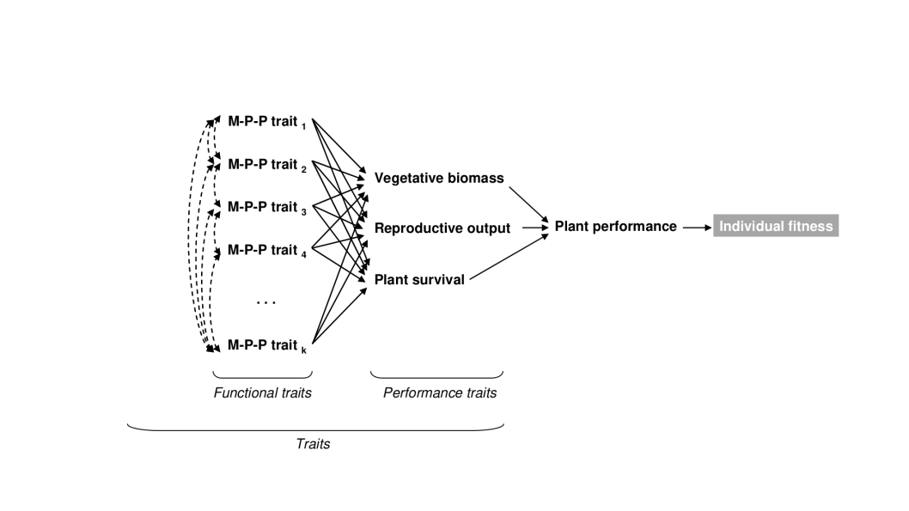

# Representing biodiversity in vegetation models
\chaptermark{Biodiversity}

## Why and how representing biodiversity in vegetation models?  
We can start with the applications? I think it is more interesting than finishing with the applications. 
Application: Conservation, ecosystem resilience, vegetation-atmosphere feedbacks

Biodiversity refers here to functional diversity. 

## Functional diversity
- check the book " Terrestrial Ecosystems in a changing world" from P. Canadell (2007)
- Part C: Landscapes under changing disturbance regimes:
    - PFT
    - Fire and disturbances
    - upscalling
    - construction, evaluation and examples of DGVM applications
    
### Definition of funcional diversity and plant functional traits
Any morphological, physiological or phenological feature measurable at the individual level, from the cell to the whole-organism level, without reference to the environment or any other level of organization. 
It is functional if it affects fitness indirectly via its effects on growth, reproduction and survival.

- Seminal papers from the plant functional trait community Violle 2007, Lavorel, garnier, Shipley, etc...

```{r figViolle, fig.cap='Functional diversity', echo=FALSE, message=FALSE, warning=FALSE}

```
- Mention here the interesting summer school: http://www.cef-cfr.ca/index.php?n=MEmbres.AlisonMunsonPlantTraits?userlang=en
- List of reference papers in the link above
- 3 types of traits: dynamic, response & constant, that are linked to the processes we studied in the previous chapter (slow/fast processes)

### Representing 400 000 plant species in a single model: the Plant Functional Type approach
Short description in UCL 4.3.2  
No description in Bonan

- Lack of observations for every species
- Computing resources problem (refers to the history of DGVMs from the introduction)
- A simplification based on biome description and plant functionning at the ecosystem level 
- Different definitions of PFT: statistical classification, etc.
- Table of classical PFTs used in models here. 
- PFT mapping: multi-obs approach based on remote sensing. 
- First use of PFTs managed to reproduce well the gradients at the global scale, but now it is unsuficcient. 


### Limits of the PFT representation in the context of global change
- Including acclimation and adaptation processes
- Dynamic vegetation: Accounting for non-random species turnover
- Quantifying vegetation-environment feedbacks
- Quantifying impacts of biodiversity on ecosytem functioning and climate

### From model parameters to plant traits
- Reconciliating modelling with functional ecology. 
- Existing databases (TRY)
- Empirical approach: More PFTs with traits instead of model-specific parameters, trait-trait, trait-environment relationships
- Trade-offs: modeling plant strategies --> LES, PES, RES, all the ES :D
- Role of data assimilation in regions without data and to assess spatial variability of vegetation properties
- But: requires lots of observations in space and time. 

### Eco-evolutive optimality approaches
- New generation of models 
- PPA, coordination, ect... 
- Paper from Oskar. 

<!-- _____________________ COMPETITION MODELS ________________________ -->
## Competition models
**!!! Redundancy with Chapter 6 !!!**
Not in Bonan nor UCL  
In Bonan Chapter 19 on demography, gap models, etc... which is a part of competition. 

### Representation of PFTs in vegetation models
- Parameterization and calibration of PFTs--> data assimilation, traits, model-specific parameters
- representation by pixels
- shared processes, different processes
- interaction between PFTs
- Depend on the model: individual/cohort/big leaf

### Competition for ressources / Plant strategy? 
- In fact we can extend the trait based approach and plant strategy (PES, etc) 
in the competition and community section? 
- Mortality, turnover, etc..

### Representation of trait distributions 
- Trade-offs

<!-- _____________________ COMMUNITIES ________________________ -->
## Communities
- Successions and impact on cycles, species composition etc. 

## What about crops? 
- Not our focus but we don't forget it. A few words to say that specific crop models exists
- Diversity is not a problem anymore
- Plant functional traits are still central to crop modelling, but competition and diversity are no more an issue. 
- Other problematics specific to agriculture, such as agro-ecosystems where we have multi layers of vegetation (Trees over crops) --> Very interesting modelling problem and application especially in arid/semi-arid and tropical regions

