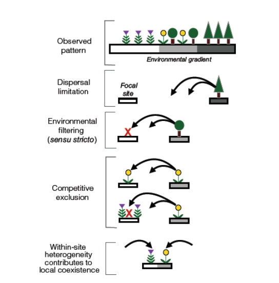

# Representing functional biodiversity in vegetation models
\chaptermark{Dynamics}
<!-- Not in UCL -->

## Introduction


## Functional diversity

```{r f71, fig.cap='Estimated vascular plant species richness per ecoregion (Kier et al. 2005)', out.width='80%', fig.asp=.75, fig.align='center',echo=FALSE}

```


```{r f72, fig.cap='Arnold’s (1983) framework revisited in a plant ecology perspective. Morpho-physio-phenological (M-P-P) traits (from 1 to k) modulate one or all three performance traits (vegetative biomass, reproductive output and plant survival) which determine plant performance and, in fine, its individual fitness. M-P-P traits may be inter-related (dashed double-arrows). For clarity, interrelations among performance traits and feedbacks between performance and M-P-P traits are not represented. (Violle et al. 2007)', out.width='80%', fig.asp=.75, fig.align='center',echo=FALSE}

```

Any morphological, physiological or phenological feature measurable at the individual level, from the cell to the whole-organism level, without reference to the environment or any other level of organization. 
It is functional if it affects fitness indirectly via its effects on growth, reproduction and survival.


```{r f73, fig.cap='Pathways linking the challenge of interest of different organizational levels, through their related inherent components, to some examples of traits found in the literature. Without trait-based information, scaling-up to higher organizational levels needs complex integration information (I). Thus fitness components of an individual determine the components of the finite rate of increase (lambda) of the population (Ii-p). Occurrence and frequency of species at the community level encompass components of lambda through complex integration (e.g. biotic interactions) (Ip-c). Finally, scaling-up to ecosystem properties can be done by combining functional property of each species of the community (Ic-e). Using traits as proxies of a process at a particular organizational level can sometimes be done without such integration function. For example, at the ecosystem level, ecosystem productivity (one component of ecosystem functioning) shows a strong positive relationship with plant height (an effect trait) (Saugier et al. 2001; Violle et al. 2007)', out.width='80%', fig.asp=.75, fig.align='center',echo=FALSE}
knitr::include_graphics('figures/chap7/f73_violle2.png')
```

```{r f74, fig.cap='Illustration of the leaf economics spectrum.', out.width='80%', fig.asp=.75, fig.align='center',echo=FALSE}
knitr::include_graphics('figures/chap7/f74_LES.png')
```

```{r f75, fig.cap='The leaf economic spectrum. Three-way trait relationships among six leaf traits with reference to LMA (leaf mass per area), one of the key traits in the leaf economics spectrum. The direction of the data cloud in three-dimensional space can be ascertained from the shadows projected on the floor and walls of the three-dimensional space. Sample sizes for three-way relationships are necessarily a subset of those for each of the bivariate relationships. a) Amass, LMA and Nmass; 706 species. b) LL, Rmass and LMA; 217 species. c) Nmass, Pmass and LMA; 733 species. d) Aarea, LMA and Narea; 706 species. (Wright et al. 2004)', out.width='80%', fig.asp=.75, fig.align='center',echo=FALSE}
knitr::include_graphics('figures/chap7/f75_LES_wright.png')
```

```{r f76, fig.cap='Illustration of the wood economics spectrum. Relationship between wood density and relative growth rate (log-transformed, a), and mortality rate (log-transformed, b), for two tropical forest sites (Barro Colorado Island, Panama, white circles, and Pasoh, Malaysia, black circles). All correlations were highly significant (P < 0.001), and the correlation coefficients ranged between r2 = 0.13 and 0.19. Demographic data were collected from saplings 1–5 cm in diameter. (Chave et al. 2009).', out.width='80%', fig.asp=.75, fig.align='center',echo=FALSE}
knitr::include_graphics('figures/chap7/f76_WES.png')
```

```{r f77, fig.cap='The global spectrum of plant form and function. a, Projection of global vascular plant species (dots) on the plane defined by principal component axes (PC) 1 and 2 (based on PCA of gloabl trait data). Solid arrows indicate direction and weighing of vectors representing the six traits considered; icons illustrate low and high extremes of each trait vector. Circled numbers indicate approximate position of extreme poles of whole-plant specialization, illustrated by typical species. The colour gradient indicates regions of highest (red) to lowest (white) occurrence probability of species in the trait space defined by PC1 and PC2, with contour lines indicating 0.5, 0.95 and 0.99 quantiles. Red regions falling within the limits of the 0.50 occurrence probability correspond to the functional hotspots. b, c, location of different growth-forms (b) and major taxa (c) in the global spectrum. (Diaz et al. 2015).', out.width='80%', fig.asp=.75, fig.align='center',echo=FALSE}

```

```{r f78, fig.cap='Environmental filtering in relation to other community assembly processes in the context of species abundance changes across an environmental gradient. Firstly, a species may be absent from a focal site on the gradient because of dispersal limitation. Next, environmental filtering (sensu stricto) occurs when a species arrives at a focal site but fails to establish or persist with neighbours removed. Competitive exclusion occurs when a species arrives and can persist in the absence of neighbours but not in their presence. Finally, at a different focal site, within‐site abiotic heterogeneity (not typically defined as environmental filtering) can contribute to the ability of community members to persist locally. Note that in this hypothetical example, the observed pattern of species abundance shifts across the gradient emerges from the combined action of all four processes. (Kraft et al. 2015).', out.width='80%', fig.asp=.75, fig.align='center',echo=FALSE}

```


```{r f79, fig.cap='Geographic representativeness of the TRY database: (a) the number of species with at least one trait measurement in an ecoregion in TRY version 5; (b) number of species per ecoregion estimated by Kier et al. (2005); (c) fraction of species represented in TRY version 5 versus number of species per ecoregion estimated by Kier et al. (2005). (Kattge et al. 2020)', out.width='80%', fig.asp=.75, fig.align='center',echo=FALSE}
knitr::include_graphics('figures/chap7/f79_try_kier.png')
```

```{r f710, fig.cap='Examples of trait frequency distributions for four ecologically relevant traits in the first version of the TRY database. Upper panels: (a) seed mass and (b) plant height for all data and three major plant growth forms (white, all database entries; light grey, herbs/grasses; dark grey, trees; black, shrubs). Rug-plots provide data ranges hidden by overlapping histograms. Lower panels: (c) Specific leaf area (SLA) and (d) leaf nitrogen content per dry mass [Nm, white, all database entries excluding outliers (including experimental conditions); light grey, database entries from natural environment (excluding experimental conditions); medium grey, growth form trees; dark grey, PFT needle-leaved evergreen; black, Pinus sylvestris]. (Kattge et al. 2011)', out.width='80%', fig.asp=.75, fig.align='center',echo=FALSE}

```

```{r f711, fig.cap='Frequency distributions of specific leaf area (SLA, mm2 mg-1) values (grey histograms) compiled in the TRY database and parameter values for SLA (red dashes) published in the context of the following global vegetation models: Frankfurt Biosphere Model (Ludeke et al., 1994; Kohlmaier et al., 1997), SCM (Friend and Cox, 1995), HRBM (Kaduk and Heimann, 1996), IBIS (Foley et al., 1996; Kucharik et al., 2000), Hybrid (Friend et al., 1997), BIOME-BGC (White et al., 2000), ED (Moorcroft et al., 2001), LPJ-GUESS (Smith et al., 2001), LPJDGVM (Sitch et al., 2003), LSM (Bonan et al., 2003), SEIB–DGVM (Sato et al., 2007). n, number of SLA data in the TRY database version 1 per PFT.(Kattge et al. 2011)', out.width='80%', fig.asp=.75, fig.align='center',echo=FALSE}
knitr::include_graphics('figures/chap7/f711_try_models.png')
```


## Representing 400.000 plant species in a single model: the PFT approach


```{r f712, fig.cap='A conceptual diagram showing critical aspects of PFT classification, remote sensing, trait databases and methods of PFT parameterization that will be important as DGVMs develop into the future.(Wullschleger et al. 2014)', out.width='80%', fig.asp=.75, fig.align='center',echo=FALSE}

```


```{r f713, fig.cap='PFT bioclimatic limits in the LPJ model. Tcmin: minimum coldest temperature for survical; Tcmax: maximum coldest-month temperature for establishment; GDDmin: minimum degree-day sum (5°C base) for establishment; Twcmin: minimum warmests minus coldest month temperature range. (Sitch et al. 2003)', out.width='80%', fig.asp=.75, fig.align='center',echo=FALSE}

```


```{r f714, fig.cap='PFT parameter values in the original LPJ model. z1 and z2 are the fraction of fine roots in the upper and lower soil layers, respectively; gmin is the minimum canopy conductance; rfire is the fire resistance; aleaf is the leaf longevity; fleaf, fsapwood, froot are the leaf, sapwood and fine root turnover times, respectively; tmort,min is the temperature base in the heat damage mortality function and Sgdd is th egrowing degree day requirement to grow full leaf coverage? (Sitch et al. 2003)', out.width='80%', fig.asp=.75, fig.align='center',echo=FALSE}
knitr::include_graphics('figures/chap7/f714_LPJ_pft_table.png')
```

```{r f715, fig.cap='Summary of PFTs in the ED2 model for temperate forest. (Medvigy  et al. 2009)', out.width='80%', fig.asp=.75, fig.align='center',echo=FALSE}
knitr::include_graphics('figures/chap7/f715_ed2_pft_table.png')
```

```{r f716, fig.cap='Eco-Physiological, Life-History, and Allometric Parameters for the Plant Functional Types in the ED2 model for temperate forest. (Medvigy et al. 2009)', out.width='80%', fig.asp=.75, fig.align='center',echo=FALSE}
knitr::include_graphics('figures/chap7/f716_ED2_pft_values_table.png')
```


## Limitations of the PFT concept

## Alternative approaches to account for trait variability

```{r f717, fig.cap='Conceptual modelling framework for a next-generation dynamic global vegetation model (DGVM). Individuals are characterized by their traits that influence their carbon (C) status and phenotype. All individuals at a site form the community, which influences resources, environmental conditions and disturbances via engineering and modulating impacts. These conditions interact to influence growth of the individuals. Individuals, through reproduction, can add their traits to the community trait pool. Crossover and mutation of the community trait pool yield the community seed bank. PDF, probability density function. (Sheiter et al. 2013)', out.width='80%', fig.asp=.75, fig.align='center',echo=FALSE}
knitr::include_graphics('figures/chap7/f717_aDGVM.png')
```

```{r f718, fig.cap='Physio–demo–genetic (PDG) models integrate physiological, demographic, and evolutionary processes. They have been developed to better understand the interplay among plasticity and genetic adaptation and the effects of both processes on tree population dynamics under global change. The advantage of PDG models is their ability to account for the variability in functional traits due to both standing genetic variation and evolutionary change in response to changing local environmental conditions. This figure shows the conceptual framework of PDGmodels. PDGmodels couple: (i) a biophysical module to simulate carbon and water fluxes at the tree level using climate observations; (ii) a forest dynamics module to calculate demographic rates for adult trees (growth, mortality, and reproduction) based on carbohydrate reserves, and to simulate ecological processes across the life cycle; and, (iii) a quantitative genetics module relating genotype to the phenotype of one or more functional traits. (Berzaghi et al. 2019)', out.width='80%', fig.asp=.75, fig.align='center',echo=FALSE}
knitr::include_graphics('figures/chap7/f718_berzaghi.png')
```

```{r f719, fig.cap='Framework for the use of organizing principles in vegetation modelling. The application of organizing principles (circles) helps predict (arrows) vegetation properties (boxes). Natural selection drives the evolution of species (or plant types) and their heritable functional traits, modelled as emergent evolutionairy stable strategies. Natural selection is also the reason that phenotypic plasticity in response to environmental variation is predictable through fitness-proxy maximization (optimality). At the community level, collective self-organization among many plants results in predictable patterns of spatial structure at the stand level (for example, due to plasticity of stem angles in the perfect plasticity approximation). Self-organization influences the biotic environment, which, together with the abiotic (external) environment, feeds back on plant reproduction and survival—that is, the natural selection of community composition. Many different community compositions may be possible, and the most likely can be predicted by MaxEnt. The external environment includes abiotic factors and all other external drivers, including disturbance regimes. (Franklin et al. 2020)', out.width='80%', fig.asp=.75, fig.align='center',echo=FALSE}

```


## Case study 7.1


```{r f720, fig.cap='Simulated rainforest biomass under climate change and different plant trait diversity. Annual biomass over 800 simulation years for 400 ha of Ecuadorian rainforest (longitude: 77.75 W; latitude: 1.25 S) from three different versions of the vegetation model LPJmL under a severe climate change scenario (RCP 8.5 HadGEM2).DeltaT: annual temperature difference to the mean temperature of pre-impact time (1971–2000) in K. (Sakschewski et al. 2016)', out.width='80%', fig.asp=.75, fig.align='center',echo=FALSE}
knitr::include_graphics('figures/chap7/f720_lpjML_1.png')
```


```{r f721, fig.cap='Forest height structure recovers with biomass. a, Mean biomass contribution of tree height classes for pre-, mid- and post-impact time. b, Visualization of model output showing 0.5 ha of the 400 ha of Ecuadorian rainforest in a selected year during pre-, mid-, and post-impact time, respectively (top to bottom). Different crown (stem) colours denote different SLA (WD) values of individual trees. Crown size, stem diameter and tree height are scaled by model output. Green squares indicate tree gaps covered by herbaceous plants. (Sakschewski et al. 2016)', out.width='80%', fig.asp=.75, fig.align='center',echo=FALSE}

```


## Case study 7.2

```{r f722, fig.cap='Simulated liana contributions to forest carbon pools and fluxes for the Paracou site in French Guiana, with observed liana contributions in parentheses. B, biomass; GPP, gross primary productivity; NEE, net ecosystem exchange (negative values mean carbon uptake); NPP, net primary productivity; R, respiration. (di Porcia et al. 2019) ', out.width='80%', fig.asp=.75, fig.align='center',echo=FALSE}
knitr::include_graphics('figures/chap7/f722_porcia1.png')
```

```{r f723, fig.cap='Forest demographic composition for two simulated sites: young forest in Gigante, Panama (a–b–c), and old growth forest in Paracou, French Guiana (d–e–f). Panels (a) and (d) show a representative area of modeled forest of 1 ha. To visualize the forest composition, the forest is decomposed into patches according to their simulated relative area, and the three cohort densities and sizes are preserved (as well as the liana tree tracking). Panels (b–c) and (e–f) compare the basal area distributions of liana and tree PFTs, respectively, as observed locally (black) or simulated according by ED2 (shades of blue and green). Tree basal area values (panels c and f) are compared for the simulations with (solid bars) or without (hatched bars) lianas. Σ represents the total basal area according to the model (blue or green) and field observations (black). Error bars represent the standard deviation of the different plot measurements (smaller error bars correspond to more homogeneous plots). The K–Sstat is the test statistic of the two‐sample Kolmogorov–Smirnov test between the observed and simulated size distributions (with a sampling size of 250 for each distribution). Liana basal area in Gigante was the only case in which the observed and simulated distribution did not significantly differ. (di Porcia et al. 2019)', out.width='80%', fig.asp=.75, fig.align='center',echo=FALSE}

```

```{r f724, fig.cap='Comparison of simulations of forest succession with (solid lines) and without (dashed lines) lianas. The upper graphs (a–c–e) show the aboveground biomass (AGB), while the bottom graphs (b–d–f) represent LAI as a function of time for one patch (a–d) and for the forest aggregate (b–c–e–f). The gray zones represent the period during which the model outputs were averaged for all other plots (corresponding to the approximate stand age of the forest sites). The increases in LAI are caused by the crossing of the reproductive thresholds for the different plant functional types (PFTs). (di Porcia et al. 2019)', out.width='80%', fig.asp=.75, fig.align='center',echo=FALSE}
knitr::include_graphics('figures/chap7/f724_porcia3.png')
```

```{r f725, fig.cap='Relative changes in carbon pools and fluxes for Paracou, French Guiana (brown), and Gigante, Panama (yellow), upon inclusion of the liana plant functional type in the simulations (by comparing a simulation with and without the liana PFT). B, biomass; GPP, gross primary productivity; NPP, net primary productivity; R, respiration. (di Porcia et al. 2019)', out.width='80%', fig.asp=.75, fig.align='center',echo=FALSE}
knitr::include_graphics('figures/chap7/f725_porcia4.png')
```

