# (PART) Upscaling and applications {-}

# Spatial heterogeneity, landscape scale and disturbance 
\chaptermark{Heterogeneity}

## Introduction: landscape scale

In this chapter we discuss how vegetation models can deal with spatial heterogeneity at the landscape scale and how disturbance can be accounted for. These elements are key when applying vegetation models to **large spatial and temporal scales**. We first define a few important landscape ecology terms that are relevant to have in mind when applying vegetation models at the landscape scale. 

**Landscape ecology** studies the spatial patterns and the impact of ecological processes on spatial patterns and vice-versa. Landscape ecologists try to understand the causes and consequences of **spatial heterogeneity** across spatial scales. For such processes, it is important to consider the **role of humans** changing/disturbing the landscape patterns (deforestation, land conversion). Spatial heterogeneity in the landscape depends on the abiotic factors (e.g. soil, topography, climate, etc…) and biotic heterogeneity (land cover, land use, natural disturbances), and anthropogenic disturbances. In many ecosystems (natural) disturbance helps to maintain the heterogeneity of the landscape and habitats. The **scale and resolution** are very important aspects of landscape ecology and landscape scale modelling (Fig. \@ref(fig:f81)). Heterogeneity is present at every scale. Scale and resolution need to be carefully defined based on the research questions, the objective and the available data. 

```{r f81, fig.cap='Illustration of the importance of scale in landscape ecology.', out.width='80%', fig.asp=.75, fig.align='center',echo=FALSE}
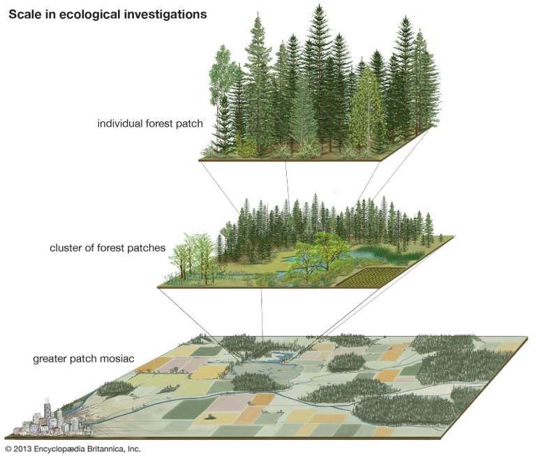
```

In vegetation models, we typically divide the landscape in homogeneous patches. Models can then be used to analyze the **patch dynamics** (Fig. \@ref(fig:f82)). In other words, we need to study the changes of landscape in terms of interacting patches, models are used to analyze:

* Spatial patterns, e.g. to study the distribution of PFTs or biomass over the patches in the landscape.
* Changes within and between patches.
* Interaction between patches (however, neglected by many vegetation models); there are many processes of interaction (e.g. via fires, seed dispersal, …)
* Metapopulations (populations of a species or PFT spread over multiple patches) and the related processes of migration, extinction or colonization of species.
* Fragmentation, edge effects, and connectivity (these aspects are important and depend on our objective of research). If we model the carbon stock is important to consider these aspects (fragmentation). For conservation studies these elements are key (see course ‘natuurbehoud’).

Most (global) vegetation models consider patch dynamics in a very aggregated way and are not spatially explicit. However, a few specific models focus on landscape dynamics explicitly. For example the PICUS model. This model is spatially explicit and it is very useful for landscape scale applications but is more difficult to apply on very large scale because it needs detailed spatial input data on soil and land cover. 

```{r f82, fig.cap='Illustration of 3 situations in landscape dynamics represented by patches on 3 time steps: a landscape in equilibrium, a landscape with patch dyanmics, an averaged landscape in steady-state but with dyanmics in de individual patches.', out.width='80%', fig.asp=.75, fig.align='center',echo=FALSE}
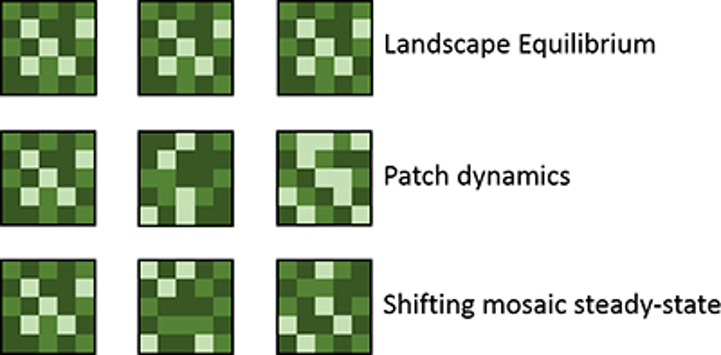
```


## Land use change
Land use change is a very important factor for vegetation modelling at large spatial scales. In most vegetation models land use change is accounted for, by using land use maps as input. The model user has the choice to simulate a static landscape based on a single land use/cover map or to have dynamic maps as model input (e.g. a land use/cover map that is updated every simulation year). Specific models exist to simulate historical or future land use change scenarios. 

There are two general categories of land-use change. They need to be accounted for in a different way in vegetation models. The first category is **extensification**, which is the expansion of land area used by people. Within this category there are two sub-categogies: (1) **Land-use conversion**, which is the change in dominant plant functional type (PFT) (e.g. forest is converted into grassland); (2) land-use modification, which is a significant change in human impact without change in PFT (e.g. introducing cattle grazing in a savanna). The second land use change category is **intensification**, which is the increase of inputs (subsidies) per unit area (e.g. intensifying the grazing of the savanna).

Large scale vegetation models are particularly suited to study the impact of land use change on various ecosystem and land surface processes. For example, in the study of Akkermans et al. 2014 (see lecture slides) a deforestation scenario for the Congo Basin was analyzed for its impact on biophysical fluxes and biogeochemistry. In this study a land surface model (CLM) was coupled to a regional climate model (COSMO), allowing to study the feedback of deforestation in the Congo Basin on the regional climate. A second example is the study of Guimberteau et al. (2017) where 3 vegetation models were used to evaluate various land use change scenarios in the Amazon basin. The 3 vegetation models had a river routing component to evaluate the impact of land use change on hydrology and river discharge. It illustrates that deforestation scenarios reduced the evapotranspiration in multiple regions in the Amazon resulting in a significant change in the Amazon river discharge rate and seasonality (especially the impact on the discharge peaks can result in important flooding). This example illustrates the power of vegetation models to use for land and river management.

## Disturbance

Natural or anthropogenic disturbance can have very large impact on ecosystem functioning and should be accounted for when applying vegetation models at large spatial scales. Disturbances can be gradual (e.g. climate change) but are very often event-based and have a stochastic nature. There are different types of disturbances: wind, fire, management, drought, herbivory, … and each of them has different characteristics and processes through which they impact ecosystem functioning. When modelling disturbance impacts it is important to consider the properties of the disturbance :

* Intensity (e.g. how intense is the forest fire, how intense is the thinning)
* Severity (e.g. how much biomass was affected)
* Frequency (e.g. how many fires per year in a region)
* Size (e.g. fraction of the landscape impacted by an insect outbreak) 
* Timing (e.g. fire in the wet or dry season will have a very different impact)

These properties are of course interrelated, for example the disturbance severity (% of organic material removed) depends on the type of disturbance (Fig \@ref(fig:f83)). For example, herbivory has in many cases a low impact while that agricultural clearing always has a larger impact.

```{r f83, fig.cap='Spectrum of disturbance severity associated with major types of disturbance, ranging from normal steady-state functioning of ecosystems to primary succession. (Chapin 2012)', out.width='80%', fig.asp=.75, fig.align='center',echo=FALSE}
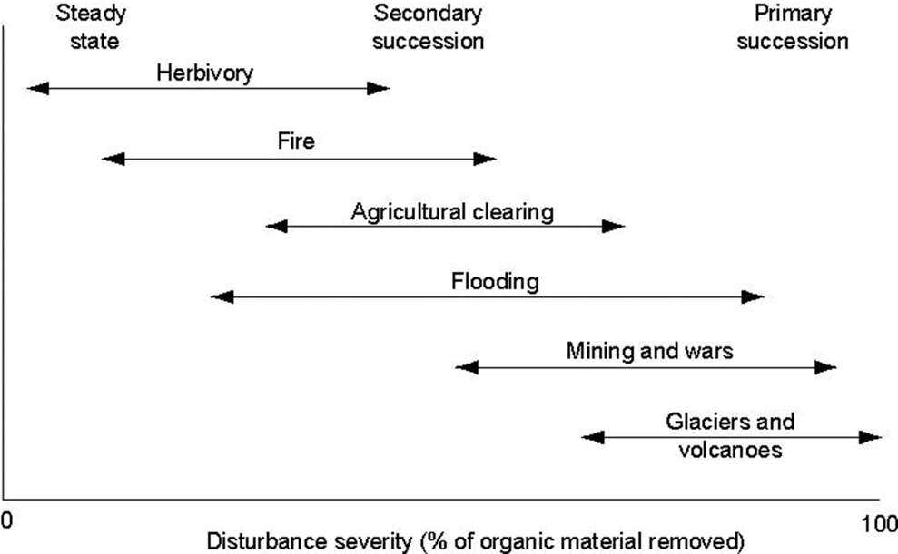
```

Vegetation models are often used to study the effect of disturbance. We know that the properties of the system and the disturbance will determine the influence the disturbance will have. In many current studies the ‘resilience’ of ecosystems is highlighted. It is however important to define multiple aspects of the influence of disturbance. In the first place there is the **resistance** of an ecosystem, which is its tendency not to change (example some forests are resistant to moderate fires). The **response** of the ecosystem is the magnitude of the change due to a perturbation. The **resilience** is defined as the rate of return of the ecosystem to its original state. While the **recovery** is the extent of return to the original state (Fig. \@ref(fig:f84)).  In the sections below, we will highlight 3 types of disturbance and how they are implemented in vegetation models: fire, herbivory and forest management. 

```{r f84, fig.cap='Properties of a system that influence its probability of changing state. The solid ball represents the state of the system after a perturbation. The open ball shows the most likely future states of the system. A, A system shows a small response to a perturbation if the perturbation is small or the system is resistant to change.B, After a perturbation, a system can assume many possible states; if it is highly resilient, it may return quickly to its original state; if it is less resilient, or if the perturbation is large, the system may move to a new state.(Chapin 2002)', out.width='80%', fig.asp=.75, fig.align='center',echo=FALSE}
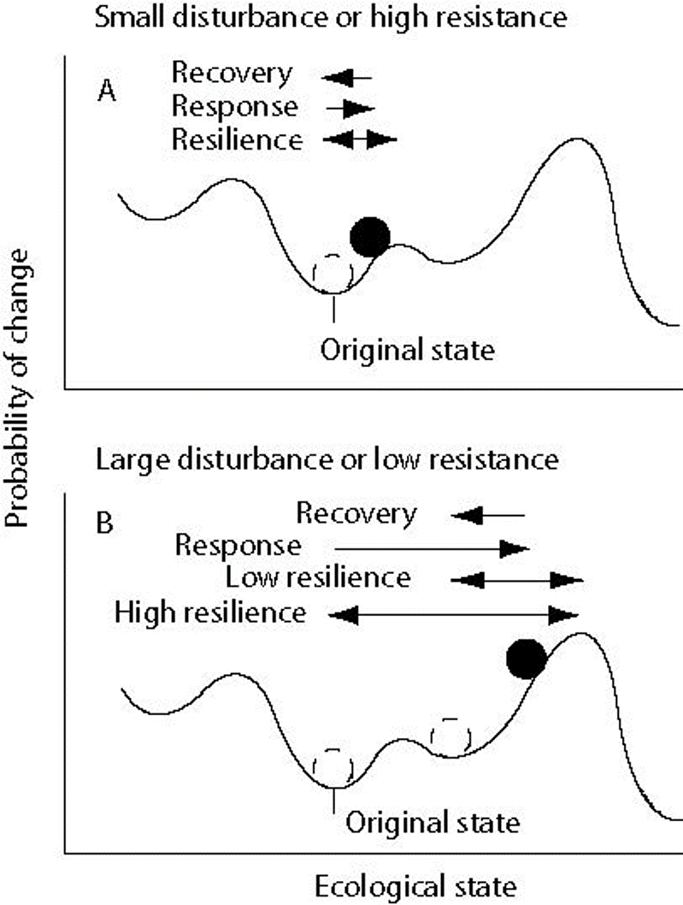
```


### Fire
Modeling of wildfires is a very specific branch of ecological modelling. It is beyond the scope of this course to go into the technical details. Therefore, we will highlight the key elements needed for fire modeling based on an example of the LPJ model. LPJ was one of the first vegetation models that included the impact of fire in a large scale vegetation model (Thonicke et al. 2001). The model assumed litter moisture as the main driver of the day-to-day vegetation fire probability (if the litter is dry, the fire probability is high). To estimate the burnt fractional area per year, they used an empirical relation with the length of the fire season. And finally, the model included a PFT parameter for fire resistance (e.g. high resistance for tropical evergreen trees and low resistance for grass PFT). This initial model was able to simulate quite well large-scale global patterns of fire occurrence and intervals. 

In the decade that followed, multiple fully-developed fire models emerged. The LPJ-spitfire model is one of them (Thonicke et al. 2010). Such models account for many processes and interactions between vegetation and climate, as illustrated by Fig. \@ref(fig:f85), and can simulate detailed spatial patterns (Fig. \@ref(fig:f86)). A process-based fire model accounts for a multitude of inputs that influence wildfires: climate, soil, PFT composition, vegetation structure and fuel (dead organic matter). The fire model itself typically consists of 3 parts:

* A module simulating the **ignition** (probability) or fire occurrence
* A module simulating the **fire spread**
* A model simulating the **fire effects/impact** on the vegetation

Each of those modules depends on multiple input factors (Fig. \@ref(fig:f85)). the outputs of such a fire model are the carbon emission by the biomass burning, other trace gas emission, the fire impact on the PFT composition, carbon pools and stand structure. Other fire models have a very similar overall structure (e.g. Fig. \@ref(fig:f87)) but differ in the details of the equations, parameter values and inputs accounted for. The burnt area is often simulated as an elliptical area starting from the point of ignition into the direction of the wind (Fig. \@ref(fig:f88)). Fire models typically rely on empirical relationships relating fire occurrence to various driving variables (Fig. \@ref(fig:f89)).

```{r f85, fig.cap='Scheme describing model features a process-based fire model for dynamic vegetation models or climate-vegetation models should consider. (Thonicke et al., 2010).', out.width='80%', fig.asp=.75, fig.align='center',echo=FALSE}
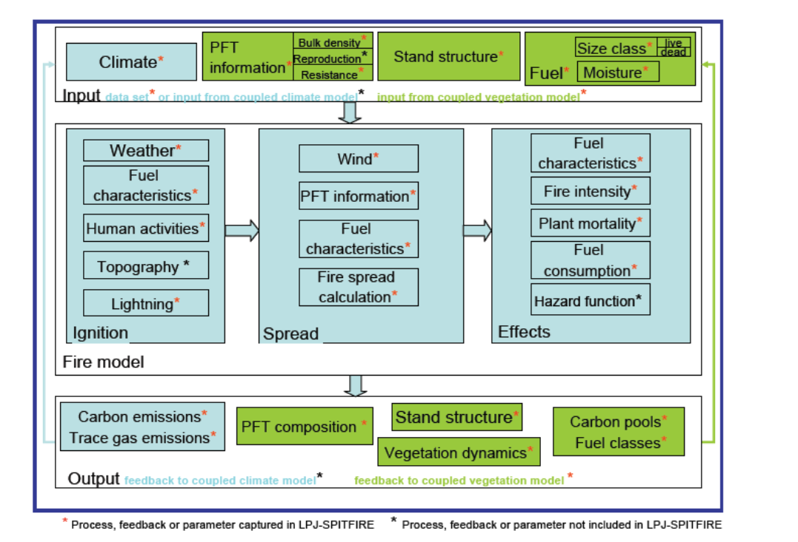
```

```{r f86, fig.cap='Simulation results of the SPITFIRE model: (a) fire danger index, (b) number of fires, (c) fractional area burnt (all as annual averages for 1982–1999). (Thonicke et al. 2010).', out.width='80%', fig.asp=.75, fig.align='center',echo=FALSE}
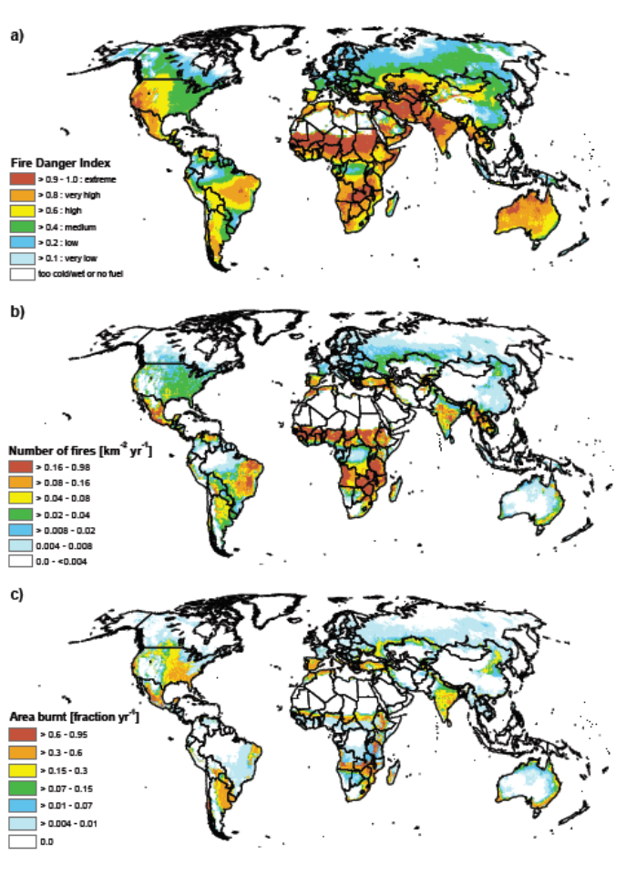
```

```{r f87, fig.cap='Structure of the fire parameterization developed for CLM by Li et al. 2012. Text boxes in yellow, red, and blue colors represent three parts in the fire module: fire occurrence, fire spread, and fire impact.', out.width='80%', fig.asp=.75, fig.align='center',echo=FALSE}
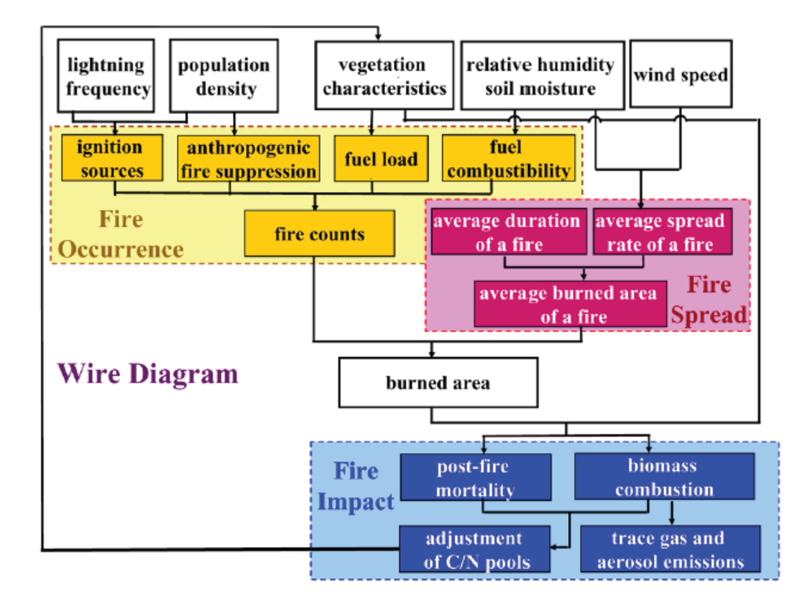
```


```{r f88, fig.cap='Conceptual elliptical fire shape that is used to estimate the burned area with the wind direction along the major axis and the point of ignition at one of the foci in the CLM model. (Li et al. 2012)', out.width='80%', fig.asp=.75, fig.align='center',echo=FALSE}
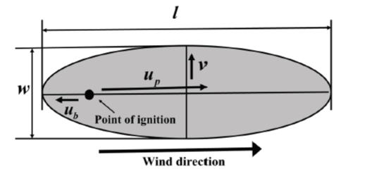
```

```{r f89, fig.cap='Dependence of fire occurrence on (a) fuel availability fb, (b) relative humidity fRH, and (c) soil wetness f(theta) in the CLM model. (Li et al. 2012)', out.width='80%', fig.asp=.75, fig.align='center',echo=FALSE}
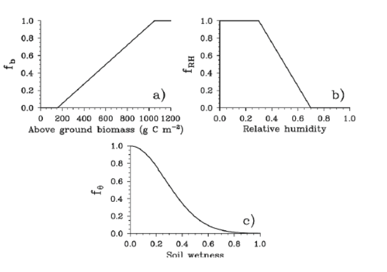
```


### Herbivory (Case study 8.1)
**Kurz, W. A., Dymond, C. C., Stinson, G., Rampley, G. J., Neilson, E. T., Carroll, A. L., ... & Safranyik, L. (2008). Mountain pine beetle and forest carbon feedback to climate change. Nature, 452(7190), 987-990.**

We illustrate the modelling of herbivory by a study on the impact of an enormous outbreak of the Mountain pine beetle, in British Columbia (CA) in 2006 (Fig. \@ref(fig:f810)). The study evaluated the impact of the outbreak on tree mortality and the carbon cycle. These impacts were estimated using the CBM-CFS3 model, which is an empirical data driven forest model. The results (Fig. \@ref(fig:f811) and \@ref(fig:f812)) indicate a very large long-term impact of the carbon stock of 279 MegaTons of carbon, turning the affected area into a large source of carbon. The study concluded that climate change contributed to the extent of the outbreak. 

```{r f810, fig.cap='Geographic extent of mountain pine beetle outbreak in North America. a, Extent (dark red) of mountain pine beetle. b, The study area includes 98% of the 2006 outbreak area. c, A photograph taken in 2006 showing an example of recent mortality: pine trees turn red in the first year after beetle kill, and grey in subsequent years. (Kurz et al. 2008) Photo credit: Joan Westfall, Entopath Management Ltd.', out.width='80%', fig.asp=.75, fig.align='center',echo=FALSE}
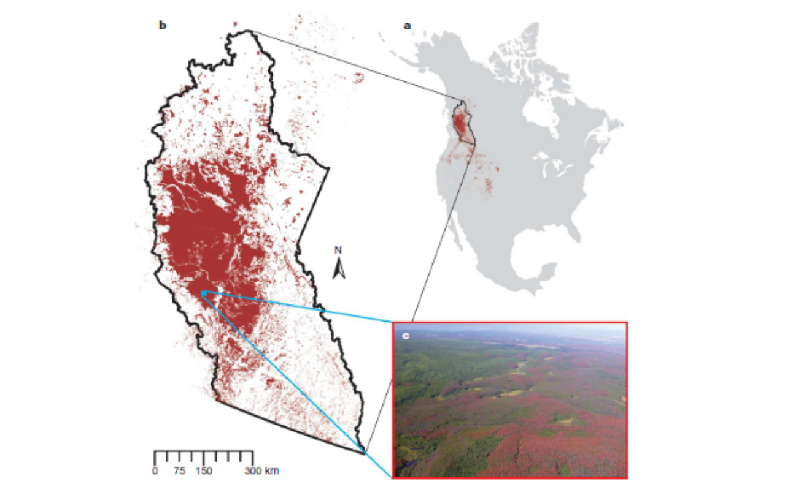
```


```{r f811, fig.cap='Area infested with the mountain pine beetle during the simulation period. Statistics are used from 2000 to 2006 and projections are used from 2007 to 2020. a, Percentiles describing the parameter space resulting from 100 Monte Carlo projections of the beetle-infested area. Our projections of decreasing area after 2009 are largely based on the decline in available live host (pine) area. b, Area statistics for the single Monte Carlo simulation used for scenario analysis broken down by host mortality class. (Kurz et al. 2008)', out.width='80%', fig.asp=.75, fig.align='center',echo=FALSE}
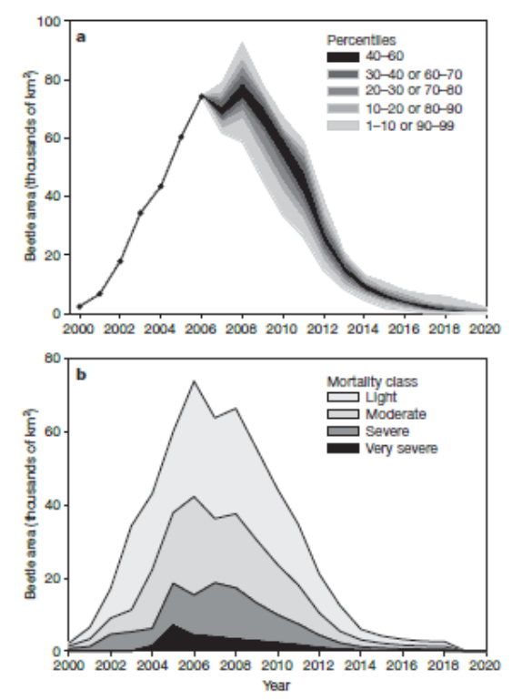
```


```{r f812, fig.cap='Total ecosystem carbon stock change for three scenarios. The control simulation was run with no beetle outbreak, and with base harvest and fires. The beetle simulation added insect impacts to the control scenario. The additional harvest simulation added the management response of increased harvest levels from 2006 to 2016 to the beetle simulation. Negative ecosystem carbon stock change values represent fluxes from the forest to the atmosphere (net source of carbon). The source in 2003 was, in part, the result of the large area burned (2,440km2 in the study area) that was included in all three scenarios.(Kurz et al. 2008)', out.width='80%', fig.asp=.75, fig.align='center',echo=FALSE}
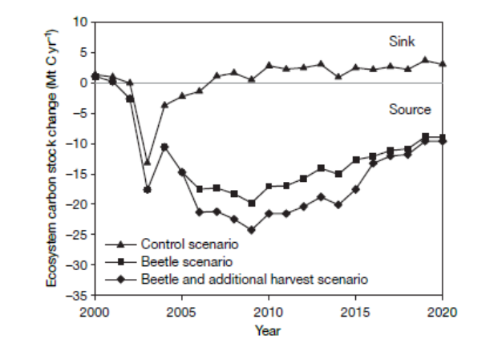
```


### Forest management
Demographic models that track individual trees or the number of trees in cohorts allow to study the impact of forest management. Management practices like thinning can be simulated by removing individuals in specific size classes, clear cuts can be simulated by changing the PFT in specific patches with a predefined rotation period, and species conversion can be simulated by introducing additional PFTs (species) in patches. These models allow then to simulate the impact of such management practices on various model variables (productivity, hydrology, etc…). The LPJ-guess model is one of these models where this is now possible (Fig. \@ref(fig:f813), \@ref(fig:f814), \@ref(fig:f815)).

```{r f813, fig.cap='Forest management in LPJguess (Lindeskog et al. 2021). Examples of age structure setup at three different structural levels, patch, stand and stand type. Beech monocultures are created from clearcut of potential natural vegetation. The target in year 2000 was three cohorts of 100, 67 and 33 years. (a) Within-patch. One secondary stand with 1 patch created in 1901. Thinnings in 1933 and 1967. Age structure depends on timing of increased light 150 and subsequent reestablishment of seedlings. (b) Among-patch. One secondary stand with 3 patches created in 1901. Clearcut in patches 2 and 3 in 1933 and 1967 (evenly spread age distribution). (c) Among-stand. Three secondary stands with 1 patch created in 1901, 1933 and 1967. Age structure from area fraction input.', out.width='80%', fig.asp=.75, fig.align='center',echo=FALSE}
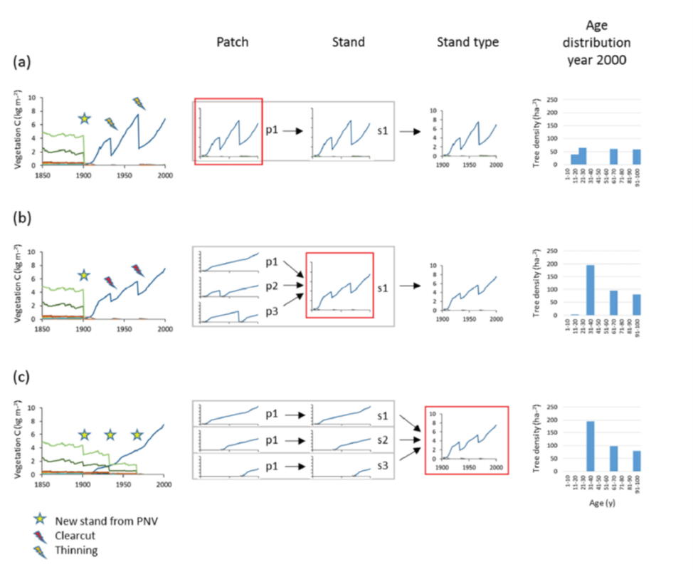
```

```{r f814, fig.cap='Example of forest management change in LPJ-GUESS (Lindeskog et al. 2021). Spruce monoculture changed to mixed broadleaved, both with automated thinning and clearcut. Management change is activated after first management has completed by a clearcut event.', out.width='80%', fig.asp=.75, fig.align='center',echo=FALSE}
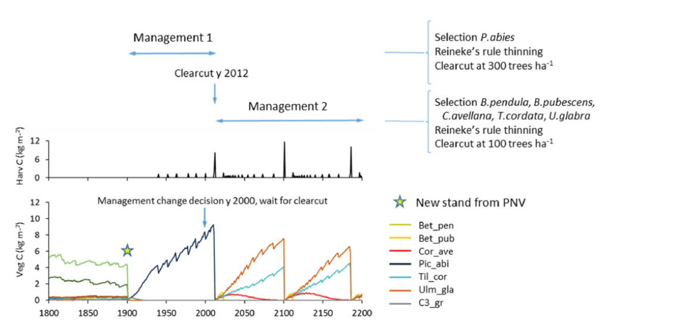
```

```{r f815, fig.cap='Simulated European forests with LPJguess including forest management (Lindeskog et al. 2021): (a) total carbon pool 2010 in a simulation with thinning, (b) total carbon pool 2010 difference between simulations with and without wood harvest in regrowth forest, (c) Mean 2001-2010 NEE (net ecosystem exchange) in a simulation with thinning, (d) Mean 2001-2010 NEE difference between simulations with and without thinning.', out.width='80%', fig.asp=.75, fig.align='center',echo=FALSE}
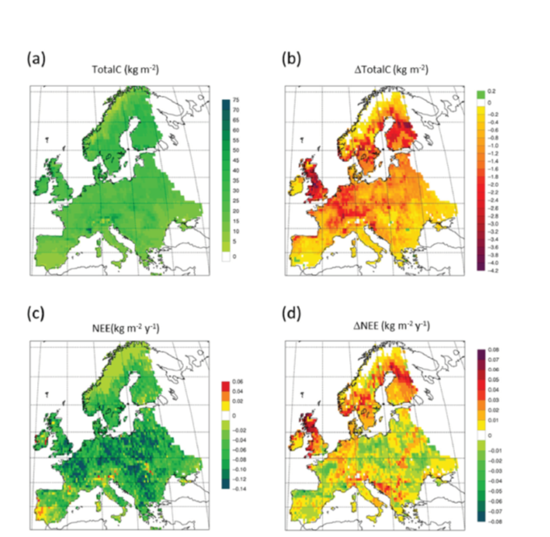
```


### Case study 8.2
**Naudts, K., Chen, Y., McGrath, M. J., Ryder, J., Valade, A., Otto, J., & Luyssaert, S. (2016). Europe’s forest management did not mitigate climate warming. Science, 351(6273), 597-600.**

In this case study, we zoom in on a study by Naudts et al. (2016) that evaluated the impact of the historical European forest management since 1750 on climate change. They used the ORCHIDEE-CAN model coupled to an atmosphere model to evaluate the effects of European forest management on climate via biogeochemical and biophysical effects and feedbacks. Since 1750 forest management changed a lot in Europe, with coniferous PFTs becoming more important and high stands replacing unmanaged or coppice forest (Fig \@ref(fig:f816)). The model simulations showed that 2.5 centuries of forests management in Europe have not cooled the climate. They show that wood extraction caused a loss 3.1 Pg C and that species conversion caused a temperature increase of 0.12 Kelvin (Fig. \@ref(fig:f817)), through albedo and energy balance effects. 

```{r f816, fig.cap='Main changes in European forest management between 1750 and 2010. (A) Relative distribution (percent) of tree growth forms in 1750 and (B) 2010. Total forest area in 1750 was 1,929,000 km2 and increased to 2,126,000 km2 by 2010. (C) Relative distribution (percent) of wood extraction strategies in 1750 and (D) 2010. (Naudts et al. 2016)', out.width='80%', fig.asp=.75, fig.align='center',echo=FALSE}
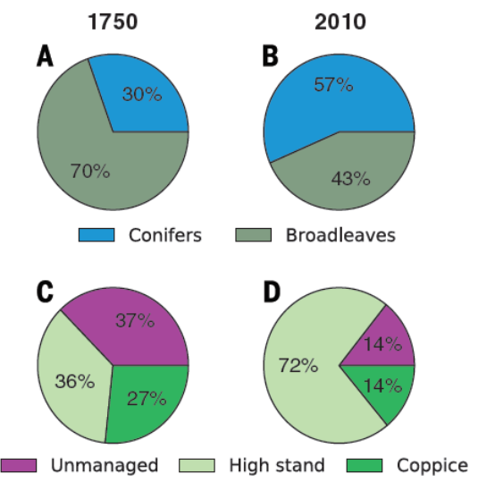
```

```{r f817, fig.cap='Effects of species conversion in Europe since 1750 as simulated by the ORCHIDEE-CAN model coupled to the LMDZ atmospheric model (Naudts et al. 2016). Temperature changes are for boundary layer temperature during summer (kelvin). (A) Temperature change due to changes in emissivity (DTa,ea) caused by species conversion, (B) changes in albedo (Da) due to species conversion, (C) total temperature change (DTa) due to species conversion, and (D) correlation between species-induced and land use–induced temperature change. In (C), black dots denote significant temperature changes at the 0.05 significance level, as determined by a modified paired one-sample t test.', out.width='80%', fig.asp=.75, fig.align='center',echo=FALSE}
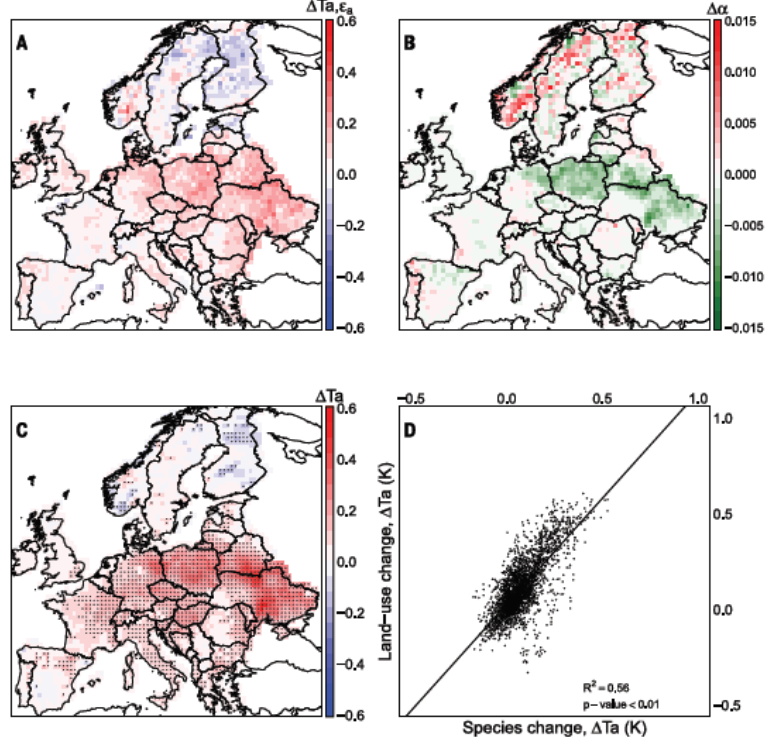
```


