# Upscaling from the leaf to the globe
\chaptermark{Globe}


## The problem of upscaling

Vegetation modelling is all about **upscaling and downscaling**. Upscaling can be defined as taking up information at smaller temporal and spatial scales and using that information to derive processes at larger spatial and longer temporal scales. In other words, upscaling is a holistic approach, which tries to integrate smaller elements of a system and synthesize them into a large-scale function. Downscaling is the opposite from upscaling. It is often used in meteorology, where for example a climate scenario from a 100 by 100 km is downscaled to a scenario for a 10 by 10 km grid cell. In vegetation modelling, downscaling can be described as the decomposing of a process happening at the large scale, in constituents at a smaller scale. By downscaling, a complex system is reduced into individual processes. For example, a vegetation model can be used to disentangle the contributions of different PFTs to the total NEE that is observed by a flux tower.
Space and timescales go hand in hand: processes that happen at a small spatial scale, are typically the processes that have their major variation at a small temporal scale. For example, carbon allocation is a slower process (compared to photosynthesis), happening at timescales of weeks to months, and also at larger spatial scales, from the whole tree to stand level (Figure \@ref(fig:f91)). 


```{r f91, fig.cap='Illustration of the correlation between the spatial and temporal scales at which various vegetation processes dominate. (Wolfgang Lucht, PIK)', out.width='80%', fig.asp=.75, fig.align='center',echo=FALSE}
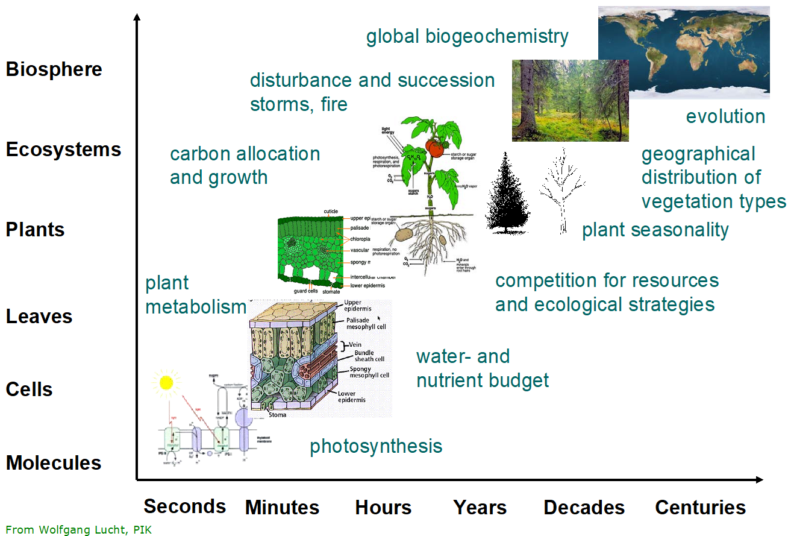
```

Figure \@ref(fig:f92) shows different possibilities of observational approaches for studying the carbon cycle, at various relevant temporal and spatial scales. Every approach covers a different temporal and spatial scale, and the strength of vegetation models is that they can integrate all these spatial and temporal scales. By linking all the scales together, the model enables a better understanding of different processes.


```{r f92, fig.cap='Illustration from the course Inventory of Forest and Nature showing the temporal and spatial scale of different carbon cycle monitoring methods and the integrative power of vegetation models.', out.width='80%', fig.asp=.75, fig.align='center',echo=FALSE}
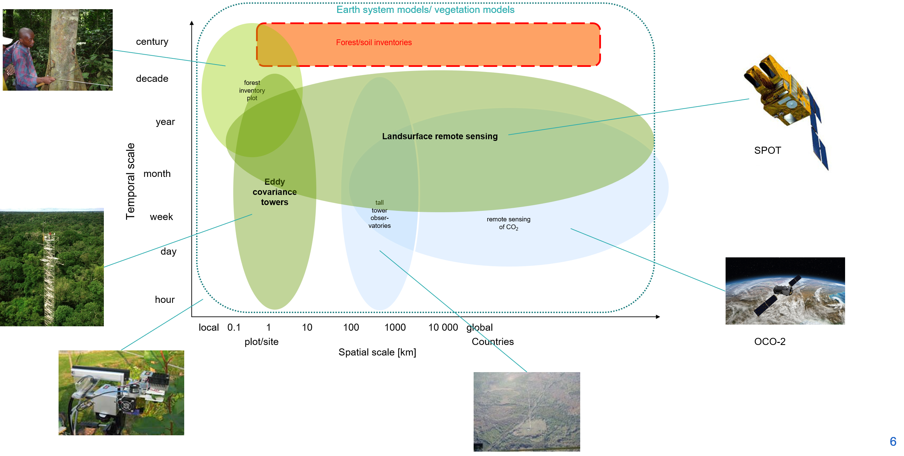
```


**Why is upscaling important?** We need upscaling to tackle global change problems. If one wants to understand how climate change will have an impact on ecosystems and plant functioning, (s)he needs upscaling. Most of the knowledge on plant functioning is collected at small scales, but without models, we would not be able to understand the impact of small-scale processes on a larger scale. Upscaling also leads to emergent properties that cannot be observed at the small scale. For example, disturbance can have a large impact at the small scale, e.g. a forest patch can be destroyed by wind or fire, but when zoomed out to a larger scale, the total area that is affected by disturbances remains more or less constant over time. 

Vegetation models are essentially upscaling tools, but they have to be tested at every scale at which they are applied to. For example, a model that perfectly simulates the growth over time in response to the climate for the Aelmoeseneie forest in Gontrode, does not guarantee that that model is applicable to study the growth of forests elsewhere in Europe. Before the model can be used for that purpose, it should be tested at multiple scales, even if it is a process-based model, to make sure that the model allows upscaling, without introducing errors. The transfer of knowledge between scales is an open-ended process. There will never be a model that is fully functional for every condition, as upscaling causes intrinsic errors. This also illustrates that there is no such thing as one model that fits all research questions. 

**Spatial variability and heterogeneity** are key problems that cause upscaling problems. There are only a few places in the world that have a fully homogeneous landscape. Most of the time, landscapes are heterogeneous, because of heterogeneous abiotic conditions, such as soil or topography, or because it is disturbed by humans. Even within a forest patch, there is a lot of variability. For example, different leaves of the same tree will have a different Vcmax value, and the same is true for different individual trees or different tree species. This heterogeneity is one of the main problems or challenges for the upscaling of models. Organized heterogeneity, or patchiness, is the phenomenon that some parts in the landscape are rather homogeneous, and makes upscaling easier. The second important cause of upscaling problems is the non-linearity of the responses and processes in the model. For example, growth curves and light extinction curves are represented by exponential curves, which cannot be easily integrated over the canopy. Further, there are some other, less important causes of upscaling problems. **Some processes need a certain scale** to be studied. A good example here is wind disturbance: if it would be studied at a patch of one hectare, it would not be possible to see consistent patterns. On a landscape scale however, these patters are detectable. Next, some other, smaller causes of upscaling problems will be summed up. **Different processes dominate at different scales** (see Figure \@ref(fig:f91)), e.g. diurnal variation in the carbon cycles are typically driven by photosynthesis. Further, there are **feedbacks between scales**: a growing carbon allocation to the leaves results in more leaves, which could in turn do more photosynthesis, which could result in more growth etc. Other aspects that lead to problems with upscaling are **emergent patterns**, which are discussed above, **edge effects**, as edges act different than the inner forest, time lags that dependent on the spatial scale, such as large-scale species adaptations to new climatic conditions and finally a **collective response with differential effects**. The latter is already discussed briefly in optimality approaches, and aims at the approach that assume that the system as a whole is striving to optimal structure, and in the case of a forest, that that is driving the growth of trees, i.e. this is a collective response of the individual trees to maximize the light capture. 

**Errors are propagated throughout all spatial and temporal scales**, and can sum up to very large errors. Possible solutions to these problems are increasing the model resolution, or distributed models. The latter is a model that integrates multiple scales, i.e. it simulates processes at multiple temporal and spatial scales. In fact, most of the operational vegetation models are distributed models, but there is a variety in the way they implement the distribution. 

## Vegetation models as part of earth system models

**Earth system models** are the global models that are currently used by the IPCC for future climate projections. The first reports of the IPCC concerning climate change made use of **climate models** (Figure \@ref(fig:f93)a). These models were far less complicated than earth system models, and they only accounted for the energy balance and the water cycle, and typically have a land, ocean and atmosphere component. Nowadays, more complex, and also more realistic, earth system models are used by the IPCC. These models consider the full global carbon cycle, atmospheric chemistry, land cover change, etc.

```{r f93, fig.cap='Scientific scope of (a) climate models and (b) Earth system models. Climate models simulate biogeophysical fluxes of energy, water, and momentum on land and also the hydrologic cycle. Terrestrial and marine biogeochemical cycles are new processes in Earth system models. The terrestrial carbon cycle includes carbon uptake through gross primary production (GPP) and carbon loss from autotrophic respiration, heterotrophic respiration, and wildfire. Many models also include the nitrogen cycle. Anthropogenic land use and land-cover change are additional processes. The fluxes of CO2, CH4, aerosols, biogenic volatile organic compounds (BVOCs), and wildfire chemical emissions are passed to the atmosphere to simulate atmospheric chemistry and composition. Nitrogen is carried in freshwater runoff to the ocean.(Bonan)', out.width='80%', fig.asp=.75, fig.align='center',echo=FALSE}
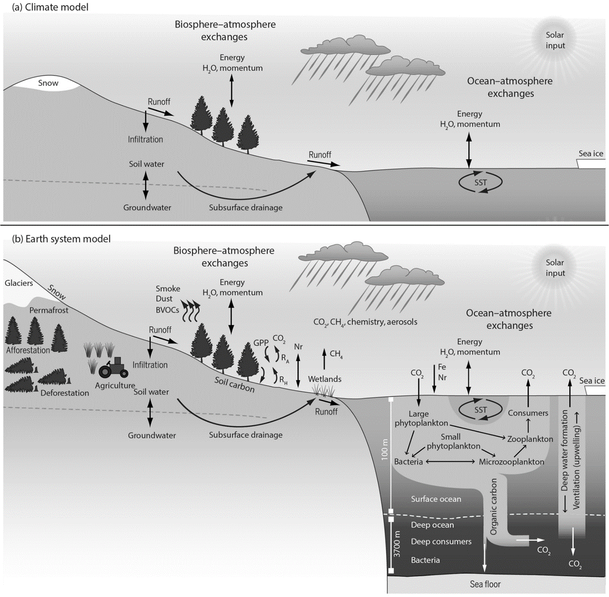
```

Both climate models and earth system models are constructed in the same way (Figure \@ref(fig:f94)). They have a **land, ocean and atmosphere component**, and they are applied at a global scale. In fact, earth system models have evolved from climate models, by adding extra components, such as ecological and biogeochemical processes, atmospheric chemistry, plant ecology and land use or continental ice sheets. Many of the large-scale vegetation models are the land component of earth system models. 

ESMs typically cover the entire planet, i.e. the land and the ocean, with a grid, and have a three-dimensional grid in the atmosphere. A major challenge for vegetation models is to couple the different components. It is necessary to let the different components communicate with each other, as they influence each other. Very often, a separate computer program is needed to make this possible (a ’coupler’). There are two different ways to couple the models. The first possibility, **asynchronous coupling**, starts at an initial condition, runs the model and lets the land and atmosphere components equilibrate at a certain moment in time. This leads to a new equilibrium condition, which is the start of a new timestep. Here, the coupler mainly translates model outputs of one component into the inputs of another component, which makes the model not fully coupled. The second coupling method, **full synchronous coupling**, runs all the components as one integrated code. From a theoretical point of view, this is the best way to simulate the interactions between components, but the computational cost is very high.


```{r f94, fig.cap='Illustration of the difference between climate models and earth system models. Climate models include the blue processes, earth system models include both the blue and green processes.', out.width='80%', fig.asp=.75, fig.align='center',echo=FALSE}
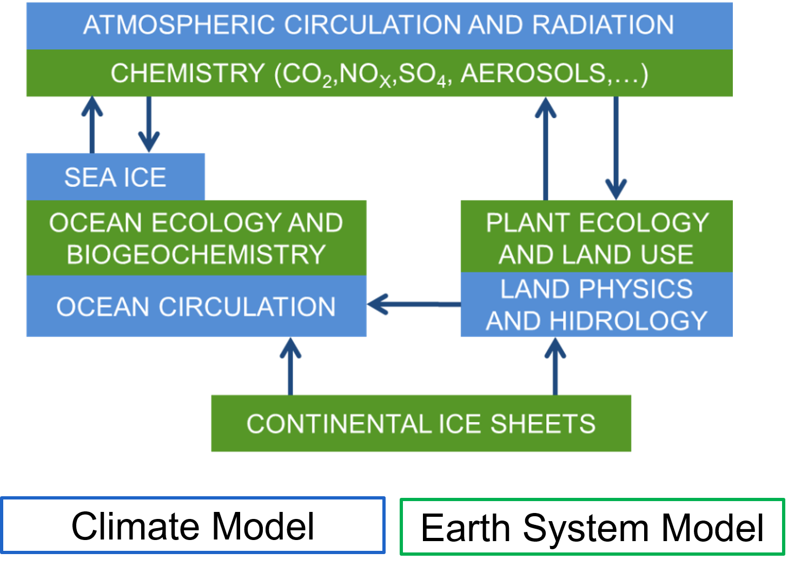
```

Figure \@ref(fig:f95) gives an overview of the evolution of the construction of earth system models. Some processes that are known to have a large effect on the climate, such as the carbon cycle, are only implemented relatively recently into earth system models. 

```{r f95, fig.cap='Illustration of the evolution of climate models into earth system models, with more and more processes and components added through time over the past decades.', out.width='80%', fig.asp=.75, fig.align='center',echo=FALSE}
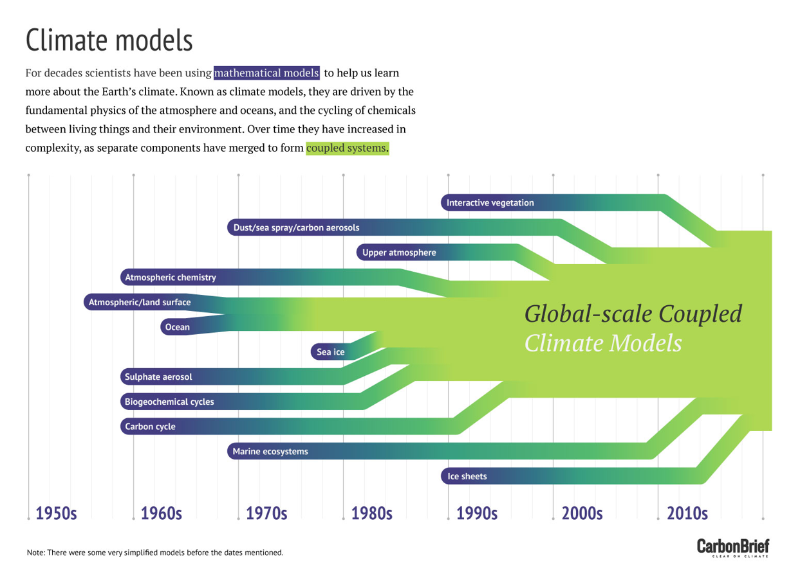
```

##  Modelling work flow

A vegetation modeler is going through the following steps to build a model:

- The start is the **model formulation**, writing the equations of the model, which are often based on theory.
- **Model characterization** is running the model, investigate the outputs and try to understand the model. Is it consistent with the expectations? **Sensitivity analyses**: changing (a) parameter(s) and see the effect on the outputs of the model. This is often done in an automated way. Another possibility is to do a full **uncertainty analysis**, which tries to propagate the uncertainty on the input variables or parameters to the output variables, so that also an uncertainty range is available on the model output. Model characterization is taking a significant part of the time from modelers.
- Models can be **parametrized** for different conditions or ecosystems, by using different datasets. This step takes the bulk of the time from a modeler.
- **Parameter interpretation**: you can try to learn something from the optimized parameters, or compare them with observations. The preceding steps give insight in the functioning of the system. 
- **Upscaling or generalization**: for example, parameterize the model for a few beech forests in Europe from which a lot of data is available, and then run the model for all beech forests in Europe. After the model runs, this could be checked with inventory data from other forests as independent validation. 
- **Model validation**: compare the model with an independent dataset (model evaluation). Mainly to check in which conditions the model is applicable.
- **Model application**: within the domain of validity, the model can be used to answer specific questions, or to run different scenarios. 

The last step of the cycle (or other steps) might give the modeler new insights in the processes that drive the model, and could lead to model improvements. Data is the key in the whole modelling workflow and is used in almost every single step of model development

```{r f96, fig.cap='Model data fusion in every step of the model development cycle. (Williams et al. 2009)', out.width='80%', fig.asp=.75, fig.align='center',echo=FALSE}
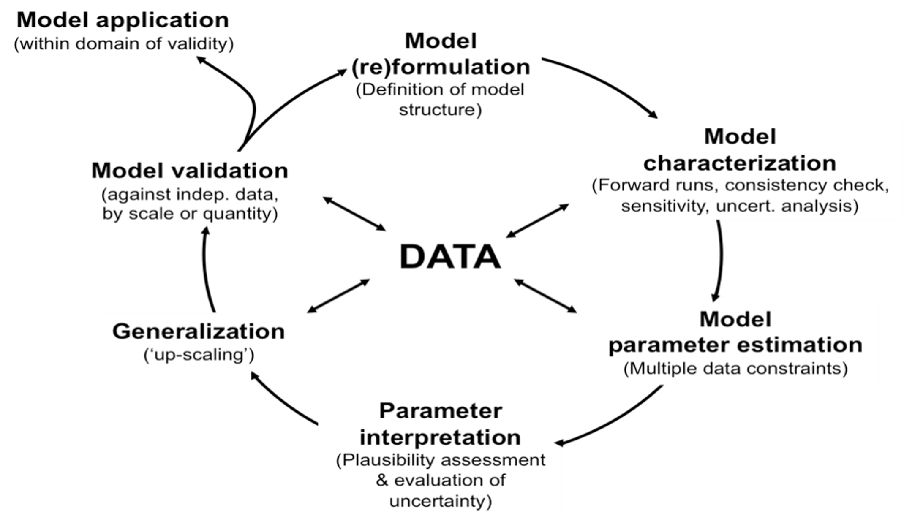
```

Figure \@ref(fig:f97) shows another way to present the modeling workflow. Here the model is in the center of the system. Here data is also a key in the process, and informatics are used to process the available data into useful format for the model. 

**Data assimilation** for model states is mostly applied on short timescales. For example, the leaf area index of next week can be predicted by the model, and one week later, this can be compared to the actual LAI that was measured in the field, and correct the model if needed. The simulation will then be continued with the updated LAI. 

You can only use a **model for decision support** if the model has gone through all steps and the uncertainty on the model outputs is quantified and acceptable. 


```{r f97, fig.cap='Methodological workflow of model data fusion. (Dietze: Ecological Forecasting)', out.width='80%', fig.asp=.75, fig.align='center',echo=FALSE}
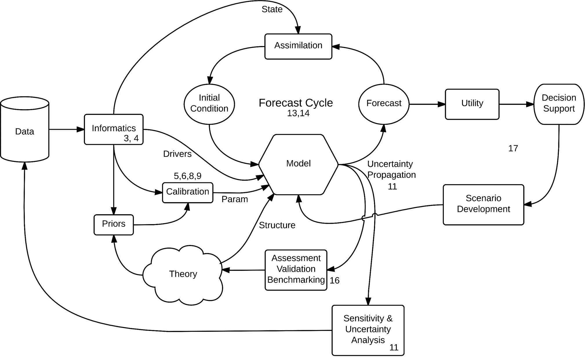
```

## Case study 9.1

Here, an earth system model was used to simulate the previous decades. The authors wanted to understand the driving factors for the interannual variability of the global carbon uptake (NBP). They found that soil moisture on the land is the main dominant factor that is causing interannual variability in NBP. Figure \@ref(fig:f98) a shows the mean centered interannual variability with and without soil moisture anomalies. It is clearly visible that the variation is highly reduced when soil moisture anomalies are blocked in the model. In subplot b, the standard deviations of NBP, GPP and ReD (respiration and disturbance), are shown for the two model runs. Here, the authors conclude that it has mainly an effect on the photosynthesis. In subplot c, it becomes clear that the soil moisture mainly has an impact on carbon fluxes by the photosynthesis. The study comes with a strong conclusion, as they state that 90% of the global variability in NBP is caused by soil moisture variability. The indirect effects caused by the land atmosphere coupling, are dominating over the direct effects (Figure \@ref(fig:f99)). 


```{r f98, fig.cap='Carbon fluxes in CTL and experiment A. a, IAV (inter annual variability) in global mean NBP as simulated by four ESMs (CCSM4, ECHAM6, GFDL and IPSL) in coupled model experiments with (CTL) and without (experiment A; ExpA) anomalies in soil moisture. Positive NBP indicates carbon uptake. b, Standard deviations of global mean NBP, GPP and respiration and disturbance (ReD) in the two experiments. c, Drivers of change in global mean NBP variance. Global mean NBP variance decreases in the experiment with prescribed seasonal soil moisture mainly because GPP variance is reduced. GPP and ReD fluxes are not available for the IPSL model. (Humphrey et al. 2021)', out.width='80%', fig.asp=.75, fig.align='center',echo=FALSE}
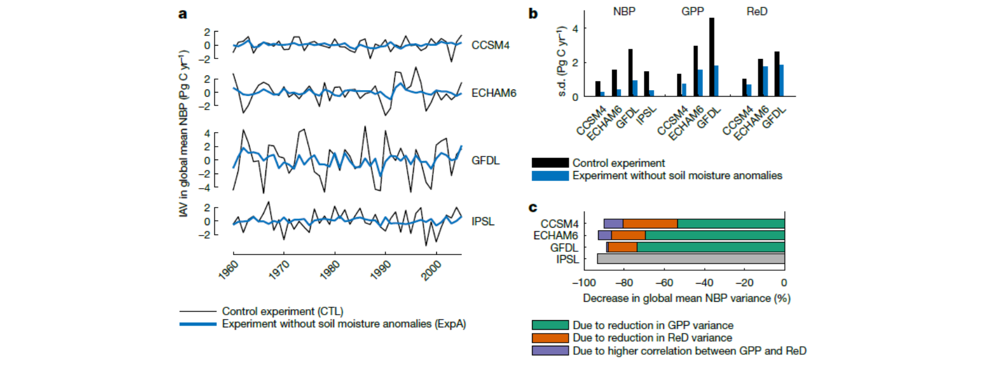
```

```{r f99, fig.cap='Drivers of NBP IAV. a, b, Contribution of meteorological drivers to NBP IAV: direct soil moisture effects (NBPSM), indirect LAC-dependent (land atmosphere coupling) temperature and VPD effects (NBPLAC T\\&VPD), non-LAC-dependent temperature and VPD effects (NBPnonLAC T\\&VPD ) and radiation (R) effects (NBPR) globally (a; mean of the four models ±1σ) and from local to global scales (b). (Humphrey et al. 2021)', out.width='80%', fig.asp=.75, fig.align='center',echo=FALSE}
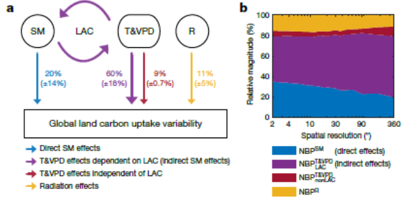
```

## Case study 9.2

This case study appeared a few times throughout the course, as it is one of the basic publications of the LPJ model. Here, the model was tested for the first time at a range of scales. The evaluation (and comparison with data) was done at different scales, ranging from local sites to the global scale. Figure \@ref(fig:f910) shows that the model was able to simulate the seasonal patterns in NEE for most flux tower locations. Figure 9.11 shows the results of the model for the water balance of various sites (simulated and observed soil water content). In some areas, the model is not doing well, while in other areas the model does a good job. The global runoff was tested and plotted vs observations in Figure \@ref(fig:f912), showing that the global pattern was simulated well by the model, with a deviation in the northern hemisphere.


```{r f910, fig.cap='Validation of LPJ model at the site level. Comparison between simulated and observed Net Ecosystem Exchange at 6 fluxtower sites in Europe. (Sitch et al. 2003) ', out.width='80%', fig.asp=.75, fig.align='center',echo=FALSE}
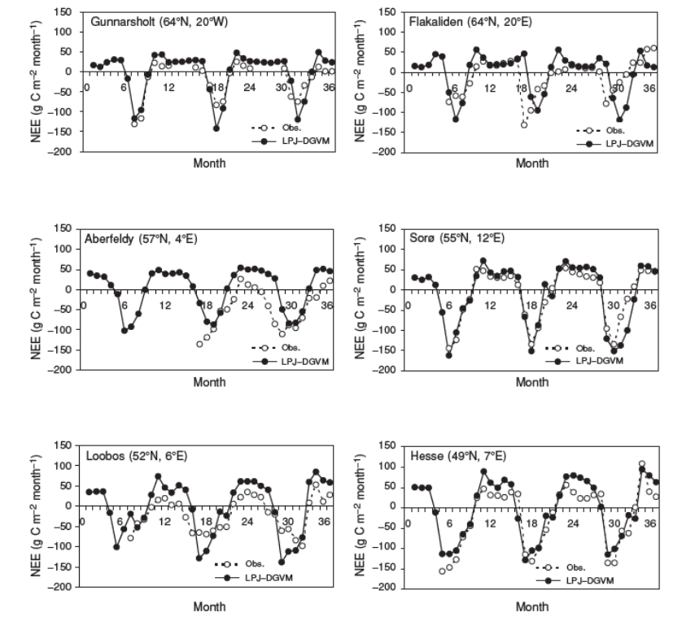
```

```{r f911, fig.cap='Validation of the LPJ model at the site level. Observed vs. simulated soil moisture at seven sites.(Sitch et al. 2003)', out.width='80%', fig.asp=.75, fig.align='center',echo=FALSE}
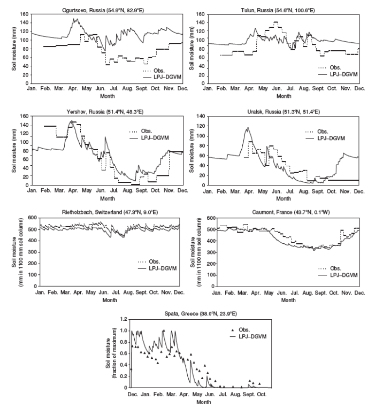
```

```{r f912, fig.cap='Validation of LPJ at the global scale, comparison with observed annual runoff per latitude. (Sitch et al. 2003)', out.width='80%', fig.asp=.75, fig.align='center',echo=FALSE}
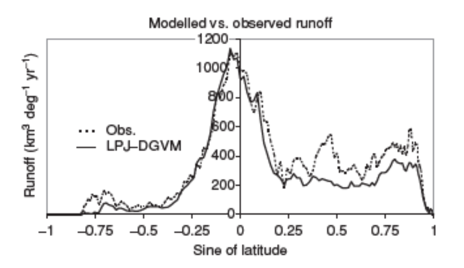
```

Figure \@ref(fig:f913) compares the model outputs (based on the global simulated PFTs) with satellite data for the seasonality of forests and their leaf types. Generally, the model does a good job, while in some regions, there is a discrepancy between the observations and the model outputs. Figure \@ref(fig:f914) shows a comparison of the NEE on a global scale between the model outputs and a reconstructed value (inter annual variability since 1960). Some variations are reproduced by the model, but others are not. This indicates that the model is working well for some conditions, but needs improvement for other conditions. 

```{r f913, fig.cap='Global comparison of LPJ simulated distributions of woody vegetation with sattelite based maps. (Sitch et al. 2003)', out.width='80%', fig.asp=.75, fig.align='center',echo=FALSE}
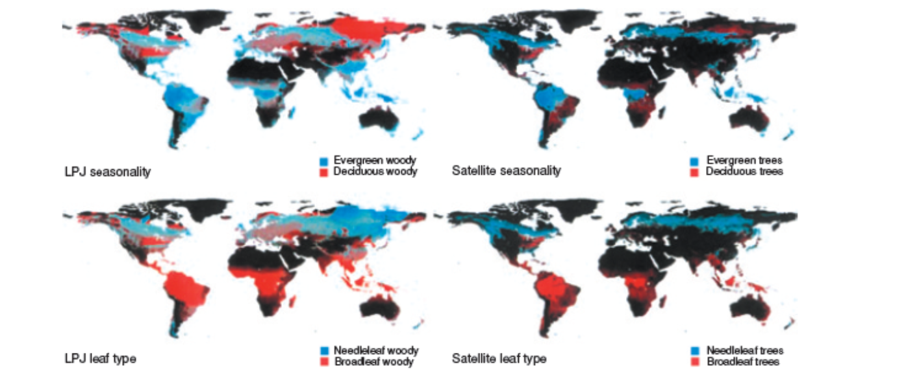
```

```{r f914, fig.cap='LPJ simulated vs. reconstructed interannual variation in net ecosystem exchange for the globe. (Sitch et al. 2003)', out.width='80%', fig.asp=.75, fig.align='center',echo=FALSE}
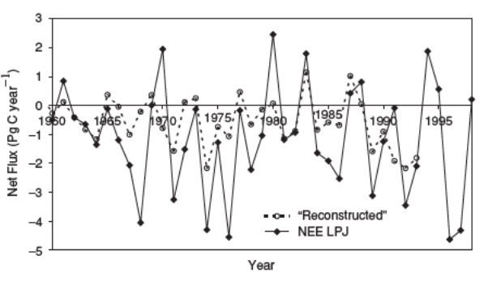
```
