# Model simulations, projections and scenario analysis
\chaptermark{Projections}

This chapter will deal with large temporal scales: historical and future scenarios. The main focus is to discuss how to apply models to simulate the past or project the future and perform scenario analysis.

## Simulation setup
First, when we want to run a model to perform a study, a few decisions are made that determin the model configuration, these decisions depend on the research question or the objective of the simulation:

* We need to choose if  we run the model for a **single location/site** or if we perform a **regional model run** (country, continent or global scale). This decision has strong implications on the input data needed and the required computational time.
* Second question is how to start a simulation, in order words how to initialize the state variables of the model. There are two options:
  - **Prescribed initial conditions**: We use data to determine the initial conditions of the state variables: e.g. forest inventory data, a large scale vegetation carbon map, …
  - **Spinup runs**: in this case, we let the vegetation grow from bare ground until it reaches an  equilibrium or steady state (stable initial conditions), which is explained in more detail below.

Once the vegetation model is initialized different types of simulations can be performed (Fig \@ref(fig:f101)):

* **Historical (or ‘transient’) simulation**. Here historical climate data are used to force the model, and the steady state conditions of the spinup are replaced by realistic changing environmental condition (e.g. warming climate and increasing greenhouse gas concentrations since the industrial revolution).
* **Paleo simulations** are historical simulation for a distant past, these are typically done with coupled earth system models to reconstruct climate or vegetation from centuries or millena ago.
* **Future projections** (scenarios) are performed after a transient simulation and project vegetaion responses to global change, land use or management scenarios
* **Simulation experiments** is a more general term for (historical or duture) simulations where experimental situations are created (see section 10.2)  

```{r f101, fig.cap='Sequention of the different parts of a simulaion setup: the model spinup, the historical run, and the scenarion run.', out.width='80%', fig.asp=.75, fig.align='center',echo=FALSE}
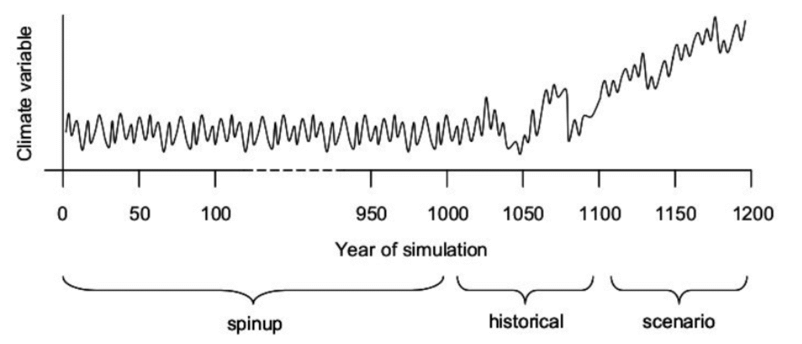
```

__**Historical climate data**__

To run a spinup or historical simulation it is necessary to have historical climate data. Usually, if the model is run at the site level, we typically use local climate data from a **weather station**. On the other hand, when we need to run a regional simulation, we use gridded datasets from ‘reanalysis’. Such **reanalysis datasets** are global spatially interpolated climate datasets which combine observations from weather stations with a climate model (Fig. \@ref(fig:f102)) to harmonize the data to provide a global product. There are several examples of global reanalyses, such as ERA5 and CRUNCEP. It is also possible to use these products for site-level simulations, by extracting climate data for one pixel to perform the analysis. The weather station observations provided to multiple reanalyses are the same for all different products. However, the way that the climate model assimilates data is quite different. Therefore, to study a specific area is essential to evaluate the reliability of the available reanalysis datasets for the region under study, especially the precipitation variable may vary considerably among the datasets.

```{r f102, fig.cap='The principle of the construction of a historical global climate reanalysis dataset. Global observations are combined with a climate model to obtain a complete gridded consistent global dataset. (ECMWF) ', out.width='80%', fig.asp=.75, fig.align='center',echo=FALSE}
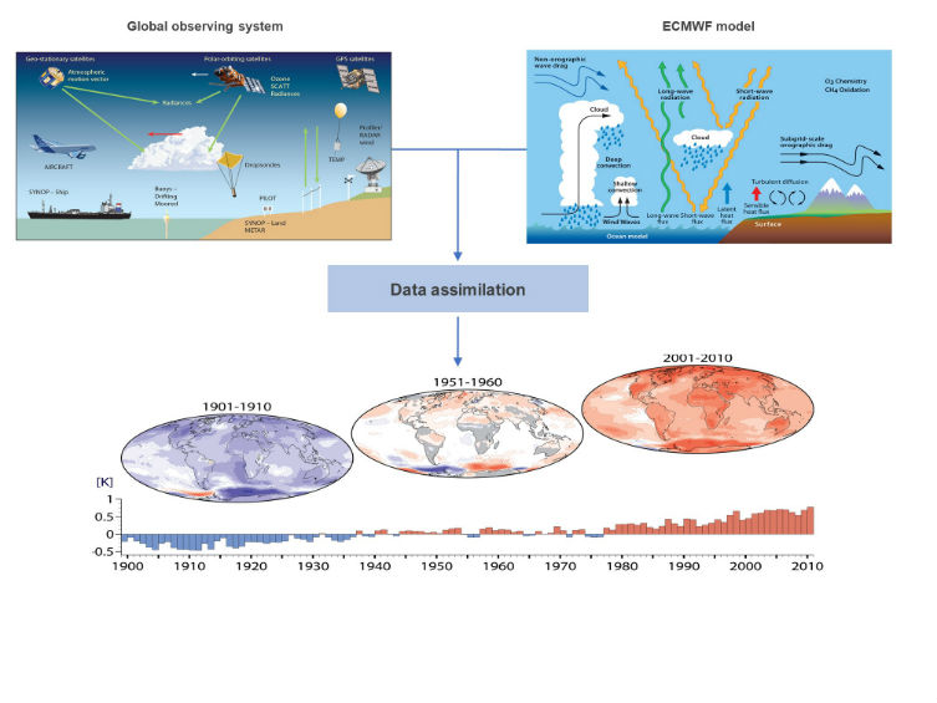
```

__**Spinup**__

If a vegetation model is not run from prescribed conditions, the model is run from bare ground, performing a so-called spinup run. This is mostly the case for large scale and global simulations because we typically have no (detailed) data to describe carbon pools or PFTs for very large areas.

In a spinup run, the **climate forcing data is recycled** towards and the model is run for a long period (multiple centuries) to reach an **equilibrium state** (steady state conditions). It is important to predefine the equilibrium state condition that are aimed for, because there are multiple options and approaches. For example, the model can be run until the carbon pools stabilize or until the PFT cover of a region is stable (Fig \@ref(fig:f103)), etc… Spinup runs are typically executed for the pre-industrial time period. This process is computationally demanding (especially when runs global models for multiple centuries). Finally it is important to define clearly what we consider as the equilibrium state, i.e. the actual threshold in variability for pools, fluxes or PFTs. If we use multiple criteria (e.g. Fig. \@ref(fig:f104)) we can see that some of the criteria are harder to reach. Soil carbon pools take much longer to reach equilibrium, for that reason sometimes only the soil model is recycled for a long time period (centuries, while the vegetation might already be stable after a few decades).

```{r f103, fig.cap='Example of a model spinup for teh LPJguess educational model. PFTs are initialized during the spinup, before a scenario run is performed.', out.width='80%', fig.asp=.75, fig.align='center',echo=FALSE}
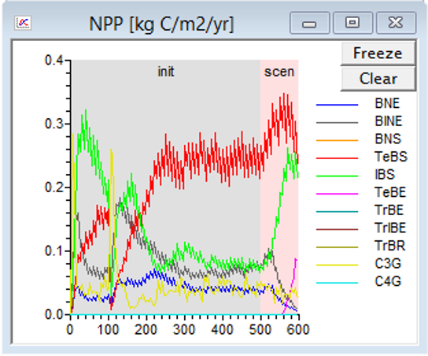
```

```{r f104, fig.cap='Pre indusrial (pre 1850) spinup run for the CLM 5.0 model, showing various model state variables reaching equilibrium.', out.width='80%', fig.asp=.75, fig.align='center',echo=FALSE}
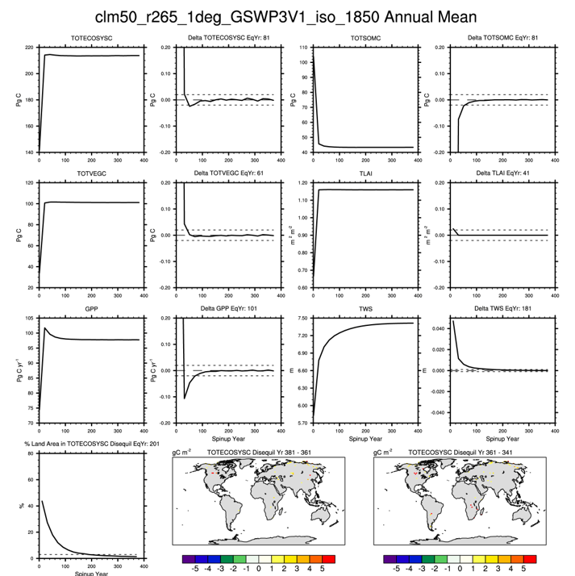
```


## Model experiments
Vegetation models can be used to study various research question, as explored in the case studies of previous chapters. In many cases ‘model experiments’ are used. Here vegetation models are use to execute virtual experiments. To test for example what happens if lianas are removed from a tropical forest, how vegetation responds when accounting for nutrient cycles or not, or when the soil water feedback is suppressed in an coupled eath system model. Such experiments illustrate that models can be very powerful tools to study perturbations, disturbances of ecosystems at scales or in ways that would be unfeasible or undesirable in real life conditions. 

## Paleo studies
Paleo climate or vegetation studies are undertaken with coupled earth system models, but instead of running these models for the future, they are run for a distant past. The vegetation component can then be used to reconstruct, for example, vegetation (PFT) cover globally (Fig  \@ref(fig:f105)). A study by Dallmeyer et al.(2019) uses four different earth system models to reconstruct the mid-Holocene biomes. These simulations can then be compared with paleo data, in this case, pollen records.

```{r f105, fig.cap='a) Simulated mid-Holocene biome distribution in  different models (ESMs) based on the PFT method, b) pollen-based biome reconstructions of the mid-Holocene biome distribution (BIOME6000 database)and c) the best neighbour score (BNS) for all individual sites showing the agreement of the reconstructed biomes and the biome distribution in the neighbourhood of the sites, ranging from 0 (no grid cell in the surrounding area shows the same biome as reconstructed) to 1 (the grid cell locating the site and the record at the site indicate the samebiome). (Dallmeyer et al. 2019) ', out.width='80%', fig.asp=.75, fig.align='center',echo=FALSE}
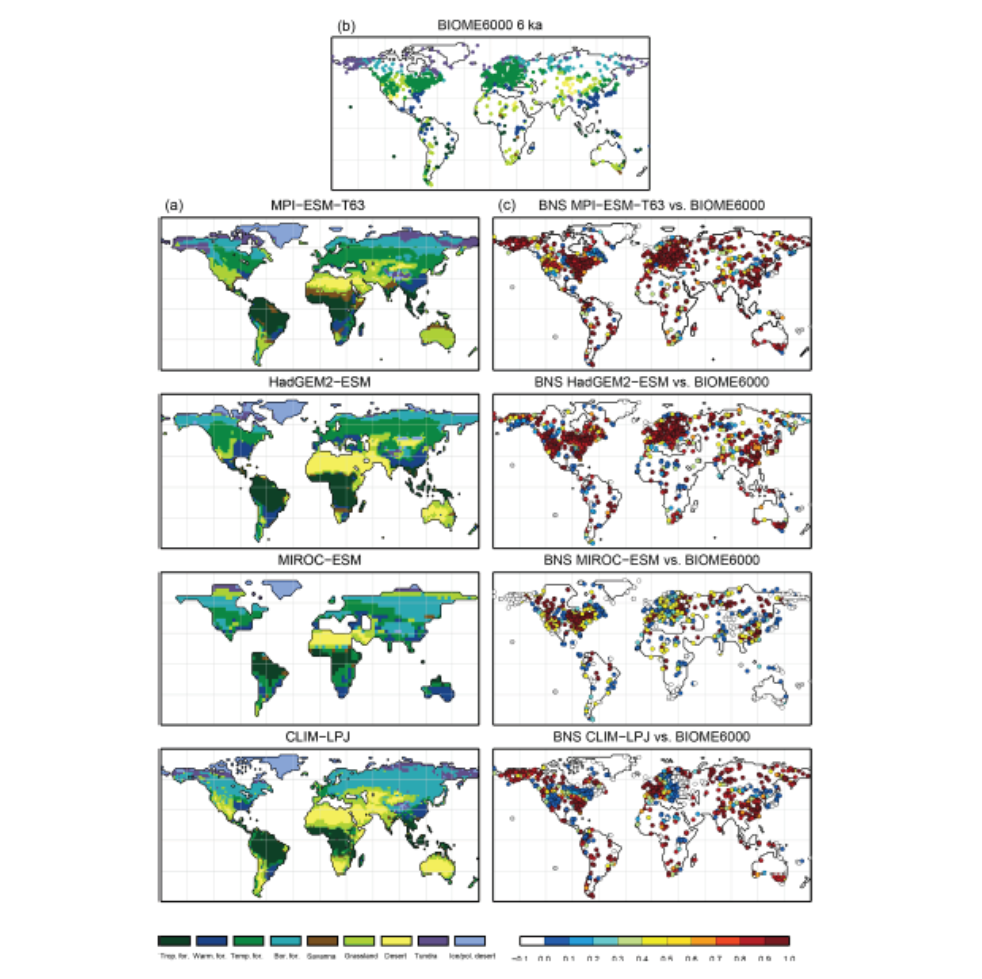
```


## Climate scenarios

Climate scenarios are used as input for vegetation models to to project vegetation responses to fuure climate change conditions, usually until the end of the century. Such climate scenarios are mostly constructed using climate models based on greenhouse gas concentration scenarios. Fig. \@ref(fig:f106) illustrates atmospheric CO2 concentration scenarios that are currently commonly used: the Representative Concentration Pathways (RCP). An RCP is a greenhouse gas concentration (not emissions) trajectory adopted by the IPCC. Four pathways were used for climate modeling and research for the IPCC fifth Assessment Report (AR5) in 2014. The pathways describe different climate futures, all of which are considered possible depending on the volume of greenhouse gases (GHG) emitted in the years to come under different socio-econmomic scenarios. When using such GHG scenarios to predict the future, there are two possible model configurations: 

* Use a climate model to create a climate scenario and then use that scanrio as an input to the vegetation model to simulate the vegetation response.
* Use a coupled earth system model, where the vegetation and climate model are run simultaneously in coupled mode. This configuration is preferred when we aim for an understanding of the climate-vegetation feedbacks and when we aim for a realistic climate projection accounting for those feedbacks.

```{r f106, fig.cap='Atmospheric CO2 concentration for the 21st century accoring to the IPCC Representative Concentration Pathways. (IPCC)', out.width='80%', fig.asp=.75, fig.align='center',echo=FALSE}
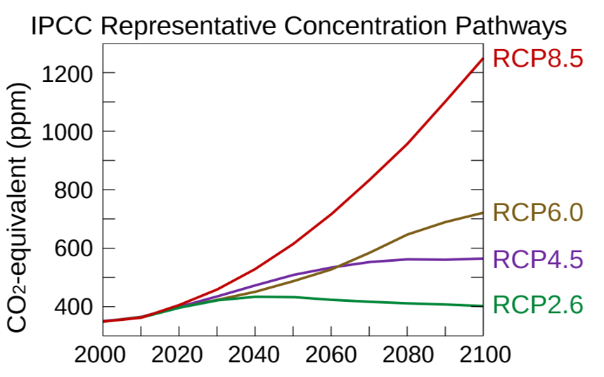
```

__**How to evaluate future scenarios?**__

Since future projections can not be validated with real data, we need to find other options to evaluate the validaty of our models to make projections. The first option here is testing the models with data from “global change” conditions. We can on one hand data from global change experiments (e.g. FACE studies or rainfall exclusion experiments). On the other hand we can use data from natural climate gradients (space for time substitution). Examples here are soil temperature gradients in iceland (due to volcanic activity) or elevantional gradients. The second option is to bring multiple models together and promote model intercomparisons (MIP) and run model ensembles. Here multiple (independent) models are run with the same scenario and the variation among models is used as an estimate of the uncertainty. (similar to weather model ensemble forecasting)

__**Example MIP**__

Model Intercomparisons Projects (MIP) are projects where multiple vegetation models are run under the same protocol: the same climate forcing, spinup condition and land use input. An example of such an intercomparsion is shown in Fig. \@ref(fig:f107). Here various models are compared for NPP simulations for a 5 year period, illustrating similarities and differences in the spatial NPP patterns simulated by these models. 

```{r f107, fig.cap='Long-term mean summer (June, July, August) net ecosystem productivity by model (2000–2005), as simulated by the models participating to the Model Intercomparison Project of the North American Carbon Program (NACP-MIP). A positive sign indicates net terrestrial carbon uptake from the atmosphere, while a negative sign signifies net carbon release to the atmosphere. Prognostic models are shown above with a green background; diagnostic models are below with a purple background. (Huntzinger et al. 2012)', out.width='80%', fig.asp=.75, fig.align='center',echo=FALSE}
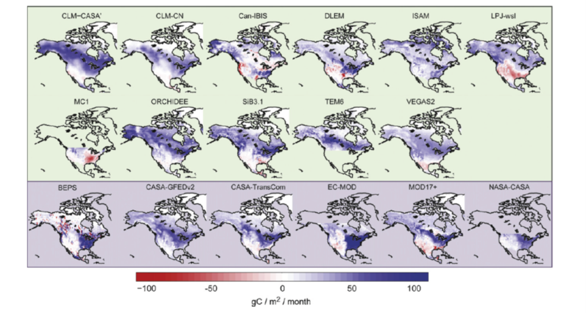
```

__**Example: ensemble projection by 5 DGVMs**__

The idea of using a model ensemble is to project the future, without relying on the assumptions of one model. We are combining several models to achieve the best possible projection for the future. Be ware that often models rely on similar assumptions and are not totally independent. A study performed by Sitch et al.(2008) used five global vegetation models forced by a climate scanrio provided by the Hadley climate model, which simulated the climate under a SRES CO2 scenario (predecessor of the RCPs) (Fig. \@ref(fig:f108)). Figure \@ref(fig:f109) shows how one scenario is results in a different pesonse between vegetation models. There are differences between the models regarding spatial patterns and the magnitude of values. This illustrates why it is important to use models ensembles instead of relying on just one model. Also, the responsiveness over time of individual models to different climate scenarios is clearly distinct (Fig. \@ref(fig:f110)).

```{r f108, fig.cap='Model Ensemble of 5 DGVMs, run for multiple climate SRES climate scenarios as simulated by the HAdGCM global climate model. Global mean land climatology (temperature, 1C, red; precipitation, mm/yr, blue),atmospheric CO2 content (black) and simulated land–atmosphere exchange over the 20th century by HyLand (HYL, black), Lund–Potsdam–Jena (LPJ, yellow), ORCHIDEE (ORC, blue), Sheffield (SHE, green), and TRIFFID (TRI, red). Red and blue dashes represent periods of strong El Nino (red) and La Nina (blue), respectively. Linear regressions are also plotted through the temperature and precipitation data. (Sitch et al. 2008) ', out.width='80%', fig.asp=.75, fig.align='center',echo=FALSE}
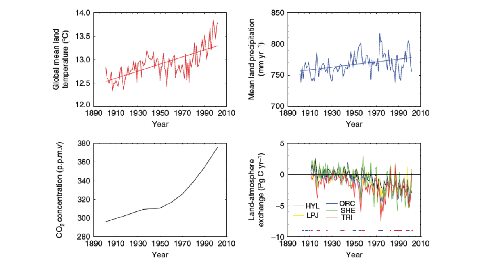
```

```{r f109, fig.cap='Model Ensemble of 5 DGVMs, here compared for 1 SRES climate scenario as simulated by the HAdGCM global climate model. Change in land carbon storage (TotC) and component vegetation (CV) and soils (CS) carbon stocks between 1860 and 2099 from the coupled climate-carbon cycle simulation under Special Report Emission Scenarios (SRES) emission scenario A1F1 (units are Pg C) for HyLand (HYL), Lund–Potsdam–Jena (LPJ), ORCHIDEE (ORC), Sheffield (SHE) and TRIFFID (TRI). (Sitch et al. 2008)', out.width='80%', fig.asp=.75, fig.align='center',echo=FALSE}
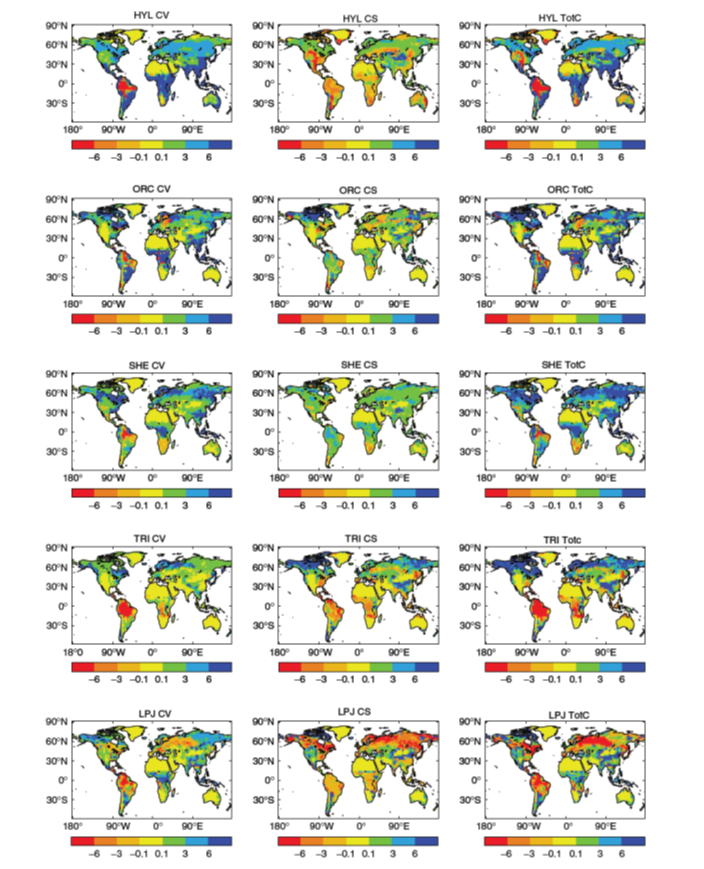
```

```{r f1010, fig.cap='Model Ensemble of 5 DGVMs, here th eresponse of the 5 models in compared for 2 SRES climate scenarios as simulated by the HAdGCM global climate model. Change in land carbon uptake, PgCyr-1, (top panels) relative to the present day (mean 1980–1999) for five Dynamic Global Vegetation Models (DGVMs) from coupled climate-carbon cycle simulations with two Special Report Emission Scenarios (SRES) emission scenarios, A1FI (solid lines), B1 (dashed lines), bracketing the range in emissions. Change in global vegetation (middle panels) and soil carbon (top panels), Pg C, between 2100 and 2000 under scenarios A1FI (solid lines) and B1 (dashed lines) for HyLand (HYL,black), Lund–Potsdam–Jena (LPJ, yellow), ORCHIDEE (ORC, blue), Sheffield (SHE, green), and TRIFFID (TRI, red). Note: only LPJ is run with interannual variations in climate. (Sitch et al. 2008)', out.width='80%', fig.asp=.75, fig.align='center',echo=FALSE}
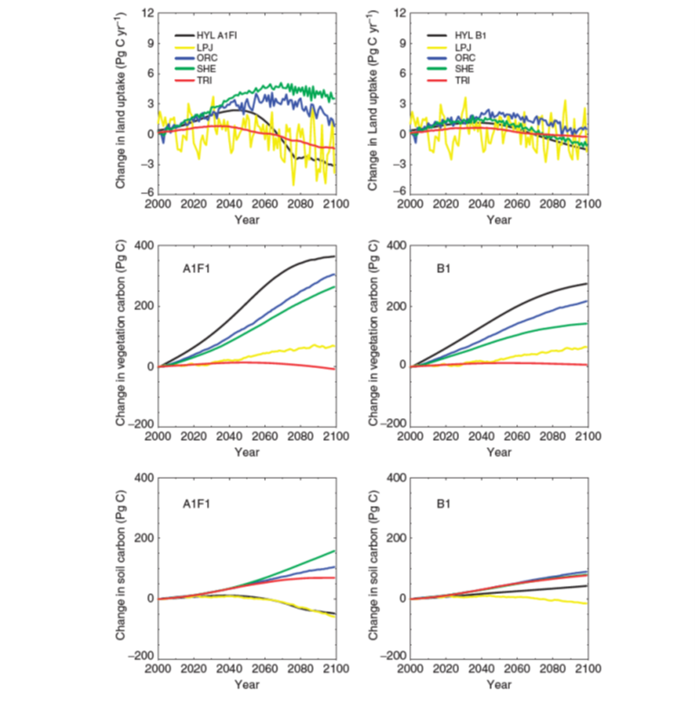
```

__**Example: 1 DGVM, multiple climate models**__

Huntingford et al.2013 use just one vegetation model but forced it with multiple climate models (contrasting with the previous example). Focusing on tropical forests, depending on the inputs from various climate models, a different vegetation carbon pattern was simulated by the end of the century (Fig. \@ref(fig:f111)) for the 3 topical continents. The is much more agreement between the simulated scenarios for Africa and Asia. For the Amazon there is more variation among the climate scanrios. However, just one scenario (from the Hadley climate model) predicts severe dieback of the Amazon forest.  Illustratin that the Amazon is likely more resilient than predicted earlier in the original ‘Amazon Dieback studies’ that were discussed earlier in this course.

```{r f1011, fig.cap='Tropical forest biomass predictions for the Americas (a), Africa (b) and Asia (c) by the MOSES–TRIFFID model forced by 22 climate models. Climate models emulated are colour-coded, from dark blue to dark red for decreasing year 2100 values of Cv. Grey regions and squares are committed Cv values with climate constant at year 2100 values, and small dashes link back to the same model in transient predictions. Committed equilibrium values are year-independent, hence the x-axis break (small vertical bars). Normalized estimates of Cv from inventory data (2.5%, mean and 97.5\\% confidence levels) are the short black curves for Americas and Africa. Horizontal lines (large dashes) are estimated pre-industrial values, year 1860 (Huntingford et al. 2013)', out.width='80%', fig.asp=.75, fig.align='center',echo=FALSE}
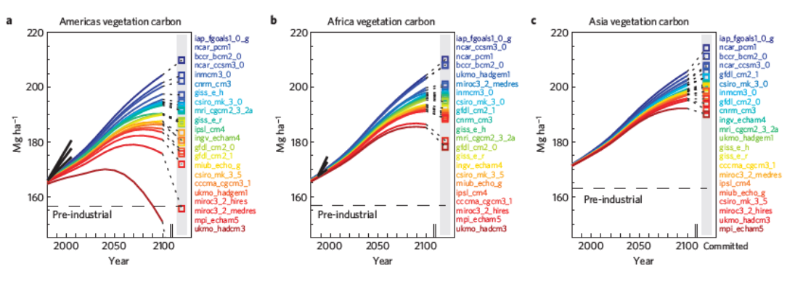
```

__**Example: multiple ESMs, multiple RCPs**__

One final example illustrates that different emissions scenarios result in different projected outputs (Fig. \@ref(fig:f112)) for individual models. The variation of the projected impact between emissions scenarios can be larger or smaller depending on each earth system model used.

```{r f1012, fig.cap='Comparing ESMs for multiple RCPs. Cumulative C sequestration from a few CMIP5 models and plausible range of C sequestration considering N constraints (CMIP5-N) for the HadGEM2-ES, IPSL-CM5A-LR, MPIESM-LR, and CESM1(BGC) models.(Zaehle et al. 2015)', out.width='80%', fig.asp=.75, fig.align='center',echo=FALSE}
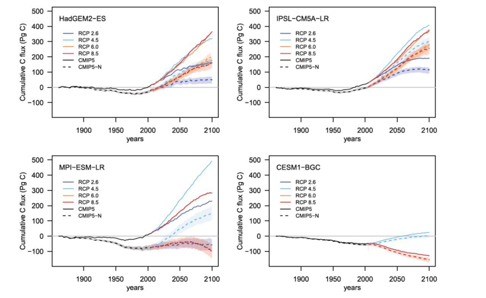
```

## Land use scenarios
Land-use scenarios use prescribed land cover or land use, prescribing the PFTs that are growing on a specific pixel or spatially distributed PFT maps. To run historical simulations prescribed land use maps are used as vegetation model input (e.g. Fig. \@ref(fig:f113)) , they are tpically based on observations from remote sensing. Future land-use scenarios can be constructed based on a series of specific land use change models accounting for socio-economic scenarios to predict how deforestation will evolve in the future. We will not go deeper into the details iof such models in this syllabus.

```{r f1013, fig.cap='Historical land use scenario for the Amazon (INPE)', out.width='80%', fig.asp=.75, fig.align='center',echo=FALSE}
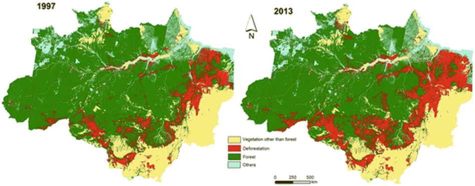
```


## Management scenarios

Ecosystem an forest management scenarios are a last possible type of scenario we discuss. Forest management was already discussed on chapter 8. Therefor we first focus on an example of ecosystem restoration scenarios. Donnell et al.2018 studied restoration scenarios in a semi-arid forests region in the South-West of the USA (Fig. \@ref(fig:f114)). They simulated three forest restoration scenarios: no restoration, limited restoration and high restoration scenario. In this example, these restoration scanrios are studied using an empirical forest model in combination with climate scenarios. 

```{r f1014, fig.cap=' Simulating th eimpact of restoration on hydrology. Predicted total runoff from a study area of semi arid forests in SW-USA by the LANDIS II model, normalized by area, from 1990 to 2110 under future vegetation distributions and restoration rates. Precipitation inputs are not adjusted to account for the effects of climate change. The top row of panels shows runoff for a median (50th percentile) annual precipitation and the bottom row of panels shows runoff for a 10-yr drought (10th percentile) annual precipitation scenario. Values are means and SD across model runs. (Donnell et al. 2018)', out.width='80%', fig.asp=.75, fig.align='center',echo=FALSE}
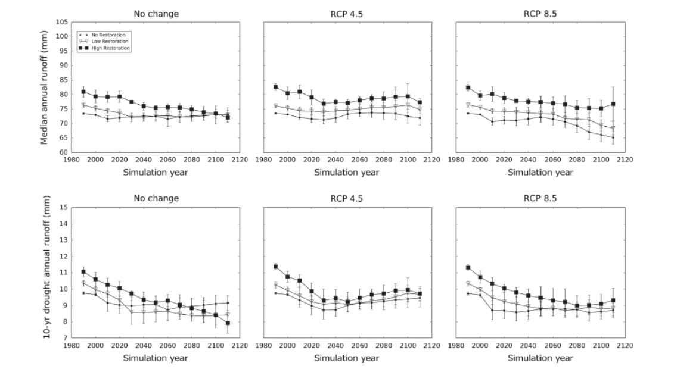
```

A second example, illustrates the complex setup of a future forest management scenario study for Europe. Luyssaert et al. 2018 use the ORCHIDEE-CAN vegetation model to simulate the impact of past and future forest management on the European climate. They run scenarios not only account for climate but also forest management. Fig \@ref(fig:f115) illustrates the model configuration with a spinup and transient simulation accounting for the historical forest management in Europe, followec by multiple forest management scanerios, for example scenarios optimizing surface albedo or optimizing carbon storage.

```{r f1015, fig.cap=' Setup of simulation experiments in a study on European forest management scenarios.The experiments are described in publication of Lyussaert et al. 2018.Simulations with the ORCHIDEE-CAN vegetation model are shown in black and simulations with LMDzORCAN (couple climate model) are shown in red. Blue boxes denote intermediate calculations using the simulation results.The simulations shown in this figure correspond to runs with reduced air temperature (BBESTT2M), maximized surface albedo (BESTALBEDO), minimized surface albedo (BWORSTALBEDO), maximized carbon sink (BBESTLCA), minimized carbon sink (BWORSTLCA) and business as usual (BWAC). BWAC, BWAC-P1 and BWAC-P2 were used to calculate the minimal model noise. (Luyssaert et al. 2018)', out.width='80%', fig.asp=.75, fig.align='center',echo=FALSE}
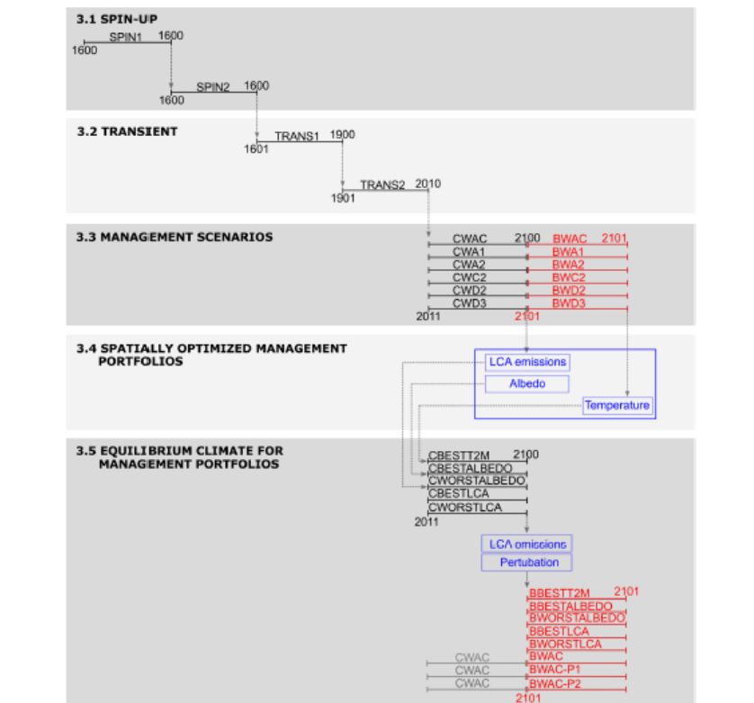
```
