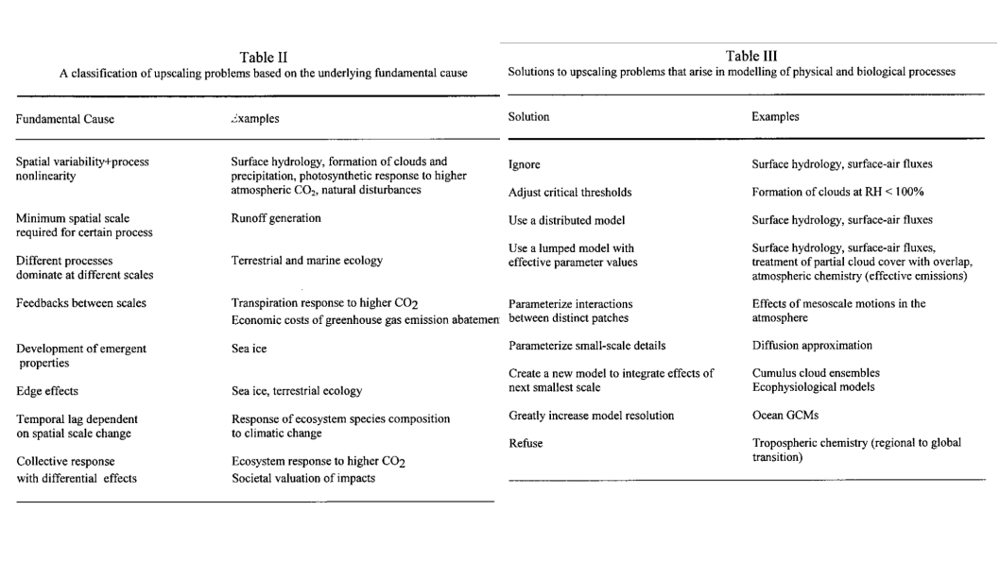

# Upscaling from leaf and tree to the globe
\chaptermark{Globe}
 - Scalling processes and problems, Jarvis 1995
 - upscalling in global change research, Harvey 2000
 
## Land surface models
- Dependence to other disciplines (Biology, ecology, physics, chemistry (VOC, etc), hydrology, pedology, datascience and mathematics, etc…)
- Figure 1.7 from Bonan
- UCL 4.2: Land surface schemes

### Spatial and temporal non-linearities: Cascading effect in the Earth system
- spatial upscalling
- temporal upscalling
- classification of upscalling problems:
  - Spatial variability + process nonlinearity
  - Minimim scale to observe the process
  - Different processes dominate at different scales
  - Feedbacks between scales
  - Development of emergent properties
  - Edge effects
  - Temporal lag dependent on spatial scale change
  - Collective response with differential effects
- Solutions to upscaling problems: 
  - Ignore (easy solution)
  - Increase model resolution (now more and more possible thanks to computing ressources, and data assimilation)
  - etc... ** Nice review in Harvey 2000 **

--> Solution depends on the application, show some examples here
```{r figHarvey, fig.cap='Functional diversity', echo=FALSE, message=FALSE, warning=FALSE}

```
### Soil-Vegetation-Atmosphere-Transer models

## DVGMs as a part of Earth System Models
- Partially in UCL 4.3.3
- Should we abord the technicall aspect or only focus the last chapters on a broad overview with applications? 
### One Biosphere
- Chapter 1 of Bonan, specifically 1.5
- Coupling to other components

### Atmosphere, Ocean, lakes and urban areas
- Rapid desciption of other models 

### Coupling of processes with different time steps and regional scale

