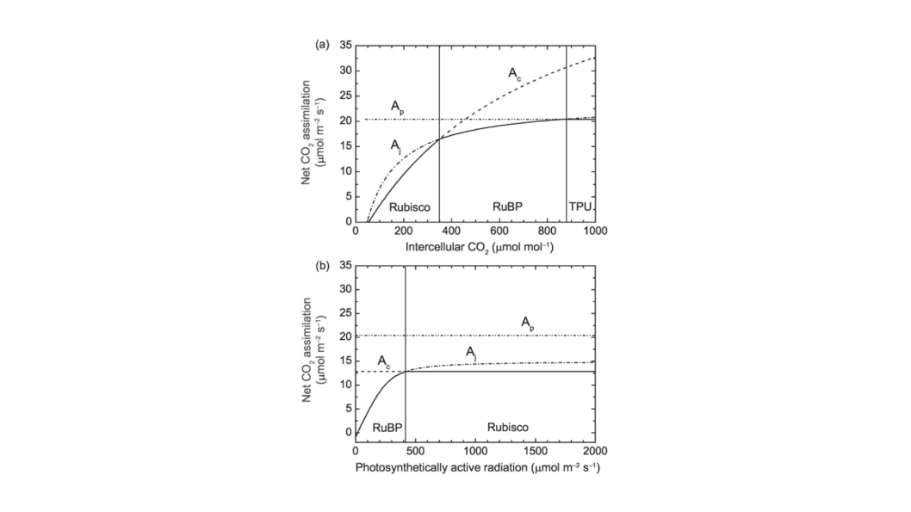

```{r, include=FALSE}
library(knitr)
library(kableExtra)
```


## Objectives of Practical A

During this first practical, you will have to implement the Farquhar, von Caemmerer and Berry model for C3 photosynthesis in R (hereafter referred to as the FvCB model). With this model, you should be able to simulate leaf assimilation from environmental conditions and *a priori* assumptions on leaf traits. 
A full description of the equations and parameters are provided in this document.
In order to implement the FvCB model, you will have to: 

1. identify input and output variables as well as constant parameters of your model from the model description bellow 
2. Create the FvCB function that will read the relevant input variables and parameters and return the corresponding outputs. 
3. Verify that your function reproduces the known behavior of the FvCB model by varying light and $CO_2$ concentration with some key figures.


Common coding practices in R are to create one function per equation, but you are free to decide what is most practical for you. In any case, we advise you to comment your code. Commenting your code is essential, not only for sharing your work with your peers but also for your future self. It helps organize the code, clarify what you are doing and remember what you did if you need to modify something in the future. Try to comment even what seems straightforward, it will save you a lot of time in the future.  

## Description of the FvCB model
### Definition of net assimilation
The FvCB model summarizes the biochemistry of photosynthesis into a set of equations that describe the kinetic properties of Rubisco (its carboxylation and oxygenation of RuBP), the ratio of $CO_2$ uptake during carboxylation to $CO_2$ loss during oxygenation (photorespiration), the regeneration of RuBP in response to the supply of NADPH and ATP produced during electron transport, the rate of carboxylation when RuBP is saturated, and the rate of carboxylation when RuBP is limited by regeneration via electron transport.

Oxygenation of 1 mole of RuBP releases 0.5 mole of $CO_2$ so that the net rate of $CO_2$ assimilation per unit leaf area ${A_n}$ is the balance between $CO_2$ uptake during carboxylation ${V_c}$, $CO_2$ loss during oxygenation (equal to ${0.5Vo}$), and CO2 loss from mitochondrial respiration ${R_d}$ (often called dark respiration). This is represented by the equation: 

$$
A_n = V_c -0.5V_o-R_d
$$
with ${A_n}$, ${V_c}$, ${Vo}$ and ${R_d}$ in µmol m^-2^ s^-1^. 
${V_c}$ corresponds to the rate of carboxylation by RUBISCO, which follows a Michalelis-Menten response function:
$$
V_c=\frac{V_{cmax}C_i}{C_i+K_c(1+O_i/K_o)}
$$
with $V_{cmax}$ the maximum rate of carboxylation in µmol CO<sub>2</sub> m^-2^ s^-1^, $C_i$ and $O_i$ the intercellular CO<sub>2</sub> concentration in µmol mol^-1^, and $K_c$ and $K_o$ are the Michaelis-Menten constants for CO<sub>2</sub> and O<sub>2</sub> in µmol mol^-1^, respectively.

It exists a specific $C_i$ concentration value at which oxygenation compensate carboxylation and no net CO<sub>2</sub> uptake occurs in the absence of mitrochondrial respiration. We call this value the CO<sub>2</sub> compensation point $\Gamma^*$. Net assimilation can be reformulated as:
$$
A_n=(1-\frac{\Gamma^*}{C_i})V_c-R_d
$$
The term $1-\Gamma^*/C_i$ accounts for CO<sub>2</sub> release during photorespiration.

### Incorporating the limitation by light and CO<sub>2</sub>
In the simplest form of the model, carboxylation $V_c$ is limited by either the activity of RUBISCO (CO<sub>2</sub> limitation), denoted by the rate $W_c$, or by the regeneration of RuBP (light limitation), denoted by the rate $W_j$, so that:
$$
A_n=(1-\frac{\Gamma^*}{C_i})min(W_c,W_j)-R_d
$$
with 
$$
W_c=V_{cmax}\frac{C_i}{C_i+K_c(1+O_i/K_o)}
$$
and 
$$
W_j=J\frac{C_i}{4C_i+8\Gamma^*}
$$
$J$ is the electron transport rate (in µmol m^-2^ s^-1^) for a given irradiance. 
the rate of electron transport is related to absorbed photosynthetically active radiation (PAR), the maximum electron transport rate and the amount of light utilized by photosystems. Different expressions can be found for J. We will use the most common form:

$$
J=\frac{I_{abs}+J_{max}-\sqrt{(I_{abs}+J_{max})^2-4\theta_jI_{abs}J_{max}}}{2\theta_j}
$$

with $I_{abs}$ the absorbed PAR in µmol photon m^-2^ s^-1^, $\theta_j$ is the curvature of the light response curve and $J_{max}$ the maximal electron transport rate in µmol m^-2^ s^-1^.

The absorbed incident radiation by the photosystem II ($I_{abs}$) depends on leaf absorptance $\alpha_l$ and the quantum yield of photosystem II $\phi_{PSII}$:
$$
I_{abs}=\frac{\phi_{PSII}}{2}\alpha_lI_r
$$
where $I_r$ is PAR in µmol m^-2^ s^-1^, and only one half of absorbed light reaches the PSII. 

In summary, a common form of the FvCB model represents photosynthetic CO<sub>2</sub> assimilation for plants utilizing the C3 photosynthetic pathway as limited by (i) Ac – the rate of Rubisco catalyzed carboxylation when RuBP is saturated (called Rubisco-limited photosynthesis because of its dependence on maximum Rubisco activity as set by Vcmax); and (ii) Aj – the rate of RuBP regeneration by light absorption and electron transport as determined by Jmax (RuBP regeneration-limited, or light-limited, photosynthesis).

### Parameter values and temperature dependencies
The FvCB model requires 6 physiological parameters: $K_c$, $K_o$, $\Gamma^*$, $V_{cmax}$, $J_{max}$ and $R_d$. Additionally, the specification of electron transport requires $\theta_j$ and $\phi_j$. Values for$K_c$, $K_o$ and $\Gamma^*$ are defined by the biochemistry of Rubisco and are similar among species. On the opposite, $V_{cmax}$ is species-dependent. 

$V_{cmax}$ is a key parameter in the FvCB model. It directly determines the Rubisco-limited rate $A_c$ and, for C3 plants, also influences the RuBP regeneration-limited rate $A_j$ though its covariation with $J_max$. The maximum rate of carboxylation has a wide range among plant species and environments and is tightly linked to leaf nitrogen content; reported values for 109
species of C3 plants vary from less than 10 to more than 150 μmol m^–2^ s^–1^.

Because $J_{max}$ is well correlated to $V_cmax$, it can be approximated to:
$$
J_{max} = 1.67V_{cmax}
$$

$R_d$ is also well correlated to $V_cmax$ and can be approximated as: 
$$
R_d=0.015V_{cmax}
$$

The parameters $K_c$, $K_o$, $\Gamma^*$, $V_{cmax}$, $J_{max}$ and $R_d$ vary with temperature. The instantaneous responses of photosynthesis and respiration to temperature are driven by their underlying enzymatic responses. When warmed from low temperature, the enzymes involved in photosynthesis and respiration increase their activity as described by the Arrhenius function:
$$
f(T_l)=exp\left[\frac{\Delta H_a}{298.15R}(1-\frac{298.15}{T_l})\right]
$$
where $T_l$ is leaf temperature (in K), R is the universal gas constant (8.314 J K^–1^
mol^–1^), and $\Delta H_a$ is the activation energy (J mol^–1^). This function is normalized to 25°C (298.15 K). Parameter values measured at 25°C are multiplied by
$f(T_l)$ to adjust for leaf temperature. 

The parameters $V_{cmax}$, $J_{max}$ and $R_d$ vary with temperature following the Arrhenius function but have a peaked response in which enzymatic activity increases up to a temperature optimum beyond which the reaction rate decreases when temperature is too high because of enzyme degradation. In this case, parameters such as $V_{cmax}$ are writen by:
$$
V_{cmax}=V_{cmax25}f(T_l)f_H(T_l)
$$
with $V_{cmax25}$ the value of $V_{cmax}$ at 25°C. The $f_H(T_l)$ function represents the thermal breakdown of biochemical processes: 
$$
f_H(T_l)=\frac{1+exp\left(\frac{298.15\Delta S-\Delta H_d}{298.15R}\right)}{1+exp\left(\frac{\Delta ST_l-\Delta H_d}{RT_l}\right)}
$$

## Summary of functions and parameter values

```{r,include=FALSE}
nom<-c("Rubisco-limited assimilation",
       "Light-limited assimilation",
       "Gross photosynthesis",
       "Net photosynthesis",
       "Electron transport rate",
       "PSII light utilization",
       "Maximum carboxylation rate",
       "Maximum electron transport rate",
       "Leaf respiration",
       "Michaelis-Menten constant CO2",
       "Michaelis-Menten constant O2",
       "CO2 compensation point",
       "Arrhenius function",
       "High temperature inhibition")
unit<-c("µmol m^-2^ s^-1^",
        "µmol m^-2^ s^-1^",
        "µmol m^-2^ s^-1^",
        "µmol m^-2^ s^-1^",
        "µmol m^-2^ s^-1^",
        "µmol m^-2^ s^-1^",
        "µmol m^-2^ s^-1^",
        "µmol m^-2^ s^-1^",
        "µmol m^-2^ s^-1^",
        "µmol mol^-1^",
        "mmol mol^-1^",
        "µmol mol^-1^",
        "dimensionless",
        "dimensionless")
equations<-c("$W_c=V_{cmax}\\frac{C_i}{C_i+K_c(1+O_i/K_o)}$",
             "$W_j=J\\frac{C_i}{4C_i+8\\Gamma^*}$",
             "$A=(1-\\frac{\\Gamma^*}{C_i})min(W_c,W_j)$",
             "$A_n=A-R_d$",
             "$J=\\frac{I_{abs}+J_{max}-\\sqrt{(I_{abs}+J_{max})^2-4\\theta_jI_{abs}J_{max}}}{2\\theta_j}$",
             "$I_{abs}=\\frac{\\phi_{PSII}}{2}\\alpha_lI_r$",
             "$V_{cmax}=V_{cmax25}f(T_l)f_H(T_l)$",
             "$J_{cmax}=J_{cmax25}f(T_l)f_H(T_l)\\\\J_{max25}=1.67V_{cmax25}$",
             "$R_d=R_{d25}f(T_l)f_H(T_l)\\\\R_{d25}=0.015V_{cmax25}$",
             "$K_c=K_{c25}f(T_l)$",
             "$K_o=K_{o25}f(T_l)$",
             "$\\Gamma^*=\\Gamma^*_{25}f(T_l)$",
             "$f(T_l)=exp\\left[\\frac{\\Delta H_a}{298.15R}(1-\\frac{298.15}{T_l})\\right]$",
             "$f_H(T_l)=\\frac{1+exp\\left(\\frac{298.15\\Delta S-\\Delta H_d}{298.15R}\\right)}{1+exp\\left(\\frac{\\Delta ST_l-\\Delta H_d}{RT_l}\\right)}$")

df<-data.frame(Definition=nom,
               Equation=equations,
               Units=unit)

```

\renewcommand{\arraystretch}{2}
```{r, echo=FALSE}
kable(df, align="c", booktabs=TRUE, escape = F,  linesep = c("\\addlinespace\\addlinespace"),caption = 'Summary equations for the C_3 photosynthesis model')%>%
  kable_styling()
```

```{r,include=FALSE}
nom<-c("$V_{cmax25}$",
       "$K_{c25}$",
       "$K_{o25}$",
       "$\\Gamma^*_{25}$",
       "$\\phi_{PSII}$",
       "$\\theta_j$",
       "$\\alpha_l$",
       "$O_i$",
       "$R$",
       "$\\Delta H_a$ for $K_c$",
       "$\\Delta H_a$ for $K_o$",
       "$\\Delta H_a$ for $\\Gamma^*$",
       "$\\Delta H_a$ for $R_d$",
       "$\\Delta H_a$ for $V_{cmax}$",
       "$\\Delta H_a$ for $J_{max}$",
       "$\\Delta H_d$",
       "$\\Delta S$"
)

valeur<-as.character(c(50,
          404.9,
          278.4,
          42.75,
          0.9,
          0.885,
          0.6,
          209,
          8.3144598,  #J/(mol*K) ideal gas constant
          79430,
          36380,
          46390,
          37830,
          65330,
          43540,
          150000,
          490))

  
unit<-c("µmol m^-2^ s^-1^",
        "µmol m^-2^ s^-1^",
        "µmol m^-2^ s^-1^",
        "µmol m^-2^ s^-1^",
        "µmol m^-2^ s^-1^",
        "Unitless",
        "Unitless",
        "mmol mol^-1^",
        "J mol^-1^ K^-1^",
        "J mol^-1^",
        "J mol^-1^",
        "J mol^-1^",
        "J mol^-1^",
        "J mol^-1^",
        "J mol^-1^",
        "J mol^-1^",
        "J mol^-1^ K^-1^")

df2<-data.frame(Definition=nom,
               Value=valeur,
               Units=unit)

```

```{r, echo=FALSE}
kable(df2, align="c", booktabs=TRUE, escape = F,full_width=T,  linesep = c("\\addlinespace\\addlinespace"),caption = 'Summary of parameters for the FvCB model')%>%
  kable_styling()
```

### Implementation steps

In this practical, we ask you to implement the FvCB, i.e. to convert the equations detailed above into a coherent set of R functions and scripts. To do so, here is a a possible workflow:

1. Create functions to define the default plant physiological parameters as well as the physical constants necessary to run the model
2. Create the temperature-dependency functions $f_H(T_l)$ and $f(T_l)$ and an overall function that scales model parameters with the actual leaf temperature
3. Implement the FcVB photosynthesis equations for $W_c$, $I_{abs}$, $J$, $W_j$, and finally $A_n$ according to a set of input parameters
4. Test your model with a fixed leaf temperature of 25°C, by varying successively the incident PAR and the internal $C0_2$ concentration $C_i$. You should be able to reproduce a figure similar to the one below (note that we did not implement the TPU limitation so net assimilation is only driven by $A_c$ and $A_i$).

{#id .class width=150% height=150%}

5. Finally, re-run your code with a lower (15°C) and a larger (35°C) temperature and compare the curves with the ones with the reference temperature
